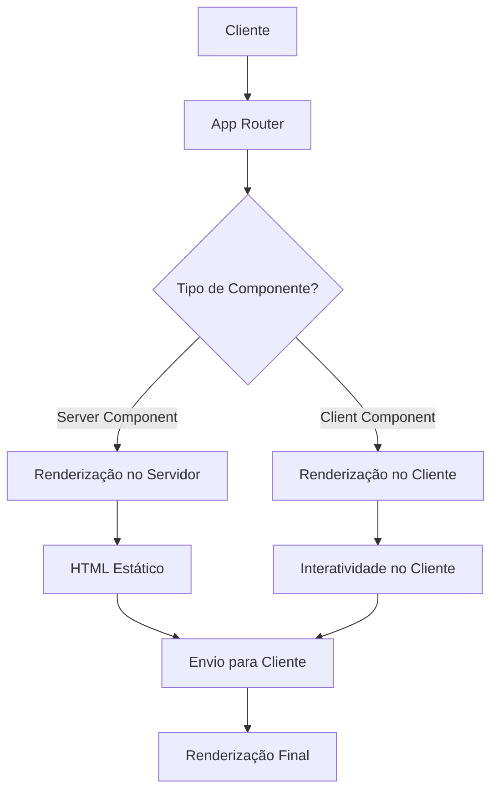
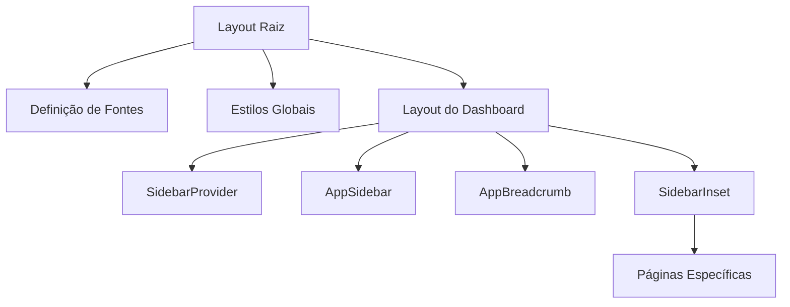
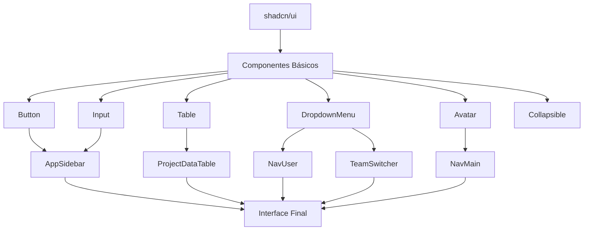
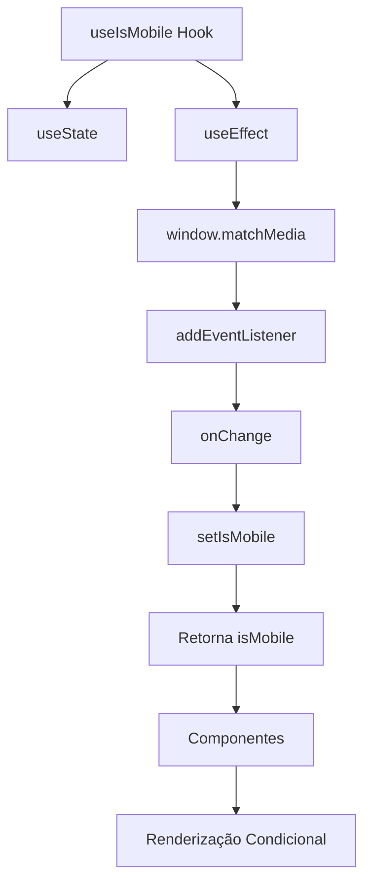

# Arquitetura Frontend

<cite>
**Arquivos Referenciados neste Documento**   
- [app/layout.tsx](file://app/layout.tsx)
- [app/(dashboard)/layout.tsx](file://app/(dashboard)/layout.tsx)
- [components/app-sidebar.tsx](file://components/app-sidebar.tsx)
- [components/app-breadcrumb.tsx](file://components/app-breadcrumb.tsx)
- [components/ui/sidebar.tsx](file://components/ui/sidebar.tsx)
- [components/ui/button.tsx](file://components/ui/button.tsx)
- [components/ui/input.tsx](file://components/ui/input.tsx)
- [components/ui/table.tsx](file://components/ui/table.tsx)
- [components/nav-main.tsx](file://components/nav-main.tsx)
- [components/nav-projects.tsx](file://components/nav-projects.tsx)
- [components/nav-user.tsx](file://components/nav-user.tsx)
- [components/team-switcher.tsx](file://components/team-switcher.tsx)
- [components/project-data-table.tsx](file://components/project-data-table.tsx)
- [hooks/use-mobile.ts](file://hooks/use-mobile.ts)
- [lib/utils.ts](file://lib/utils.ts)
- [components.json](file://components.json)
- [openspec/project.md](file://openspec/project.md)
</cite>

## Sumário
1. [Introdução](#introdução)
2. [Estrutura de Diretórios e App Router](#estrutura-de-diretórios-e-app-router)
3. [Arquitetura de Componentes](#arquitetura-de-componentes)
4. [Layout e Composição da Interface](#layout-e-composição-da-interface)
5. [Sistema de Componentes Reutilizáveis](#sistema-de-componentes-reutilizáveis)
6. [Padrões de Estado e Hooks Personalizados](#padrões-de-estado-e-hooks-personalizados)
7. [Estilização com Tailwind CSS](#estilização-com-tailwind-css)
8. [Gerenciamento de Contexto e Autenticação](#gerenciamento-de-contexto-e-autenticação)
9. [Considerações de Desempenho, SEO e Acessibilidade](#considerações-de-desempenho-seo-e-acessibilidade)
10. [Diretrizes para Criação de Novas Páginas e Componentes](#diretrizes-para-criação-de-novas-páginas-e-componentes)

## Introdução
Este documento apresenta uma análise detalhada da arquitetura frontend do sistema sinesys, baseada no App Router do Next.js. O sistema adota uma abordagem moderna de desenvolvimento web, utilizando Server Components, Server Actions e uma estrutura de rotas bem definida para criar uma interface de usuário eficiente, responsiva e escalável. A arquitetura é projetada para fornecer uma experiência de usuário otimizada, com foco em desempenho, acessibilidade e manutenibilidade.

## Estrutura de Diretórios e App Router
A estrutura de diretórios do frontend é organizada de acordo com os padrões do Next.js App Router, que permite uma separação clara entre rotas públicas e protegidas. O diretório `app/` serve como ponto de entrada principal da aplicação, contendo o layout raiz em `layout.tsx` e a página inicial em `page.tsx`. O subdiretório `(dashboard)/` é utilizado para agrupar rotas protegidas que exigem autenticação, isolando logicamente as funcionalidades do painel administrativo do restante da aplicação.

O App Router do Next.js é o núcleo da arquitetura, gerenciando a navegação, renderização e carregamento de dados. Ele permite a definição de rotas hierárquicas através da estrutura de diretórios, onde cada pasta representa um segmento da URL. Os arquivos `page.tsx` dentro dessas pastas definem as páginas renderizadas para cada rota. O uso de parâmetros dinâmicos, como `[id]` e `[cpf]`, possibilita a criação de páginas dinâmicas que podem renderizar conteúdo baseado em valores variáveis da URL.

**Seção de fontes**
- [app/layout.tsx](file://app/layout.tsx#L1-L44)
- [app/(dashboard)/layout.tsx](file://app/(dashboard)/layout.tsx#L1-L60)
- [openspec/project.md](file://openspec/project.md#L43-L80)

## Arquitetura de Componentes
A arquitetura de componentes do sistema sinesys é baseada em uma abordagem modular e reutilizável, onde componentes são organizados em diferentes camadas de abstração. A aplicação utiliza extensivamente Server Components, que são renderizados no servidor e enviam apenas HTML estático para o cliente, reduzindo significativamente o tamanho do pacote JavaScript e melhorando o desempenho de carregamento inicial.

Os Server Actions são utilizados para manipular eventos do lado do servidor, como submissões de formulários e atualizações de estado, eliminando a necessidade de chamadas API separadas e simplificando o fluxo de dados. Essa combinação de Server Components e Server Actions permite uma arquitetura híbrida eficiente, onde a maior parte da renderização ocorre no servidor, enquanto interações dinâmicas são gerenciadas de forma otimizada no cliente.



**Fontes do Diagrama**
- [app/layout.tsx](file://app/layout.tsx#L20-L43)
- [app/(dashboard)/layout.tsx](file://app/(dashboard)/layout.tsx#L27-L58)

## Layout e Composição da Interface
A composição da interface é estruturada em torno de layouts hierárquicos que definem a estrutura visual da aplicação. O layout raiz, definido em `app/layout.tsx`, estabelece a estrutura base para todas as páginas, incluindo a definição de fontes e a aplicação de estilos globais. Este layout é herdado por todos os componentes filhos, garantindo consistência visual em toda a aplicação.

O layout do dashboard, localizado em `app/(dashboard)/layout.tsx`, estende o layout raiz adicionando funcionalidades específicas para o ambiente protegido. Ele incorpora o `SidebarProvider` do shadcn/ui para gerenciar o estado do sidebar, o `AppSidebar` para exibir a navegação lateral e o `AppBreadcrumb` para fornecer navegação por trilhas. A estrutura utiliza o componente `SidebarInset` para criar o espaço de conteúdo principal, onde as páginas específicas são renderizadas.



**Fontes do Diagrama**
- [app/layout.tsx](file://app/layout.tsx#L20-L43)
- [app/(dashboard)/layout.tsx](file://app/(dashboard)/layout.tsx#L27-L58)
- [components/app-sidebar.tsx](file://components/app-sidebar.tsx#L158-L174)
- [components/app-breadcrumb.tsx](file://components/app-breadcrumb.tsx#L40-L103)

**Seção de fontes**
- [app/layout.tsx](file://app/layout.tsx#L1-L44)
- [app/(dashboard)/layout.tsx](file://app/(dashboard)/layout.tsx#L1-L60)
- [components/app-sidebar.tsx](file://components/app-sidebar.tsx#L1-L176)
- [components/app-breadcrumb.tsx](file://components/app-breadcrumb.tsx#L1-L106)

## Sistema de Componentes Reutilizáveis
O sistema de componentes reutilizáveis é baseado na biblioteca shadcn/ui, que fornece um conjunto de componentes prontos para uso e altamente personalizáveis. Esses componentes são organizados no diretório `components/ui/` e incluem elementos fundamentais como botões, inputs, tabelas e menus. A utilização de shadcn/ui garante consistência de design, acessibilidade e compatibilidade com diferentes navegadores.

Componentes de nível superior, como `AppSidebar`, `NavMain` e `NavUser`, são construídos compondo os componentes básicos do shadcn/ui. O `AppSidebar` integra o `TeamSwitcher`, `NavMain`, `NavProjects` e `NavUser` para criar uma barra lateral funcional e completa. O `NavMain` utiliza o componente `Collapsible` para criar menus com subitens, enquanto o `NavUser` implementa um menu suspenso para gerenciar o perfil do usuário.



**Fontes do Diagrama**
- [components/ui/button.tsx](file://components/ui/button.tsx#L1-L57)
- [components/ui/input.tsx](file://components/ui/input.tsx#L1-L26)
- [components/ui/table.tsx](file://components/ui/table.tsx#L1-L96)
- [components/nav-main.tsx](file://components/nav-main.tsx#L1-L74)
- [components/nav-projects.tsx](file://components/nav-projects.tsx#L1-L90)
- [components/nav-user.tsx](file://components/nav-user.tsx#L1-L115)
- [components/team-switcher.tsx](file://components/team-switcher.tsx#L1-L92)
- [components/project-data-table.tsx](file://components/project-data-table.tsx#L1-L164)

**Seção de fontes**
- [components/ui/button.tsx](file://components/ui/button.tsx#L1-L57)
- [components/ui/input.tsx](file://components/ui/input.tsx#L1-L26)
- [components/ui/table.tsx](file://components/ui/table.tsx#L1-L96)
- [components/nav-main.tsx](file://components/nav-main.tsx#L1-L74)
- [components/nav-projects.tsx](file://components/nav-projects.tsx#L1-L90)
- [components/nav-user.tsx](file://components/nav-user.tsx#L1-L115)
- [components/team-switcher.tsx](file://components/team-switcher.tsx#L1-L92)
- [components/project-data-table.tsx](file://components/project-data-table.tsx#L1-L164)

## Padrões de Estado e Hooks Personalizados
O gerenciamento de estado no frontend é implementado utilizando hooks personalizados e o contexto do React. O hook `use-mobile.ts` é um exemplo de hook personalizado que detecta se o dispositivo do usuário é móvel, baseando-se na largura da janela. Esse hook utiliza `window.matchMedia` para monitorar mudanças no tamanho da tela e retorna um valor booleano que pode ser usado para condicionalmente renderizar componentes ou alterar o comportamento da interface.

O sistema de sidebar do shadcn/ui utiliza um contexto (`SidebarContext`) para gerenciar seu estado interno, incluindo se o sidebar está expandido ou recolhido, tanto para dispositivos desktop quanto móveis. Esse contexto é fornecido pelo `SidebarProvider` e consumido por componentes como `SidebarTrigger` e `SidebarContent`, permitindo uma comunicação eficiente entre diferentes partes da interface sem a necessidade de passar props manualmente.



**Fontes do Diagrama**
- [hooks/use-mobile.ts](file://hooks/use-mobile.ts#L4-L18)
- [components/ui/sidebar.tsx](file://components/ui/sidebar.tsx#L35-L45)

**Seção de fontes**
- [hooks/use-mobile.ts](file://hooks/use-mobile.ts#L1-L20)
- [components/ui/sidebar.tsx](file://components/ui/sidebar.tsx#L1-L727)

## Estilização com Tailwind CSS
A estilização da aplicação é realizada exclusivamente com Tailwind CSS, uma framework de CSS utilitária que permite a criação de interfaces personalizadas diretamente no JSX. O arquivo `app/globals.css` é configurado como o ponto de entrada para os estilos globais, conforme definido no arquivo `components.json`. O uso de Tailwind CSS promove uma abordagem de desenvolvimento mais rápida e consistente, eliminando a necessidade de arquivos CSS separados e reduzindo a especificidade dos estilos.

A função `cn()` definida em `lib/utils.ts` é utilizada para mesclar classes do Tailwind CSS com classes personalizadas, resolvendo conflitos de estilo de forma eficiente. Essa função combina `clsx` para avaliação condicional de classes e `tailwind-merge` para garantir que classes conflitantes sejam corretamente sobrescritas, seguindo a ordem de precedência definida nos argumentos.

```mermaid
flowchart TD
A[Tailwind CSS] --> B[globals.css]
B --> C[App Router]
C --> D[Componentes]
D --> E[Classes Utilitárias]
E --> F[Estilização Direta]
G[cn() Function] --> H[clsx]
G --> I[tailwind-merge]
H --> J[Avaliação Condicional]
I --> K[Resolução de Conflitos]
J --> G
K --> G
G --> L[Mesclagem de Classes]
L --> D
```

**Fontes do Diagrama**
- [app/globals.css](file://app/globals.css)
- [lib/utils.ts](file://lib/utils.ts#L1-L7)
- [components.json](file://components.json#L1-L22)

**Seção de fontes**
- [lib/utils.ts](file://lib/utils.ts#L1-L7)
- [components.json](file://components.json#L1-L22)

## Gerenciamento de Contexto e Autenticação
O gerenciamento de contexto de usuário é integrado ao sistema de autenticação do Supabase, uma plataforma de backend que fornece autenticação, banco de dados e armazenamento. O frontend utiliza o cliente Supabase para se comunicar com o backend, verificando o estado de autenticação do usuário e obtendo seus dados. A integração é feita através de Server Components que validam a sessão do usuário no servidor antes de renderizar páginas protegidas.

O sistema implementa múltiplos métodos de autenticação, incluindo sessões baseadas em cookies, tokens Bearer e chaves de API de serviço. Isso permite que diferentes tipos de clientes, como navegadores, APIs externas e jobs agendados, acessem os endpoints protegidos de forma segura. O contexto de usuário é propagado através da aplicação, permitindo que componentes como `NavUser` exibam informações personalizadas com base na identidade do usuário autenticado.

**Seção de fontes**
- [backend/utils/auth/api-auth.ts](file://backend/utils/auth/api-auth.ts#L1-L135)
- [backend/utils/supabase/server.ts](file://backend/utils/supabase/server.ts#L1-L30)
- [backend/utils/supabase/service-client.ts](file://backend/utils/supabase/service-client.ts#L1-L51)

## Considerações de Desempenho, SEO e Acessibilidade
A arquitetura frontend do sinesys é projetada com foco em desempenho, SEO e acessibilidade. O uso extensivo de Server Components minimiza o JavaScript enviado ao cliente, resultando em tempos de carregamento mais rápidos e melhor desempenho em dispositivos com recursos limitados. A renderização no servidor também garante que o conteúdo seja imediatamente disponível para motores de busca, melhorando significativamente a indexação e a visibilidade do site.

A acessibilidade é uma prioridade no design dos componentes, com o shadcn/ui fornecendo suporte nativo para ARIA (Accessible Rich Internet Applications) e navegação por teclado. Componentes como `DropdownMenu`, `Sidebar` e `Table` são implementados com atributos semânticos e comportamentos que facilitam o uso por tecnologias assistivas. O sistema também utiliza `next/navigation` para gerenciar a navegação interna de forma eficiente, preservando o estado da aplicação e melhorando a experiência do usuário.

## Diretrizes para Criação de Novas Páginas e Componentes
Para criar novas páginas no sistema sinesys, deve-se seguir a estrutura de diretórios do App Router. Novas páginas devem ser adicionadas como arquivos `page.tsx` dentro de pastas que representam suas rotas. Páginas que exigem autenticação devem ser colocadas dentro do diretório `(dashboard)/`, enquanto páginas públicas devem ser adicionadas diretamente ao diretório `app/`. É recomendado utilizar Server Components sempre que possível para maximizar o desempenho.

Ao criar novos componentes, deve-se seguir o padrão estabelecido pela biblioteca shadcn/ui. Componentes devem ser colocados no diretório `components/`, com componentes básicos no subdiretório `ui/` e componentes compostos no diretório raiz. Os nomes dos arquivos devem seguir a convenção kebab-case, enquanto os nomes dos componentes React devem usar PascalCase. Todos os componentes devem ser tipados com TypeScript e documentados com JSDoc quando necessário.