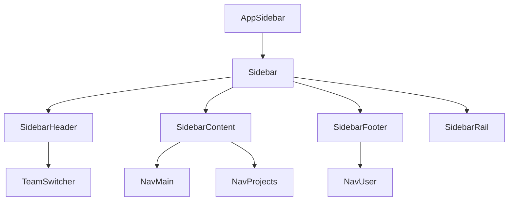
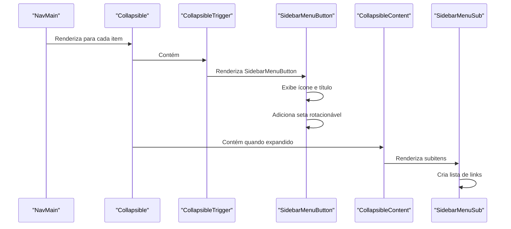
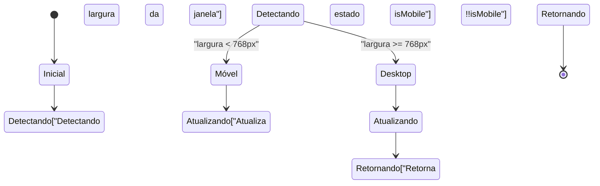

# Componentes UI

<cite>
**Arquivos Referenciados neste Documento**   
- [button.tsx](file://components/ui/button.tsx)
- [avatar.tsx](file://components/ui/avatar.tsx)
- [input.tsx](file://components/ui/input.tsx)
- [app-sidebar.tsx](file://components/app-sidebar.tsx)
- [nav-main.tsx](file://components/nav-main.tsx)
- [use-mobile.ts](file://hooks/use-mobile.ts)
- [components.json](file://components.json)
</cite>

## Sumário
1. [Introdução](#introdução)
2. [Arquitetura Baseada em shadcn/ui](#arquitetura-baseada-em-shadcnui)
3. [Componentes Primitivos](#componentes-primitivos)
4. [Componentes Compostos](#componentes-compostos)
5. [Estilização com Tailwind CSS](#estilização-com-tailwind-css)
6. [Propriedades, Eventos e Acessibilidade](#propriedades-eventos-e-acessibilidade)
7. [Integração com Sistema de Tema e Responsividade](#integração-com-sistema-de-tema-e-responsividade)
8. [Diretrizes de Uso e Boas Práticas](#diretrizes-de-uso-e-boas-práticas)

## Introdução
Este documento fornece uma análise detalhada dos componentes de interface do usuário no sistema sinesys, com foco na arquitetura baseada em shadcn/ui. O sistema utiliza uma abordagem modular e reutilizável para a construção da interface, combinando componentes primitivos estilizados com Tailwind CSS e componentes compostos que orquestram a experiência do usuário. A documentação abrange desde os blocos de construção fundamentais até os componentes complexos, explicando sua composição, personalização, acessibilidade e integração com o sistema de tema e responsividade.

## Arquitetura Baseada em shadcn/ui
O sistema sinesys adota a biblioteca shadcn/ui como base para seus componentes de interface, uma abordagem moderna que combina componentes acessíveis com estilização baseada em Tailwind CSS. A arquitetura é configurada através do arquivo `components.json`, que define o estilo "new-york", habilita o uso de React Server Components (RSC) e estabelece aliases importantes para importação de componentes, utilitários e hooks. Os componentes são organizados em um sistema de camadas, onde componentes primitivos fornecem funcionalidades básicas e são combinados para formar componentes compostos mais complexos, promovendo consistência visual e reutilização de código.

**Seção fontes**
- [components.json](file://components.json#L1-L23)

## Componentes Primitivos
Os componentes primitivos são os blocos de construção fundamentais da interface do sistema, fornecendo funcionalidades básicas com estilização consistente. Eles são implementados como componentes React reutilizáveis, utilizando Tailwind CSS para estilização e bibliotecas como Radix UI para acessibilidade e comportamento.

### Botão (button.tsx)
O componente `Button` é um dos primitivos centrais, implementado com suporte a múltiplas variantes (padrão, destrutivo, contorno, secundário, fantasma e link) e tamanhos (padrão, pequeno, grande e ícone). Ele utiliza a biblioteca `class-variance-authority` (cva) para gerenciar condicionalmente as classes CSS com base nas props fornecidas. O componente também suporta o prop `asChild`, que permite substituir a tag de botão nativa por qualquer outro componente React, mantendo o estilo e comportamento do botão.

```mermaid
classDiagram
class Button {
+variant : "default" | "destructive" | "outline" | "secondary" | "ghost" | "link"
+size : "default" | "sm" | "lg" | "icon"
+asChild? : boolean
+className? : string
}
Button --> cva : "usa buttonVariants"
Button --> Slot : "usado quando asChild=true"
Button --> "button" : "usado quando asChild=false"
```

**Fontes do diagrama**
- [button.tsx](file://components/ui/button.tsx#L7-L34)
- [button.tsx](file://components/ui/button.tsx#L42-L52)

**Seção fontes**
- [button.tsx](file://components/ui/button.tsx#L1-L57)

### Avatar (avatar.tsx)
O componente `Avatar` é composto por três subcomponentes: `Avatar`, `AvatarImage` e `AvatarFallback`. Ele é usado para exibir imagens de perfil de usuário, com fallback para uma representação textual quando a imagem não está disponível. O componente utiliza Radix UI para garantir acessibilidade e comportamento consistente. O estilo padrão inclui bordas arredondadas e tratamento de overflow, garantindo uma apresentação consistente em toda a aplicação.

```mermaid
classDiagram
class Avatar {
+className? : string
}
class AvatarImage {
+className? : string
+src : string
+alt : string
}
class AvatarFallback {
+className? : string
}
Avatar --> AvatarImage : "contém"
Avatar --> AvatarFallback : "contém"
AvatarImage --> "img" : "renderiza"
AvatarFallback --> "div" : "renderiza"
```

**Fontes do diagrama**
- [avatar.tsx](file://components/ui/avatar.tsx#L8-L21)
- [avatar.tsx](file://components/ui/avatar.tsx#L24-L34)
- [avatar.tsx](file://components/ui/avatar.tsx#L37-L50)

**Seção fontes**
- [avatar.tsx](file://components/ui/avatar.tsx#L1-L54)

### Entrada (input.tsx)
O componente `Input` é um primitivo para campos de entrada de texto, com estilização consistente e tratamento especial para tipos específicos como "search" e "file". Ele aplica estilos para estados focados, desabilitados e placeholders, garantindo uma experiência de usuário consistente. O componente utiliza `forwardRef` para permitir o acesso ao elemento DOM subjacente, essencial para integração com bibliotecas de formulários.

```mermaid
flowchart TD
Input["Input Component"] --> Conditional["Verifica tipo de entrada"]
Conditional --> |type='search'| SearchStyles["Aplica estilos para cancelar botão de pesquisa"]
Conditional --> |type='file'| FileStyles["Aplica estilos específicos para arquivos"]
Conditional --> |outro tipo| DefaultStyles["Aplica estilos padrão"]
DefaultStyles --> Focus["Estilos para estado focado"]
DefaultStyles --> Disabled["Estilos para estado desabilitado"]
DefaultStyles --> Placeholder["Estilos para placeholder"]
Input --> "input"["Renderiza elemento input nativo"]
```

**Fontes do diagrama**
- [input.tsx](file://components/ui/input.tsx#L4-L21)

**Seção fontes**
- [input.tsx](file://components/ui/input.tsx#L1-L26)

## Componentes Compostos
Componentes compostos são formados pela combinação de componentes primitivos para criar elementos de interface mais complexos e específicos do domínio da aplicação.

### Barra Lateral do Aplicativo (app-sidebar.tsx)
O componente `AppSidebar` é um componente composto que estrutura a navegação principal da aplicação. Ele utiliza o componente `Sidebar` do shadcn/ui como base e organiza a interface em seções: cabeçalho com `TeamSwitcher`, conteúdo com `NavMain` e `NavProjects`, e rodapé com `NavUser`. O componente demonstra o padrão de composição, onde dados estáticos são usados para alimentar os componentes filhos, criando uma estrutura de navegação hierárquica e responsiva.



**Fontes do diagrama**
- [app-sidebar.tsx](file://components/app-sidebar.tsx#L159-L174)

**Seção fontes**
- [app-sidebar.tsx](file://components/app-sidebar.tsx#L1-L176)

### Navegação Principal (nav-main.tsx)
O componente `NavMain` implementa um menu de navegação com suporte a itens aninhados e colapsáveis. Ele utiliza o componente `Collapsible` do shadcn/ui para permitir que seções do menu se expandam e colapsem. O componente mapeia uma lista de itens de navegação, cada um podendo ter um ícone, título, URL e subitens. A seta de expansão rotaciona com base no estado do `Collapsible`, fornecendo feedback visual claro ao usuário.



**Fontes do diagrama**
- [nav-main.tsx](file://components/nav-main.tsx#L21-L72)

**Seção fontes**
- [nav-main.tsx](file://components/nav-main.tsx#L1-L74)

## Estilização com Tailwind CSS
A estilização no sistema sinesys é feita exclusivamente com Tailwind CSS, uma abordagem utility-first que permite estilização direta no JSX. Os componentes utilizam a função `cn` (classnames) para combinar classes condicionalmente, especialmente útil ao mesclar classes padrão com classes personalizadas fornecidas via prop `className`. O uso de `cva` no componente `Button` demonstra um padrão avançado de estilização, onde variantes são definidas centralmente e aplicadas com base em props, garantindo consistência e facilitando a manutenção.

**Seção fontes**
- [button.tsx](file://components/ui/button.tsx#L7-L34)
- [input.tsx](file://components/ui/input.tsx#L9-L15)

## Propriedades, Eventos e Acessibilidade
Os componentes do sistema sinesys seguem padrões rigorosos de acessibilidade e tipagem. Eles estendem tipos nativos do React (como `React.ButtonHTMLAttributes` e `React.ComponentProps`) para garantir compatibilidade com atributos HTML padrão e suporte a ferramentas de desenvolvimento. Todos os componentes interativos são compatíveis com teclado e leitores de tela, graças ao uso da biblioteca Radix UI, que implementa padrões WAI-ARIA. O componente `Button`, por exemplo, inclui atributos como `focus-visible` para indicar foco de maneira acessível, enquanto o `Collapsible` em `NavMain` gerencia estados de expansão de forma acessível.

**Seção fontes**
- [button.tsx](file://components/ui/button.tsx#L36-L40)
- [nav-main.tsx](file://components/nav-main.tsx#L40-L45)

## Integração com Sistema de Tema e Responsividade
O sistema implementa responsividade através do hook personalizado `useIsMobile`, localizado em `hooks/use-mobile.ts`. Este hook utiliza `window.matchMedia` para detectar se a largura da janela é inferior a 768 pixels, retornando um valor booleano que pode ser usado para alterar o comportamento ou a aparência dos componentes em dispositivos móveis. Embora o arquivo de configuração do Tailwind não esteja disponível, a presença do hook indica uma estratégia de design responsivo integrada ao sistema de componentes.



**Fontes do diagrama**
- [use-mobile.ts](file://hooks/use-mobile.ts#L5-L19)

**Seção fontes**
- [use-mobile.ts](file://hooks/use-mobile.ts#L1-L20)

## Diretrizes de Uso e Boas Práticas
Para garantir consistência e manutenibilidade, novos desenvolvedores devem seguir estas diretrizes ao adicionar componentes ao sistema:

1. **Utilize Componentes Primitivos**: Sempre que possível, componha novos componentes usando os primitivos existentes (Button, Input, Avatar, etc.) em vez de criar elementos HTML estilizados diretamente.

2. **Siga o Padrão de Nomenclatura**: Nomeie componentes com base em sua função, utilizando PascalCase e evitando abreviações não padronizadas.

3. **Tipagem Rigorosa**: Utilize TypeScript para definir interfaces claras para props, estendendo tipos nativos quando apropriado para garantir compatibilidade.

4. **Acessibilidade**: Sempre que possível, utilize componentes da Radix UI para comportamentos complexos (como modais, dropdowns, collapsibles) para garantir acessibilidade nativa.

5. **Responsividade**: Utilize o hook `useIsMobile` para implementar comportamentos diferentes em dispositivos móveis, mas prefira abordagens baseadas em media queries do Tailwind quando possível.

6. **Estilização**: Evite estilos inline; utilize classes do Tailwind CSS e a função `cn` para combinar classes de maneira condicional e consistente.

7. **Documentação**: Documente novos componentes com comentários JSDoc, explicando props, uso esperado e exemplos de implementação.

**Seção fontes**
- [components.json](file://components.json#L14-L19)
- [use-mobile.ts](file://hooks/use-mobile.ts#L3-L5)