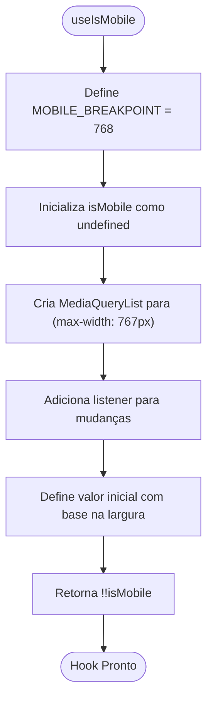
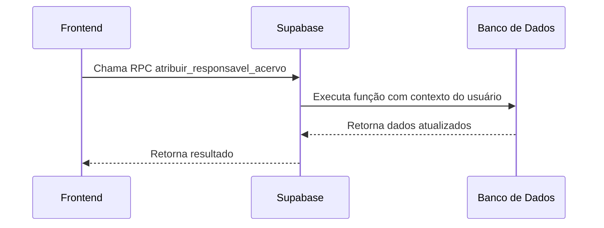
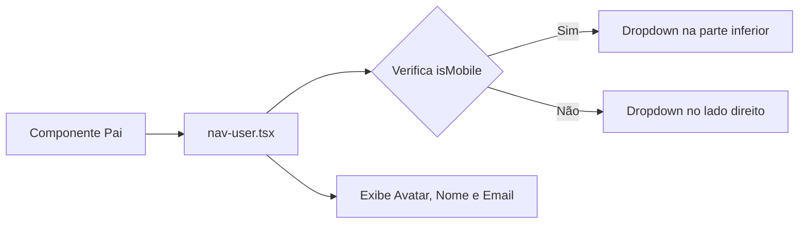

# Estado e Hooks

<cite>
**Arquivos Referenciados neste Documento**  
- [use-mobile.ts](file://hooks/use-mobile.ts)
- [set-user-context.ts](file://backend/utils/supabase/set-user-context.ts)
- [nav-user.tsx](file://components/nav-user.tsx)
- [sidebar.tsx](file://components/ui/sidebar.tsx)
</cite>

## Sumário
1. [Introdução](#introdução)
2. [Gerenciamento de Estado no Frontend](#gerenciamento-de-estado-no-frontend)
3. [Hook Personalizado useIsMobile](#hook-personalizado-useismobile)
4. [Contexto de Usuário e Integração com Supabase](#contexto-de-usuário-e-integração-com-supabase)
5. [Propagação de Estado em Componentes](#propagação-de-estado-em-componentes)
6. [Padrões de Estado Global vs Local](#padrões-de-estado-global-vs-local)
7. [Estratégias de Caching e Desempenho](#estratégias-de-caching-e-desempenho)
8. [Criação de Novos Hooks Personalizados](#criação-de-novos-hooks-personalizados)

## Introdução
Este documento detalha o gerenciamento de estado e o uso de hooks personalizados no frontend do sistema sinesys. O foco está na detecção de dispositivos móveis, na gestão do estado do usuário via Supabase, na propagação de estado entre componentes e nas melhores práticas para o App Router do Next.js.

## Gerenciamento de Estado no Frontend
O frontend do sinesys utiliza uma combinação de estado local, contexto React e estado gerenciado pelo Supabase para manter a consistência entre a interface e os dados do backend. O estado é gerido de forma eficiente para garantir responsividade e escalabilidade.

## Hook Personalizado useIsMobile

O hook `useIsMobile` é um hook personalizado que detecta se o dispositivo do usuário é móvel com base na largura da janela. Ele utiliza a API `window.matchMedia` para monitorar mudanças no tamanho da tela e retorna um valor booleano indicando se a largura está abaixo do breakpoint definido (768px).

O hook é implementado com `useState` e `useEffect`, garantindo que o estado seja atualizado dinamicamente quando o usuário redimensiona a janela ou acessa de diferentes dispositivos. Ele é especialmente útil para ajustar o layout em componentes responsivos.



**Fontes do Diagrama**  
- [use-mobile.ts](file://hooks/use-mobile.ts#L3-L19)

**Fontes da Seção**  
- [use-mobile.ts](file://hooks/use-mobile.ts#L1-L20)

## Contexto de Usuário e Integração com Supabase

O estado do usuário é gerenciado através da integração com o Supabase, utilizando funções RPC (Remote Procedure Call) que garantem a segurança e a consistência dos dados. O arquivo `set-user-context.ts` contém funções assíncronas que atribuem responsáveis a diferentes entidades (acervo, audiências, pendentes) e registram o usuário que executou a ação.

Essas funções utilizam o cliente Supabase para chamar procedimentos armazenados no banco de dados, que automaticamente definem o contexto do usuário para fins de auditoria e controle de acesso. Isso permite que o sistema mantenha um registro preciso de quem realizou cada alteração.



**Fontes do Diagrama**  
- [set-user-context.ts](file://backend/utils/supabase/set-user-context.ts#L15-L90)

**Fontes da Seção**  
- [set-user-context.ts](file://backend/utils/supabase/set-user-context.ts#L1-L93)

## Propagação de Estado em Componentes

O estado do usuário é propagado entre componentes por meio de props, como demonstrado no componente `nav-user.tsx`. Esse componente recebe as informações do usuário (nome, email, avatar) como propriedades e as exibe em um menu dropdown no sidebar.

Além disso, o componente utiliza o hook `useSidebar` para obter o estado `isMobile`, demonstrando como o estado pode ser compartilhado entre diferentes partes da interface para adaptar o comportamento com base no layout.



**Fontes do Diagrama**  
- [nav-user.tsx](file://components/nav-user.tsx#L32-L113)
- [sidebar.tsx](file://components/ui/sidebar.tsx#L68-L68)

**Fontes da Seção**  
- [nav-user.tsx](file://components/nav-user.tsx#L1-L115)

## Padrões de Estado Global vs Local

O sistema sinesys adota uma abordagem híbrida para o gerenciamento de estado:

- **Estado Local**: Utilizado em componentes que não precisam compartilhar estado com outros, como formulários ou elementos de UI isolados.
- **Estado Global**: Gerenciado via contexto React e Supabase para dados que precisam ser acessados em múltiplas partes da aplicação, como informações do usuário autenticado.

Essa divisão permite otimizar o desempenho, evitando rerenderizações desnecessárias, enquanto mantém a acessibilidade dos dados críticos.

## Estratégias de Caching e Desempenho

No App Router do Next.js, o caching é essencial para melhorar o desempenho. O sistema utiliza:

- **Server-Side Rendering (SSR)**: Para dados dinâmicos que precisam ser atualizados com frequência.
- **Caching no Supabase**: Para reduzir consultas repetidas ao banco de dados.
- **Memoização de Hooks**: Para evitar cálculos desnecessários em hooks personalizados.

Essas estratégias garantem que a aplicação permaneça responsiva mesmo com grandes volumes de dados.

## Criação de Novos Hooks Personalizados

Para criar novos hooks personalizados no sinesys, siga estas práticas:

1. Crie o arquivo no diretório `hooks/` com o prefixo `use-`.
2. Utilize `useState`, `useEffect`, `useCallback` ou `useMemo` conforme necessário.
3. Garanta que o hook seja reutilizável e independente de componentes específicos.
4. Documente claramente os parâmetros e o valor de retorno.

Exemplo de estrutura:
```ts
export function useCustomHook(param: Type) {
  const [state, setState] = useState<Type | null>(null);

  useEffect(() => {
    // Lógica personalizada
  }, [param]);

  return state;
}
```

**Fontes da Seção**  
- [use-mobile.ts](file://hooks/use-mobile.ts#L1-L20)
- [set-user-context.ts](file://backend/utils/supabase/set-user-context.ts#L1-L93)