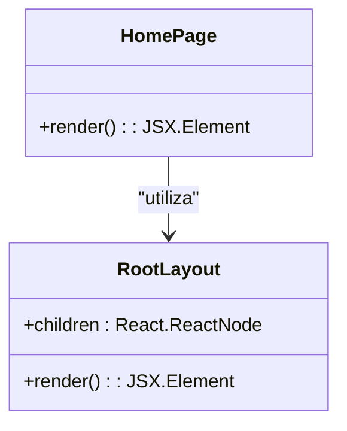
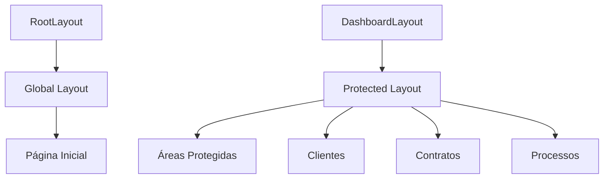
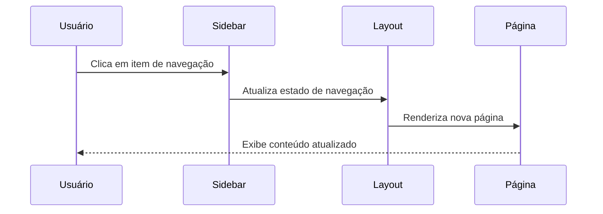
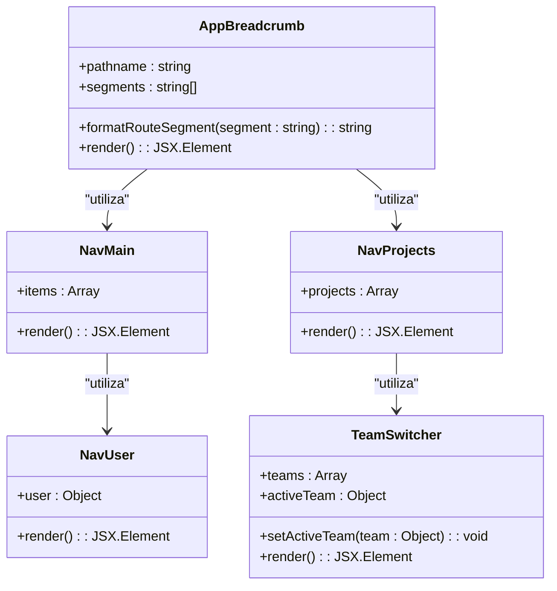
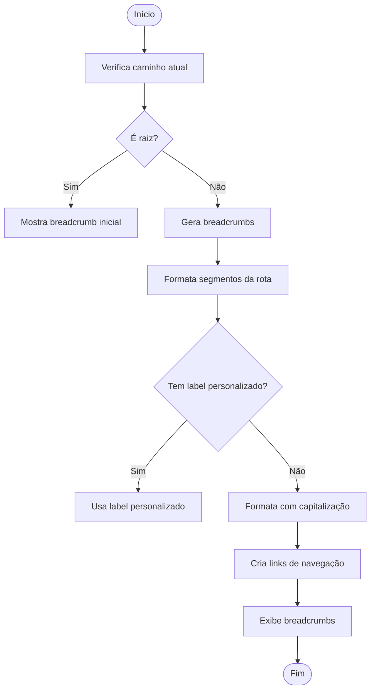
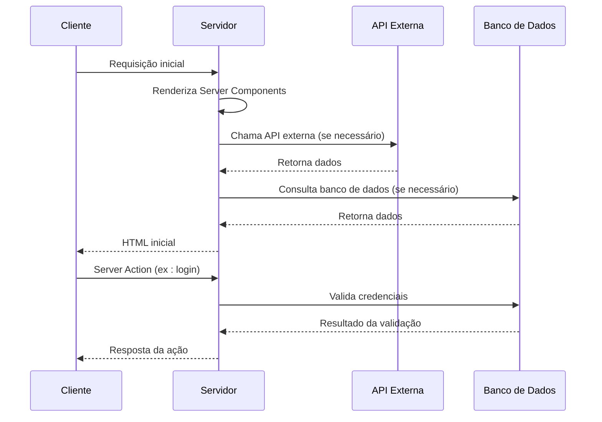
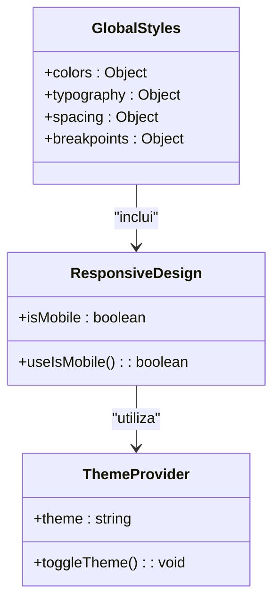
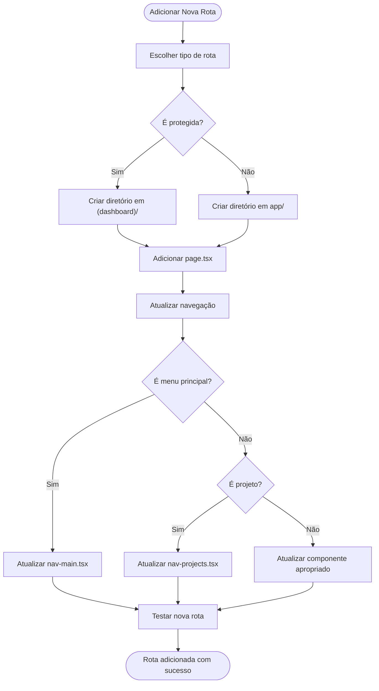

# Rotas e Navegação

<cite>
**Arquivos Referenciados neste Documento**   
- [app/page.tsx](file://app/page.tsx)
- [app/layout.tsx](file://app/layout.tsx)
- [app/(dashboard)/layout.tsx](file://app/(dashboard)/layout.tsx)
- [app/globals.css](file://app/globals.css)
- [components/app-breadcrumb.tsx](file://components/app-breadcrumb.tsx)
- [components/app-sidebar.tsx](file://components/app-sidebar.tsx)
- [components/nav-main.tsx](file://components/nav-main.tsx)
- [components/nav-projects.tsx](file://components/nav-projects.tsx)
- [components/nav-user.tsx](file://components/nav-user.tsx)
- [components/team-switcher.tsx](file://components/team-switcher.tsx)
- [components/ui/sidebar.tsx](file://components/ui/sidebar.tsx)
- [hooks/use-mobile.ts](file://hooks/use-mobile.ts)
- [app/docs/page.tsx](file://app/docs/page.tsx)
</cite>

## Sumário
1. [Introdução](#introdução)
2. [Estrutura de Diretórios](#estrutura-de-diretórios)
3. [Página Inicial e Layout Global](#página-inicial-e-layout-global)
4. [Layouts Compartilhados e Protegidos](#layouts-compartilhados-e-protegidos)
5. [Sistema de Navegação](#sistema-de-navegação)
6. [Componentes de Navegação](#componentes-de-navegação)
7. [Navegação entre Páginas](#navegação-entre-páginas)
8. [Server Components e Server Actions](#server-components-e-server-actions)
9. [Estilos Globais e Responsividade](#estilos-globais-e-responsividade)
10. [Adição de Novas Rotas e Layouts](#adição-de-novas-rotas-e-layouts)
11. [Conclusão](#conclusão)

## Introdução
O sistema de rotas e navegação do frontend sinesys é baseado no App Router do Next.js, uma abordagem moderna e eficiente para gerenciar rotas em aplicações React. Este documento fornece uma análise detalhada da estrutura de diretórios, componentes de navegação, layouts e padrões de implementação utilizados no projeto. O sistema é projetado para oferecer uma experiência de usuário consistente e responsiva, com suporte a áreas protegidas, breadcrumbs dinâmicos e navegação intuitiva através de sidebars e menus.

## Estrutura de Diretórios
A estrutura de diretórios do projeto sinesys segue os padrões recomendados pelo Next.js App Router, organizando os arquivos de forma lógica e escalável. O diretório `app/` é o coração do sistema de rotas, contendo todos os componentes relacionados à interface e navegação.

```mermaid
graph TD
A[app/] --> B[(dashboard)/]
A --> C[api/]
A --> D[docs/]
A --> E[layout.tsx]
A --> F[page.tsx]
B --> G[layout.tsx]
D --> H[page.tsx]
C --> I[acervo/]
C --> J[clientes/]
C --> K[contratos/]
```

**Fontes do Diagrama**
- [app/page.tsx](file://app/page.tsx)
- [app/layout.tsx](file://app/layout.tsx)
- [app/(dashboard)/layout.tsx](file://app/(dashboard)/layout.tsx)

**Fontes da Seção**
- [app/page.tsx](file://app/page.tsx)
- [app/layout.tsx](file://app/layout.tsx)
- [app/(dashboard)/layout.tsx](file://app/(dashboard)/layout.tsx)

## Página Inicial e Layout Global
A página inicial do sistema é definida pelo arquivo `page.tsx` localizado na raiz do diretório `app/`. Este componente serve como ponto de entrada da aplicação e é responsável por renderizar o conteúdo da página inicial.



**Fontes do Diagrama**
- [app/page.tsx](file://app/page.tsx)
- [app/layout.tsx](file://app/layout.tsx)

**Fontes da Seção**
- [app/page.tsx](file://app/page.tsx#L3-L65)
- [app/layout.tsx](file://app/layout.tsx#L21-L43)

## Layouts Compartilhados e Protegidos
O sistema utiliza dois tipos principais de layouts: o layout global e o layout protegido. O arquivo `layout.tsx` na raiz do diretório `app/` define o layout global aplicado a todas as páginas, enquanto o arquivo `(dashboard)/layout.tsx` define o layout para áreas protegidas do sistema.

O uso de parênteses em `(dashboard)` indica uma rota paralela, permitindo que o sistema tenha diferentes layouts para diferentes contextos sem conflitos de roteamento. O layout protegido inclui componentes de navegação adicionais, como sidebar e breadcrumb, que não estão presentes no layout inicial.



**Fontes do Diagrama**
- [app/layout.tsx](file://app/layout.tsx#L21-L43)
- [app/(dashboard)/layout.tsx](file://app/(dashboard)/layout.tsx#L28-L58)

**Fontes da Seção**
- [app/layout.tsx](file://app/layout.tsx#L21-L43)
- [app/(dashboard)/layout.tsx](file://app/(dashboard)/layout.tsx#L28-L58)

## Sistema de Navegação
O sistema de navegação do sinesys é implementado através de uma combinação de componentes React que trabalham em conjunto para fornecer uma experiência de usuário coesa. A navegação é baseada em padrões modernos de SPAs (Single Page Applications), com suporte a navegação cliente-side e pré-carregamento de rotas.

A arquitetura de navegação utiliza o contexto do React para gerenciar o estado da sidebar e outros elementos de interface, permitindo que diferentes componentes se comuniquem de forma eficiente. O sistema também implementa responsividade, adaptando-se a diferentes tamanhos de tela e dispositivos.



**Fontes do Diagrama**
- [components/app-sidebar.tsx](file://components/app-sidebar.tsx)
- [components/ui/sidebar.tsx](file://components/ui/sidebar.tsx)
- [app/(dashboard)/layout.tsx](file://app/(dashboard)/layout.tsx)

**Fontes da Seção**
- [components/app-sidebar.tsx](file://components/app-sidebar.tsx#L159-L175)
- [components/ui/sidebar.tsx](file://components/ui/sidebar.tsx#L56-L152)
- [app/(dashboard)/layout.tsx](file://app/(dashboard)/layout.tsx#L38-L54)

## Componentes de Navegação
Os principais componentes de navegação são implementados nos arquivos `app-breadcrumb.tsx`, `nav-projects.tsx`, `nav-main.tsx`, `nav-user.tsx` e `team-switcher.tsx`. Esses componentes são responsáveis por diferentes aspectos da interface de navegação, desde o breadcrumb até os menus de usuário e seleção de times.

O componente `AppBreadcrumb` é particularmente importante, pois fornece uma navegação hierárquica baseada na URL atual. Ele utiliza o hook `usePathname` do Next.js para obter a rota atual e gerar automaticamente os links de breadcrumb correspondentes.



**Fontes do Diagrama**
- [components/app-breadcrumb.tsx](file://components/app-breadcrumb.tsx#L41-L105)
- [components/nav-main.tsx](file://components/nav-main.tsx#L21-L73)
- [components/nav-projects.tsx](file://components/nav-projects.tsx#L28-L89)
- [components/nav-user.tsx](file://components/nav-user.tsx#L33-L114)
- [components/team-switcher.tsx](file://components/team-switcher.tsx#L22-L91)

**Fontes da Seção**
- [components/app-breadcrumb.tsx](file://components/app-breadcrumb.tsx#L41-L105)
- [components/nav-main.tsx](file://components/nav-main.tsx#L21-L73)
- [components/nav-projects.tsx](file://components/nav-projects.tsx#L28-L89)
- [components/nav-user.tsx](file://components/nav-user.tsx#L33-L114)
- [components/team-switcher.tsx](file://components/team-switcher.tsx#L22-L91)

## Navegação entre Páginas
A navegação entre páginas no sistema sinesys é implementada utilizando os recursos nativos do Next.js App Router. O sistema utiliza o componente `Link` do Next.js para navegação cliente-side eficiente, com pré-carregamento automático das rotas para melhorar a experiência do usuário.

O componente `AppBreadcrumb` desempenha um papel crucial na navegação, fornecendo uma forma hierárquica de navegar entre as diferentes seções do sistema. Ele mapeia automaticamente os segmentos da URL para labels legíveis, utilizando um objeto de mapeamento definido no componente.



**Fontes do Diagrama**
- [components/app-breadcrumb.tsx](file://components/app-breadcrumb.tsx#L41-L105)

**Fontes da Seção**
- [components/app-breadcrumb.tsx](file://components/app-breadcrumb.tsx#L41-L105)
- [app/docs/page.tsx](file://app/docs/page.tsx#L12-L68)

## Server Components e Server Actions
O sistema sinesys aproveita os recursos de Server Components e Server Actions do Next.js para otimizar o desempenho e a segurança. Os Server Components permitem que parte da renderização ocorra no servidor, reduzindo o tamanho do bundle enviado ao cliente e melhorando o tempo de carregamento.

Os Server Actions são utilizados para operações que requerem acesso direto ao servidor, como chamadas a APIs externas ou operações de banco de dados. Isso permite que o sistema mantenha a lógica sensível no servidor, enquanto a interface permanece responsiva no cliente.



**Fontes do Diagrama**
- [app/page.tsx](file://app/page.tsx)
- [app/docs/page.tsx](file://app/docs/page.tsx)
- [app/api/](file://app/api/)

**Fontes da Seção**
- [app/docs/page.tsx](file://app/docs/page.tsx#L17-L33)
- [app/api/](file://app/api/)

## Estilos Globais e Responsividade
Os estilos globais do sistema são definidos no arquivo `globals.css`, que utiliza Tailwind CSS em conjunto com variáveis CSS para criar um sistema de design consistente. O arquivo define as cores, tipografia e espaçamentos utilizados em toda a aplicação.

O sistema implementa responsividade completa, adaptando-se a diferentes tamanhos de tela e dispositivos. O componente `useIsMobile` é utilizado para detectar se o usuário está acessando de um dispositivo móvel, permitindo que a interface se adapte apropriadamente.



**Fontes do Diagrama**
- [app/globals.css](file://app/globals.css)
- [hooks/use-mobile.ts](file://hooks/use-mobile.ts)

**Fontes da Seção**
- [app/globals.css](file://app/globals.css#L46-L113)
- [hooks/use-mobile.ts](file://hooks/use-mobile.ts#L5-L19)

## Adição de Novas Rotas e Layouts
Para adicionar novas rotas ao sistema, deve-se criar um novo diretório dentro de `app/` com o nome da rota desejada, utilizando kebab-case. Dentro desse diretório, deve-se criar um arquivo `page.tsx` que definirá o conteúdo da página.

Para rotas protegidas, o novo diretório deve ser criado dentro de `(dashboard)/`. Isso garantirá que a nova rota utilize o layout protegido com sidebar e breadcrumb. Para adicionar itens de navegação, deve-se atualizar os dados no componente `AppSidebar` ou nos componentes de navegação específicos.



**Fontes do Diagrama**
- [app/page.tsx](file://app/page.tsx)
- [app/(dashboard)/layout.tsx](file://app/(dashboard)/layout.tsx)
- [components/nav-main.tsx](file://components/nav-main.tsx)
- [components/nav-projects.tsx](file://components/nav-projects.tsx)

**Fontes da Seção**
- [app/page.tsx](file://app/page.tsx)
- [app/(dashboard)/layout.tsx](file://app/(dashboard)/layout.tsx)
- [components/nav-main.tsx](file://components/nav-main.tsx)
- [components/nav-projects.tsx](file://components/nav-projects.tsx)

## Conclusão
O sistema de rotas e navegação do frontend sinesys é uma implementação robusta e bem estruturada baseada no App Router do Next.js. A arquitetura modular permite fácil escalabilidade e manutenção, enquanto os componentes de navegação fornecem uma experiência de usuário consistente e intuitiva.

A combinação de layouts compartilhados, áreas protegidas, breadcrumbs dinâmicos e navegação responsiva cria um sistema coeso que atende às necessidades de uma aplicação jurídica complexa. O uso de Server Components e Server Actions otimiza o desempenho e a segurança, enquanto a estrutura de diretórios clara facilita a adição de novas funcionalidades.

Para futuras extensões, recomenda-se seguir os padrões existentes de nomenclatura e estrutura, garantindo a consistência do sistema como um todo.