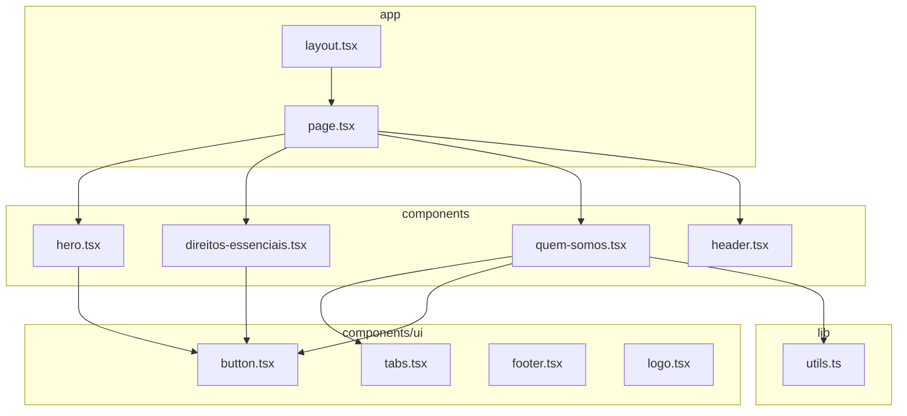
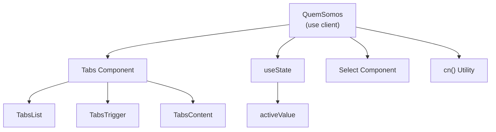
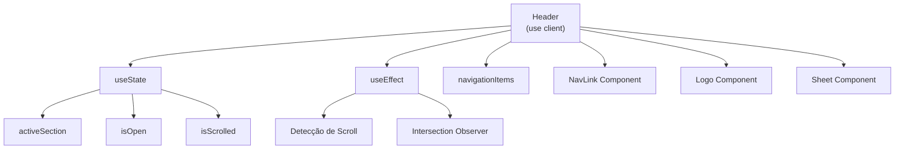
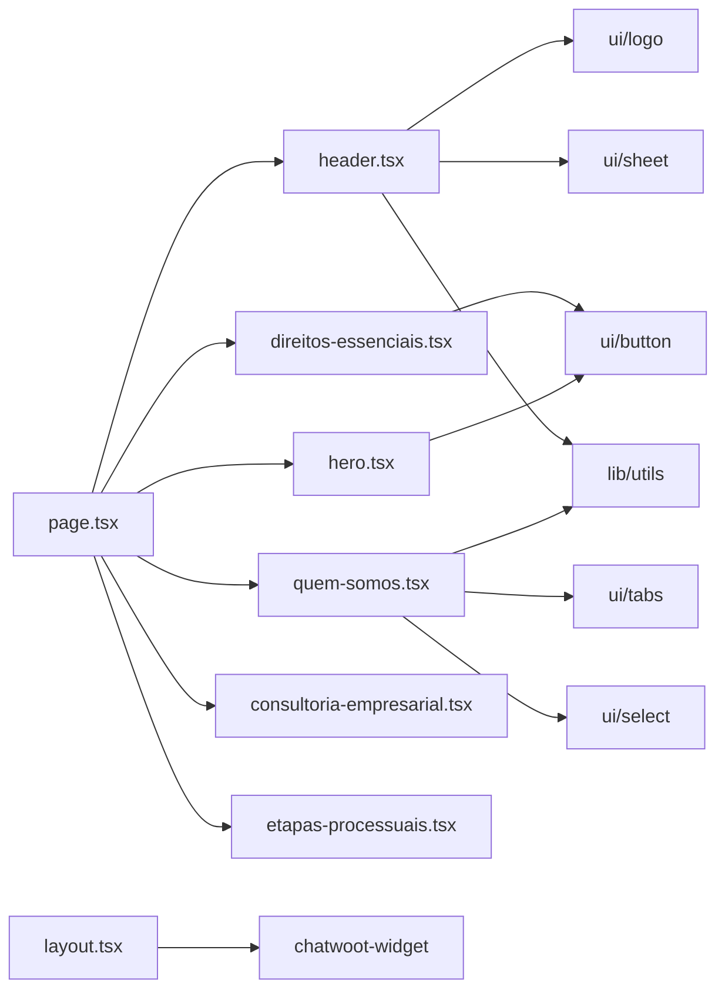

# Arquitetura de Componentes

<cite>
**Arquivos Referenciados neste Documento**  
- [app/page.tsx](file://app/page.tsx) - *Atualizado para refletir nova estrutura de marca*
- [app/layout.tsx](file://app/layout.tsx) - *Atualizado com novo título e metadados para Zattar Advogados*
- [components/header.tsx](file://components/header.tsx) - *Atualizado com efeito de glassmorphism e navegação centralizada*
- [components/hero.tsx](file://components/hero.tsx) - *Ajustado para alinhamento com novo header fixo*
- [components/ui/logo.tsx](file://components/ui/logo.tsx) - *Atualizado para nova marca Zattar Advogados*
- [components/direitos-essenciais.tsx](file://components/direitos-essenciais.tsx)
- [components/quem-somos.tsx](file://components/quem-somos.tsx)
- [components/chatwoot-widget.tsx](file://components/chatwoot-widget.tsx)
- [components/ui/button.tsx](file://components/ui/button.tsx)
- [components/ui/tabs.tsx](file://components/ui/tabs.tsx)
- [components/ui/footer.tsx](file://components/ui/footer.tsx) - *Atualizado para nova identidade visual*
- [lib/utils.ts](file://lib/utils.ts)
</cite>

## Resumo das Atualizações
**Alterações Realizadas**  
- Implementação de efeito de glassmorphism no header com detecção dinâmica de scroll
- Refatoração completa da navegação para layout com logo centralizado e suporte responsivo
- Ajuste no componente Hero para compensar o offset do novo header fixo
- Atualização da identidade visual para **Zattar Advogados** em todos os componentes de marca
- Atualização dos metadados da aplicação em `layout.tsx` com novo título, descrição e palavras-chave
- Manutenção da arquitetura modular e do padrão de design system com shadcn/ui
- Preservação do uso de React Server Components e da diretiva `'use client'` onde necessário

## Sumário
1. [Introdução](#introdução)
2. [Estrutura de Projeto](#estrutura-de-projeto)
3. [Componentes Principais](#componentes-principais)
4. [Visão Geral da Arquitetura](#visão-geral-da-arquitetura)
5. [Análise Detalhada de Componentes](#análise-detalhada-de-componentes)
6. [Análise de Dependências](#análise-de-dependências)
7. [Considerações de Desempenho](#considerações-de-desempenho)
8. [Guia de Solução de Problemas](#guia-de-solução-de-problemas)
9. [Conclusão](#conclusão)

## Introdução
Este documento apresenta uma análise detalhada da arquitetura de componentes do projeto, destacando o padrão de composição baseado em React Server Components, a separação entre componentes base e de seção, e as decisões de design que priorizam desempenho, reutilização e escalabilidade. O sistema utiliza o framework Next.js com uma abordagem moderna de renderização híbrida. A identidade visual foi atualizada para **Zattar Advogados**, refletindo uma nova fase institucional com foco em advocacia trabalhista especializada. As recentes alterações introduziram um efeito de glassmorphism no header e uma nova arquitetura de navegação com logo centralizado, melhorando significativamente a experiência do usuário e a estética visual do site.

## Estrutura de Projeto
A estrutura do projeto segue uma organização clara baseada em responsabilidades e camadas de abstração. Os componentes são divididos em dois diretórios principais: `/components` para componentes de seção e `/components/ui` para componentes base do sistema de design.



**Fontes do Diagrama**  
- [app/page.tsx](file://app/page.tsx#L1-L21)
- [components/hero.tsx](file://components/hero.tsx#L1-L42)
- [components/direitos-essenciais.tsx](file://components/direitos-essenciais.tsx#L1-L130)
- [components/quem-somos.tsx](file://components/quem-somos.tsx#L1-L236)
- [components/ui/button.tsx](file://components/ui/button.tsx#L1-L59)
- [components/ui/tabs.tsx](file://components/ui/tabs.tsx#L1-L55)

**Fontes da Seção**  
- [app/page.tsx](file://app/page.tsx#L1-L21)
- [components/hero.tsx](file://components/hero.tsx#L1-L42)

## Componentes Principais
Os componentes principais do sistema são organizados em uma hierarquia clara, onde a página principal (`page.tsx`) monta componentes de seção como `Hero`, `DireitosEssenciais`, `EtapasProcessuais`, `QuemSomos` e `ConsultoriaEmpresarial`. Essa abordagem modular permite alta reutilização e manutenção simplificada. A identidade visual foi atualizada para **Zattar Advogados**, com alterações no logo, header, footer e metadados da aplicação. O componente `Header` foi significativamente refatorado para implementar um layout com logo centralizado e um efeito de glassmorphism que ativa quando o usuário rola a página, melhorando a experiência visual e a usabilidade.

**Fontes da Seção**  
- [app/page.tsx](file://app/page.tsx#L1-L21)
- [components/hero.tsx](file://components/hero.tsx#L1-L42)
- [components/direitos-essenciais.tsx](file://components/direitos-essenciais.tsx#L1-L130)
- [components/quem-somos.tsx](file://components/quem-somos.tsx#L1-L236)
- [components/consultoria-empresarial.tsx](file://components/consultoria-empresarial.tsx)
- [components/etapas-processuais.tsx](file://components/etapas-processuais.tsx)
- [components/header.tsx](file://components/header.tsx#L1-L206) - *Refatorado com navegação centralizada*

## Visão Geral da Arquitetura
O sistema adota uma arquitetura baseada em componentes modulares com uma clara separação entre componentes de interface base e componentes de seção. O uso de React Server Components por padrão maximiza o desempenho, enquanto componentes interativos utilizam a diretiva `'use client'`. O `RootLayout` em `layout.tsx` envolve toda a aplicação com `Header`, `Footer` e `ChatwootWidget`, além de definir metadados atualizados para **Zattar Advogados**. O componente `Header` foi atualizado para uma nova arquitetura de navegação com logo centralizado, utilizando um layout de grid com três colunas para alinhar os itens de navegação à esquerda e à direita do logo central. Para dispositivos móveis, um sistema de drawer com `Sheet` é utilizado para manter a usabilidade.

```mermaid
graph TD
RootLayout[RootLayout<br/>layout.tsx] --> Header
RootLayout --> ChatwootWidget
RootLayout --> MainContent
MainContent[Conteúdo Principal] --> Hero
MainContent --> DireitosEssenciais
MainContent --> QuemSomos
MainContent --> ConsultoriaEmpresarial
MainContent --> EtapasProcessuais
Hero --> Button[Botão UI]
DireitosEssenciais --> Button
QuemSomos --> Tabs[Tabs UI]
QuemSomos --> Button
QuemSomos --> Select[Select UI]
QuemSomos --> cn[cn()]
```

**Fontes do Diagrama**  
- [app/layout.tsx](file://app/layout.tsx#L1-L39)
- [app/page.tsx](file://app/page.tsx#L1-L21)
- [components/chatwoot-widget.tsx](file://components/chatwoot-widget.tsx#L1-L26)
- [lib/utils.ts](file://lib/utils.ts#L1-L6)

## Análise Detalhada de Componentes

### Análise do Componente Hero
O componente `Hero` representa a seção inicial da página, implementando uma chamada visual forte com elementos interativos. Utiliza componentes base como `Button` e `BackgroundPattern`, demonstrando a reutilização do sistema de design. O conteúdo textual foi ajustado para refletir a missão do escritório: "Uma vida digna se constrói sobre um trabalho justo." O componente foi ajustado para incluir um padding top adicional (`pt-32 md:pt-36`) para compensar o offset do novo header fixo, garantindo que o conteúdo não seja ocultado pela navegação superior.

**Fontes da Seção**  
- [components/hero.tsx](file://components/hero.tsx#L1-L42)
- [components/ui/button.tsx](file://components/ui/button.tsx#L1-L59)

### Análise do Componente DireitosEssenciais
O componente `DireitosEssenciais` exibe uma grade de direitos trabalhistas essenciais, utilizando um padrão de dados estruturados para renderização dinâmica. Demonstra a separação entre lógica de apresentação e conteúdo. Cada direito é apresentado com ícone temático e descrição clara, promovendo a educação jurídica do usuário.

**Fontes da Seção**  
- [components/direitos-essenciais.tsx](file://components/direitos-essenciais.tsx#L1-L130)

### Análise do Componente QuemSomos
O componente `QuemSomos` é um exemplo avançado de componente interativo que utiliza abas (tabs) para navegação entre pilares de atuação. Requer a diretiva `'use client'` devido ao estado gerenciado com `useState`. Inclui um dropdown responsivo para dispositivos móveis e uma imagem ilustrativa para cada pilar.



**Fontes do Diagrama**  
- [components/quem-somos.tsx](file://components/quem-somos.tsx#L1-L236)
- [components/ui/tabs.tsx](file://components/ui/tabs.tsx#L1-L55)
- [lib/utils.ts](file://lib/utils.ts#L1-L6)

**Fontes da Seção**  
- [components/quem-somos.tsx](file://components/quem-somos.tsx#L1-L236)
- [components/ui/tabs.tsx](file://components/ui/tabs.tsx#L1-L55)

### Análise do Componente Header
O componente `Header` foi completamente refatorado para implementar uma nova arquitetura de navegação com logo centralizado e um sofisticado efeito de glassmorphism. O header é fixo no topo da página (`position: fixed`) e utiliza um efeito de vidro translúcido que se ativa quando o usuário rola a página mais de 20 pixels, criando uma transição suave com `backdrop-blur-xl`. A navegação desktop utiliza um layout de grid com três colunas: itens à esquerda, logo centralizado e itens à direita. Para dispositivos móveis, um ícone de hambúrguer abre um drawer lateral com todas as opções de navegação. O componente utiliza `IntersectionObserver` para detectar automaticamente a seção ativa e `useState` para gerenciar o estado de rolagem e o menu móvel.



**Fontes do Diagrama**  
- [components/header.tsx](file://components/header.tsx#L1-L206)
- [components/ui/logo.tsx](file://components/ui/logo.tsx#L1-L13)
- [components/ui/sheet.tsx](file://components/ui/sheet.tsx)

**Fontes da Seção**  
- [components/header.tsx](file://components/header.tsx#L1-L206)
- [components/ui/logo.tsx](file://components/ui/logo.tsx#L1-L13)
- [components/ui/sheet.tsx](file://components/ui/sheet.tsx)

### Sistema de Design com shadcn/ui
O projeto utiliza um sistema de design baseado em shadcn/ui, com componentes base localizados em `/components/ui`. Essa abordagem garante consistência visual e facilita a manutenção. A identidade visual foi atualizada para **Zattar Advogados**, com alterações no logo, cores e tipografia refletidas nos componentes `header.tsx`, `footer.tsx` e `logo.tsx`. O utilitário `cn()` é amplamente utilizado para combinar classes CSS de forma condicional, especialmente no componente `Header` para alternar entre os estados de glassmorphism ativado e desativado.

```mermaid
classDiagram
class Button {
+variant : default | destructive | outline | secondary | ghost | link | brand
+size : default | sm | lg | icon
+asChild : boolean
+className : string
}
class Tabs {
+value : string
+onValueChange : (value : string) => void
}
class TabsList {
+className : string
}
class TabsTrigger {
+value : string
+className : string
}
class TabsContent {
+value : string
+className : string
}
Tabs --> TabsList : contém
Tabs --> TabsTrigger : contém
Tabs --> TabsContent : contém
Button --> "cn()" : utiliza
Tabs --> "cn()" : utiliza
```

**Fontes do Diagrama**  
- [components/ui/button.tsx](file://components/ui/button.tsx#L1-L59)
- [components/ui/tabs.tsx](file://components/ui/tabs.tsx#L1-L55)
- [lib/utils.ts](file://lib/utils.ts#L1-L6)

**Fontes da Seção**  
- [components/ui/button.tsx](file://components/ui/button.tsx#L1-L59)
- [components/ui/tabs.tsx](file://components/ui/tabs.tsx#L1-L55)
- [components/ui/logo.tsx](file://components/ui/logo.tsx)
- [components/ui/footer.tsx](file://components/ui/footer.tsx)

## Análise de Dependências
A análise de dependências revela uma arquitetura bem estruturada com baixo acoplamento entre componentes de alto nível. A utilização de um utilitário central (`cn`) e componentes UI padronizados reduz a duplicação de código. A nova identidade visual foi implementada de forma consistente em todos os componentes de marca. O componente `Header` demonstra um padrão avançado de composição, dependendo de múltiplos componentes de UI como `Sheet`, `Logo`, e utilizando o utilitário `cn()` para gerenciamento de classes condicionais.



**Fontes do Diagrama**  
- [app/page.tsx](file://app/page.tsx#L1-L21)
- [app/layout.tsx](file://app/layout.tsx#L1-L39)
- [components/header.tsx](file://components/header.tsx#L1-L206)
- [components/chatwoot-widget.tsx](file://components/chatwoot-widget.tsx#L1-L26)

**Fontes da Seção**  
- [app/page.tsx](file://app/page.tsx#L1-L21)
- [app/layout.tsx](file://app/layout.tsx#L1-L39)

## Considerações de Desempenho
O projeto implementa práticas modernas de otimização de desempenho, incluindo o uso padrão de React Server Components, o que reduz o tamanho do bundle do cliente. Componentes interativos são marcados com `'use client'` apenas quando necessário, minimizando o custo de hidratação. A diretiva `'use client'` é utilizada estrategicamente em componentes que requerem estado ou interatividade, como `QuemSomos`, `Tabs` e `Header`, enquanto a maioria dos componentes permanece como Server Components. O utilitário `cn()` otimiza a manipulação de classes CSS, e o uso de `Image` do Next.js garante otimização automática de imagens. O efeito de glassmorphism no `Header` é otimizado com transições suaves e detecção eficiente de scroll, garantindo bom desempenho mesmo em dispositivos móveis.

## Guia de Solução de Problemas
Para problemas relacionados à interatividade em componentes que deveriam ser interativos, verifique se a diretiva `'use client'` está presente no início do arquivo. Para problemas de estilos, confirme que o utilitário `cn()` está sendo utilizado corretamente para mesclar classes. Erros de montagem de componentes podem ocorrer se houver inconsistência entre Server Components e Client Components. Certifique-se de que todos os componentes filhos de um Client Component estão no mesmo contexto de cliente ou são compatíveis com a transferência entre ambientes. Para problemas específicos com o novo header, verifique se o offset de rolagem (100px) está correto e se o `IntersectionObserver` está configurado com as margens apropriadas.

**Fontes da Seção**  
- [components/quem-somos.tsx](file://components/quem-somos.tsx#L1-L236)
- [components/ui/tabs.tsx](file://components/ui/tabs.tsx#L1-L55)
- [lib/utils.ts](file://lib/utils.ts#L1-L6)
- [components/header.tsx](file://components/header.tsx#L1-L206) - *Para problemas de navegação*