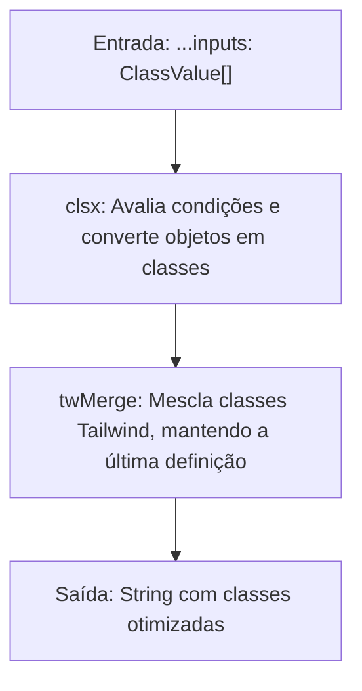
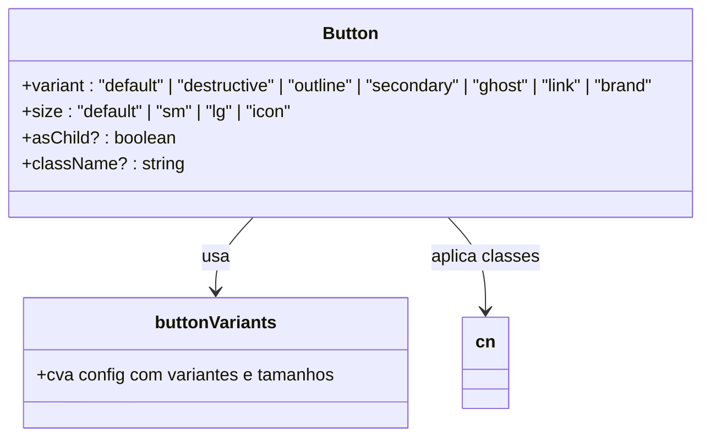
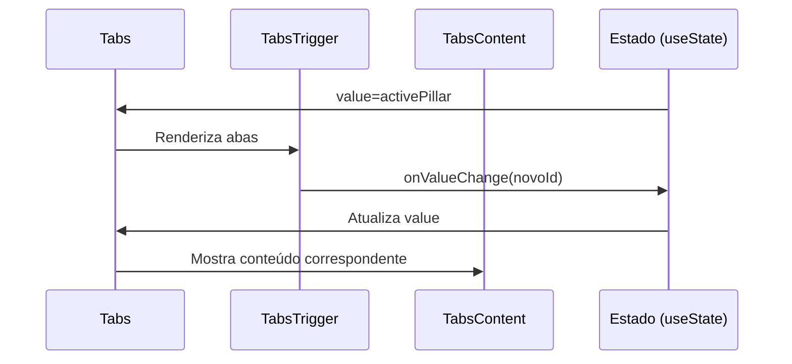
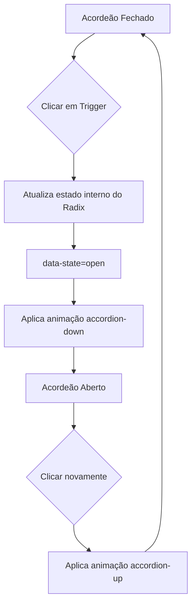
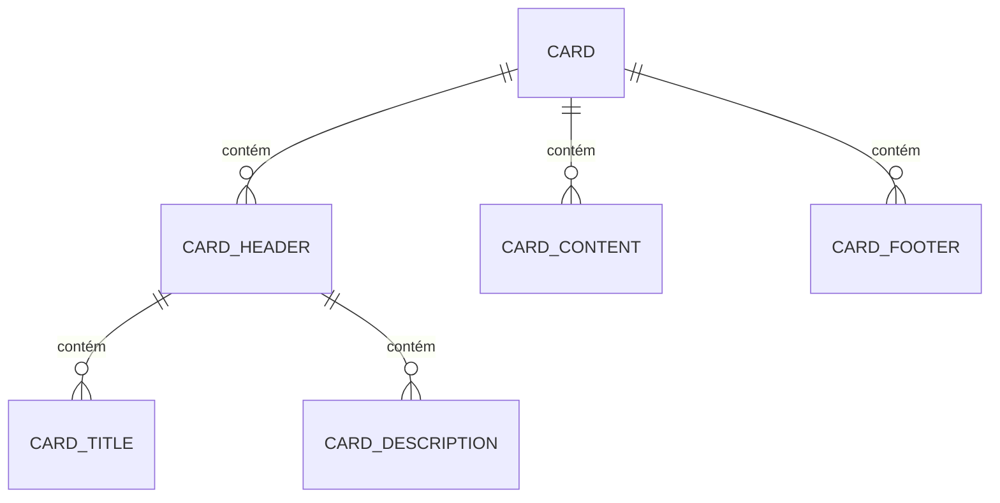

# Componentes Base (UI)

<cite>
**Arquivos Referenciados neste Documento**  
- [components/ui/button.tsx](file://components/ui/button.tsx)
- [components/ui/tabs.tsx](file://components/ui/tabs.tsx)
- [components/ui/accordion.tsx](file://components/ui/accordion.tsx)
- [components/ui/input.tsx](file://components/ui/input.tsx)
- [components/ui/card.tsx](file://components/ui/card.tsx)
- [lib/utils.ts](file://lib/utils.ts)
- [components/consultoria-empresarial.tsx](file://components/consultoria-empresarial.tsx)
- [components/quem-somos.tsx](file://components/quem-somos.tsx)
</cite>

## Sumário
1. [Introdução](#introdução)
2. [Estrutura do Sistema de Design](#estrutura-do-sistema-de-design)
3. [Componentes Principais](#componentes-principais)
4. [Arquitetura e Composição](#arquitetura-e-composição)
5. [Uso Prático nos Componentes da Aplicação](#uso-prático-nos-componentes-da-aplicação)
6. [Diretrizes de Personalização](#diretrizes-de-personalização)
7. [Conclusão](#conclusão)

## Introdução

Os componentes base localizados em `/components/ui` formam o núcleo do sistema de design do projeto, oferecendo uma coleção reutilizável, acessível e estilizada de elementos de interface. Esses componentes são construídos com base em duas bibliotecas fundamentais: **shadcn/ui** e **Radix UI**, que fornecem primitivos acessíveis e altamente compostáveis. A arquitetura prioriza consistência visual, manutenibilidade e facilidade de extensão, permitindo uma experiência de usuário coesa em toda a aplicação.

**Seção fontes**  
- [components/ui/button.tsx](file://components/ui/button.tsx#L1-L60)
- [components/ui/tabs.tsx](file://components/ui/tabs.tsx#L1-L56)

## Estrutura do Sistema de Design

O sistema de design é organizado em componentes atômicos que podem ser combinados para formar interfaces mais complexas. Cada componente é implementado como um wrapper sobre os primitivos do Radix UI, garantindo acessibilidade nativa (ARIA, navegação por teclado, estados de foco). A estilização é feita exclusivamente com Tailwind CSS, e a fusão segura de classes é gerenciada pela função `cn()` do arquivo `lib/utils.ts`.

### Função `cn()` para Fusão de Classes

A função `cn()` é central para a consistência estilística do projeto. Ela combina `clsx` e `tailwind-merge` para garantir que classes Tailwind sejam mescladas de forma segura, evitando conflitos e sobrescritas indesejadas.

**Fontes do diagrama**  
- [lib/utils.ts](file://lib/utils.ts#L3-L5)

**Seção fontes**  
- [lib/utils.ts](file://lib/utils.ts#L1-L7)

## Componentes Principais

### Botões com Variantes

O componente `Button` oferece múltiplas variantes (primary, secondary, outline, ghost, destructive, link, brand) e tamanhos (default, sm, lg, icon), definidas com `cva` (class-variance-authority). Isso permite tipagem segura e autocompletar no editor, garantindo que apenas variantes válidas sejam usadas.

**Fontes do diagrama**  
- [components/ui/button.tsx](file://components/ui/button.tsx#L6-L36)

**Seção fontes**  
- [components/ui/button.tsx](file://components/ui/button.tsx#L1-L60)

### Abas com Estado Controlado

O componente `Tabs` é um wrapper sobre `@radix-ui/react-tabs`, permitindo abas com estado controlado via prop `value` e `onValueChange`. É usado em contextos como `QuemSomos` e `ConsultoriaEmpresarial` para exibir conteúdo dinâmico de forma organizada.

**Fontes do diagrama**  
- [components/ui/tabs.tsx](file://components/ui/tabs.tsx#L1-L56)
- [components/consultoria-empresarial.tsx](file://components/consultoria-empresarial.tsx#L100-L115)

**Seção fontes**  
- [components/ui/tabs.tsx](file://components/ui/tabs.tsx#L1-L56)

### Acordeões Animados

O componente `Accordion` permite expansão e contração de seções com animação suave. Usa `data-[state=open]` para aplicar transições CSS, garantindo acessibilidade e experiência fluida.

**Fontes do diagrama**  
- [components/ui/accordion.tsx](file://components/ui/accordion.tsx#L1-L59)

**Seção fontes**  
- [components/ui/accordion.tsx](file://components/ui/accordion.tsx#L1-L59)

### Campos de Entrada e Cards

- **Input**: Campo de entrada estilizado com bordas, foco e estados desabilitados, totalmente acessível.
- **Card**: Componente de layout flexível com partes compostas (`CardHeader`, `CardTitle`, `CardDescription`, `CardContent`, `CardFooter`), ideal para agrupar conteúdo.

**Fontes do diagrama**  
- [components/ui/card.tsx](file://components/ui/card.tsx#L1-L80)
- [components/ui/input.tsx](file://components/ui/input.tsx#L1-L23)

**Seção fontes**  
- [components/ui/input.tsx](file://components/ui/input.tsx#L1-L23)
- [components/ui/card.tsx](file://components/ui/card.tsx#L1-L80)

## Arquitetura e Composição

A arquitetura dos componentes UI prioriza:

- **Composição**: Uso de `asChild` no `Button` para repassar props a componentes filhos (ex: `Link`).
- **Tipagem Segura**: `cva` gera tipos para variantes, evitando erros em tempo de desenvolvimento.
- **Reutilização**: Estilos base definidos no `cva` são reaproveitados em múltiplos componentes.
- **Tema**: Cores e espaçamentos baseiam-se em variáveis CSS definidas no `tailwind.config`, permitindo theming.

**Seção fontes**  
- [components/ui/button.tsx](file://components/ui/button.tsx#L6-L36)
- [lib/utils.ts](file://lib/utils.ts#L3-L5)

## Uso Prático nos Componentes da Aplicação

### Em QuemSomos

O componente `Tabs` é usado para exibir os pilares de atuação do escritório. Em telas menores, é substituído por um `Select` para melhor usabilidade.

**Seção fontes**  
- [components/quem-somos.tsx](file://components/quem-somos.tsx#L100-L115)

### Em ConsultoriaEmpresarial

O mesmo padrão de `Tabs`/`Select` é aplicado para apresentar os pilares da consultoria preventiva, demonstrando a reutilização e consistência do sistema de design.

**Seção fontes**  
- [components/consultoria-empresarial.tsx](file://components/consultoria-empresarial.tsx#L100-L115)

## Diretrizes de Personalização

Para estender componentes sem quebrar a consistência:

1. **Use `cn()`**: Sempre combine classes com `cn()` para evitar conflitos.
2. **Respeite variantes**: Adicione novas variantes via `cva`, não inline.
3. **Evite estilos inline**: Prefira classes Tailwind.
4. **Teste acessibilidade**: Verifique navegação por teclado e leitores de tela.
5. **Documente mudanças**: Atualize a documentação ao adicionar variantes.

**Seção fontes**  
- [components/ui/button.tsx](file://components/ui/button.tsx#L6-L36)
- [lib/utils.ts](file://lib/utils.ts#L3-L5)

## Conclusão

Os componentes base em `/components/ui` representam uma implementação robusta e escalável de um design system moderno, combinando as melhores práticas do shadcn/ui e Radix UI. A utilização de `cva` e `cn()` garante tipagem segura e consistência estilística, enquanto a arquitetura de composição permite flexibilidade sem sacrificar a manutenibilidade. Esses componentes são o alicerce visual e funcional da aplicação, usados de forma consistente em múltiplos contextos.