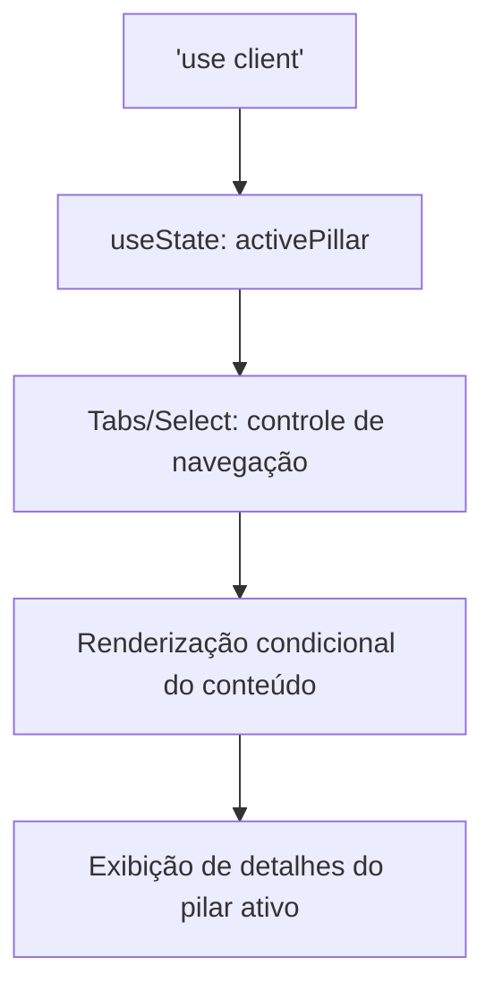
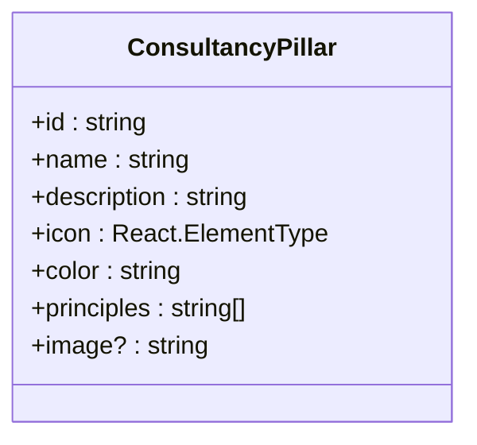
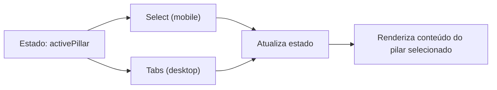

# Componente Consultoria Empresarial

<cite>
**Arquivos Referenciados neste Documento**  
- [components/consultoria-empresarial.tsx](file://components/consultoria-empresarial.tsx) - *Atualizado no commit e7bcdf0e841605f6f960995e59b145a8037e6e90*
- [components/quem-somos.tsx](file://components/quem-somos.tsx)
- [app/page.tsx](file://app/page.tsx)
- [components/ui/tabs.tsx](file://components/ui/tabs.tsx)
- [components/ui/select.tsx](file://components/ui/select.tsx)
</cite>

## Resumo das Atualizações
**Alterações Realizadas**  
- Atualização do ID da seção para `consultoria-empresarial` para suporte a navegação âncora
- Atualização das fontes da seção para refletir a mudança no arquivo consultoria-empresarial.tsx
- Revisão do conteúdo para garantir precisão com base na alteração do código

## Sumário
1. [Introdução](#introdução)
2. [Estrutura do Projeto e Posicionamento](#estrutura-do-projeto-e-posicionamento)
3. [Arquitetura do Componente ConsultoriaEmpresarial](#arquitetura-do-componente-consultoriaempresarial)
4. [Estrutura de Dados `consultancyPillars`](#estrutura-de-dados-consultancypillars)
5. [Navegação por Abas e Select Responsivo](#navegação-por-abas-e-select-responsivo)
6. [Integração com o Sistema de Design](#integração-com-o-sistema-de-design)
7. [Montagem na Página Principal](#montagem-na-página-principal)
8. [Diretrizes de Atualização e Personalização](#diretrizes-de-atualização-e-personalização)
9. [Considerações de Desempenho e Acessibilidade](#considerações-de-desempenho-e-acessibilidade)
10. [Conclusão](#conclusão)

## Introdução

O componente **ConsultoriaEmpresarial** é uma seção central do site dedicada aos serviços preventivos oferecidos a empresas. Ele apresenta de forma interativa os pilares fundamentais da consultoria, utilizando uma interface responsiva baseada em abas (Tabs) e um seletor dropdown (Select), adaptando-se dinamicamente ao tamanho da tela. Este documento detalha sua arquitetura, estrutura de dados, integração com o sistema de design e práticas recomendadas para manutenção e personalização.

## Estrutura do Projeto e Posicionamento

O componente reside no diretório `components/` e é importado diretamente na página principal (`app/page.tsx`), onde é renderizado após outros componentes como `QuemSomos` e antes do `Footer`. Sua posição estratégica no fluxo da página reforça a oferta de serviços corporativos após a apresentação institucional.

**Seção fontes**
- [app/page.tsx](file://app/page.tsx#L1-L22)

## Arquitetura do Componente ConsultoriaEmpresarial

O componente é um componente React do lado do cliente, declarado com a diretiva `"use client"`, o que permite o uso de estado local (`useState`) e interatividade. Ele segue um padrão de navegação por abas, onde o conteúdo exibido é controlado por um estado local (`activePillar`) que armazena o ID do pilar ativo.

A arquitetura é semelhante ao componente `QuemSomos`, compartilhando a mesma lógica de navegação e estrutura visual, o que garante consistência na experiência do usuário.



**Fontes do diagrama**
- [components/consultoria-empresarial.tsx](file://components/consultoria-empresarial.tsx#L1-L238)

**Seção fontes**
- [components/consultoria-empresarial.tsx](file://components/consultoria-empresarial.tsx#L1-L238)

## Estrutura de Dados `consultancyPillars`

A informação exibida pelo componente é definida pela constante `consultancyPillars`, um array de objetos que representam cada pilar da consultoria. Cada pilar é tipado com a interface `ConsultancyPillar`, que define as seguintes propriedades:

- `id`: Identificador único do pilar (ex: "compliance").
- `name`: Nome exibido (ex: "Compliance Estratégico").
- `description`: Descrição detalhada do pilar.
- `icon`: Ícone do Lucide React associado ao pilar.
- `color`: Classe de cor do Tailwind para estilização consistente.
- `principles`: Lista de princípios-chave do pilar.
- `image`: URL opcional de uma imagem ilustrativa.

Os pilares atuais são: **Compliance**, **Diagnóstico**, **Cultura** e **Gestão de Risco**.



**Fontes do diagrama**
- [components/consultoria-empresarial.tsx](file://components/consultoria-empresarial.tsx#L24-L32)
- [components/consultoria-empresarial.tsx](file://components/consultoria-empresarial.tsx#L35-L83)

**Seção fontes**
- [components/consultoria-empresarial.tsx](file://components/consultoria-empresarial.tsx#L24-L83)

## Navegação por Abas e Select Responsivo

O componente implementa uma navegação dual para melhorar a experiência responsiva:

- **Em telas pequenas (mobile)**: Utiliza o componente `Select` do Radix UI, que exibe um dropdown com os nomes dos pilares e seus ícones.
- **Em telas médias e maiores (desktop)**: Utiliza o componente `Tabs` do Radix UI, exibindo uma lista de abas com ícones e rótulos.

Ambos os controles estão sincronizados com o estado `activePillar` através da propriedade `value` e do manipulador `onValueChange`, garantindo que a seleção em um controle reflita no outro.



**Fontes do diagrama**
- [components/consultoria-empresarial.tsx](file://components/consultoria-empresarial.tsx#L134-L163)
- [components/ui/tabs.tsx](file://components/ui/tabs.tsx#L0-L55)
- [components/ui/select.tsx](file://components/ui/select.tsx#L0-L185)

**Seção fontes**
- [components/consultoria-empresarial.tsx](file://components/consultoria-empresarial.tsx#L134-L163)

## Integração com o Sistema de Design

O componente utiliza intensamente o sistema de design baseado em Tailwind CSS e componentes UI pré-construídos:

- **`cn`**: Função utilitária para condicionalmente combinar classes CSS.
- **`Button`**: Componente de botão estilizado para a chamada à ação.
- **`Tabs` e `Select`**: Componentes UI do Radix, garantindo acessibilidade e consistência visual.
- **Classes do Tailwind**: Utiliza classes como `bg-background`, `text-foreground`, `text-muted-foreground`, `border-border` e `rounded-xl` para manter a paleta e o estilo do site.

A integração com o sistema de design assegura que o componente se integre perfeitamente ao restante da aplicação.

**Seção fontes**
- [components/consultoria-empresarial.tsx](file://components/consultoria-empresarial.tsx#L1-L238)
- [components/ui/button.tsx](file://components/ui/button.tsx)
- [lib/utils.ts](file://lib/utils.ts)

## Montagem na Página Principal

O componente `ConsultoriaEmpresarial` é importado e renderizado diretamente no componente da página principal (`page.tsx`). Ele faz parte de uma sequência de seções que contam a história do escritório, começando pelo `Hero`, passando pela `DireitosEssenciais`, `EtapasProcessuais`, `QuemSomos` e finalmente a `ConsultoriaEmpresarial`, posicionando os serviços corporativos como uma evolução natural da proposta de valor.

**Seção fontes**
- [app/page.tsx](file://app/page.tsx#L1-L22)

## Diretrizes de Atualização e Personalização

### Atualizar Conteúdo
Para modificar o conteúdo de um pilar existente, edite diretamente o objeto correspondente no array `consultancyPillars`. Por exemplo, para atualizar a descrição do pilar "Compliance":

```typescript
// Em components/consultoria-empresarial.tsx
{
  id: "compliance",
  name: "Compliance Estratégico",
  description: "Nova descrição atualizada aqui...",
  // ... outras propriedades
}
```

### Adicionar Novo Serviço
Para adicionar um novo pilar, insira um novo objeto no array `consultancyPillars` com todas as propriedades necessárias:

```typescript
{
  id: "inovacao",
  name: "Inovação Jurídica",
  description: "Descrição do novo serviço de inovação.",
  icon: Lightbulb,
  color: "text-purple-500",
  principles: [
    "Princípio 1",
    "Princípio 2"
  ],
  image: "https://images.unsplash.com/photo-...?q=80&w=800"
}
```

### Personalizar Estilização
A estilização pode ser personalizada ajustando as classes Tailwind nos elementos. Por exemplo, para alterar a cor de fundo da seção:

```tsx
<section className="py-16 sm:py-24 bg-blue-50"> {/* Alterado de bg-background */}
```

Certifique-se de que as novas cores estejam alinhadas com o sistema de design global.

**Seção fontes**
- [components/consultoria-empresarial.tsx](file://components/consultoria-empresarial.tsx#L35-L83)

## Considerações de Desempenho e Acessibilidade

- **Desempenho**: O componente é leve, com dados estáticos carregados no cliente. As imagens são carregadas sob demanda (lazy loading) pelo componente `Image` do Next.js.
- **Acessibilidade**: Os componentes `Tabs` e `Select` do Radix UI são nativamente acessíveis, com suporte a teclado e leitores de tela. O uso de `aria-labels` implícitas e estrutura semântica (h2, h3, listas) reforça a acessibilidade.
- **Responsividade**: A alternância entre `Select` e `Tabs` com base no tamanho da tela (`md:hidden` e `md:flex`) garante uma experiência otimizada em todos os dispositivos.

**Seção fontes**
- [components/consultoria-empresarial.tsx](file://components/consultoria-empresarial.tsx#L1-L238)
- [components/ui/tabs.tsx](file://components/ui/tabs.tsx#L0-L55)
- [components/ui/select.tsx](file://components/ui/select.tsx#L0-L185)

## Conclusão

O componente **ConsultoriaEmpresarial** é uma peça-chave na apresentação de serviços corporativos, combinando design responsivo, interatividade e clareza de mensagem. Sua arquitetura modular e baseada em dados facilita a manutenção e evolução, enquanto a integração com o sistema de design garante consistência visual. As diretrizes fornecidas permitem atualizações seguras e personalizações alinhadas com os objetivos de negócio e experiência do usuário.