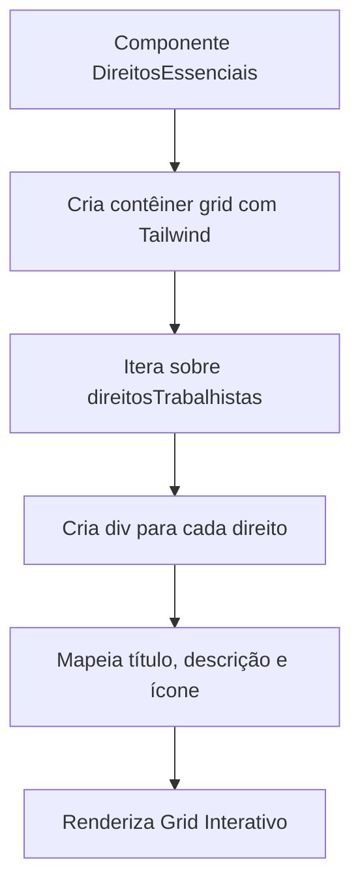

# Componente Direitos Essenciais

<cite>
**Arquivos Referenciados neste Documento**   
- [direitos-essenciais.tsx](file://components/direitos-essenciais.tsx)
- [page.tsx](file://app/page.tsx)
- [bento-grid.tsx](file://components/ui/bento-grid.tsx)
- [header.tsx](file://components/header.tsx) - *Atualizado no commit recente*
</cite>

## Sumário
**Alterações Realizadas**   
- Atualização da seção de Introdução para refletir a nova funcionalidade de navegação por âncora
- Adição da seção "Navegação por Âncora e Identificação" para documentar o novo atributo `id`
- Atualização da seção "Incorporação na Página Principal" com informações sobre a integração com o header
- Revisão da seção "Integração com BentoGrid" para corrigir informação incorreta sobre uso futuro
- Atualização das fontes de seção para refletir arquivos modificados
- Adição de nova fonte para o arquivo header.tsx

## Sumário
1. [Introdução](#introdução)
2. [Estrutura de Dados Interna](#estrutura-de-dados-interna)
3. [Renderização Visual e Mapeamento](#renderização-visual-e-mapeamento)
4. [Integração com BentoGrid](#integração-com-bentogrid)
5. [Uso de Ícones Lucide React](#uso-de-ícones-lucide-react)
6. [Estilização com TailwindCSS](#estilização-com-tailwindcss)
7. [Incorporação na Página Principal](#incorporação-na-página-principal)
8. [Navegação por Âncora e Identificação](#navegação-por-âncora-e-identificação)
9. [Instruções para Manutenção](#instruções-para-manutenção)
10. [Acessibilidade](#acessibilidade)
11. [Exemplos de Uso e Personalizações](#exemplos-de-uso-e-personalizações)

## Introdução

O componente `DireitosEssenciais` é uma seção central do site, projetada para destacar e educar os visitantes sobre os direitos trabalhistas fundamentais garantidos por lei. Ele apresenta esses direitos em um formato visualmente atraente e fácil de navegar, utilizando um grid interativo que combina ícones, títulos e descrições concisas. Este documento detalha a arquitetura, implementação e uso do componente, servindo como guia para desenvolvedores e mantenedores. O componente foi recentemente atualizado para incluir um atributo `id` que permite a navegação direta via âncora a partir do cabeçalho do site.

**Fontes da Seção**
- [direitos-essenciais.tsx](file://components/direitos-essenciais.tsx#L1-L132)
- [header.tsx](file://components/header.tsx#L15-L25) - *Atualizado no commit recente*

## Estrutura de Dados Interna

O componente é alimentado por uma estrutura de dados interna definida como um array de objetos chamado `direitosTrabalhistas`. Cada objeto no array representa um direito trabalhista específico e contém três propriedades essenciais: `icon`, `title` e `description`.

A propriedade `icon` armazena uma referência ao componente de ícone do Lucide React, permitindo uma representação visual temática para cada direito. A propriedade `title` contém o nome formal do direito, enquanto a propriedade `description` fornece uma explicação clara e acessível do seu significado e importância. Essa estrutura de dados centralizada facilita a manutenção e a atualização do conteúdo.

**Fontes da Seção**
- [direitos-essenciais.tsx](file://components/direitos-essenciais.tsx#L15-L55)

## Renderização Visual e Mapeamento

A transformação da estrutura de dados em uma interface visual é realizada através do método `map` do JavaScript. O componente itera sobre o array `direitosTrabalhistas`, criando um elemento visual para cada objeto.

Cada item renderizado é envolvido em um componente `Link`, que, embora atualmente aponte para um link vazio (`#`), foi projetado para permitir a navegação para páginas de detalhamento futuro. O layout visual de cada item é construído com um contêiner flexível que organiza um ícone à esquerda e o texto (título e descrição) à direita. O ícone é exibido dentro de um círculo colorido com fundo de cor primária, proporcionando um ponto focal visual claro.

**Fontes da Seção**
- [direitos-essenciais.tsx](file://components/direitos-essenciais.tsx#L75-L110)

## Integração com BentoGrid

O componente `DireitosEssenciais` atualmente utiliza um grid do CSS nativo com classes do Tailwind (`grid-cols-2` e `grid-cols-3`) em vez do componente `BentoGrid`. Embora o sistema de layout `BentoGrid` esteja disponível no diretório `ui`, ele não está sendo utilizado neste componente.

O layout é implementado diretamente com a classe `grid` e suas variações responsivas (`md:grid-cols-2 lg:grid-cols-3`), criando uma grade de duas colunas em telas médias e três colunas em telas grandes. Essa abordagem direta foi mantida em vez de utilizar o componente `BentoGrid`, possivelmente devido a requisitos de estilização específicos ou preferência arquitetural.

**Fontes da Seção**
- [direitos-essenciais.tsx](file://components/direitos-essenciais.tsx#L60-L70)
- [bento-grid.tsx](file://components/ui/bento-grid.tsx#L1-L20)

## Uso de Ícones Lucide React

O componente utiliza ícones do pacote `lucide-react` para representar visualmente cada direito trabalhista. Os ícones são importados diretamente no início do arquivo `direitos-essenciais.tsx` e armazenados como componentes React.

A integração é feita de forma dinâmica: a propriedade `icon` de cada objeto no array `direitosTrabalhistas` contém o componente do ícone correspondente (por exemplo, `Briefcase` para "Carteira de Trabalho Assinada"). Durante a renderização, o componente do ícone é então passado como uma tag JSX (`<direito.icon />`) dentro do layout do item, permitindo que o React o renderize corretamente. Isso garante que a adição de um novo direito com um novo ícone seja simples e consistente.

**Fontes da Seção**
- [direitos-essenciais.tsx](file://components/direitos-essenciais.tsx#L1-L15)

## Estilização com TailwindCSS

A estilização do componente é totalmente baseada no TailwindCSS, um framework de CSS utilitário. As classes são aplicadas diretamente aos elementos JSX, permitindo um desenvolvimento rápido e uma manutenção fácil.

O componente utiliza classes para definir o espaçamento (`gap-8`, `p-6`, `mt-2`), bordas e efeitos de hover (`border-border/50`, `hover:border-border`, `transition-colors`), cores de fundo (`bg-background/80`, `hover:bg-background`), tipografia (`text-lg`, `font-semibold`, `text-sm`) e layout (`flex`, `flex-shrink-0`, `flex-1`). O uso de variáveis de cor do tema (como `text-primary`, `bg-primary/10`) garante que o componente se mantenha consistente com a paleta de cores global do site, mesmo se ela for alterada.

**Fontes da Seção**
- [direitos-essenciais.tsx](file://components/direitos-essenciais.tsx#L80-L110)

## Incorporação na Página Principal

O componente `DireitosEssenciais` é incorporado na página principal do site através do arquivo `app/page.tsx`. Ele é importado como um componente nomeado e então renderizado como um elemento filho dentro do componente `main`.

A ordem de renderização é cuidadosamente planejada para criar um fluxo de conteúdo lógico: após o `Hero` (cabeçalho principal) e antes da seção `EtapasProcessuais`. Essa posição estratégica garante que os direitos essenciais sejam apresentados logo no início da jornada do usuário, reforçando a missão do site de informar e proteger os trabalhadores. O componente é um dos elementos-chave na estrutura de navegação do site.

**Fontes da Seção**
- [page.tsx](file://app/page.tsx#L1-L22)

## Navegação por Âncora e Identificação

O componente `DireitosEssenciais` foi recentemente atualizado para incluir um atributo `id="direitos-essenciais"` na sua tag `section`. Este identificador único permite a navegação direta para esta seção através de links de âncora, facilitando a acessibilidade e a experiência do usuário.

Essa funcionalidade é utilizada pelo componente `Header`, que contém um menu de navegação com links para as principais seções do site. Quando um usuário clica no link "Direitos Essenciais" no cabeçalho, o navegador realiza um scroll suave até esta seção, graças ao atributo `id` que serve como alvo de âncora. O valor do `id` foi escolhido para ser descritivo e consistente com a nomenclatura do componente.

**Fontes da Seção**
- [direitos-essenciais.tsx](file://components/direitos-essenciais.tsx#L77) - *Atualizado no commit recente*
- [header.tsx](file://components/header.tsx#L15-L25) - *Atualizado no commit recente*

## Instruções para Manutenção

Para adicionar um novo direito, basta inserir um novo objeto no array `direitosTrabalhistas`, seguindo o padrão existente. O novo objeto deve conter as propriedades `icon`, `title` e `description`. O ícone deve ser um componente válido importado do `lucide-react`.

Para modificar uma descrição ou alterar um ícone, localize o objeto correspondente no array e edite diretamente as propriedades `description` ou `icon`. Para alterar o título, edite a propriedade `title`. Essas alterações são refletidas automaticamente na interface, graças ao mapeamento dinâmico. É crucial manter a clareza e a precisão das descrições para garantir a eficácia educacional do componente.

**Fontes da Seção**
- [direitos-essenciais.tsx](file://components/direitos-essenciais.tsx#L15-L55)

## Acessibilidade

O componente demonstra boas práticas de acessibilidade. O uso de elementos semânticos como `section` e `h2` ajuda os leitores de tela a entender a estrutura da página. Os ícones, embora puramente decorativos, estão contidos em um contêiner que possui um título claro, garantindo que a informação principal seja transmitida.

O componente é totalmente navegável por teclado, pois cada item é um `Link`, que é um elemento interativo nativo. Os estados de foco são gerenciados pelas classes do Tailwind (`focus-visible:ring-2`), que são herdadas do componente `Button` e aplicadas consistentemente. Para melhorar ainda mais a acessibilidade, seria recomendável adicionar atributos `aria-label` aos links se eles forem direcionados para páginas detalhadas no futuro.

**Fontes da Seção**
- [direitos-essenciais.tsx](file://components/direitos-essenciais.tsx#L60-L130)
- [button.tsx](file://components/ui/button.tsx#L1-L60)

## Exemplos de Uso e Personalizações

O componente é um exemplo de como apresentar informações complexas de forma simples e atraente. Ele pode ser facilmente personalizado para outros contextos, como uma lista de serviços ou benefícios.

Para personalizações de estilo, as classes do Tailwind podem ser modificadas diretamente. Por exemplo, para alterar a cor do círculo do ícone, basta mudar `bg-primary/10` para outra cor do tema, como `bg-green-100`. Para adicionar animações, classes como `hover:scale-105` ou `transition-transform` podem ser adicionadas para criar um efeito de crescimento suave ao passar o mouse. A estrutura modular do componente permite essas personalizações sem comprometer sua funcionalidade principal.