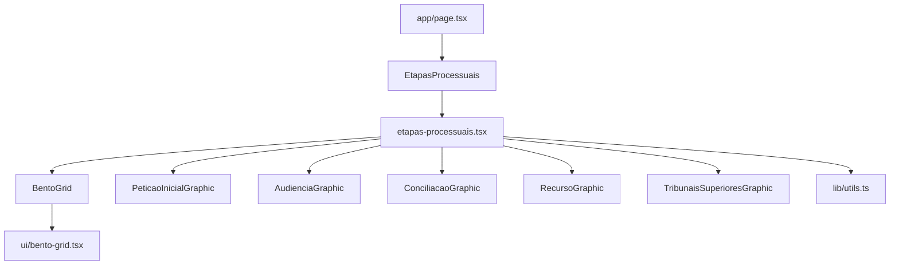
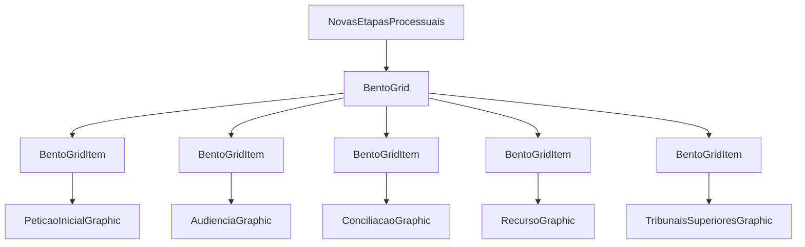
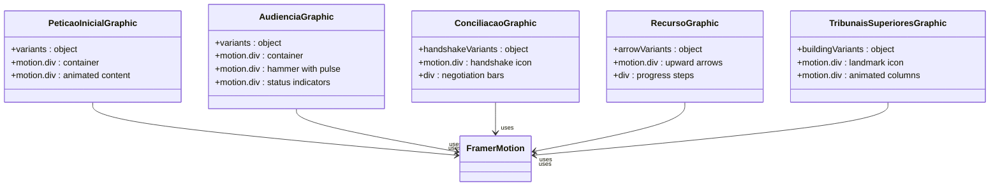
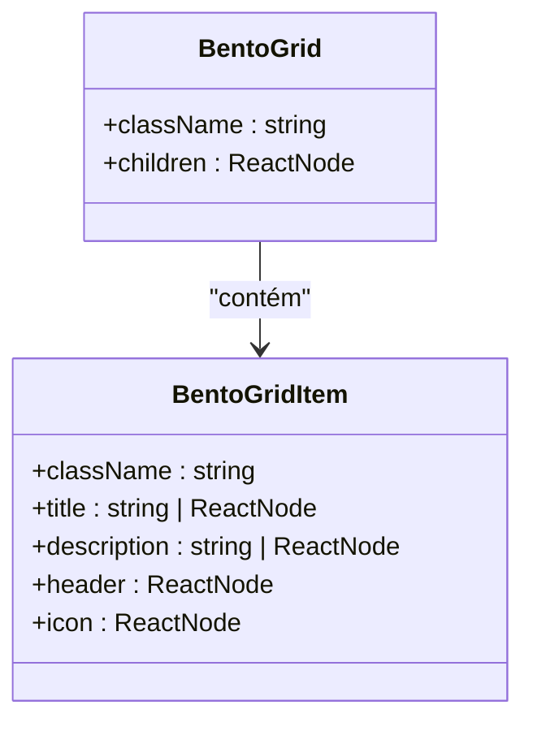
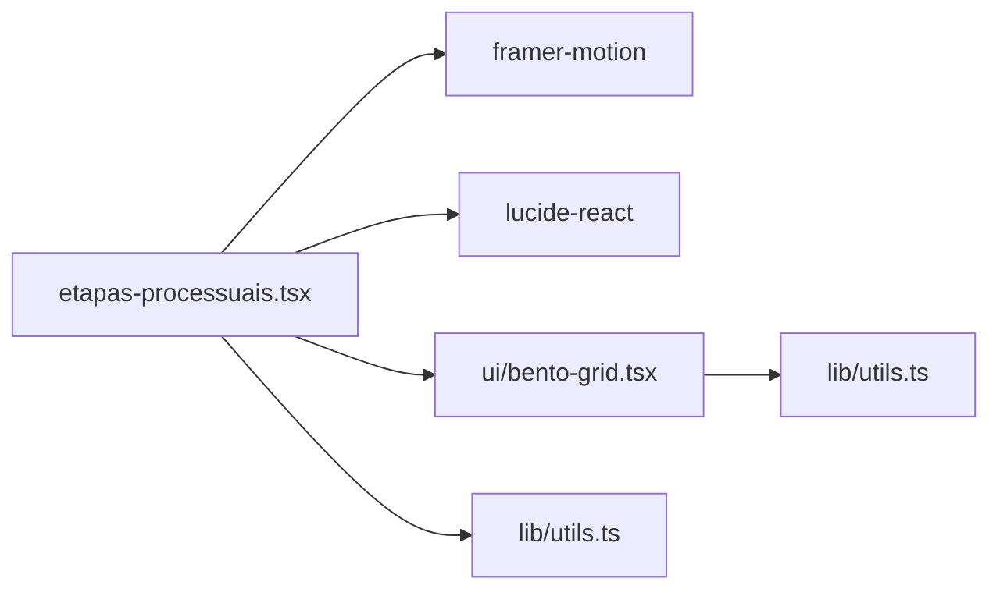

# Componente Etapas Processuais

<cite>
**Arquivos Referenciados neste Documento**   
- [etapas-processuais.tsx](file://components\etapas-processuais.tsx) - *Atualizado no commit e7bcdf0*
- [ui/bento-grid.tsx](file://components\ui\bento-grid.tsx)
- [lib/utils.ts](file://lib\utils.ts)
- [app/page.tsx](file://app\page.tsx)
</cite>

## Sumário
1. [Introdução](#introdução)
2. [Estrutura do Projeto](#estrutura-do-projeto)
3. [Componentes Principais](#componentes-principais)
4. [Visão Geral da Arquitetura](#visão-geral-da-arquitetura)
5. [Análise Detalhada dos Componentes](#análise-detalhada-dos-componentes)
6. [Análise de Dependências](#análise-de-dependências)
7. [Considerações de Desempenho](#considerações-de-desempenho)
8. [Guia de Solução de Problemas](#guia-de-solução-de-problemas)
9. [Conclusão](#conclusão)

## Introdução
O componente **Etapas Processuais** é uma seção central do site que visualiza de forma animada as fases do processo judicial, proporcionando uma experiência de usuário dinâmica e informativa. Ele utiliza o layout `BentoGrid` combinado com animações do Framer Motion para criar transições suaves e efeitos visuais envolventes. Cada etapa — como Petição Inicial, Audiência, Conciliação, Recurso e Tribunais Superiores — é representada com um título, descrição, ícone e um cabeçalho gráfico animado. Este documento detalha a estrutura, funcionamento, integração com o sistema de design e orientações para manutenção e extensão do componente.

**Section sources**
- [etapas-processuais.tsx](file://components\etapas-processuais.tsx#L1-L334)

## Estrutura do Projeto
O componente `EtapasProcessuais` está localizado em `components/etapas-processuais.tsx` e é montado na página principal (`app/page.tsx`) como uma seção entre outros componentes como `Hero`, `DireitosEssenciais` e `QuemSomos`. Ele depende de componentes UI reutilizáveis localizados em `components/ui`, como `BentoGrid` e `BentoGridItem`, e utiliza utilitários de estilo do arquivo `lib/utils.ts`.

**Diagram sources**
- [etapas-processuais.tsx](file://components\etapas-processuais.tsx#L1-L334)
- [app/page.tsx](file://app\page.tsx#L1-L22)
- [ui/bento-grid.tsx](file://components\ui\bento-grid.tsx#L1-L53)
- [lib/utils.ts](file://lib\utils.ts#L1-L7)

**Section sources**
- [etapas-processuais.tsx](file://components\etapas-processuais.tsx#L1-L334)
- [app/page.tsx](file://app\page.tsx#L1-L22)

## Componentes Principais
O componente principal `NovasEtapasProcessuais` renderiza uma seção com um cabeçalho descritivo e uma grade (`BentoGrid`) contendo cinco etapas processuais. Cada etapa é definida no array `items`, que inclui propriedades como `title`, `description`, `header` (componente gráfico animado), `icon` e `className` para controle de layout responsivo. Os gráficos animados utilizam `motion.div` do Framer Motion com variantes de animação que criam movimentos suaves e contínuos.

**Section sources**
- [etapas-processuais.tsx](file://components\etapas-processuais.tsx#L1-L334)

## Visão Geral da Arquitetura
A arquitetura do componente é baseada em composição de componentes funcionais do React, com separação clara entre lógica de apresentação e animação. O `BentoGrid` organiza os itens em uma grade responsiva, enquanto cada `BentoGridItem` encapsula a estrutura visual de uma etapa. As animações são gerenciadas pelo Framer Motion, com variantes definidas localmente em cada componente gráfico.

**Diagram sources**
- [etapas-processuais.tsx](file://components\etapas-processuais.tsx#L1-L334)
- [ui/bento-grid.tsx](file://components\ui\bento-grid.tsx#L1-L53)

## Análise Detalhada dos Componentes

### Análise do Componente Etapas Processuais
O componente principal utiliza o `BentoGrid` para organizar visualmente as etapas do processo judicial. Cada item do array `items` corresponde a uma fase do processo e é mapeado para um `BentoGridItem`, que renderiza o conteúdo com animações e estilos.

#### Para Componentes com Animação:

**Diagram sources**
- [etapas-processuais.tsx](file://components\etapas-processuais.tsx#L30-L243)

#### Para Componentes de UI:

**Diagram sources**
- [ui/bento-grid.tsx](file://components\ui\bento-grid.tsx#L1-L53)

**Section sources**
- [etapas-processuais.tsx](file://components\etapas-processuais.tsx#L1-L334)
- [ui/bento-grid.tsx](file://components\ui\bento-grid.tsx#L1-L53)

## Análise de Dependências
O componente `EtapasProcessuais` depende de vários módulos externos e internos. Ele utiliza `framer-motion` para animações, `lucide-react` para ícones e `tailwind-merge` via função `cn` para composição de classes CSS. A estrutura de grid é fornecida pelo `BentoGrid`, que faz parte do sistema de UI do projeto.

**Diagram sources**
- [etapas-processuais.tsx](file://components\etapas-processuais.tsx#L1-L334)
- [ui/bento-grid.tsx](file://components\ui\bento-grid.tsx#L1-L53)
- [lib/utils.ts](file://lib\utils.ts#L1-L7)

**Section sources**
- [etapas-processuais.tsx](file://components\etapas-processuais.tsx#L1-L334)
- [ui/bento-grid.tsx](file://components\ui\bento-grid.tsx#L1-L53)
- [lib/utils.ts](file://lib\utils.ts#L1-L7)

## Considerações de Desempenho
Embora as animações melhorem a experiência do usuário, o uso de múltiplos `motion.div` com animações infinitas pode impactar o desempenho, especialmente em dispositivos móveis ou com muitos elementos na tela. Recomenda-se:
- Limitar o número de animações simultâneas.
- Usar `shouldReduceMotion` para desativar animações em dispositivos com preferência por redução de movimento.
- Testar o desempenho em dispositivos com recursos limitados.
- Considerar a pausa de animações fora da viewport com Intersection Observer.

**Section sources**
- [etapas-processuais.tsx](file://components\etapas-processuais.tsx#L1-L334)

## Guia de Solução de Problemas
Problemas comuns incluem animações travadas, layout quebrado em mobile ou ícones não exibidos. Para resolver:
- Verifique se `framer-motion` está corretamente instalado e importado.
- Confirme que `use client` está presente no topo do arquivo.
- Valide as classes do TailwindCSS com o `cn` para evitar conflitos.
- Teste em diferentes breakpoints para garantir responsividade.
- Use o DevTools para inspecionar variantes de animação e estados.

**Section sources**
- [etapas-processuais.tsx](file://components\etapas-processuais.tsx#L1-L334)
- [lib/utils.ts](file://lib\utils.ts#L1-L7)

## Conclusão
O componente **Etapas Processuais** é uma implementação eficaz de uma interface animada para representar fases jurídicas, combinando design responsivo, animações suaves e uma arquitetura modular. Sua integração com `BentoGrid` e `Framer Motion` permite uma experiência visual envolvente, enquanto a função `cn` garante consistência no estilo. Com pequenas otimizações, pode-se garantir desempenho ideal em todos os dispositivos.