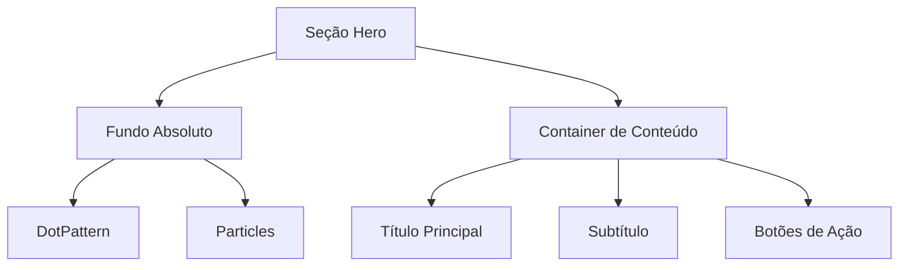
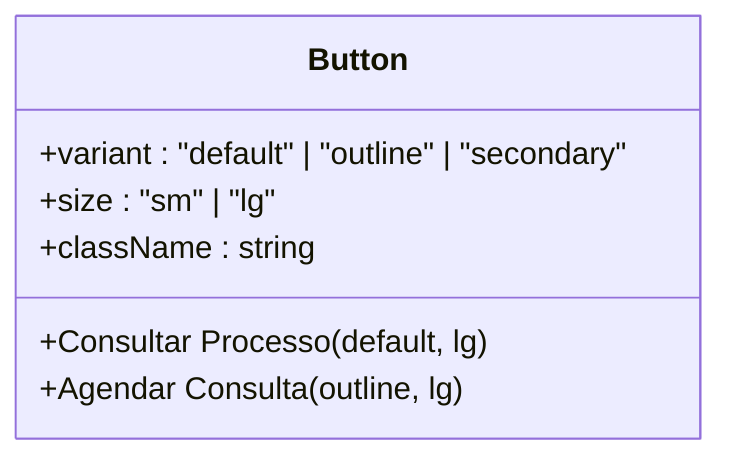
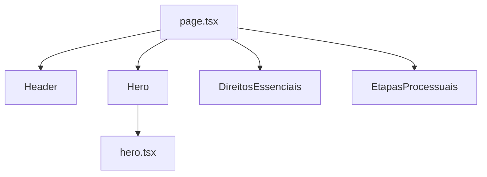

# Componente Hero

<cite>
**Arquivos Referenciados neste Documento**  
- [hero.tsx](file://components/hero.tsx) - *Atualizado para adicionar ID e ajustar margem*
- [page.tsx](file://app/page.tsx)
- [background-pattern.tsx](file://components/ui/background-pattern.tsx)
- [button.tsx](file://components/ui/button.tsx)
- [header.tsx](file://components/header.tsx) - *Adicionado efeito de glassmorphism*
</cite>

## Sumário
1. [Introdução](#introdução)
2. [Estrutura Visual e Composição](#estrutura-visual-e-composição)
3. [Estilização com TailwindCSS](#estilização-com-tailwindcss)
4. [Chamadas para Ação (CTAs)](#chamadas-para-ação-ctas)
5. [Montagem no Página Inicial](#montagem-no-página-inicial)
6. [Personalização e Manutenção do Design System](#personalização-e-manutenção-do-design-system)
7. [Acessibilidade](#acessibilidade)
8. [Comportamento em Dispositivos Móveis](#comportamento-em-dispositivos-móveis)

## Introdução
O componente **Hero** representa a seção inicial de apresentação do site, projetada para capturar a atenção do usuário com uma mensagem central clara e chamadas para ação estratégicas. Ele combina tipografia destacada, fundo em camadas dinâmico e botões estilizados para promover interação imediata. Este documento detalha sua estrutura, estilização, integração e práticas recomendadas para modificação e acessibilidade.

**Seção fontes**  
- [hero.tsx](file://components/hero.tsx#L5-L40)

## Estrutura Visual e Composição
O componente Hero é organizado em camadas para criar profundidade visual:
- **Camada de fundo**: Utiliza o componente `BackgroundPattern`, que combina um padrão de pontos (`DotPattern`) com partículas animadas (`Particles`) em cores vibrantes.
- **Camada de conteúdo**: Centralizada e posicionada acima do fundo, contém o título principal, subtítulo e botões de ação.
- **Posicionamento**: Usa `flex items-center justify-center` para alinhamento centralizado vertical e horizontal, com altura mínima de `80vh`.

O fundo utiliza `position: absolute` para cobrir toda a seção, enquanto o conteúdo é limitado por um container responsivo com largura máxima (`max-w-6xl`).

**Fontes do diagrama**  
- [hero.tsx](file://components/hero.tsx#L7-L40)
- [background-pattern.tsx](file://components/ui/background-pattern.tsx#L6-L38)

**Seção fontes**  
- [hero.tsx](file://components/hero.tsx#L7-L40)
- [background-pattern.tsx](file://components/ui/background-pattern.tsx#L6-L38)

## Estilização com TailwindCSS
O componente utiliza classes do TailwindCSS para responsividade e alinhamento:
- **Responsividade tipográfica**: `text-5xl sm:text-6xl md:text-7xl` ajusta o tamanho da fonte conforme o dispositivo.
- **Espaçamento responsivo**: `px-4 md:px-6` define padding menor em telas pequenas e maior em médias.
- **Alinhamento centralizado**: `flex items-center justify-center` garante centralização em todas as dimensões.
- **Limitação de largura**: `max-w-4xl` e `max-w-6xl` controlam a largura máxima do conteúdo para legibilidade.
- **Ajuste de margem superior**: `pt-32 md:pt-36` compensa o header fixo com efeito de glassmorphism, garantindo que o conteúdo não fique oculto atrás do cabeçalho.

Essas classes garantem que o componente se adapte a diferentes tamanhos de tela mantendo a estética e funcionalidade.

**Seção fontes**  
- [hero.tsx](file://components/hero.tsx#L12-L19)

## Chamadas para Ação (CTAs)
O componente inclui dois botões principais:
1. **Consultar Processo**: Botão primário com ícone de busca (`Search`) à direita.
2. **Agendar Consulta**: Botão com contorno (`variant="outline"`) e ícone de mensagem (`Message`) à esquerda.

Ambos utilizam `size="lg"` para maior destaque e `rounded-full` para bordas arredondadas. A variação de estilo (primary e outline) cria hierarquia visual, direcionando o foco para a ação principal.

**Fontes do diagrama**  
- [hero.tsx](file://components/hero.tsx#L24-L35)
- [button.tsx](file://components/ui/button.tsx#L44-L55)

**Seção fontes**  
- [hero.tsx](file://components/hero.tsx#L24-L35)
- [button.tsx](file://components/ui/button.tsx#L1-L60)

## Montagem no Página Inicial
O componente Hero é montado dentro de `app/page.tsx` como parte da composição da página inicial, logo após o Header. Ele é importado e renderizado diretamente como um componente funcional, integrando-se à estrutura principal do site. O ID `inicio` permite navegação âncora a partir do menu de navegação.

**Fontes do diagrama**  
- [page.tsx](file://app/page.tsx#L1-L22)
- [hero.tsx](file://components/hero.tsx#L5-L40)

**Seção fontes**  
- [page.tsx](file://app/page.tsx#L1-L22)

## Personalização e Manutenção do Design System
Para modificar o componente mantendo a coerência do design:
- **Texto**: Altere diretamente o conteúdo de `<h1>` e `
`, preservando as classes de tipografia.
- **CTAs**: Substitua o texto dos botões ou adicione novos, utilizando as mesmas variantes e tamanhos.
- **Estilização**: Modifique `className` dos botões, mas mantenha `rounded-full` e `text-base` para consistência.
- **ID da seção**: Mantenha o ID `inicio` para compatibilidade com a navegação âncora do Header.

Evite alterar classes de layout responsivo (`flex`, `max-w`, `px`) para garantir compatibilidade com diferentes dispositivos.

**Seção fontes**  
- [hero.tsx](file://components/hero.tsx#L15-L35)

## Acessibilidade
O componente segue boas práticas de acessibilidade:
- **Contraste de cores**: O texto principal (`text-foreground`) e secundário (`text-muted-foreground`) possuem contraste suficiente com o fundo.
- **Ícones com texto**: Os ícones (`Search`, `Message`) são acompanhados de texto descritivo, garantindo compreensão mesmo sem visão.
- **Atributos ARIA**: O canvas das partículas usa `aria-hidden="true"` pois é puramente decorativo.
- **Navegação por âncora**: O ID `inicio` permite navegação direta para a seção Hero, melhorando a acessibilidade para usuários de teclado e leitores de tela.

Essas práticas garantem que o conteúdo seja acessível a usuários com deficiências visuais ou auditivas.

**Seção fontes**  
- [hero.tsx](file://components/hero.tsx#L15-L35)
- [particles.tsx](file://components/ui/particles.tsx#L290-L295)

## Comportamento em Dispositivos Móveis
Em telas menores, os botões usam `flex-wrap` para quebrar linha quando necessário, evitando sobreposição ou corte. Isso garante que ambos os CTAs permaneçam visíveis e clicáveis mesmo em dispositivos com largura limitada.

A classe `flex-wrap` na `div` que envolve os botões permite que eles se reorganizem em múltiplas linhas, mantendo o alinhamento centralizado e o espaçamento adequado (`gap-4`).

**Seção fontes**  
- [hero.tsx](file://components/hero.tsx#L24-L35)