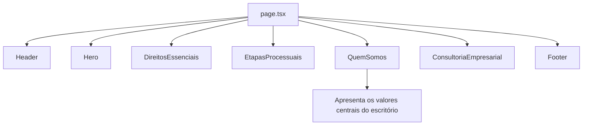

# Componente Quem Somos

<cite>
**Arquivos Referenciados neste Documento**  
- [components/quem-somos.tsx](file://components/quem-somos.tsx) - *Adição do ID de seção para navegação âncora no commit e7bcdf0*
- [components/ui/tabs.tsx](file://components/ui/tabs.tsx)
- [components/ui/select.tsx](file://components/ui/select.tsx)
- [app/page.tsx](file://app/page.tsx)
- [components/header.tsx](file://components/header.tsx) - *Atualizado para suportar navegação por seção no commit e7bcdf0*
</cite>

## Sumário
1. [Introdução](#introdução)
2. [Estrutura de Dados `pilaresDeAtuacao`](#estrutura-de-dados-pilaresdeatuacao)
3. [Gerenciamento de Estado com `useState`](#gerenciamento-de-estado-com-usestate)
4. [Navegação Responsiva: Tabs e Select](#navegação-responsiva-tabs-e-select)
5. [Integração com shadcn/ui](#integração-com-shadcnui)
6. [Inclusão na Página Principal](#inclusão-na-página-principal)
7. [Instruções para Manutenção](#instruções-para-manutenção)
8. [Boas Práticas de Acessibilidade](#boas-práticas-de-acessibilidade)
9. [Conclusão](#conclusão)

## Introdução

O componente `QuemSomos` é uma seção central da narrativa institucional do escritório, projetada para apresentar de forma clara e impactante os pilares de atuação que guiam sua missão jurídica. Ele utiliza uma interface interativa baseada em abas para organizar e exibir informações sobre os cinco principais valores do escritório: Nossa Causa, Vanguarda em Apps, Vínculo Empregatício, Atuação Completa e Consultoria Preventiva. O componente é projetado para ser totalmente responsivo, adaptando-se perfeitamente a dispositivos móveis e desktops, e é construído com foco em acessibilidade e experiência do usuário.

**Fontes da seção**
- [components/quem-somos.tsx](file://components/quem-somos.tsx#L1-L236)

## Estrutura de Dados `pilaresDeAtuacao`

A base do componente é a constante `pilaresDeAtuacao`, um array de objetos que define todos os pilares de atuação do escritório. Cada objeto representa um pilar e contém propriedades estruturadas que alimentam diretamente a interface do usuário.

A tipagem `PilarDeAtuacao` garante a consistência dos dados e inclui os seguintes campos:
- **`id`**: Um identificador único e estável para cada pilar, usado como chave de estado.
- **`name`**: O nome exibido do pilar (ex: "Vanguarda em Apps").
- **`description`**: Uma descrição concisa do pilar.
- **`icon`**: Um componente de ícone do Lucide React que representa visualmente o pilar.
- **`color`**: Uma classe de cor do Tailwind CSS para aplicar uma identidade visual única.
- **`principles`**: Um array de strings que detalha os princípios-chave do pilar.
- **`image`**: Uma URL opcional para uma imagem de fundo que ilustra o pilar.

Essa estrutura de dados centralizada permite uma manutenção fácil e uma renderização dinâmica, onde qualquer alteração nos dados é automaticamente refletida na interface.

**Fontes da seção**
- [components/quem-somos.tsx](file://components/quem-somos.tsx#L25-L112)

## Gerenciamento de Estado com `useState`

O componente utiliza o hook `useState` do React para gerenciar a interatividade da navegação entre os pilares. Um estado local chamado `activeValue` é declarado para armazenar o `id` do pilar atualmente ativo.

```typescript
const [activeValue, setActiveValue] = useState<string>(pilaresDeAtuacao[0].id);
```

O estado é inicializado com o `id` do primeiro pilar no array, garantindo que uma aba esteja sempre ativa ao carregar a página. A função `setActiveValue` é chamada em resposta a eventos de clique (nas abas) ou de seleção (no dropdown), atualizando o valor de `activeValue`. O componente então usa esse valor para encontrar o objeto de dados correspondente no array `pilaresDeAtuacao` e renderizar seu conteúdo, implementando uma lógica de renderização condicional eficiente.

**Fontes da seção**
- [components/quem-somos.tsx](file://components/quem-somos.tsx#L115-L116)

## Navegação Responsiva: Tabs e Select

O componente implementa uma estratégia de navegação responsiva sofisticada, oferecendo a melhor experiência de usuário para cada tipo de dispositivo.

```mermaid
flowchart TD
A[Renderização do Componente] --> B{Tamanho da Tela?}
B --> |Pequena (mobile)| C[Renderiza Select]
B --> |Média/Grande (desktop)| D[Renderiza Tabs]
C --> E[Dropdown com ícones e nomes]
D --> F[Lista de abas com ícones e nomes]
E --> G[Atualiza activeValue]
F --> G
G --> H[Renderiza Conteúdo do Pilar Ativo]
```

**Fontes do diagrama**
- [components/quem-somos.tsx](file://components/quem-somos.tsx#L134-L179)

Para telas pequenas (usando a classe `md:hidden` do Tailwind), o componente renderiza um `Select` (dropdown). Para telas médias e grandes (usando `md:flex`), ele renderiza um conjunto de `Tabs`. Ambos os controles são sincronizados com o mesmo estado `activeValue` através da propriedade `value` e do manipulador `onValueChange`. Isso garante que a experiência de navegação seja coerente, independentemente do controle usado. Cada opção no `Select` e cada `TabsTrigger` exibe um ícone e o nome do pilar, proporcionando uma identificação visual clara.

**Fontes da seção**
- [components/quem-somos.tsx](file://components/quem-somos.tsx#L134-L179)
- [components/ui/tabs.tsx](file://components/ui/tabs.tsx#L1-L56)
- [components/ui/select.tsx](file://components/ui/select.tsx#L1-L186)

## Integração com shadcn/ui

O componente depende fortemente de componentes da biblioteca shadcn/ui para sua aparência e funcionalidade. A diretiva `"use client"` no início do arquivo é essencial, pois marca o componente como um Componente do Cliente, permitindo o uso de hooks como `useState` e a interatividade dos controles `Tabs` e `Select`.

Os componentes `Tabs`, `TabsList`, `TabsTrigger` e `Select` são importados diretamente do diretório `ui`. Esses componentes são wrappers acessíveis em torno dos primitivos do Radix UI, garantindo que a navegação por teclado e a compatibilidade com leitores de tela sejam implementadas corretamente. O componente também utiliza `Button`, `Image` do Next.js e utilitários de classe como `cn` para mesclar classes do Tailwind CSS de forma segura.

**Fontes da seção**
- [components/quem-somos.tsx](file://components/quem-somos.tsx#L1-L18)
- [components/ui/tabs.tsx](file://components/ui/tabs.tsx#L1-L56)
- [components/ui/select.tsx](file://components/ui/select.tsx#L1-L186)

## Inclusão na Página Principal

O componente `QuemSomos` desempenha um papel estratégico na jornada do usuário na página inicial do site. Ele é importado e renderizado diretamente no componente `page.tsx`, que serve como a página principal da aplicação.



**Fontes do diagrama**
- [app/page.tsx](file://app/page.tsx#L1-L22)

Sua posição na sequência de componentes é cuidadosamente planejada para vir após a apresentação do serviço e antes da oferta de consultoria empresarial, servindo como um ponto de virada que transita da explicação de serviços para a declaração de valores e princípios. Isso fortalece a credibilidade do escritório, mostrando que sua prática é guiada por uma filosofia clara.

**Fontes da seção**
- [app/page.tsx](file://app/page.tsx#L1-L22)
- [components/quem-somos.tsx](file://components/quem-somos.tsx#L1-L236)

## Instruções para Manutenção

Para adicionar um novo pilar de atuação, basta adicionar um novo objeto ao array `pilaresDeAtuacao`, seguindo a estrutura da tipagem `PilarDeAtuacao`. O novo pilar aparecerá automaticamente nos controles de navegação (tanto no `Select` quanto nas `Tabs`) e será funcional sem necessidade de alterações adicionais no código de renderização.

Para modificar uma descrição ou um princípio, edite diretamente a string correspondente no objeto do pilar. Para estilizar as abas, modifique a propriedade `color` do pilar (usando classes do Tailwind) ou ajuste as classes CSS no `TabsTrigger` e `SelectItem`. É crucial garantir que o `id` de cada pilar seja único e não contenha espaços ou caracteres especiais.

**Fontes da seção**
- [components/quem-somos.tsx](file://components/quem-somos.tsx#L25-L112)

## Boas Práticas de Acessibilidade

O componente incorpora várias práticas de acessibilidade por meio da integração com shadcn/ui e Radix UI:
- **Navegação por teclado**: Os componentes `Tabs` e `Select` são totalmente operáveis com o teclado (Tab, Setas, Enter).
- **Semântica correta**: Os controles usam elementos HTML apropriados e atributos ARIA para comunicar seu papel a tecnologias assistivas.
- **Foco visível**: Os estilos incluem um `focus-visible` claro para indicar qual elemento está em foco.
- **Texto alternativo**: As imagens usam a propriedade `alt` para descrever seu conteúdo.
- **Contraste de cor**: As classes de cor do Tailwind são escolhidas para garantir um bom contraste entre texto e fundo.

**Fontes da seção**
- [components/quem-somos.tsx](file://components/quem-somos.tsx#L1-L236)
- [components/ui/tabs.tsx](file://components/ui/tabs.tsx#L1-L56)
- [components/ui/select.tsx](file://components/ui/select.tsx#L1-L186)

## Conclusão

O componente `QuemSomos` é um exemplo eficaz de como combinar dados estruturados, estado local e componentes de UI acessíveis para criar uma experiência de usuário envolvente e informativa. Sua arquitetura modular, baseada em um array de dados e um estado de controle, torna-o fácil de manter e expandir. A abordagem responsiva garante que a mensagem central do escritório seja comunicada com clareza em qualquer dispositivo, reforçando sua identidade e valores de forma consistente e profissional. A recente adição do atributo `id="quem-somos"` permite a navegação direta via âncora, integrando-se perfeitamente com o sistema de navegação do cabeçalho, que agora pode direcionar usuários diretamente para esta seção com um comportamento de rolagem suave.

**Fontes da seção**
- [components/quem-somos.tsx](file://components/quem-somos.tsx#L115-L236)
- [components/header.tsx](file://components/header.tsx#L83-L188)