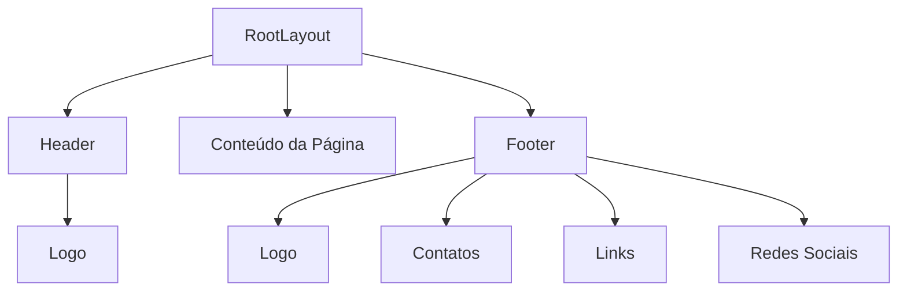
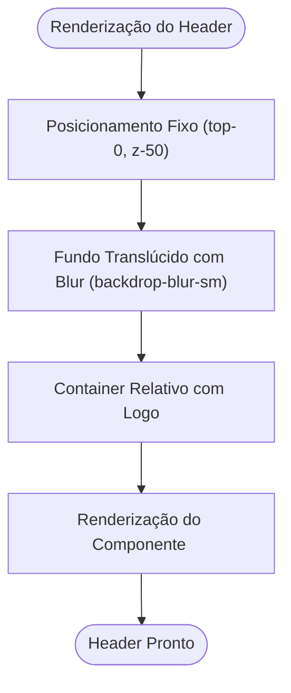
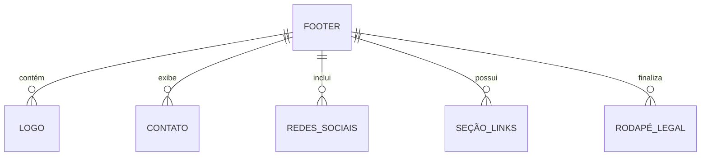
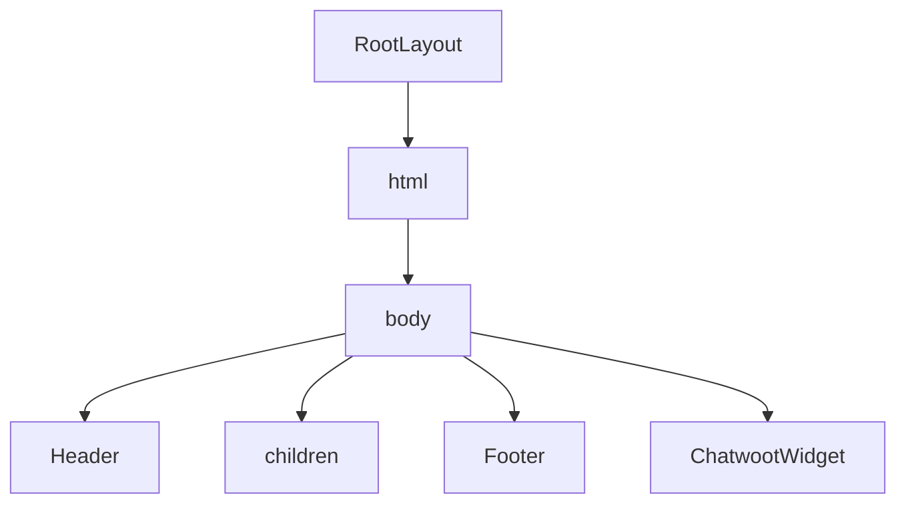

# Componentes Header e Footer

<cite>
**Arquivos Referenciados neste Documento**  
- [components/header.tsx](file://components\header.tsx) - *Atualizado com efeito glassmorphism e navegação centralizada*
- [components/ui/footer.tsx](file://components\ui\footer.tsx) - *Estrutura de grid com seções dinâmicas*
- [app/layout.tsx](file://app\layout.tsx) - *Layout raiz que integra Header e Footer*
- [components/ui/logo.tsx](file://components\ui\logo.tsx) - *Componente de logo reutilizável*
</cite>

## Sumário
1. [Introdução](#introdução)
2. [Estrutura do Projeto](#estrutura-do-projeto)
3. [Componente Header](#componente-header)
4. [Componente Footer](#componente-footer)
5. [Integração no Layout Principal](#integração-no-layout-principal)
6. [Personalização e Atualização](#personalização-e-atualização)
7. [Boas Práticas de Acessibilidade e SEO](#boas-práticas-de-acessibilidade-e-seo)
8. [Conclusão](#conclusão)

## Introdução
Os componentes **Header** e **Footer** são elementos persistentes na aplicação, responsáveis pela navegação consistente e exibição de informações essenciais em todas as páginas. Este documento detalha a implementação técnica, estrutura, estilização e práticas recomendadas para manutenção e personalização desses componentes no site do escritório Polastri e Zattar Advogados.

## Estrutura do Projeto
Os componentes estão organizados em diretórios específicos:
- `components/header.tsx`: Implementação do cabeçalho.
- `components/ui/footer.tsx`: Implementação do rodapé.
- `components/ui/logo.tsx`: Componente de logo reutilizável.
- `app/layout.tsx`: Layout raiz que inclui Header e Footer globalmente.



**Fontes do Diagrama**
- [app/layout.tsx](file://app\layout.tsx#L23-L39)
- [components/header.tsx](file://components\header.tsx#L122-L158)
- [components/ui/footer.tsx](file://components\ui\footer.tsx#L68-L136)

**Fontes da Seção**
- [app/layout.tsx](file://app\layout.tsx#L23-L39)

## Componente Header

O componente **Header** é implementado com uma abordagem minimalista, exibindo apenas o logo centralizado com um fundo translúcido e efeito blur (backdrop-blur-sm), proporcionando uma estética moderna e discreta.

### Características Técnicas
- **Posicionamento fixo**: Utiliza `position: fixed` para permanecer visível durante o scroll.
- **Sobreposição**: Está posicionado com `z-50`, garantindo que sobreponha outros conteúdos.
- **Estilização visual**: Fundo semitransparente com desfoque (backdrop-blur-sm) e borda arredondada sutil.
- **Logo**: Renderizado via componente `Logo`, que utiliza `next/image` com otimização automática.



**Fontes do Diagrama**
- [components/header.tsx](file://components\header.tsx#L122-L158)
- [components/ui/logo.tsx](file://components\ui\logo.tsx#L2-L12)

**Fontes da Seção**
- [components/header.tsx](file://components\header.tsx#L1-L205)
- [components/ui/logo.tsx](file://components\ui\logo.tsx#L2-L12)

## Componente Footer

O **Footer** é estruturado em grid com múltiplas seções, fornecendo navegação, contato e informações legais de forma organizada.

### Estrutura em Grid
- **Grid de 5 colunas** em telas grandes (`lg:grid-cols-5`).
- **Coluna 1 (2 colunas)**: Logo, endereço, e-mail, telefone e redes sociais.
- **Colunas 2–4**: Seções de links (Institucional, Áreas de Atuação, Conteúdo).
- **Seção inferior**: Direitos autorais e links legais (Política de Privacidade, Termos de Uso).

### Funcionalidades
- **Imagens otimizadas**: Uso de `next/image` com `priority={false}` para carregamento eficiente.
- **Links externos**: Redes sociais abrem em nova aba (`target="_blank"`) com `rel="noopener noreferrer"`.
- **Ícones do Tabler**: Biblioteca `@mynaui/icons-react` fornece ícones de Instagram, LinkedIn e Facebook.
- **Navegação interna**: Links internos com `next/link` para roteamento eficiente.



**Fontes do Diagrama**
- [components/ui/footer.tsx](file://components\ui\footer.tsx#L68-L136)

**Fontes da Seção**
- [components/ui/footer.tsx](file://components\ui\footer.tsx#L1-L138)

## Integração no Layout Principal

Ambos os componentes são incluídos no `RootLayout` em `app/layout.tsx`, garantindo presença global em todas as páginas.

### Implementação
- O `Header` é renderizado antes do conteúdo principal.
- O `Footer` é renderizado após o conteúdo.
- O `ChatwootWidget` também é incluído no layout para suporte.



**Fontes do Diagrama**
- [app/layout.tsx](file://app\layout.tsx#L23-L39)

**Fontes da Seção**
- [app/layout.tsx](file://app\layout.tsx#L23-L39)

## Personalização e Atualização

### Atualizar Informações de Contato
Edite diretamente o conteúdo dentro da `div` com classe `mt-6 space-y-4` no componente `Footer`.

### Adicionar Novos Links
Modifique o array `footerSections` no `Footer`:
```ts
{
  title: 'Nova Seção',
  links: [
    { text: 'Novo Link', href: '/nova-pagina' }
  ]
}
```

### Modificar Conteúdo do Rodapé Legal
Altere o texto do copyright ou adicione novos links na seção inferior:
```tsx
<Link href="/nova-politica">Nova Política</Link>
```

### Personalização de Estilos
- **Header**: Ajuste classes como `backdrop-blur-sm`, `bg-white/5`, ou dimensões do `rounded-full`.
- **Footer**: Modifique `bg-muted/60`, espaçamentos (`py-16`, `gap-12`) ou cores dos links.

**Fontes da Seção**
- [components/ui/footer.tsx](file://components\ui\footer.tsx#L20-L48)
- [components/header.tsx](file://components\header.tsx#L4-L15)

## Boas Práticas de Acessibilidade e SEO

### Acessibilidade
- **Navegação por teclado**: Links internos e externos são acessíveis via tab.
- **Texto alternativo**: Imagens possuem `alt` descritivo.
- **Contraste de cores**: Utiliza classes do Tailwind (`text-foreground`, `text-muted-foreground`) para garantir legibilidade.
- **ARIA labels**: O logo possui `aria-label` para leitores de tela.

### SEO
- **Estrutura semântica**: Uso de `<header>` e `<footer>` para melhor indexação.
- **Links internos**: Facilitam a navegação e rastreamento por motores de busca.
- **Metadados**: Definidos em `metadata` no `layout.tsx` (título, descrição, palavras-chave).
- **Imagens otimizadas**: `next/image` melhora desempenho e SEO técnico.

**Fontes da Seção**
- [app/layout.tsx](file://app\layout.tsx#L10-L23)
- [components/ui/footer.tsx](file://components\ui\footer.tsx#L100-L138)
- [components/header.tsx](file://components\header.tsx#L6-L15)

## Conclusão
Os componentes **Header** e **Footer** são fundamentais para a experiência do usuário, oferecendo navegação intuitiva e informações de contato acessíveis. Sua implementação com React, Next.js e TailwindCSS garante desempenho, acessibilidade e facilidade de manutenção. A integração no `RootLayout` assegura consistência em toda a aplicação, enquanto a estrutura modular permite personalização sem comprometer a arquitetura.