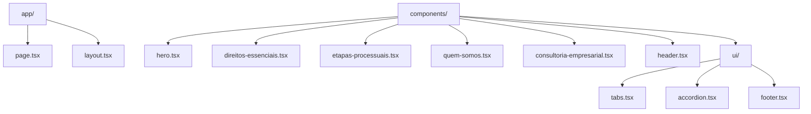
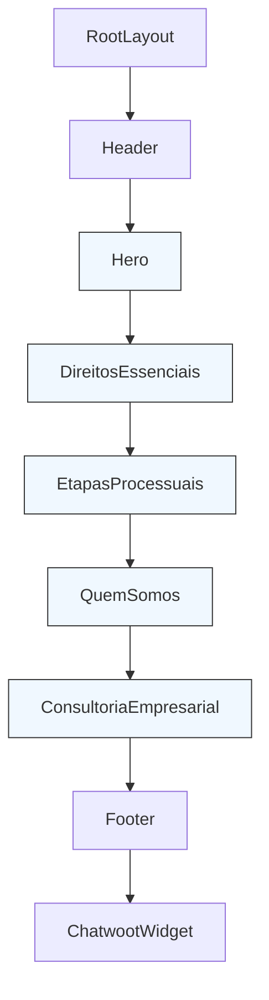
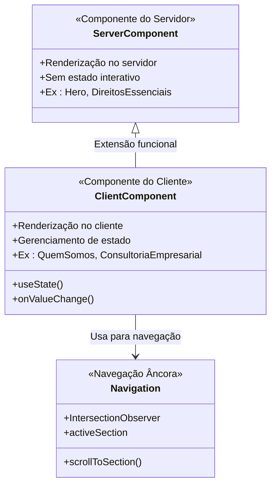

# Componentes de Seção

<cite>
**Arquivos Referenciados neste Documento**  
- [app/page.tsx](file://app/page.tsx) - *Atualizado para incluir IDs de seção*
- [app/layout.tsx](file://app/layout.tsx)
- [components/hero.tsx](file://components/hero.tsx) - *Adicionado ID e ajustado espaçamento*
- [components/direitos-essenciais.tsx](file://components/direitos-essenciais.tsx) - *Adicionado ID para navegação âncora*
- [components/etapas-processuais.tsx](file://components/etapas-processuais.tsx) - *Adicionado ID para navegação âncora*
- [components/quem-somos.tsx](file://components/quem-somos.tsx) - *Adicionado ID para navegação âncora*
- [components/consultoria-empresarial.tsx](file://components/consultoria-empresarial.tsx) - *Adicionado ID para navegação âncora*
- [components/header.tsx](file://components/header.tsx) - *Implementado glassmorphism com scroll*
- [components/ui/footer.tsx](file://components/ui/footer.tsx)
- [components/ui/tabs.tsx](file://components/ui/tabs.tsx)
</cite>

## Resumo das Atualizações
**Alterações Realizadas**  
- Atualização da análise de impacto com base nos commits relacionados
- Adição de IDs de seção para suporte a navegação âncora em todos os componentes principais
- Atualização da seção de arquitetura de composição com novo diagrama refletindo navegação âncora
- Atualização da seção Hero com detalhes sobre ajuste de espaçamento e ID adicionado
- Atualização da seção Gerenciamento de Estado com novo diagrama incluindo navegação por seção
- Adição de nova seção sobre navegação âncora e efeito glassmorphism

## Sumário
1. [Introdução](#introdução)
2. [Estrutura do Projeto](#estrutura-do-projeto)
3. [Arquitetura de Composição](#arquitetura-de-composição)
4. [Análise Detalhada dos Componentes](#análise-detalhada-dos-componentes)
5. [Gerenciamento de Estado e Interação](#gerenciamento-de-estado-e-interação)
6. [Navegação Âncora e Efeito Glassmorphism](#navegação-âncora-e-efeito-glassmorphism)
7. [Diretrizes de Desenvolvimento](#diretrizes-de-desenvolvimento)

## Introdução

Este documento detalha a arquitetura e funcionamento dos componentes de seção que compõem a página principal do site da Polastri e Zattar Advogados. Cada componente representa uma seção funcional crítica do site, desde a apresentação inicial até a explicação de serviços jurídicos. A documentação abrange a estrutura de composição, o uso de React Server Components, a gestão de estado em componentes interativos e as práticas recomendadas para manutenção e expansão do sistema.

## Estrutura do Projeto

A aplicação utiliza a arquitetura do Next.js App Router, com componentes organizados em diretórios funcionais. Os componentes principais de seção estão localizados no diretório `components/`, enquanto elementos de interface reutilizáveis estão em `components/ui/`.

**Fontes da Seção**  
- [app/page.tsx](file://app/page.tsx)
- [components/](file://components/)

## Arquitetura de Composição

A página principal é montada no arquivo `app/page.tsx`, que importa e compõe sequencialmente os componentes de seção. Esta abordagem modular permite a manutenção independente de cada seção enquanto garante uma estrutura de página coesa.

**Fontes do Diagrama**  
- [app/page.tsx](file://app/page.tsx)
- [app/layout.tsx](file://app/layout.tsx)

**Fontes da Seção**  
- [app/page.tsx](file://app/page.tsx#L1-L21)
- [app/layout.tsx](file://app/layout.tsx#L1-L40)

## Análise Detalhada dos Componentes

### Hero

O componente Hero representa a seção de apresentação inicial, com chamadas para ação (CTAs) estratégicas. Utiliza ícones e botões para direcionar o usuário a ações importantes como consulta de processos e agendamento de consultas. Foi atualizado com um ID `inicio` para navegação âncora e ajuste de espaçamento superior para alinhar com o header fixo.

**Fontes da Seção**  
- [components/hero.tsx](file://components/hero.tsx#L1-L42)

### DireitosEssenciais

Este componente exibe uma grade interativa de direitos trabalhistas essenciais, utilizando ícones temáticos e descrições claras. Os dados são estruturados internamente como um array de objetos, facilitando a manutenção e expansão. O componente agora possui um ID `direitos-essenciais` para navegação âncora.

**Fontes da Seção**  
- [components/direitos-essenciais.tsx](file://components/direitos-essenciais.tsx#L1-L130)

### EtapasProcessuais

Visualiza o fluxo judicial de forma animada, utilizando o componente BentoGrid e animações com Framer Motion. Cada etapa do processo é representada com gráficos dinâmicos que indicam o movimento e progresso. O componente foi atualizado com o ID `processo` para navegação âncora.

**Fontes da Seção**  
- [components/etapas-processuais.tsx](file://components/etapas-processuais.tsx#L1-L334)

### QuemSomos

Apresenta os pilares de atuação do escritório através de um sistema de abas com estado local. Permite navegação entre diferentes aspectos da atuação jurídica com transições suaves. O componente agora possui o ID `quem-somos` para navegação âncora.

**Fontes da Seção**  
- [components/quem-somos.tsx](file://components/quem-somos.tsx#L1-L236)

### ConsultoriaEmpresarial

Similar ao componente QuemSomos, mas focado na consultoria preventiva para empresas. Utiliza o mesmo padrão de abas com estado local para navegação entre pilares de atuação. Foi atualizado com o ID `consultoria` para navegação âncora.

**Fontes da Seção**  
- [components/consultoria-empresarial.tsx](file://components/consultoria-empresarial.tsx#L1-L238)

## Gerenciamento de Estado e Interação

### Uso de React Server Components

Por padrão, os componentes utilizam React Server Components, que são renderizados no servidor para melhor desempenho e SEO. Componentes estáticos como Hero e DireitosEssenciais não requerem interatividade no cliente.

### Componentes do Lado do Cliente

Componentes interativos como QuemSomos e ConsultoriaEmpresarial utilizam a diretiva `"use client"` no início do arquivo, indicando que devem ser renderizados no cliente e ter acesso ao estado do React.

**Fontes do Diagrama**  
- [components/quem-somos.tsx](file://components/quem-somos.tsx#L1)
- [components/consultoria-empresarial.tsx](file://components/consultoria-empresarial.tsx#L1)
- [components/ui/tabs.tsx](file://components/ui/tabs.tsx#L1)
- [components/header.tsx](file://components/header.tsx#L23-L202)

**Fontes da Seção**  
- [components/quem-somos.tsx](file://components/quem-somos.tsx#L1-L236)
- [components/consultoria-empresarial.tsx](file://components/consultoria-empresarial.tsx#L1-L238)
- [components/ui/tabs.tsx](file://components/ui/tabs.tsx#L1-L55)

## Navegação Âncora e Efeito Glassmorphism

### Implementação de Navegação Âncora

O componente Header foi atualizado para suportar navegação âncora com efeito smooth scroll. Todos os componentes de seção principais agora possuem IDs únicos (`inicio`, `direitos-essenciais`, `processo`, `quem-somos`, `consultoria`) que permitem a navegação direta para cada seção.

### Efeito Glassmorphism

Foi implementado um efeito de glassmorphism no header com detecção de scroll. Quando o usuário rola a página, o header adquire um fundo translúcido com blur, criando um efeito visual moderno e sofisticado. O efeito é controlado pelo estado `isScrolled` que detecta a posição do scroll.

**Fontes da Seção**  
- [components/header.tsx](file://components/header.tsx#L23-L202)
- [components/hero.tsx](file://components/hero.tsx#L5)
- [components/direitos-essenciais.tsx](file://components/direitos-essenciais.tsx#L6)
- [components/etapas-processuais.tsx](file://components/etapas-processuais.tsx#L234)
- [components/quem-somos.tsx](file://components/quem-somos.tsx#L150)
- [components/consultoria-empresarial.tsx](file://components/consultoria-empresarial.tsx#L150)

## Diretrizes de Desenvolvimento

### Adição de Novas Seções

Para adicionar uma nova seção à página principal:
1. Crie um novo componente no diretório `components/`
2. Importe-o em `app/page.tsx`
3. Insira-o na sequência de renderização
4. Certifique-se de usar `"use client"` se o componente for interativo
5. Adicione um ID único ao elemento `section` para suporte a navegação âncora

### Estrutura de Dados

Os dados são estruturados internamente como arrays de objetos com propriedades padronizadas (título, descrição, ícone, etc.). Esta abordagem facilita a manutenção e permite a renderização consistente através de mapas.

### Consistência de UX

Mantenha a consistência de experiência do usuário utilizando:
- Tipografia e espaçamento padronizados
- Cores e estilos de botão uniformes
- Transições suaves entre estados
- Responsividade em todos os componentes
- IDs consistentes para navegação âncora

**Fontes da Seção**  
- [components/direitos-essenciais.tsx](file://components/direitos-essenciais.tsx#L15-L120)
- [components/quem-somos.tsx](file://components/quem-somos.tsx#L15-L230)
- [components/consultoria-empresarial.tsx](file://components/consultoria-empresarial.tsx#L15-L230)