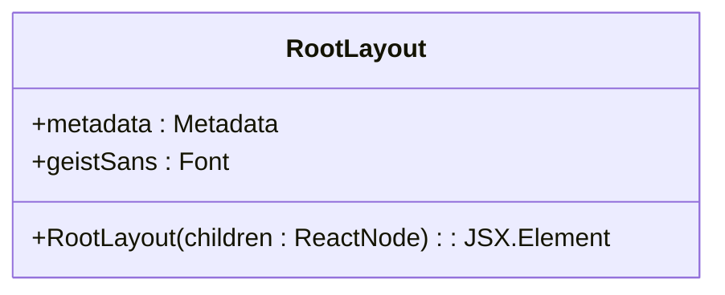
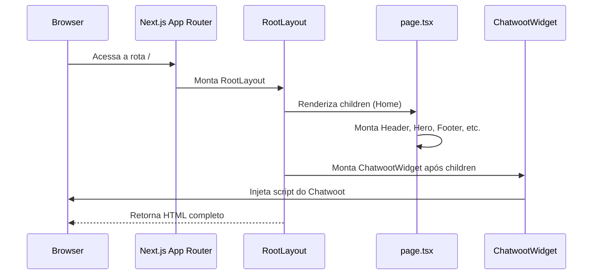
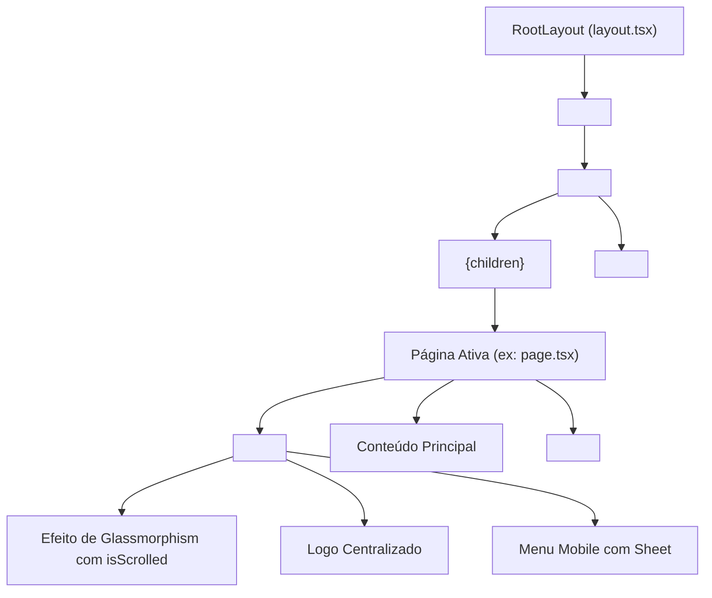

# Estrutura de Layout e Composição Global

<cite>
**Arquivos Referenciados neste Documento**  
- [app/layout.tsx](file://app/layout.tsx)
- [app/page.tsx](file://app/page.tsx)
- [components/header.tsx](file://components/header.tsx) - *Atualizado com efeito de glassmorphism e navegação centralizada*
- [components/ui/footer.tsx](file://components/ui/footer.tsx)
- [components/chatwoot-widget.tsx](file://components/chatwoot-widget.tsx)
</cite>

## Sumário
1. [Introdução](#introdução)
2. [Estrutura do Projeto](#estrutura-do-projeto)
3. [Componente RootLayout](#componente-rootlayout)
4. [Fluxo de Renderização do Next.js App Router](#fluxo-de-renderização-do-nextjs-app-router)
5. [Composição do Layout Global](#composição-do-layout-global)
6. [Integração do ChatwootWidget](#integração-do-chatwootwidget)
7. [Análise de Desempenho](#análise-de-desempenho)
8. [Orientações para Modificação](#orientações-para-modificação)
9. [Conclusão](#conclusão)

## Introdução

Este documento apresenta uma análise arquitetônica detalhada da estrutura de layout da aplicação Next.js, com foco no componente `RootLayout` localizado em `app/layout.tsx`. O objetivo é explicar como o layout raiz serve como invólucro principal da aplicação, definindo o HTML base, injetando recursos globais como o widget de atendimento Chatwoot e garantindo uma experiência de usuário consistente através da inclusão de elementos persistentes como o cabeçalho e rodapé em todas as rotas. A documentação aborda o fluxo de renderização, decisões de desempenho e fornece orientações para futuras modificações.

## Estrutura do Projeto

A aplicação segue a estrutura convencional do Next.js App Router, onde o diretório `app` contém os arquivos principais de roteamento e layout. O componente `layout.tsx` atua como o invólucro raiz, enquanto `page.tsx` representa a página inicial. Os componentes de interface, como `Header`, `Footer` e `ChatwootWidget`, estão organizados em diretórios específicos para promover a reutilização e a manutenção do código.

**Section sources**
- [app/layout.tsx](file://app/layout.tsx#L1-L40)
- [app/page.tsx](file://app/page.tsx#L1-L22)

## Componente RootLayout

O `RootLayout` é o componente de layout raiz da aplicação, definido em `app/layout.tsx`. Ele é responsável por estruturar o documento HTML base (`<html>` e `<body>`) e injetar metadados globais, como título, descrição e palavras-chave, através do objeto `metadata`. O componente utiliza a fonte `Geist` do Google Fonts, configurada com variáveis CSS para estilização consistente em toda a aplicação. Sua principal função é envolver todos os conteúdos das rotas filhas, representados pela propriedade `children`, garantindo uma estrutura comum para todas as páginas.



**Diagram sources**
- [app/layout.tsx](file://app/layout.tsx#L1-L40)

**Section sources**
- [app/layout.tsx](file://app/layout.tsx#L1-L40)

## Fluxo de Renderização do Next.js App Router

O fluxo de renderização inicia-se com o `RootLayout`, que é montado automaticamente pelo Next.js para todas as rotas dentro do diretório `app`. O conteúdo da página ativa, como a página inicial (`page.tsx`), é injetado no `RootLayout` através da propriedade `children`. O `RootLayout` então renderiza o `children` dentro do elemento `<body>` e, posteriormente, monta o `ChatwootWidget`. Este fluxo garante que o layout global seja aplicado de forma consistente, independentemente da rota acessada.



**Diagram sources**
- [app/layout.tsx](file://app/layout.tsx#L23-L38)
- [app/page.tsx](file://app/page.tsx#L8-L20)

**Section sources**
- [app/layout.tsx](file://app/layout.tsx#L23-L38)
- [app/page.tsx](file://app/page.tsx#L8-L20)

## Composição do Layout Global

A hierarquia de composição do layout é clara e eficiente. O `RootLayout` envolve todo o conteúdo da aplicação, incluindo o `Header` e o `Footer`, que são componentes persistentes renderizados em todas as páginas. O `Header` é fixo no topo da tela, enquanto o `Footer` é posicionado no final do conteúdo principal. Essa estrutura assegura uma navegação consistente e uma identidade visual uniforme em toda a aplicação.

A implementação do `Header` foi significativamente atualizada para incluir dois recursos importantes: efeito de glassmorphism com detecção de scroll e navegação com logo centralizado. O efeito de glassmorphism é ativado dinamicamente quando o usuário rola a página, utilizando um estado `isScrolled` que monitora a posição do scroll. Quando o usuário desce mais de 20 pixels, o cabeçalho ganha um fundo branco semitransparente com desfoque (`backdrop-blur-xl`) e sombra, criando um efeito visual moderno e profissional. Este comportamento é implementado através do hook `useEffect` que adiciona um listener ao evento de scroll.

Além disso, a arquitetura de navegação foi refatorada para suportar um layout com logo centralizado, especialmente otimizado para dispositivos móveis. Na versão desktop, a navegação é dividida em dois grupos: itens à esquerda e à direita do logo centralizado, utilizando uma grade CSS com três colunas (`md:grid-cols-[1fr_auto_1fr]`). Para dispositivos móveis, um menu em forma de gaveta (Sheet) é utilizado, acessível através de um ícone de hambúrguer, mantendo a usabilidade em telas menores. O sistema de navegação também destaca a seção ativa utilizando Intersection Observer, que detecta qual seção está atualmente visível na viewport e atualiza o estado `activeSection` em tempo real.



**Diagram sources**
- [app/layout.tsx](file://app/layout.tsx#L23-L38)
- [app/page.tsx](file://app/page.tsx#L8-L20)
- [components/header.tsx](file://components/header.tsx#L1-L206) - *Implementação do glassmorphism e navegação centralizada*
- [components/ui/footer.tsx](file://components/ui/footer.tsx#L1-L139)

**Section sources**
- [app/layout.tsx](file://app/layout.tsx#L23-L38)
- [app/page.tsx](file://app/page.tsx#L8-L20)
- [components/header.tsx](file://components/header.tsx#L1-L206) - *Atualizado com novos recursos de UI*
- [components/ui/footer.tsx](file://components/ui/footer.tsx#L1-L139)

## Integração do ChatwootWidget

O `ChatwootWidget` é um componente do lado do cliente (Client Component), indicado pelo diretivo `'use client'`. Ele é montado diretamente no corpo do documento HTML, após o conteúdo principal (`children`), utilizando o componente `Script` do Next.js com a estratégia `afterInteractive`. Isso garante que o script do Chatwoot seja carregado após a interatividade da página ser estabelecida, minimizando o impacto no tempo de carregamento inicial. O widget é injetado globalmente, tornando-se disponível em todas as rotas da aplicação.

```mermaid
classDiagram
class ChatwootWidget {
+ChatwootWidget() : JSX.Element
}
ChatwootWidget --> Script : "usa"
Script --> "window.chatwootSDK" : "inicializa"
```

**Diagram sources**
- [components/chatwoot-widget.tsx](file://components/chatwoot-widget.tsx#L1-L27)

**Section sources**
- [components/chatwoot-widget.tsx](file://components/chatwoot-widget.tsx#L1-L27)

## Análise de Desempenho

A arquitetura adotada prioriza a renderização no servidor (SSR) por padrão, o que melhora significativamente o desempenho percebido e o SEO. O `RootLayout` e a maioria dos componentes são renderizados no servidor, gerando HTML estático. Apenas componentes interativos, como o `ChatwootWidget`, são marcados como Client Components e hidratados no cliente. A posição do `ChatwootWidget` no final do `<body>` evita bloqueios no carregamento do conteúdo principal, seguindo as melhores práticas de desempenho web. A utilização de `next/script` com `strategy="afterInteractive"` otimiza ainda mais o carregamento do script externo.

A implementação do efeito de glassmorphism no `Header` demonstra boas práticas de desempenho, utilizando transições CSS suaves (`transition-all duration-300`) em vez de manipulação direta do DOM. O uso de `requestAnimationFrame` implícito no `useEffect` com listener de scroll garante que as atualizações de UI sejam sincronizadas com o ciclo de renderização do navegador. Além disso, o componente `Header` utiliza o Intersection Observer API de forma eficiente, observando apenas as seções principais da página e desconectando o observador no cleanup do efeito, prevenindo vazamentos de memória.

**Section sources**
- [app/layout.tsx](file://app/layout.tsx#L30-L36)
- [components/chatwoot-widget.tsx](file://components/chatwoot-widget.tsx#L1-L27)
- [components/header.tsx](file://components/header.tsx#L45-L55) - *Implementação do useEffect para scroll*

## Orientações para Modificação

Para modificar o layout global, edite o arquivo `app/layout.tsx`. Novos elementos persistentes devem ser adicionados dentro do `<body>`, preferencialmente antes ou após o `{children}` e o `ChatwootWidget`, dependendo da necessidade de visibilidade e prioridade. Para adicionar novos componentes que requerem interatividade no cliente, eles devem ser marcados com `'use client'` e importados no `RootLayout` ou em páginas específicas. É crucial garantir que as alterações no layout não afetem negativamente o desempenho, especialmente evitando a promoção desnecessária de componentes para Client Components.

Para modificar o comportamento do `Header`, especialmente os recursos de glassmorphism e navegação ativa, as seguintes orientações devem ser seguidas:
- O limite de scroll para ativar o glassmorphism (20 pixels) pode ser ajustado alterando o valor na condição `window.scrollY > 20` dentro do `useEffect`.
- A intensidade do desfoque pode ser modificada alterando a classe `backdrop-blur-xl` para outros valores como `backdrop-blur-lg` ou `backdrop-blur-2xl`.
- A transparência do fundo pode ser ajustada modificando o valor `bg-white/90` para diferentes níveis de opacidade (ex: `bg-white/80` para mais transparência).
- A navegação ativa pode ser personalizada adicionando novas seções à constante `navigationItems` e garantindo que os IDs correspondam aos IDs dos elementos na página.
- Para adicionar novos estados ou comportamentos ao `Header`, utilize hooks do React como `useState` e `useEffect`, sempre garantindo o cleanup adequado para prevenir vazamentos de memória.

**Section sources**
- [app/layout.tsx](file://app/layout.tsx#L23-L38)
- [components/chatwoot-widget.tsx](file://components/chatwoot-widget.tsx#L1-L27)
- [components/header.tsx](file://components/header.tsx#L1-L206) - *Lógica de modificação do Header*

## Conclusão

A estrutura de layout da aplicação é bem projetada, utilizando os recursos do Next.js App Router de forma eficaz para criar uma experiência de usuário consistente e de alto desempenho. O `RootLayout` atua como um invólucro robusto, definindo a estrutura base e injetando funcionalidades globais como o widget de atendimento. A separação clara entre Server Components e Client Components, juntamente com a otimização do carregamento de scripts externos, demonstra boas práticas de desenvolvimento moderno. Esta arquitetura é escalável e fácil de manter, fornecendo uma base sólida para futuras expansões.

As recentes atualizações no componente `Header`, incluindo o efeito de glassmorphism com detecção de scroll e a navegação com logo centralizado, demonstram um compromisso com a melhoria contínua da experiência do usuário. Essas mudanças não apenas modernizam a aparência visual da aplicação, mas também melhoram a usabilidade, especialmente em dispositivos móveis. A implementação cuidadosa desses recursos, com atenção ao desempenho e acessibilidade, reflete uma abordagem madura de desenvolvimento front-end. Esta arquitetura é escalável e fácil de manter, fornecendo uma base sólida para futuras expansões.