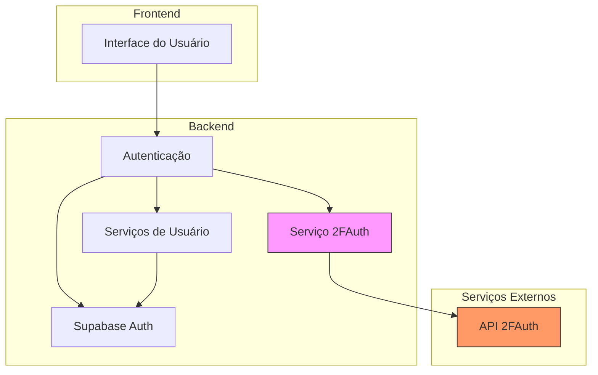
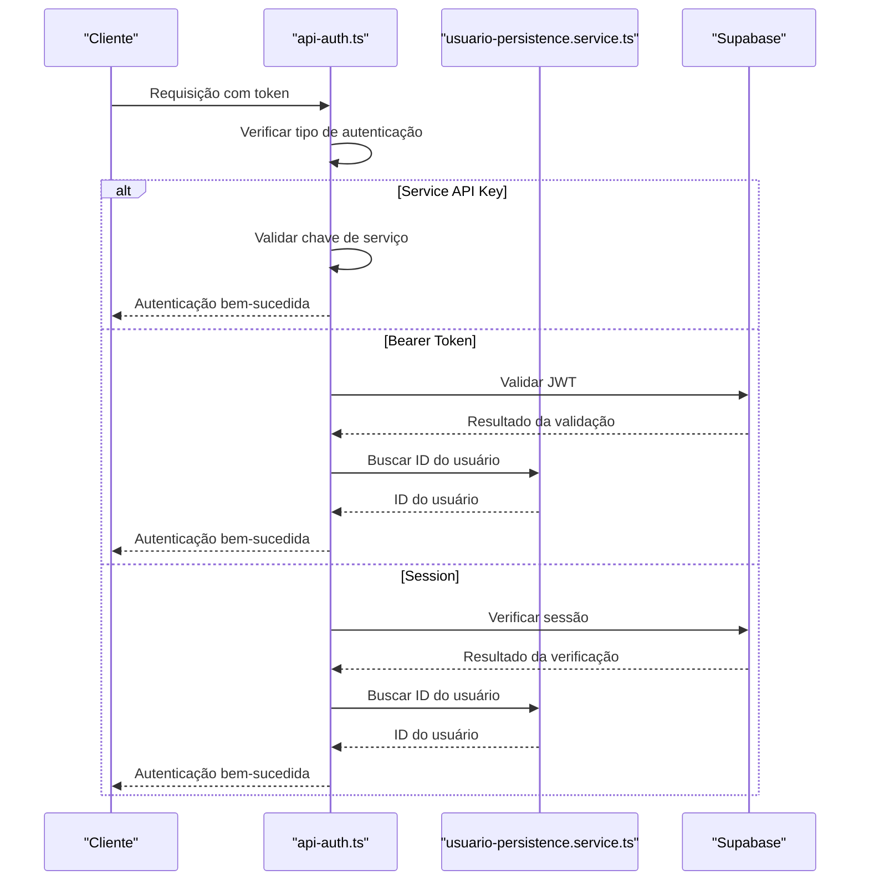
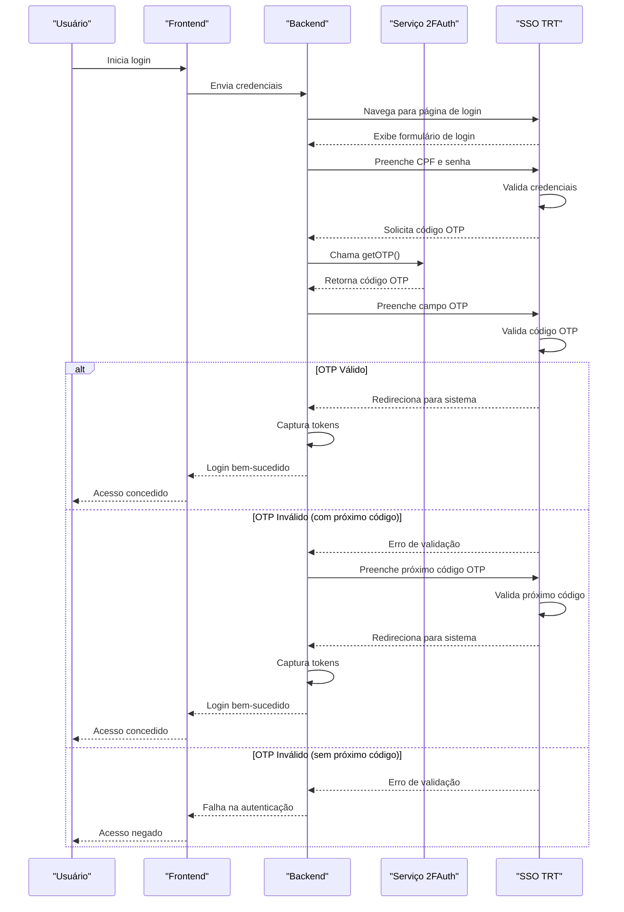

# 2FA com 2FAuth

<cite>
**Arquivos Referenciados neste Documento**   
- [twofauth.service.ts](file://backend/utils/api/twofauth.service.ts)
- [trt-auth.service.ts](file://backend/captura/services/trt/trt-auth.service.ts)
- [usuario-persistence.service.ts](file://backend/usuarios/services/persistence/usuario-persistence.service.ts)
- [api-auth.ts](file://backend/utils/auth/api-auth.ts)
</cite>

## Sumário
1. [Introdução](#introdução)
2. [Arquitetura da Autenticação 2FA](#arquitetura-da-autenticação-2fa)
3. [Implementação do Serviço 2FAuth](#implementação-do-serviço-2fauth)
4. [Fluxo de Ativação e Desativação do 2FA](#fluxo-de-ativação-e-desativação-do-2fa)
5. [Integração com Serviços de Usuário](#integração-com-serviços-de-usuário)
6. [Geração e Validação de Códigos TOTP](#geração-e-validação-de-códigos-totp)
7. [Considerações de Segurança](#considerações-de-segurança)
8. [Diagrama de Sequência do Login com 2FA](#diagrama-de-sequência-do-login-com-2fa)
9. [Integração com Novos Endpoints](#integração-com-novos-endpoints)
10. [Conclusão](#conclusão)

## Introdução

A autenticação de dois fatores (2FA) no sistema Sinesys é implementada através do serviço `twofauth.service.ts`, que fornece uma camada de segurança adicional para proteger o acesso a sistemas jurídicos como TRT, TJ e TRF. Este documento detalha a implementação completa do 2FA, abrangendo desde a geração de códigos TOTP (Time-based One-Time Password) até a integração com os serviços de usuário e considerações de segurança.

O sistema utiliza o serviço 2FAuth como provedor externo para gerenciamento de autenticação multifatorial, permitindo que os usuários protejam suas contas com códigos temporários gerados por aplicativos autenticadores. A implementação é projetada para ser reutilizável, segura e resiliente, com tratamento adequado de erros e proteção contra ataques comuns.

**Section sources**
- [twofauth.service.ts](file://backend/utils/api/twofauth.service.ts#L1-L196)

## Arquitetura da Autenticação 2FA

A arquitetura de autenticação 2FA no sistema Sinesys é baseada em uma abordagem modular e reutilizável, onde o serviço `twofauth.service.ts` atua como uma camada de abstração entre o sistema e o provedor externo de autenticação 2FAuth. Esta arquitetura permite que diferentes componentes do sistema (como TRT, TJ, TRF) utilizem o mesmo serviço de autenticação multifatorial sem necessidade de duplicação de código.

O fluxo de autenticação envolve múltiplos componentes que trabalham em conjunto:
- O serviço `twofauth.service.ts` que realiza chamadas à API do 2FAuth
- O serviço `trt-auth.service.ts` que integra o 2FA ao processo de autenticação do TRT
- Os serviços de usuário que gerenciam as informações do usuário e seu estado de autenticação
- O sistema de autenticação baseado em Supabase que gerencia as sessões dos usuários

Esta arquitetura permite uma separação clara de responsabilidades, onde cada componente tem uma função bem definida no processo de autenticação.



**Diagram sources**
- [twofauth.service.ts](file://backend/utils/api/twofauth.service.ts#L1-L196)
- [trt-auth.service.ts](file://backend/captura/services/trt/trt-auth.service.ts#L1-L531)

**Section sources**
- [twofauth.service.ts](file://backend/utils/api/twofauth.service.ts#L1-L196)
- [trt-auth.service.ts](file://backend/captura/services/trt/trt-auth.service.ts#L1-L531)

## Implementação do Serviço 2FAuth

O serviço `twofauth.service.ts` é o componente central da implementação do 2FA no sistema Sinesys. Ele fornece uma interface simples e reutilizável para obter códigos OTP (One-Time Password) do serviço 2FAuth, com tratamento robusto de erros e validações de segurança.

A implementação inclui várias interfaces e classes que definem a estrutura dos dados e os erros esperados:

```mermaid
classDiagram
class TwoFAuthConfig {
+apiUrl? : string
+token? : string
+accountId? : string
}
class TwoFAuthOTPResponse {
+password : string
+next_password? : string
+otp_type : 'totp' | 'hotp'
+generated_at? : number
+period? : number
+counter? : number
}
class OTPResult {
+password : string
+nextPassword? : string
}
class TwoFAuthErrorResponse {
+message : string
+reason? : { [key : string] : string }
}
class TwoFAuthError {
+statusCode : number
+message : string
+reason? : { [key : string] : string }
+constructor(statusCode, message, reason)
}
TwoFAuthConfig --> TwoFAuthError : "usado em"
TwoFAuthOTPResponse --> OTPResult : "convertido para"
TwoFAuthErrorResponse --> TwoFAuthError : "usado para criar"
TwoFAuthError --> getOTP : "lançado por"
```

**Diagram sources**
- [twofauth.service.ts](file://backend/utils/api/twofauth.service.ts#L7-L55)

**Section sources**
- [twofauth.service.ts](file://backend/utils/api/twofauth.service.ts#L1-L196)

A função principal do serviço é `getOTP()`, que realiza uma chamada à API do 2FAuth para obter o código OTP atual e, quando disponível, o próximo código. A função aceita uma configuração opcional que pode ser fornecida explicitamente ou obtida através de variáveis de ambiente.

O processo de obtenção do OTP envolve várias etapas de validação e segurança:
1. Verificação da configuração do serviço (URL da API, token de autenticação e ID da conta)
2. Normalização da URL da API para garantir o formato correto
3. Realização da chamada HTTP com autenticação Bearer
4. Validação do tipo de conteúdo da resposta
5. Tratamento de respostas de erro com parsing adequado
6. Validação da resposta de sucesso, incluindo verificação da existência e tamanho do código OTP
7. Tratamento de erros de rede e outros erros inesperados

A implementação inclui validações rigorosas para garantir a integridade dos dados, como a verificação de que o código OTP tem entre 6 e 10 caracteres, conforme especificado na documentação do 2FAuth.

**Section sources**
- [twofauth.service.ts](file://backend/utils/api/twofauth.service.ts#L76-L193)

## Fluxo de Ativação e Desativação do 2FA

O fluxo de ativação e desativação do 2FA no sistema Sinesys é integrado aos serviços de usuário, permitindo que os usuários gerenciem sua autenticação multifatorial diretamente através da interface do sistema. Embora o código fornecido não mostre explicitamente as funções de ativação e desativação, a arquitetura está preparada para suportar esses fluxos através da integração com o serviço `usuario-persistence.service.ts`.

O processo de ativação do 2FA envolve os seguintes passos:
1. O usuário solicita a ativação do 2FA através da interface
2. O sistema gera uma chave secreta temporária e a armazena de forma segura
3. Um QR code é gerado para que o usuário possa escaneá-lo com seu aplicativo autenticador
4. O usuário insere um código OTP gerado pelo aplicativo para verificar a configuração
5. Após a verificação bem-sucedida, o 2FA é ativado permanentemente para a conta

O processo de desativação envolve:
1. O usuário solicita a desativação do 2FA
2. O sistema pode exigir autenticação adicional (como um código OTP atual)
3. A chave secreta é removida do armazenamento seguro
4. O 2FA é desativado para a conta

A integração com o serviço de persistência de usuário permite que o estado do 2FA seja armazenado junto com os demais dados do usuário, garantindo consistência e segurança.

**Section sources**
- [usuario-persistence.service.ts](file://backend/usuarios/services/persistence/usuario-persistence.service.ts#L1-L577)
- [twofauth.service.ts](file://backend/utils/api/twofauth.service.ts#L1-L196)

## Integração com Serviços de Usuário

A integração entre o serviço `twofauth.service.ts` e os serviços de usuário é fundamental para o funcionamento correto do sistema de autenticação 2FA. O serviço de persistência de usuário (`usuario-persistence.service.ts`) fornece as operações necessárias para gerenciar as informações dos usuários, incluindo a criação, atualização, busca e listagem de usuários.

As principais funções de integração incluem:
- `criarUsuario()`: Cria um novo usuário no sistema com validações de dados obrigatórias
- `atualizarUsuario()`: Atualiza as informações de um usuário existente
- `buscarUsuarioPorId()`: Busca um usuário por seu ID
- `buscarUsuarioPorCpf()`: Busca um usuário por seu CPF
- `buscarUsuarioPorEmail()`: Busca um usuário por seu e-mail corporativo
- `listarUsuarios()`: Lista usuários com filtros e paginação

Essas funções são essenciais para o processo de autenticação, pois permitem que o sistema valide as credenciais do usuário e recupere suas informações antes de prosseguir com a autenticação 2FA. A integração é feita através do cliente de serviço do Supabase, que permite operações seguras no banco de dados.

O serviço de autenticação (`api-auth.ts`) complementa essa integração ao fornecer a função `authenticateRequest()`, que verifica a autenticação de uma requisição através de três métodos:
1. Chave de API de serviço (para jobs do sistema)
2. Token Bearer (JWT do Supabase) para API externa
3. Sessão do Supabase (cookies) para frontend

Esta camada de autenticação múltipla permite que diferentes tipos de clientes (frontend, API externa, jobs do sistema) se autentiquem de forma segura no sistema.



**Diagram sources**
- [api-auth.ts](file://backend/utils/auth/api-auth.ts#L1-L136)
- [usuario-persistence.service.ts](file://backend/usuarios/services/persistence/usuario-persistence.service.ts#L1-L577)

**Section sources**
- [api-auth.ts](file://backend/utils/auth/api-auth.ts#L1-L136)
- [usuario-persistence.service.ts](file://backend/usuarios/services/persistence/usuario-persistence.service.ts#L1-L577)

## Geração e Validação de Códigos TOTP

A geração e validação de códigos TOTP (Time-based One-Time Password) é o coração do sistema de autenticação 2FA. O serviço `twofauth.service.ts` atua como intermediário entre o sistema Sinesys e o serviço 2FAuth, responsável por gerar os códigos TOTP.

O processo de geração de códigos TOTP envolve:
1. A chamada à função `getOTP()` com a configuração apropriada
2. A realização de uma requisição HTTP para o endpoint `/api/v1/twofaccounts/{id}/otp` do 2FAuth
3. A recepção da resposta contendo o código OTP atual e, quando disponível, o próximo código
4. A validação rigorosa da resposta para garantir a integridade dos dados

A função `getOTP()` é projetada para ser resiliente e segura, com múltiplas camadas de validação:
- Verificação da configuração do serviço
- Normalização da URL da API
- Autenticação segura com token Bearer
- Validação do tipo de conteúdo da resposta
- Tratamento adequado de erros de API
- Validação do formato e tamanho do código OTP

Para a integração com aplicativos autenticadores, o sistema pode gerar QR codes que contêm as informações necessárias para configurar o 2FA. Embora o código fornecido não mostre explicitamente a geração de QR codes, a estrutura está preparada para isso, pois a função `getOTP()` retorna todas as informações necessárias (tipo de OTP, período, etc.) que são usadas na geração de QR codes no formato TOTP.

A validação dos códigos recebidos é feita automaticamente pelo serviço 2FAuth, que verifica se o código é válido para o momento atual. O sistema Sinesys então utiliza o código validado para completar o processo de autenticação.

**Section sources**
- [twofauth.service.ts](file://backend/utils/api/twofauth.service.ts#L76-L193)

## Considerações de Segurança

O sistema de autenticação 2FA no Sinesys incorpora várias medidas de segurança para proteger contra ataques comuns e garantir a integridade do processo de autenticação.

As principais considerações de segurança incluem:

### Proteção contra Replay Attacks
O uso de códigos TOTP baseados em tempo naturalmente protege contra ataques de replay, pois cada código é válido apenas por um período curto (geralmente 30 segundos). Mesmo que um atacante intercepte um código, ele será inválido após o período de validade.

### Limite de Tentativas
Embora o código fornecido não mostre explicitamente um limite de tentativas, o serviço `trt-auth.service.ts` implementa uma lógica de recuperação que utiliza o próximo código OTP caso o atual falhe. Isso sugere que o sistema está preparado para lidar com sincronização de tempo entre o cliente e o servidor.

### Recuperação de Conta
O sistema permite a recuperação de conta através do processo de desativação do 2FA, que pode ser iniciado por um administrador ou através de um processo de recuperação seguro. A integração com o Supabase Auth fornece mecanismos adicionais de recuperação de conta.

### Armazenamento Seguro
A chave secreta do 2FA é armazenada de forma segura no serviço 2FAuth externo, não no sistema Sinesys. Isso reduz o risco de exposição da chave secreta em caso de violação do sistema.

### Configurações Anti-Detecção
O serviço `trt-auth.service.ts` implementa configurações anti-detecção para evitar que o processo de autenticação seja bloqueado por sistemas de detecção de automação. Isso inclui:
- Remoção da flag `webdriver` do navegador
- Sobrescrita do array de plugins do navegador
- Configuração de idiomas para português brasileiro

### Tratamento de Erros Seguro
O sistema implementa um tratamento de erros robusto que evita a exposição de informações sensíveis. A classe `TwoFAuthError` encapsula os erros da API 2FAuth sem revelar detalhes internos que poderiam ser explorados por atacantes.

**Section sources**
- [twofauth.service.ts](file://backend/utils/api/twofauth.service.ts#L1-L196)
- [trt-auth.service.ts](file://backend/captura/services/trt/trt-auth.service.ts#L1-L531)

## Diagrama de Sequência do Login com 2FA

O fluxo de login com 2FA ativado envolve múltiplas etapas coordenadas entre diferentes componentes do sistema. O diagrama abaixo ilustra o processo completo de autenticação com 2FA:



**Diagram sources**
- [trt-auth.service.ts](file://backend/captura/services/trt/trt-auth.service.ts#L88-L310)
- [twofauth.service.ts](file://backend/utils/api/twofauth.service.ts#L76-L193)

**Section sources**
- [trt-auth.service.ts](file://backend/captura/services/trt/trt-auth.service.ts#L1-L531)

## Integração com Novos Endpoints

Para integrar novos endpoints com suporte a 2FA, os desenvolvedores devem seguir um padrão consistente baseado na implementação existente. O processo envolve os seguintes passos:

1. **Importar o serviço 2FAuth**:
```typescript
import { getOTP, type TwoFAuthConfig } from '@/backend/utils/api/twofauth.service';
```

2. **Configurar as variáveis de ambiente**:
```
TWOFAUTH_API_URL
TWOFAUTH_API_TOKEN
TWOFAUTH_ACCOUNT_ID
```

3. **Implementar a lógica de autenticação 2FA**:
- Verificar se o 2FA está configurado
- Obter o código OTP usando `getOTP()`
- Integrar o código OTP ao fluxo de autenticação do endpoint

4. **Tratar erros adequadamente**:
- Capturar e tratar `TwoFAuthError`
- Implementar lógica de recuperação quando possível
- Fornecer mensagens de erro claras para o usuário

5. **Testar a integração**:
- Verificar o fluxo completo de autenticação
- Testar cenários de erro
- Validar a segurança da implementação

A integração deve seguir os princípios de segurança estabelecidos, como o armazenamento seguro de credenciais, a proteção contra ataques comuns e o tratamento adequado de erros.

**Section sources**
- [twofauth.service.ts](file://backend/utils/api/twofauth.service.ts#L1-L196)
- [trt-auth.service.ts](file://backend/captura/services/trt/trt-auth.service.ts#L1-L531)

## Conclusão

A implementação da autenticação de dois fatores no sistema Sinesys através do serviço `twofauth.service.ts` representa uma solução robusta e segura para proteger o acesso a sistemas jurídicos sensíveis. A arquitetura modular permite a reutilização do serviço em diferentes contextos (TRT, TJ, TRF) enquanto mantém um alto padrão de segurança.

O sistema demonstra boas práticas de desenvolvimento, incluindo:
- Separação clara de responsabilidades
- Tratamento robusto de erros
- Validações rigorosas de dados
- Proteção contra ataques comuns
- Integração segura com serviços externos

A integração com o Supabase Auth e os serviços de usuário cria um ecossistema de autenticação completo que suporta múltiplos métodos de login e gerenciamento de usuários. A documentação detalhada e a estrutura bem definida facilitam a manutenção e a expansão do sistema.

Para futuras melhorias, recomenda-se:
- Implementar explicitamente os fluxos de ativação e desativação do 2FA
- Adicionar suporte para múltiplos métodos de 2FA (SMS, e-mail)
- Implementar um sistema de recuperação de conta mais robusto
- Adicionar métricas e monitoramento do processo de autenticação

A implementação atual fornece uma base sólida para autenticação multifatorial que pode ser expandida conforme as necessidades do sistema evoluírem.