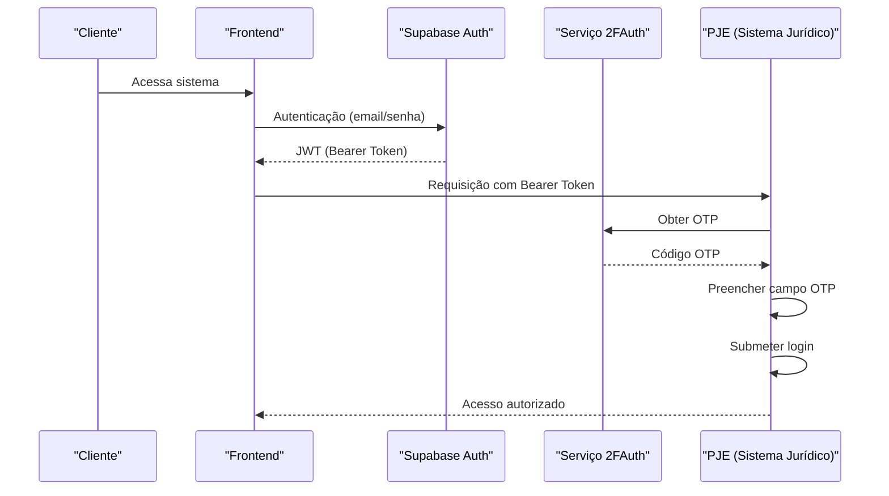
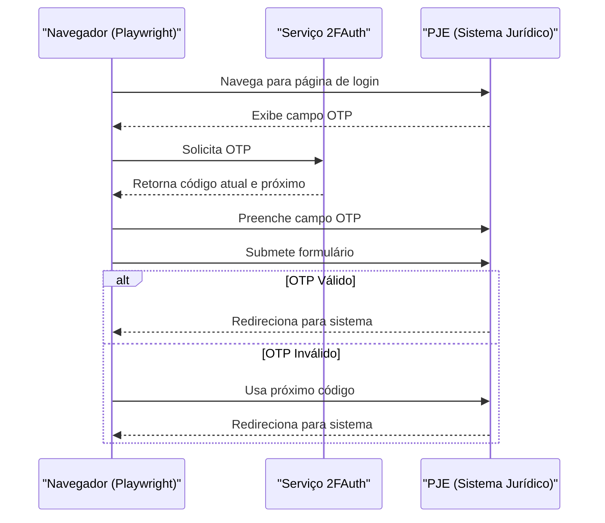

# Autenticação e Segurança

<cite>
**Arquivos Referenciados neste Documento**   
- [api-auth.ts](file://backend/utils/auth/api-auth.ts)
- [twofauth.service.ts](file://backend/utils/api/twofauth.service.ts)
- [08_usuarios.sql](file://supabase/schemas/08_usuarios.sql)
- [trt-auth.service.ts](file://backend/captura/services/trt/trt-auth.service.ts)
- [server.ts](file://backend/utils/supabase/server.ts)
- [service-client.ts](file://backend/utils/supabase/service-client.ts)
</cite>

## Sumário
1. [Introdução](#introdução)
2. [Fluxo de Autenticação Dual](#fluxo-de-autenticação-dual)
3. [Autenticação de Dois Fatores (2FA)](#autenticação-de-dois-fatores-2fa)
4. [Estrutura da Tabela Usuários](#estrutura-da-tabela-usuários)
5. [Práticas de Segurança](#práticas-de-segurança)
6. [Diagramas de Sequência](#diagramas-de-sequência)
7. [Configurações e Boas Práticas](#configurações-e-boas-práticas)
8. [Considerações de Privacidade e Conformidade](#considerações-de-privacidade-e-conformidade)
9. [Conclusão](#conclusão)

## Introdução
O sistema sinesys implementa um modelo robusto de autenticação e segurança, projetado para proteger dados sensíveis de escritórios de advocacia e garantir acesso seguro a sistemas jurídicos externos. Este documento detalha os mecanismos de autenticação dual, a implementação da autenticação de dois fatores (2FA), a estrutura do banco de dados, práticas de segurança e conformidade com regulamentações.

## Fluxo de Autenticação Dual
O sistema sinesys suporta múltiplos métodos de autenticação através do arquivo `api-auth.ts`, permitindo flexibilidade e segurança em diferentes cenários de uso. O fluxo de autenticação é processado em ordem de prioridade:

1. **Service API Key**: Utilizada por jobs do sistema, possui a maior prioridade.
2. **Bearer Token (JWT do Supabase)**: Usado por front-end e APIs externas.
3. **Sessão do Supabase (cookies)**: Para autenticação baseada em sessão no front-end.

A função `authenticateRequest` valida a requisição HTTP, verificando os cabeçalhos apropriados e retornando um objeto `AuthResult` com o estado de autenticação, identificadores de usuário e a fonte da autenticação.

**Fontes da Seção**
- [api-auth.ts](file://backend/utils/auth/api-auth.ts#L49-L133)

## Autenticação de Dois Fatores (2FA)
A autenticação de dois fatores é implementada através do serviço `twofauth.service.ts`, que se integra com o provedor 2FAuth para geração e verificação de códigos OTP (One-Time Password). O serviço é reutilizável por diferentes sistemas jurídicos (TRT, TJ, TRF, etc.).

### Geração de Códigos OTP
A função `getOTP` realiza uma chamada à API do 2FAuth para obter o código atual e o próximo código (quando disponível). A função valida:
- A presença das credenciais de configuração (URL, token, ID da conta).
- O formato da resposta JSON.
- A existência e o tamanho do campo `password` (6 a 10 caracteres).

### Verificação de Códigos
O processo de verificação ocorre durante a autenticação no PJE, onde o código OTP é inserido automaticamente no campo apropriado. Caso o código atual falhe, o sistema tenta automaticamente com o próximo código disponível.

**Fontes da Seção**
- [twofauth.service.ts](file://backend/utils/api/twofauth.service.ts#L76-L193)
- [trt-auth.service.ts](file://backend/captura/services/trt/trt-auth.service.ts#L88-L216)

## Estrutura da Tabela Usuários
A tabela `usuarios` é definida no arquivo `08_usuarios.sql` e armazena informações detalhadas sobre os usuários do sistema, incluindo dados pessoais, profissionais e de contato.

### Campos Principais
- **id**: Identificador único gerado automaticamente.
- **nome_completo**, **nome_exibicao**: Informações de identificação do usuário.
- **cpf**, **rg**: Documentos de identidade.
- **email_corporativo**: Email corporativo único.
- **oab**, **uf_oab**: Número da OAB e UF de emissão (para advogados).
- **auth_user_id**: Referência ao usuário no Supabase Auth.
- **ativo**: Indica se o usuário está ativo no sistema.
- **endereco**: Armazenado em formato JSONB com campos estruturados.

### Índices e RLS
A tabela possui índices para otimizar consultas por CPF, email, nome e ID do Supabase. A RLS (Row Level Security) está habilitada para garantir que apenas usuários autorizados possam acessar os dados.

**Fontes da Seção**
- [08_usuarios.sql](file://supabase/schemas/08_usuarios.sql#L1-L74)

## Práticas de Segurança
O sistema implementa várias camadas de segurança para proteger contra ameaças comuns e garantir a integridade dos dados.

### Armazenamento Seguro de Credenciais
As credenciais são armazenadas de forma segura utilizando variáveis de ambiente e criptografia. O serviço `credential-cache.service.ts` gerencia um cache de credenciais com validade limitada e limpeza automática de itens expirados.

### Proteção contra Ataques
- **XSS (Cross-Site Scripting)**: Prevenido através da sanitização de entradas e uso de Content Security Policy (CSP).
- **CSRF (Cross-Site Request Forgery)**: Mitigado com tokens XSRF e validação de origem das requisições.
- **Detecção de Automação**: O serviço de autenticação TRT aplica configurações anti-detecção no navegador para evitar bloqueios por sistemas de segurança.

### Uso de RLS no Supabase
A RLS é habilitada em todas as tabelas sensíveis, garantindo que os dados só possam ser acessados por usuários com as permissões apropriadas. O cliente de serviço (`service-client.ts`) é usado apenas em operações administrativas que precisam contornar a RLS.

**Fontes da Seção**
- [service-client.ts](file://backend/utils/supabase/service-client.ts#L37-L52)
- [trt-auth.service.ts](file://backend/captura/services/trt/trt-auth.service.ts#L59-L82)

## Diagramas de Sequência
### Fluxo de Login com 2FA

**Fontes do Diagrama**
- [api-auth.ts](file://backend/utils/auth/api-auth.ts#L49-L133)
- [twofauth.service.ts](file://backend/utils/api/twofauth.service.ts#L76-L193)

### Verificação 2FA no PJE

**Fontes do Diagrama**
- [trt-auth.service.ts](file://backend/captura/services/trt/trt-auth.service.ts#L88-L216)

## Configurações e Boas Práticas
### Configuração do 2FAuth
As variáveis de ambiente devem ser definidas para integrar com o serviço 2FAuth:
- `TWOFAUTH_API_URL`: URL base da API 2FAuth.
- `TWOFAUTH_API_TOKEN`: Token de autenticação.
- `TWOFAUTH_ACCOUNT_ID`: ID da conta 2FAuth.

### Boas Práticas para Desenvolvedores
- Nunca armazene credenciais em código fonte.
- Use sempre o cliente de serviço (`createServiceClient`) apenas em operações backend.
- Valide e sanitize todas as entradas de usuário.
- Implemente logging detalhado para auditoria, mas evite registrar dados sensíveis.

**Fontes da Seção**
- [twofauth.service.ts](file://backend/utils/api/twofauth.service.ts#L68-L72)
- [service-client.ts](file://backend/utils/supabase/service-client.ts#L37-L52)

## Considerações de Privacidade e Conformidade
O sistema sinesys foi projetado para estar em conformidade com regulamentações de proteção de dados, como a LGPD. Todas as operações que envolvem dados pessoais são auditadas e registradas. O acesso a dados sensíveis é restrito por políticas de segurança rigorosas e monitoramento contínuo.

## Conclusão
O sistema sinesys implementa um modelo abrangente de autenticação e segurança, combinando múltiplos métodos de autenticação, 2FA, RLS e práticas de segurança modernas. Esta abordagem garante que os dados dos clientes sejam protegidos contra ameaças externas e internas, mantendo a conformidade com as regulamentações aplicáveis.