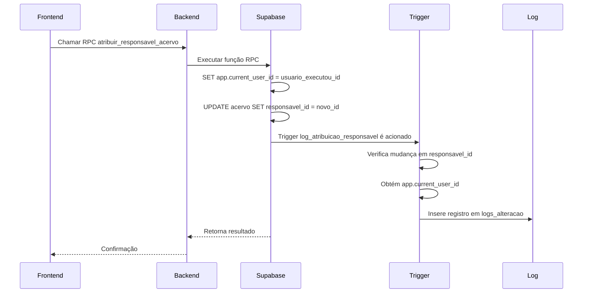

# Banco de Dados

<cite>
**Arquivos Referenciados neste Documento**  
- [04_acervo.sql](file://supabase/schemas/04_acervo.sql)
- [11_contratos.sql](file://supabase/schemas/11_contratos.sql)
- [09_clientes.sql](file://supabase/schemas/09_clientes.sql)
- [08_usuarios.sql](file://supabase/schemas/08_usuarios.sql)
- [06_pendentes_manifestacao.sql](file://supabase/schemas/06_pendentes_manifestacao.sql)
- [10_partes_contrarias.sql](file://supabase/schemas/10_partes_contrarias.sql)
- [12_contrato_processos.sql](file://supabase/schemas/12_contrato_processos.sql)
- [07_audiencias.sql](file://supabase/schemas/07_audiencias.sql)
- [01_enums.sql](file://supabase/schemas/01_enums.sql)
- [02_advogados.sql](file://supabase/schemas/02_advogados.sql)
- [20251117015304_create_logs_alteracao.sql](file://supabase/migrations/20251117015304_create_logs_alteracao.sql)
- [20251117015305_add_responsavel_id_tables.sql](file://supabase/migrations/20251117015305_add_responsavel_id_tables.sql)
- [20251117015306_create_triggers_log_atribuicao.sql](file://supabase/migrations/20251117015306_create_triggers_log_atribuicao.sql)
- [20251117020000_create_rpc_functions_atribuir_responsavel.sql](file://supabase/migrations/20251117020000_create_rpc_functions_atribuir_responsavel.sql)
- [backend/usuarios/services/persistence/usuario-persistence.service.ts](file://backend/usuarios/services/persistence/usuario-persistence.service.ts)
- [backend/clientes/services/persistence/cliente-persistence.service.ts](file://backend/clientes/services/persistence/cliente-persistence.service.ts)
- [backend/contratos/services/persistence/contrato-persistence.service.ts](file://backend/contratos/services/persistence/contrato-persistence.service.ts)
- [backend/contratos/services/persistence/contrato-processo-persistence.service.ts](file://backend/contratos/services/persistence/contrato-processo-persistence.service.ts)
- [backend/acervo/services/persistence/listar-acervo.service.ts](file://backend/acervo/services/persistence/listar-acervo.service.ts)
- [backend/pendentes/services/persistence/listar-pendentes.service.ts](file://backend/pendentes/services/persistence/listar-pendentes.service.ts)
</cite>

## Sumário
1. [Introdução](#introdução)
2. [Modelo de Dados](#modelo-de-dados)
3. [Entidades Principais](#entidades-principais)
4. [Relacionamentos e Integridade Referencial](#relacionamentos-e-integridade-referencial)
5. [Segurança e Controle de Acesso (RLS)](#segurança-e-controle-de-acesso-rls)
6. [Auditoria e Triggers](#auditoria-e-triggers)
7. [Migrações de Banco de Dados](#migrações-de-banco-de-dados)
8. [Acesso aos Dados via Serviços de Persistência](#acesso-aos-dados-via-serviços-de-persistência)
9. [Considerações de Desempenho e Indexação](#considerações-de-desempenho-e-indexação)
10. [Exemplos de Consultas Comuns](#exemplos-de-consultas-comuns)

## Introdução

O sistema Sinesys utiliza um modelo de dados robusto e bem estruturado no Supabase para gerenciar informações jurídicas, incluindo processos, contratos, clientes, usuários e pendências. Este documento detalha o esquema do banco de dados, com foco nas tabelas principais, seus relacionamentos, políticas de segurança (RLS), triggers para auditoria, estratégias de migração e padrões de acesso aos dados. O modelo foi projetado para garantir integridade referencial, desempenho e segurança, permitindo o rastreamento de alterações e o controle de acesso granular.

**Fontes da seção**
- [04_acervo.sql](file://supabase/schemas/04_acervo.sql#L1-L77)
- [11_contratos.sql](file://supabase/schemas/11_contratos.sql#L1-L86)
- [01_enums.sql](file://supabase/schemas/01_enums.sql#L1-L112)

## Modelo de Dados

O modelo de dados do Sinesys é composto por várias tabelas inter-relacionadas, organizadas em esquemas SQL no Supabase. As principais entidades incluem `acervo`, `contratos`, `clientes`, `usuarios`, `pendentes_manifestacao`, `partes_contrarias`, `audiencias` e `advogados`. O modelo utiliza tipos de dados enumerados (enums) para garantir consistência nos valores dos campos, como grau do tribunal, área de direito e status de contratos. A unicidade dos registros é garantida por combinações de campos, evitando duplicações mesmo quando múltiplos usuários acessam os mesmos dados.

```mermaid
erDiagram
USUARIOS {
bigint id PK
text nome_completo
text nome_exibicao
text cpf UK
text email_corporativo UK
uuid auth_user_id FK
boolean ativo
timestamptz created_at
timestamptz updated_at
}
CLIENTES {
bigint id PK
public.tipo_pessoa tipo_pessoa
text nome
text nome_fantasia
text cpf UK
text cnpj UK
date data_nascimento
text email
jsonb endereco
bigint created_by FK
boolean ativo
timestamptz created_at
timestamptz updated_at
}
PARTES_CONTRARIAS {
bigint id PK
public.tipo_pessoa tipo_pessoa
text nome
text nome_fantasia
text cpf UK
text cnpj UK
date data_nascimento
text email
jsonb endereco
bigint created_by FK
boolean ativo
timestamptz created_at
timestamptz updated_at
}
ADVOGADOS {
bigint id PK
text nome_completo
text cpf UK
text oab
text uf_oab
timestamptz created_at
timestamptz updated_at
}
ACERVO {
bigint id PK
bigint id_pje
bigint advogado_id FK
text origem
public.codigo_tribunal trt
public.grau_tribunal grau
text numero_processo
text descricao_orgao_julgador
text classe_judicial
boolean segredo_justica
text codigo_status_processo
integer prioridade_processual
text nome_parte_autora
integer qtde_parte_autora
text nome_parte_re
integer qtde_parte_re
timestamptz data_autuacao
boolean juizo_digital
timestamptz data_arquivamento
timestamptz data_proxima_audiencia
boolean tem_associacao
bigint responsavel_id FK
bigint created_by FK
timestamptz created_at
timestamptz updated_at
}
CONTRATOS {
bigint id PK
public.area_direito area_direito
public.tipo_contrato tipo_contrato
public.tipo_cobranca tipo_cobranca
bigint cliente_id FK
public.polo_processual polo_cliente
bigint parte_contraria_id FK
jsonb parte_autora
jsonb parte_re
integer qtde_parte_autora
integer qtde_parte_re
public.status_contrato status
timestamptz data_contratacao
date data_assinatura
date data_distribuicao
date data_desistencia
bigint responsavel_id FK
bigint created_by FK
text observacoes
jsonb dados_anteriores
timestamptz created_at
timestamptz updated_at
}
PENDENTES_MANIFESTACAO {
bigint id PK
bigint id_pje
bigint advogado_id FK
bigint processo_id FK
public.codigo_tribunal trt
public.grau_tribunal grau
text numero_processo
text descricao_orgao_julgador
text classe_judicial
bigint numero
boolean segredo_justica
text codigo_status_processo
integer prioridade_processual
text nome_parte_autora
integer qtde_parte_autora
text nome_parte_re
integer qtde_parte_re
timestamptz data_autuacao
boolean juizo_digital
timestamptz data_arquivamento
bigint id_documento
timestamptz data_ciencia_parte
timestamptz data_prazo_legal_parte
timestamptz data_criacao_expediente
boolean prazo_vencido
text sigla_orgao_julgador
bigint responsavel_id FK
timestamptz created_at
timestamptz updated_at
}
AUDIENCIAS {
bigint id PK
bigint id_pje
bigint advogado_id FK
bigint processo_id FK
bigint orgao_julgador_id FK
public.codigo_tribunal trt
public.grau_tribunal grau
text numero_processo
timestamptz data_inicio
timestamptz data_fim
text sala_audiencia_nome
bigint sala_audiencia_id
text status
text status_descricao
bigint tipo_id
text tipo_descricao
text tipo_codigo
boolean tipo_is_virtual
boolean designada
boolean em_andamento
boolean documento_ativo
text polo_ativo_nome
text polo_ativo_cpf
text polo_passivo_nome
text polo_passivo_cnpj
text url_audiencia_virtual
time hora_inicial
time hora_final
bigint responsavel_id FK
timestamptz created_at
timestamptz updated_at
}
CONTRATO_PROCESSOS {
bigint id PK
bigint contrato_id FK
bigint processo_id FK
timestamptz created_at
}
LOGS_ALTERACAO {
bigint id PK
text tipo_entidade
bigint entidade_id
text tipo_evento
bigint usuario_que_executou_id FK
bigint responsavel_anterior_id FK
bigint responsavel_novo_id FK
jsonb dados_evento
timestamptz created_at
}
USUARIOS ||--o{ CONTRATOS : "created_by"
USUARIOS ||--o{ CONTRATOS : "responsavel_id"
USUARIOS ||--o{ LOGS_ALTERACAO : "usuario_que_executou_id"
USUARIOS ||--o{ LOGS_ALTERACAO : "responsavel_anterior_id"
USUARIOS ||--o{ LOGS_ALTERACAO : "responsavel_novo_id"
USUARIOS ||--o{ CLIENTES : "created_by"
USUARIOS ||--o{ PARTES_CONTRARIAS : "created_by"
USUARIOS ||--o{ ACERVO : "created_by"
USUARIOS ||--o{ ACERVO : "responsavel_id"
USUARIOS ||--o{ PENDENTES_MANIFESTACAO : "responsavel_id"
USUARIOS ||--o{ AUDIENCIAS : "responsavel_id"
CLIENTES ||--o{ CONTRATOS : "cliente_id"
PARTES_CONTRARIAS ||--o{ CONTRATOS : "parte_contraria_id"
ADVOGADOS ||--o{ ACERVO : "advogado_id"
ADVOGADOS ||--o{ PENDENTES_MANIFESTACAO : "advogado_id"
ADVOGADOS ||--o{ AUDIENCIAS : "advogado_id"
ACERVO ||--o{ CONTRATO_PROCESSOS : "processo_id"
CONTRATOS ||--o{ CONTRATO_PROCESSOS : "contrato_id"
ACERVO ||--o{ PENDENTES_MANIFESTACAO : "processo_id"
ACERVO ||--o{ AUDIENCIAS : "processo_id"
ACERVO }|--|| ACERVO : "tem_associacao"
```

**Fontes do diagrama**
- [04_acervo.sql](file://supabase/schemas/04_acervo.sql#L1-L77)
- [11_contratos.sql](file://supabase/schemas/11_contratos.sql#L1-L86)
- [09_clientes.sql](file://supabase/schemas/09_clientes.sql#L1-L86)
- [08_usuarios.sql](file://supabase/schemas/08_usuarios.sql#L1-L74)
- [10_partes_contrarias.sql](file://supabase/schemas/10_partes_contrarias.sql#L1-L84)
- [06_pendentes_manifestacao.sql](file://supabase/schemas/06_pendentes_manifestacao.sql#L1-L117)
- [07_audiencias.sql](file://supabase/schemas/07_audiencias.sql#L1-L91)
- [12_contrato_processos.sql](file://supabase/schemas/12_contrato_processos.sql#L1-L29)
- [20251117015304_create_logs_alteracao.sql](file://supabase/migrations/20251117015304_create_logs_alteracao.sql#L1-L54)

**Fontes da seção**
- [04_acervo.sql](file://supabase/schemas/04_acervo.sql#L1-L77)
- [11_contratos.sql](file://supabase/schemas/11_contratos.sql#L1-L86)
- [09_clientes.sql](file://supabase/schemas/09_clientes.sql#L1-L86)
- [08_usuarios.sql](file://supabase/schemas/08_usuarios.sql#L1-L74)
- [10_partes_contrarias.sql](file://supabase/schemas/10_partes_contrarias.sql#L1-L84)
- [06_pendentes_manifestacao.sql](file://supabase/schemas/06_pendentes_manifestacao.sql#L1-L117)
- [07_audiencias.sql](file://supabase/schemas/07_audiencias.sql#L1-L91)
- [12_contrato_processos.sql](file://supabase/schemas/12_contrato_processos.sql#L1-L29)

## Entidades Principais

### Acervo

A tabela `acervo` armazena todos os processos jurídicos capturados do PJE, tanto do acervo geral quanto de processos arquivados. A unicidade do processo é garantida pela combinação `(id_pje, trt, grau, numero_processo)`, permitindo que múltiplos advogados acessem o mesmo processo sem duplicação. O campo `advogado_id` referencia o advogado que capturou o processo, mas não faz parte da unicidade. A tabela inclui campos para dados processuais, como número do processo, órgão julgador, partes envolvidas, datas de autuação e arquivamento, e status.

**Fontes da seção**
- [04_acervo.sql](file://supabase/schemas/04_acervo.sql#L1-L77)

### Contratos

A tabela `contratos` gerencia os contratos jurídicos do escritório, incluindo informações sobre área de direito, tipo de contrato, cobrança, partes envolvidas e status. O campo `cliente_id` referencia o cliente principal, enquanto `parte_contraria_id` é opcional. As partes autoras e rés são armazenadas em campos JSONB (`parte_autora`, `parte_re`), permitindo múltiplas partes. O campo `responsavel_id` permite atribuir um usuário responsável pelo contrato, habilitando o rastreamento de responsabilidades.

**Fontes da seção**
- [11_contratos.sql](file://supabase/schemas/11_contratos.sql#L1-L86)

### Clientes

A tabela `clientes` armazena informações sobre os clientes do escritório, podendo ser pessoas físicas (PF) ou jurídicas (PJ). Os campos `cpf` e `cnpj` são únicos e obrigatórios conforme o tipo de pessoa. Dados específicos de PF, como RG, data de nascimento e gênero, são armazenados separadamente. O endereço é armazenado em formato JSONB, permitindo flexibilidade na estrutura. O campo `created_by` referencia o usuário que cadastrou o cliente.

**Fontes da seção**
- [09_clientes.sql](file://supabase/schemas/09_clientes.sql#L1-L86)

### Usuários

A tabela `usuarios` contém os dados dos funcionários e colaboradores do escritório. O campo `auth_user_id` referencia o usuário no sistema de autenticação do Supabase. Informações profissionais, como número da OAB, são armazenadas para advogados. O endereço é armazenado em JSONB. A tabela é usada para controle de acesso e auditoria, com campos `created_at` e `updated_at` gerenciados automaticamente.

**Fontes da seção**
- [08_usuarios.sql](file://supabase/schemas/08_usuarios.sql#L1-L74)

### Pendentes de Manifestação

A tabela `pendentes_manifestacao` armazena processos que aguardam manifestação do advogado. A unicidade é garantida por `(id_pje, trt, grau, numero_processo)`, onde `id_pje` é o ID do expediente, não do processo. O campo `processo_id` referencia a tabela `acervo`, preenchido automaticamente por um trigger. Campos como `data_ciencia_parte` e `data_prazo_legal_parte` são cruciais para o controle de prazos. O campo `prazo_vencido` permite filtragem rápida de pendências urgentes.

**Fontes da seção**
- [06_pendentes_manifestacao.sql](file://supabase/schemas/06_pendentes_manifestacao.sql#L1-L117)

## Relacionamentos e Integridade Referencial

O modelo de dados do Sinesys utiliza chaves estrangeiras para garantir a integridade referencial entre as entidades. A tabela `contrato_processos` implementa um relacionamento muitos-para-muitos entre `contratos` e `acervo`, permitindo que um contrato tenha múltiplos processos associados. A tabela `pendentes_manifestacao` referencia `acervo` via `processo_id`, estabelecendo um vínculo direto entre pendências e processos. A tabela `audiencias` também referencia `acervo`, garantindo que cada audiência esteja ligada a um processo específico. As chaves estrangeiras com `on delete cascade` garantem que a exclusão de um registro pai remova automaticamente os registros filhos, enquanto `on delete set null` preserva os registros filhos ao remover referências opcionais.

**Fontes da seção**
- [12_contrato_processos.sql](file://supabase/schemas/12_contrato_processos.sql#L1-L29)
- [06_pendentes_manifestacao.sql](file://supabase/schemas/06_pendentes_manifestacao.sql#L1-L117)
- [07_audiencias.sql](file://supabase/schemas/07_audiencias.sql#L1-L91)

## Segurança e Controle de Acesso (RLS)

Todas as tabelas principais do sistema têm a segurança em nível de linha (RLS) habilitada, o que significa que o acesso aos dados é controlado por políticas definidas no Supabase. As políticas de RLS garantem que os usuários só possam acessar dados para os quais têm permissão, com base em seu papel e contexto. Por exemplo, um advogado só pode ver processos que capturou, enquanto um gestor pode ter acesso a todos os dados sob sua responsabilidade. O campo `responsavel_id` é central para essas políticas, permitindo a atribuição de responsabilidades e o controle de acesso baseado em equipe.

**Fontes da seção**
- [04_acervo.sql](file://supabase/schemas/04_acervo.sql#L75)
- [11_contratos.sql](file://supabase/schemas/11_contratos.sql#L84)
- [09_clientes.sql](file://supabase/schemas/09_clientes.sql#L84)
- [08_usuarios.sql](file://supabase/schemas/08_usuarios.sql#L72)
- [06_pendentes_manifestacao.sql](file://supabase/schemas/06_pendentes_manifestacao.sql#L115)
- [07_audiencias.sql](file://supabase/schemas/07_audiencias.sql#L89)

## Auditoria e Triggers

O sistema implementa um mecanismo robusto de auditoria para rastrear alterações em registros críticos. A tabela `logs_alteracao` armazena eventos de mudança, como atribuição, transferência ou desatribuição de responsáveis. A função `log_atribuicao_responsavel` é um trigger que detecta mudanças no campo `responsavel_id` nas tabelas `acervo`, `audiencias` e `pendentes_manifestacao`, registrando automaticamente o evento no log. O contexto do usuário é definido via `app.current_user_id`, garantindo que a auditoria identifique corretamente quem executou a ação. Funções RPC como `atribuir_responsavel_acervo` definem esse contexto antes de atualizar o responsável, integrando-se perfeitamente com o sistema de triggers.



**Fontes do diagrama**
- [20251117015306_create_triggers_log_atribuicao.sql](file://supabase/migrations/20251117015306_create_triggers_log_atribuicao.sql#L1-L102)
- [20251117020000_create_rpc_functions_atribuir_responsavel.sql](file://supabase/migrations/20251117020000_create_rpc_functions_atribuir_responsavel.sql#L1-L100)
- [20251117015304_create_logs_alteracao.sql](file://supabase/migrations/20251117015304_create_logs_alteracao.sql#L1-L54)

**Fontes da seção**
- [20251117015306_create_triggers_log_atribuicao.sql](file://supabase/migrations/20251117015306_create_triggers_log_atribuicao.sql#L1-L102)
- [20251117020000_create_rpc_functions_atribuir_responsavel.sql](file://supabase/migrations/20251117020000_create_rpc_functions_atribuir_responsavel.sql#L1-L100)
- [20251117015304_create_logs_alteracao.sql](file://supabase/migrations/20251117015304_create_logs_alteracao.sql#L1-L54)

## Migrações de Banco de Dados

As migrações de banco de dados são gerenciadas pelo Supabase, com scripts SQL versionados e executados em ordem. As migrações incluem a criação de tabelas, adição de colunas, criação de índices e definição de triggers. Por exemplo, a migração `20251117015305_add_responsavel_id_tables.sql` adiciona a coluna `responsavel_id` às tabelas principais, enquanto `20251117015306_create_triggers_log_atribuicao.sql` cria os triggers de auditoria. A migração `add_dados_anteriores_auditoria.sql` pode ser usada para retroalimentar o sistema com dados históricos. Esse sistema garante que o esquema do banco de dados evolua de forma controlada e reversível.

**Fontes da seção**
- [20251117015304_create_logs_alteracao.sql](file://supabase/migrations/20251117015304_create_logs_alteracao.sql#L1-L54)
- [20251117015305_add_responsavel_id_tables.sql](file://supabase/migrations/20251117015305_add_responsavel_id_tables.sql)
- [20251117015306_create_triggers_log_atribuicao.sql](file://supabase/migrations/20251117015306_create_triggers_log_atribuicao.sql#L1-L102)
- [20251117020000_create_rpc_functions_atribuir_responsavel.sql](file://supabase/migrations/20251117020000_create_rpc_functions_atribuir_responsavel.sql#L1-L100)
- [add_dados_anteriores_auditoria.sql](file://supabase/migrations/add_dados_anteriores_auditoria.sql)

## Acesso aos Dados via Serviços de Persistência

Os dados são acessados através de serviços de persistência localizados em `backend/*/services/persistence/`. Esses serviços abstraem as operações de banco de dados, fornecendo uma interface limpa para as camadas superiores. Por exemplo, `usuario-persistence.service.ts` lida com operações CRUD na tabela `usuarios`, enquanto `contrato-persistence.service.ts` gerencia contratos. Os serviços utilizam o cliente Supabase para executar consultas, aplicando filtros e tratando erros. Essa camada de abstração permite que a lógica de negócios se concentre em regras de negócio, não em detalhes de acesso a dados.

**Fontes da seção**
- [backend/usuarios/services/persistence/usuario-persistence.service.ts](file://backend/usuarios/services/persistence/usuario-persistence.service.ts)
- [backend/clientes/services/persistence/cliente-persistence.service.ts](file://backend/clientes/services/persistence/cliente-persistence.service.ts)
- [backend/contratos/services/persistence/contrato-persistence.service.ts](file://backend/contratos/services/persistence/contrato-persistence.service.ts)
- [backend/contratos/services/persistence/contrato-processo-persistence.service.ts](file://backend/contratos/services/persistence/contrato-processo-persistence.service.ts)
- [backend/acervo/services/persistence/listar-acervo.service.ts](file://backend/acervo/services/persistence/listar-acervo.service.ts)
- [backend/pendentes/services/persistence/listar-pendentes.service.ts](file://backend/pendentes/services/persistence/listar-pendentes.service.ts)

## Considerações de Desempenho e Indexação

O modelo de dados inclui uma estratégia de indexação cuidadosamente planejada para garantir desempenho em consultas frequentes. Índices B-Tree são usados em colunas frequentemente filtradas, como `advogado_id`, `trt`, `grau` e `numero_processo`. Índices GIN são usados em campos JSONB, como `endereco` em `clientes` e `parte_autora` em `contratos`, permitindo buscas eficientes dentro de dados semi-estruturados. Índices parciais são usados em colunas que podem ser nulas, como `data_assinatura` em `contratos`, otimizando o uso de espaço e desempenho. A combinação de índices em múltiplas colunas, como `idx_acervo_advogado_trt_grau`, acelera consultas complexas.

**Fontes da seção**
- [04_acervo.sql](file://supabase/schemas/04_acervo.sql#L57-L67)
- [11_contratos.sql](file://supabase/schemas/11_contratos.sql#L63-L75)
- [09_clientes.sql](file://supabase/schemas/09_clientes.sql#L67-L75)
- [08_usuarios.sql](file://supabase/schemas/08_usuarios.sql#L55-L63)
- [06_pendentes_manifestacao.sql](file://supabase/schemas/06_pendentes_manifestacao.sql#L65-L75)
- [07_audiencias.sql](file://supabase/schemas/07_audiencias.sql#L69-L81)

## Exemplos de Consultas Comuns

### Listar Processos do Acervo por Advogado e TRT

```sql
SELECT * FROM acervo 
WHERE advogado_id = 123 
  AND trt = 'TRT1' 
  AND grau = 'primeiro_grau'
ORDER BY data_autuacao DESC;
```

### Buscar Contratos por Cliente e Status

```sql
SELECT * FROM contratos 
WHERE cliente_id = 456 
  AND status = 'contratado'
ORDER BY data_contratacao DESC;
```

### Encontrar Pendências com Prazo Vencido

```sql
SELECT * FROM pendentes_manifestacao 
WHERE prazo_vencido = true 
  AND data_prazo_legal_parte < NOW()
ORDER BY data_prazo_legal_parte;
```

### Listar Audiências Futuras por Processo

```sql
SELECT * FROM audiencias 
WHERE processo_id = 789 
  AND data_inicio > NOW()
ORDER BY data_inicio;
```

### Buscar Cliente por CPF

```sql
SELECT * FROM clientes 
WHERE cpf = '12345678900';
```

**Fontes da seção**
- [04_acervo.sql](file://supabase/schemas/04_acervo.sql#L57-L67)
- [11_contratos.sql](file://supabase/schemas/11_contratos.sql#L63-L75)
- [06_pendentes_manifestacao.sql](file://supabase/schemas/06_pendentes_manifestacao.sql#L65-L75)
- [07_audiencias.sql](file://supabase/schemas/07_audiencias.sql#L69-L81)
- [09_clientes.sql](file://supabase/schemas/09_clientes.sql#L67-L75)