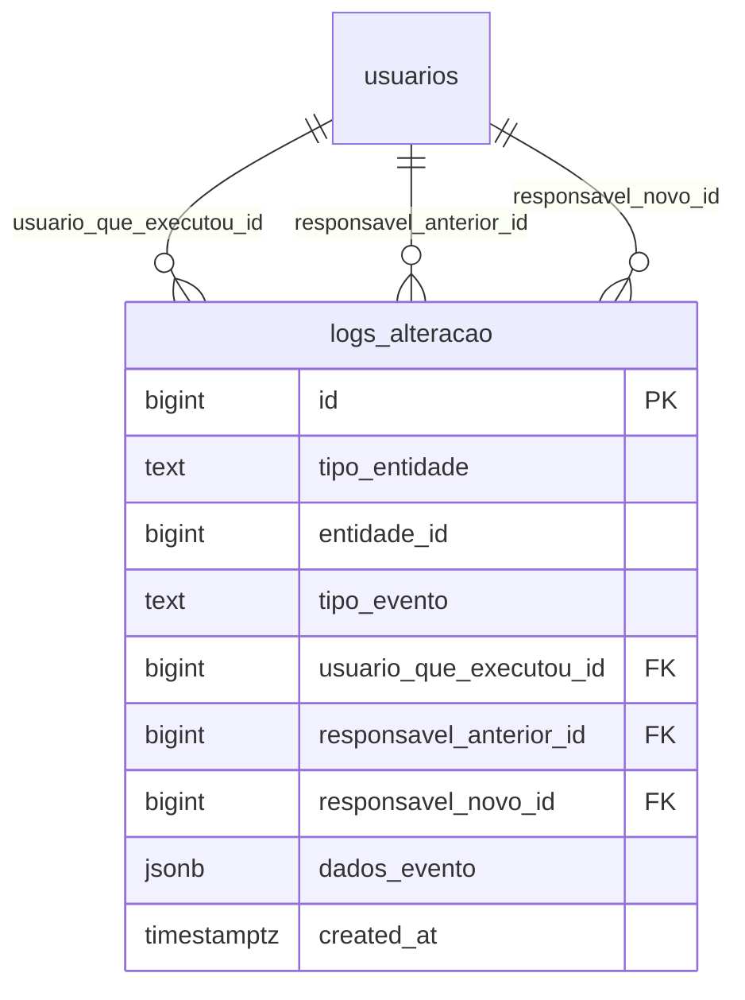
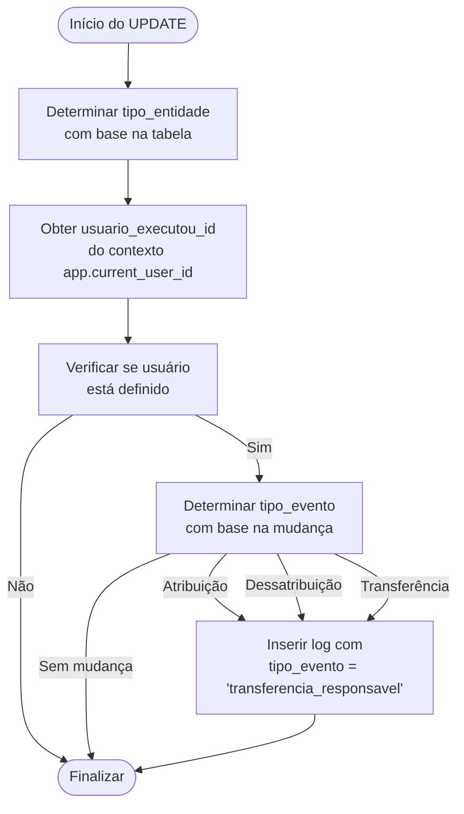
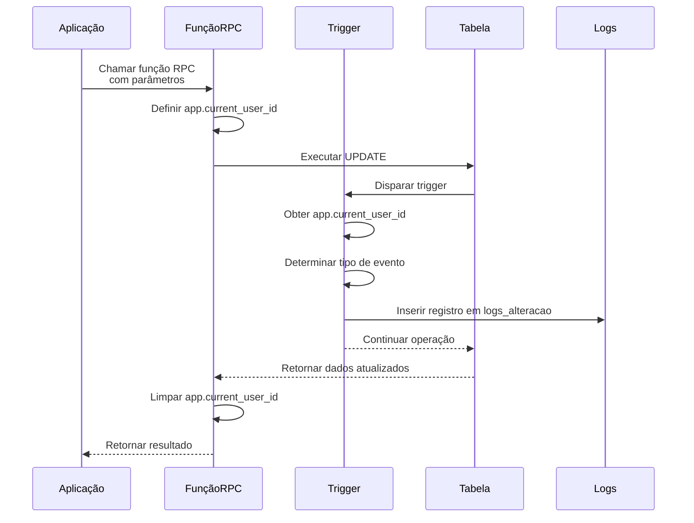
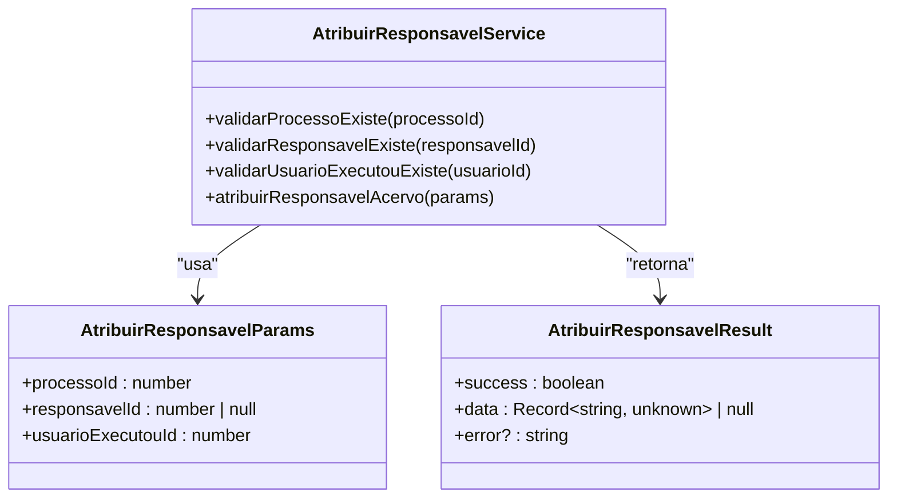

# Triggers e Auditoria

<cite>
**Arquivos Referenciados neste Documento**  
- [20251117015304_create_logs_alteracao.sql](file://supabase/migrations/20251117015304_create_logs_alteracao.sql)
- [20251117015306_create_triggers_log_atribuicao.sql](file://supabase/migrations/20251117015306_create_triggers_log_atribuicao.sql)
- [20251117020000_create_rpc_functions_atribuir_responsavel.sql](file://supabase/migrations/20251117020000_create_rpc_functions_atribuir_responsavel.sql)
- [atribuir-responsavel.service.ts](file://backend/acervo/services/atribuir-responsavel.service.ts)
- [atribuir-responsavel.service.ts](file://backend/audiencias/services/atribuir-responsavel.service.ts)
- [atribuir-responsavel.service.ts](file://backend/pendentes/services/atribuir-responsavel.service.ts)
</cite>

## Sumário
1. [Introdução](#introdução)
2. [Estrutura da Tabela logs_alteracao](#estrutura-da-tabela-logs_alteracao)
3. [Funcionamento do Trigger de Auditoria](#funcionamento-do-trigger-de-auditoria)
4. [Funções RPC para Operações Seguras](#funções-rpc-para-operações-seguras)
5. [Fluxo de Disparo dos Triggers](#fluxo-de-disparo-dos-triggers)
6. [Consulta de Dados de Auditoria](#consulta-de-dados-de-auditoria)
7. [Serviços de Negócio Relacionados](#serviços-de-negócio-relacionados)

## Introdução
O sistema sinesys implementa um mecanismo robusto de auditoria para rastrear alterações críticas em entidades importantes, especialmente a atribuição de responsáveis. Este documento detalha a arquitetura de auditoria baseada em triggers do PostgreSQL, a estrutura da tabela de logs e a integração com os serviços de negócio. O sistema garante que todas as alterações no campo `responsavel_id` sejam registradas com contexto completo, incluindo quem executou a ação, quando ocorreu e quais foram as mudanças.

## Estrutura da Tabela logs_alteracao

A tabela `logs_alteracao` é o componente central do sistema de auditoria, projetada para registrar de forma genérica todas as alterações em entidades do sistema. Sua estrutura foi definida na migration `20251117015304_create_logs_alteracao.sql` e inclui campos essenciais para rastreamento completo de eventos.

### Estrutura de Dados
A tabela possui os seguintes campos principais:

| Campo | Tipo | Descrição |
|-------|------|-----------|
| **id** | bigint | Identificador único do registro de log |
| **tipo_entidade** | text | Tipo da entidade alterada (acervo, audiencias, pendentes_manifestacao, etc) |
| **entidade_id** | bigint | ID do registro da entidade que foi alterada |
| **tipo_evento** | text | Tipo do evento de alteração (atribuicao_responsavel, transferencia_responsavel, desatribuicao_responsavel) |
| **usuario_que_executou_id** | bigint | Usuário que executou a ação |
| **responsavel_anterior_id** | bigint | Responsável anterior (usado apenas para eventos de atribuição/transferência) |
| **responsavel_novo_id** | bigint | Novo responsável (usado apenas para eventos de atribuição/transferência) |
| **dados_evento** | jsonb | Dados adicionais específicos do evento em formato JSONB |
| **created_at** | timestamptz | Data e hora em que o log foi criado |

### Características de Projeto
A tabela foi projetada com flexibilidade e desempenho em mente:

- **Flexibilidade**: O campo `dados_evento` em formato JSONB permite armazenar informações adicionais específicas de cada tipo de entidade sem necessidade de alterar a estrutura da tabela.
- **Controle de Acesso**: A tabela tem RLS (Row Level Security) habilitado para garantir que apenas usuários autorizados possam acessar os logs.
- **Índices Otimizados**: Vários índices foram criados para otimizar consultas comuns:
  - Índice B-Tree para busca por tipo de entidade e ID
  - Índice B-Tree para busca por tipo de evento
  - Índice B-Tree para busca por usuário que executou a ação
  - Índice GIN para busca eficiente dentro do campo JSONB `dados_evento`



**Fontes do Diagrama**
- [20251117015304_create_logs_alteracao.sql](file://supabase/migrations/20251117015304_create_logs_alteracao.sql#L6-L54)

**Fontes da Seção**
- [20251117015304_create_logs_alteracao.sql](file://supabase/migrations/20251117015304_create_logs_alteracao.sql#L1-L54)

## Funcionamento do Trigger de Auditoria

O mecanismo de auditoria é implementado através de um trigger PostgreSQL definido no arquivo `20251117015306_create_triggers_log_atribuicao.sql`. Este trigger é responsável por registrar automaticamente as alterações no campo `responsavel_id` nas tabelas relevantes.

### Função do Trigger
A função `log_atribuicao_responsavel()` é executada após qualquer atualização no campo `responsavel_id` das tabelas `acervo`, `audiencias` e `pendentes_manifestacao`. O funcionamento pode ser dividido em várias etapas:

1. **Determinação da Entidade**: O trigger identifica automaticamente qual tabela está sendo alterada através da variável `tg_table_name`.
2. **Obtenção do Usuário Executante**: O trigger obtém o ID do usuário que está executando a ação através da configuração de contexto `app.current_user_id`.
3. **Detecção do Tipo de Evento**: Com base na comparação entre os valores antigo (`old`) e novo (`new`) do campo `responsavel_id`, o trigger determina o tipo de evento:
   - `atribuicao_responsavel`: Quando um responsável é atribuído a um registro que anteriormente não tinha responsável
   - `desatribuicao_responsavel`: Quando um responsável é removido de um registro
   - `transferencia_responsavel`: Quando o responsável é alterado de um usuário para outro
4. **Registro do Log**: Se houver uma mudança significativa, um novo registro é inserido na tabela `logs_alteracao` com todas as informações relevantes.

### Condições de Disparo
O trigger é configurado para disparar apenas quando há uma mudança real no campo `responsavel_id`, conforme definido pela cláusula `WHEN`:

```sql
when (old.responsavel_id is distinct from new.responsavel_id)
```

Esta condição garante que o trigger não seja executado quando não há alteração no valor do campo, otimizando o desempenho.



**Fontes do Diagrama**
- [20251117015306_create_triggers_log_atribuicao.sql](file://supabase/migrations/20251117015306_create_triggers_log_atribuicao.sql#L6-L102)

**Fontes da Seção**
- [20251117015306_create_triggers_log_atribuicao.sql](file://supabase/migrations/20251117015306_create_triggers_log_atribuicao.sql#L1-L102)

## Funções RPC para Operações Seguras

Para garantir que o mecanismo de auditoria funcione corretamente, o sistema utiliza funções RPC (Remote Procedure Call) definidas no arquivo `20251117020000_create_rpc_functions_atribuir_responsavel.sql`. Essas funções são essenciais para estabelecer o contexto de usuário necessário para os triggers de auditoria.

### Propósito das Funções RPC
As funções RPC servem como intermediárias seguras entre a aplicação e o banco de dados, com dois objetivos principais:

1. **Estabelecimento de Contexto**: Antes de executar qualquer operação de UPDATE, as funções RPC definem o contexto de usuário usando `set_config('app.current_user_id', ...)`, que é posteriormente lido pelo trigger de auditoria.
2. **Segurança**: As funções são executadas com `security definer`, o que significa que rodam com os privilégios do seu proprietário, não do chamador, adicionando uma camada de segurança.

### Funções Implementadas
Três funções RPC foram implementadas para cobrir as principais entidades do sistema:

- **atribuir_responsavel_acervo**: Para atribuir responsável a processos do acervo
- **atribuir_responsavel_audiencia**: Para atribuir responsável a audiências
- **atribuir_responsavel_pendente**: Para atribuir responsável a processos pendentes de manifestação

Cada função segue o mesmo padrão de execução:
1. Define o contexto do usuário executante
2. Executa a operação de UPDATE na tabela apropriada
3. Retorna os dados atualizados do registro
4. Limpa o contexto de usuário



**Fontes do Diagrama**
- [20251117020000_create_rpc_functions_atribuir_responsavel.sql](file://supabase/migrations/20251117020000_create_rpc_functions_atribuir_responsavel.sql#L5-L100)

**Fontes da Seção**
- [20251117020000_create_rpc_functions_atribuir_responsavel.sql](file://supabase/migrations/20251117020000_create_rpc_functions_atribuir_responsavel.sql#L1-L100)

## Fluxo de Disparo dos Triggers

O fluxo completo de disparo dos triggers é coordenado entre a aplicação, as funções RPC e os triggers do banco de dados. Este fluxo garante que todas as alterações sejam registradas de forma consistente e segura.

### Sequência de Operações
Quando um usuário realiza uma operação de atribuição de responsável, o seguinte fluxo ocorre:

1. **Chamada da API**: A aplicação chama um serviço de negócio que, por sua vez, invoca a função RPC apropriada.
2. **Estabelecimento de Contexto**: A função RPC define o contexto `app.current_user_id` com o ID do usuário que está executando a ação.
3. **Operação de UPDATE**: A função RPC executa a operação de UPDATE na tabela apropriada.
4. **Disparo do Trigger**: O UPDATE dispara automaticamente o trigger correspondente.
5. **Registro de Auditoria**: O trigger lê o contexto `app.current_user_id` e cria um registro na tabela `logs_alteracao`.
6. **Limpeza de Contexto**: Após a conclusão, a função RPC limpa o contexto `app.current_user_id`.

### Exemplo de Disparo
Um exemplo prático de disparo ocorre quando um responsável é atribuído a um processo do acervo:

```sql
-- A aplicação chama a função RPC
select atribuir_responsavel_acervo(123, 456, 789);

-- Internamente, a função RPC executa:
-- perform set_config('app.current_user_id', '789', false);
-- update public.acervo set responsavel_id = 456 where id = 123;
-- perform set_config('app.current_user_id', '', true);
```

Este fluxo garante que o trigger tenha acesso ao ID do usuário que executou a ação, permitindo um rastreamento preciso de todas as alterações.

**Fontes da Seção**
- [20251117015306_create_triggers_log_atribuicao.sql](file://supabase/migrations/20251117015306_create_triggers_log_atribuicao.sql#L75-L102)
- [20251117020000_create_rpc_functions_atribuir_responsavel.sql](file://supabase/migrations/20251117020000_create_rpc_functions_atribuir_responsavel.sql#L5-L100)

## Consulta de Dados de Auditoria

Os dados de auditoria armazenados na tabela `logs_alteracao` podem ser consultados de várias maneiras para fins de análise, troubleshooting ou relatórios.

### Consultas Comuns
Algumas consultas frequentes incluem:

- **Logs de uma entidade específica**:
```sql
select * from logs_alteracao 
where tipo_entidade = 'acervo' and entidade_id = 123 
order by created_at desc;
```

- **Logs por usuário executante**:
```sql
select * from logs_alteracao 
where usuario_que_executou_id = 456 
order by created_at desc;
```

- **Logs por tipo de evento**:
```sql
select * from logs_alteracao 
where tipo_evento = 'atribuicao_responsavel' 
order by created_at desc;
```

- **Logs com dados específicos**:
```sql
select * from logs_alteracao 
where dados_evento->>'trt' = '1' 
order by created_at desc;
```

### Estratégias de Indexação
As consultas são otimizadas pelos índices criados na tabela:

- `idx_logs_alteracao_tipo_entidade_id`: Para consultas por tipo de entidade e ID
- `idx_logs_alteracao_tipo_evento`: Para consultas por tipo de evento
- `idx_logs_alteracao_usuario_executou`: Para consultas por usuário executante
- `idx_logs_alteracao_created_at`: Para consultas ordenadas por data
- `idx_logs_alteracao_dados_evento`: Para consultas no campo JSONB

**Fontes da Seção**
- [20251117015304_create_logs_alteracao.sql](file://supabase/migrations/20251117015304_create_logs_alteracao.sql#L41-L53)

## Serviços de Negócio Relacionados

Os mecanismos de auditoria são integrados aos serviços de negócio do sistema através de serviços TypeScript localizados nos diretórios `backend/acervo/services`, `backend/audiencias/services` e `backend/pendentes/services`.

### Arquitetura dos Serviços
Cada serviço segue um padrão consistente de implementação:

1. **Validação de Entrada**: Verifica se o processo/audiência/pendente existe
2. **Validação de Responsável**: Verifica se o responsável existe e está ativo
3. **Validação de Usuário Executante**: Verifica se o usuário que está executando a ação existe e está ativo
4. **Chamada da Função RPC**: Invoca a função RPC apropriada com os parâmetros necessários

### Serviços Implementados
Três serviços principais foram implementados para cobrir as diferentes entidades:

- **atribuir-responsavel.service.ts** (acervo): Gerencia a atribuição de responsáveis a processos do acervo
- **atribuir-responsavel.service.ts** (audiencias): Gerencia a atribuição de responsáveis a audiências
- **atribuir-responsavel.service.ts** (pendentes): Gerencia a atribuição de responsáveis a processos pendentes de manifestação

Todos os serviços compartilham a mesma estrutura básica e utilizam a mesma função auxiliar `rpcAtribuirResponsavel` para chamar as funções RPC do Supabase.



**Fontes do Diagrama**
- [atribuir-responsavel.service.ts](file://backend/acervo/services/atribuir-responsavel.service.ts#L1-L154)

**Fontes da Seção**
- [atribuir-responsavel.service.ts](file://backend/acervo/services/atribuir-responsavel.service.ts#L1-L154)
- [atribuir-responsavel.service.ts](file://backend/audiencias/services/atribuir-responsavel.service.ts#L1-L154)
- [atribuir-responsavel.service.ts](file://backend/pendentes/services/atribuir-responsavel.service.ts#L1-L154)