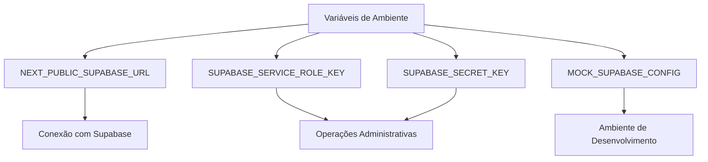
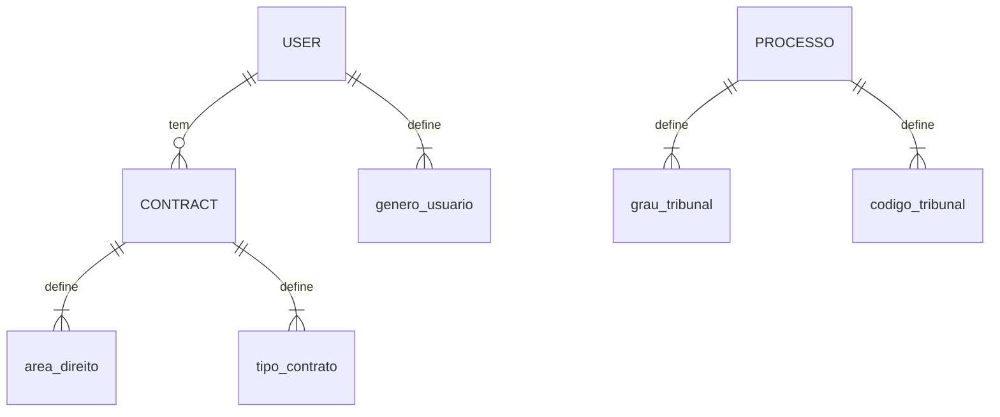
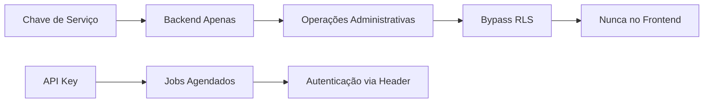

# Configuração de Ambiente

<cite>
**Arquivos Referenciados neste Documento**  
- [next.config.ts](file://next.config.ts)
- [backend/utils/supabase/service-client.ts](file://backend/utils/supabase/service-client.ts)
- [supabase/schemas/00_permissions.sql](file://supabase/schemas/00_permissions.sql)
- [supabase/schemas/01_enums.sql](file://supabase/schemas/01_enums.sql)
- [swagger.config.ts](file://swagger.config.ts)
- [openspec/project.md](file://openspec/project.md)
</cite>

## Sumário
1. [Introdução](#introdução)
2. [Variáveis de Ambiente](#variáveis-de-ambiente)
3. [Configuração do Supabase](#configuração-do-supabase)
4. [Configuração de Desenvolvimento Local](#configuração-de-desenvolvimento-local)
5. [Exemplos de Valores de Configuração](#exemplos-de-valores-de-configuração)
6. [Considerações de Segurança e Boas Práticas](#considerações-de-segurança-e-boas-práticas)

## Introdução

Este documento detalha a configuração de ambiente para o sistema Sinesys, uma plataforma de gestão jurídica voltada para escritórios de advocacia. O sistema utiliza Supabase como banco de dados e autenticação, com arquitetura baseada em Next.js e integração com o PJE-TRT. A configuração envolve variáveis de ambiente, permissões de banco de dados, enums e esquemas de tabelas, além de práticas recomendadas para ambientes de desenvolvimento, teste e produção.

**Seção fontes**  
- [openspec/project.md](file://openspec/project.md#L1-L41)

## Variáveis de Ambiente

As variáveis de ambiente são essenciais para a conexão com o Supabase e para a autenticação de serviços. Com base na análise de `next.config.ts` e `backend/utils/supabase/service-client.ts`, as seguintes variáveis são necessárias:

- **NEXT_PUBLIC_SUPABASE_URL**: URL pública do projeto Supabase. Usada tanto no frontend quanto no backend.
- **SUPABASE_SERVICE_ROLE_KEY** ou **SUPABASE_SECRET_KEY**: Chave secreta com privilégios de `service_role`, permitindo operações administrativas e bypass de RLS (Row Level Security).
- **MOCK_SUPABASE_CONFIG**: Utilizada em ambientes de desenvolvimento para simular a configuração do Supabase quando não disponível.

Essas variáveis são validadas no momento da inicialização do serviço. A ausência delas resulta em erro crítico, conforme verificado em logs de execução de scripts de captura.



**Fontes do diagrama**  
- [backend/utils/supabase/service-client.ts](file://backend/utils/supabase/service-client.ts#L10-L24)
- [dev_data/scripts/results/acervo-geral/resumo-geral.json](file://dev_data/scripts/results/acervo-geral/resumo-geral.json#L29-L57)

**Seção fontes**  
- [backend/utils/supabase/service-client.ts](file://backend/utils/supabase/service-client.ts#L10-L24)
- [dev_data/scripts/results/acervo-geral/resumo-geral.json](file://dev_data/scripts/results/acervo-geral/resumo-geral.json#L29-L57)

## Configuração do Supabase

### Permissões (00_permissions.sql)

O arquivo `00_permissions.sql` define as permissões iniciais para o `service_role`, garantindo acesso irrestrito ao esquema `public`. Isso é necessário para operações de backend que precisam contornar o RLS.

- Concede `USAGE` no esquema `public`
- Permite `SELECT`, `INSERT`, `UPDATE`, `DELETE` em todas as tabelas
- Define privilégios padrão para tabelas futuras
- Concede acesso a sequências (para colunas `identity`)
- Permite execução de funções

Essa configuração deve ser aplicada primeiro para garantir que os serviços backend tenham acesso completo ao banco.

**Seção fontes**  
- [supabase/schemas/00_permissions.sql](file://supabase/schemas/00_permissions.sql#L1-L21)

### Enums (01_enums.sql)

O arquivo `01_enums.sql` define tipos enumerados para padronização de dados no sistema. Os principais enums incluem:

- **grau_tribunal**: `primeiro_grau`, `segundo_grau`
- **codigo_tribunal**: `TRT1` a `TRT24`
- **genero_usuario**: `masculino`, `feminino`, `outro`, `prefiro_nao_informar`
- **tipo_pessoa**: `pf`, `pj`
- **estado_civil**: `solteiro`, `casado`, `divorciado`, `viuvo`, `uniao_estavel`, `outro`
- **area_direito**: `trabalhista`, `civil`, `previdenciario`, `criminal`, `empresarial`, `administrativo`
- **tipo_contrato**: `ajuizamento`, `defesa`, `ato_processual`, `assessoria`, `consultoria`, `extrajudicial`, `parecer`
- **tipo_cobranca**: `pro_exito`, `pro_labore`
- **status_contrato**: `em_contratacao`, `contratado`, `distribuido`, `desistencia`
- **polo_processual**: `autor`, `re`

Esses enums garantem consistência nos dados e facilitam consultas e validações.



**Fontes do diagrama**  
- [supabase/schemas/01_enums.sql](file://supabase/schemas/01_enums.sql#L1-L112)

**Seção fontes**  
- [supabase/schemas/01_enums.sql](file://supabase/schemas/01_enums.sql#L1-L112)

## Configuração de Desenvolvimento Local

Para configurar um ambiente de desenvolvimento local:

1. **Instale as dependências**:
   ```bash
   npm install
   ```

2. **Configure o Supabase localmente**:
   - Inicie o Supabase via Docker ou use uma instância remota
   - Aplique os schemas e migrações com `supabase db push`

3. **Inicialize o banco de dados**:
   - Execute os scripts em `supabase/schemas/` em ordem numérica
   - Certifique-se de que `00_permissions.sql` seja executado primeiro

4. **Execute a aplicação**:
   ```bash
   npm run dev
   ```

5. **Popule dados de teste (opcional)**:
   - Use scripts em `dev_data/scripts/` para inserir dados simulados

**Seção fontes**  
- [openspec/project.md](file://openspec/project.md#L81-L111)
- [dev_data/scripts/populate-database.ts](file://dev_data/scripts/populate-database.ts)

## Exemplos de Valores de Configuração

### Desenvolvimento
```env
NEXT_PUBLIC_SUPABASE_URL=http://localhost:54321
SUPABASE_SERVICE_ROLE_KEY=seu-service-role-key-local
MOCK_SUPABASE_CONFIG=true
```

### Teste
```env
NEXT_PUBLIC_SUPABASE_URL=https://teste.supabase.com
SUPABASE_SERVICE_ROLE_KEY=chave-teste-service-role
```

### Produção
```env
NEXT_PUBLIC_SUPABASE_URL=https://api.sinesys.com.br
SUPABASE_SERVICE_ROLE_KEY=chave-producao-secreta
```

**Seção fontes**  
- [swagger.config.ts](file://swagger.config.ts#L1-L48)
- [openspec/project.md](file://openspec/project.md#L1-L41)

## Considerações de Segurança e Boas Práticas

- **Nunca exponha `SUPABASE_SERVICE_ROLE_KEY` no frontend**: Esta chave permite bypass de RLS e deve ser usada apenas em backend.
- **Use variáveis de ambiente protegidas**: Em produção, utilize segredos gerenciados (ex: AWS Secrets Manager, Supabase Vault).
- **Rotacione chaves periodicamente**: Para minimizar riscos de exposição.
- **Valide entradas de API**: Sempre valide e sanitize dados recebidos.
- **Monitore acessos ao banco**: Use logs e auditoria para detectar acessos indevidos.
- **Habilite RLS em todas as tabelas**: Garanta que políticas de segurança estejam definidas.
- **Use API Keys para jobs automatizados**: O header `x-service-api-key` deve ser usado para autenticar processos agendados.



**Fontes do diagrama**  
- [backend/utils/supabase/service-client.ts](file://backend/utils/supabase/service-client.ts#L30-L36)
- [swagger.config.ts](file://swagger.config.ts#L1-L48)

**Seção fontes**  
- [backend/utils/supabase/service-client.ts](file://backend/utils/supabase/service-client.ts#L30-L36)
- [swagger.config.ts](file://swagger.config.ts#L1-L48)