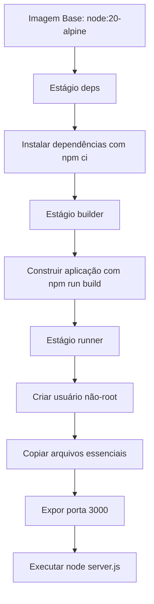
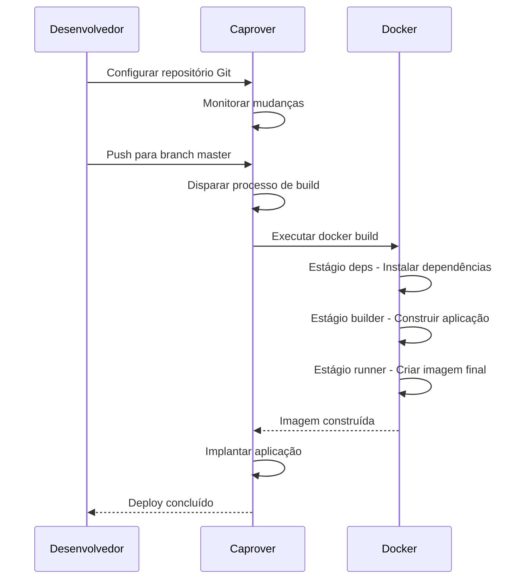

# Deploy e Configuração

<cite>
**Arquivos Referenciados neste Documento**  
- [Dockerfile](file://Dockerfile)
- [package.json](file://package.json)
- [README-deploy.md](file://README-deploy.md)
- [next.config.ts](file://next.config.ts)
- [captain-definition](file://captain-definition)
- [README.md](file://README.md)
</cite>

## Sumário
1. [Introdução](#introdução)
2. [Estrutura do Dockerfile](#estrutura-do-dockerfile)
3. [Scripts do package.json](#scripts-do-packagejson)
4. [Instruções de Deploy](#instruções-de-deploy)
5. [Variáveis de Ambiente](#variáveis-de-ambiente)
6. [Testes Locais de Produção](#testes-locais-de-produção)
7. [Solução de Problemas Comuns](#solução-de-problemas-comuns)
8. [Considerações de Segurança](#considerações-de-segurança)
9. [Considerações de Desempenho](#considerações-de-desempenho)
10. [Conclusão](#conclusão)

## Introdução

Este documento fornece uma análise arquitetural detalhada do processo de deploy e configuração do projeto website-pz, um site institucional para o escritório de advocacia Polastri e Zattar Advogados. O sistema foi projetado para ser implantado em plataformas como Caprover, utilizando containerização com Docker e uma stack tecnológica moderna baseada em Next.js 15, TypeScript e TailwindCSS.

A arquitetura de deploy é otimizada para ambientes de produção, com foco em segurança, desempenho e facilidade de manutenção. O processo utiliza um Dockerfile multiestágio com Node.js 20 Alpine para criar imagens leves e seguras, combinado com a configuração `output: 'standalone'` do Next.js para maximizar a eficiência de execução.

**Section sources**
- [README.md](file://README.md#L1-L50)
- [README-deploy.md](file://README-deploy.md#L1-L20)

## Estrutura do Dockerfile

O Dockerfile implementa uma estratégia de build multiestágio otimizada para aplicações Next.js em produção. Esta abordagem separa o processo de construção em diferentes fases, resultando em imagens menores e mais seguras.

O processo começa com a imagem oficial `node:20-alpine`, que oferece um sistema operacional leve baseado em Alpine Linux com Node.js 20. A instalação do pacote `libc6-compat` resolve compatibilidade de bibliotecas necessária para algumas dependências do Node.js.

A construção é dividida em quatro estágios principais:
1. **deps**: Instala as dependências do projeto usando `npm ci` para garantir reprodutibilidade
2. **builder**: Constrói a aplicação executando `npm run build`
3. **runner**: Imagem de produção otimizada que contém apenas os arquivos necessários
4. **Configuração de segurança**: Cria um usuário não-root para execução da aplicação

A configuração `output: 'standalone'` no next.config.ts permite que apenas os arquivos essenciais sejam copiados para a imagem final, reduzindo significativamente seu tamanho. A aplicação é executada como usuário não-root (nextjs) por questões de segurança, seguindo as melhores práticas de containerização.



**Diagram sources**
- [Dockerfile](file://Dockerfile#L1-L55)
- [next.config.ts](file://next.config.ts#L1-L17)

**Section sources**
- [Dockerfile](file://Dockerfile#L1-L55)
- [next.config.ts](file://next.config.ts#L1-L17)

## Scripts do package.json

O arquivo package.json define os scripts essenciais para o desenvolvimento, construção e execução da aplicação, alinhados com as convenções do Next.js.

```json
"scripts": {
  "dev": "next dev --turbopack",
  "build": "next build",
  "start": "next start",
  "lint": "next lint"
}
```

O script `dev` utiliza o Turbopack, um sistema de empacotamento incremental que acelera significativamente o tempo de inicialização e recarga durante o desenvolvimento. O `build` executa o processo de construção de produção do Next.js, gerando os artefatos estáticos e dinâmicos necessários. O script `start` inicia o servidor de produção, enquanto `lint` executa a verificação de qualidade de código com ESLint.

Esses scripts são chamados durante o processo de build do Docker, garantindo consistência entre os ambientes de desenvolvimento e produção. A utilização do `npm ci` no Dockerfile (em vez do `npm install`) assegura que as dependências sejam instaladas exatamente como especificado no package-lock.json, promovendo reprodutibilidade.

**Section sources**
- [package.json](file://package.json#L1-L45)
- [Dockerfile](file://Dockerfile#L1-L55)

## Instruções de Deploy

O processo de deploy é configurado para funcionar com o Caprover, uma plataforma de PaaS auto-hospedada baseada em Docker. A configuração principal é definida no arquivo `captain-definition`, que especifica os parâmetros essenciais para o deploy.

Existem duas abordagens principais para deploy:

### Deploy via Git (Recomendado)
1. Configure o repositório Git no painel do Caprover
2. Especifique o repositório (`seu-usuario/website-pz`) e a branch (normalmente `master`)
3. O Caprover automaticamente executa o build usando o Dockerfile

### Deploy via Upload
1. Crie um arquivo tar.gz excluindo diretórios desnecessários:
   ```bash
   tar -czf website-pz.tar.gz --exclude=node_modules --exclude=.git .
   ```
2. Faça upload do arquivo no painel do Caprover na seção "Upload tar file"

Ambos os métodos utilizam o Dockerfile para construir a imagem, garantindo consistência entre ambientes. O processo de build é automatizado, executando os scripts `build` do package.json e gerando a imagem otimizada para produção.



**Diagram sources**
- [README-deploy.md](file://README-deploy.md#L25-L86)
- [captain-definition](file://captain-definition#L1-L4)

**Section sources**
- [README-deploy.md](file://README-deploy.md#L25-L86)
- [captain-definition](file://captain-definition#L1-L4)

## Variáveis de Ambiente

Embora o projeto não exija variáveis de ambiente críticas para funcionamento básico, algumas podem ser configuradas para personalização em produção:

- **NODE_ENV**: Deve ser definida como `production` para otimizações apropriadas
- **NEXT_PUBLIC_APP_URL**: URL base da aplicação para geração de links absolutos
- **NEXT_PUBLIC_CHATWOOT_TOKEN**: Token de integração com o Chatwoot para o widget de chat
- **NEXT_PUBLIC_CHATWOOT_WEBSITE_TOKEN**: Token específico do website para o Chatwoot

Essas variáveis devem ser configuradas no painel do Caprover na seção "App Configs" > "Environment Variables". A aplicação está configurada para carregar automaticamente variáveis com prefixo `NEXT_PUBLIC_` no ambiente do cliente, permitindo acesso seguro a tokens de integração.

A configuração de imagens remotas no next.config.ts já inclui os domínios permitidos (como images.unsplash.com), eliminando a necessidade de variáveis adicionais para este propósito. Para adicionar novos domínios de imagens, a configuração deve ser atualizada diretamente no código.

**Section sources**
- [README-deploy.md](file://README-deploy.md#L65-L70)
- [next.config.ts](file://next.config.ts#L1-L17)
- [README.md](file://README.md#L380-L385)

## Testes Locais de Produção

Para testar o build de produção localmente antes do deploy, siga este procedimento:

1. Construa a imagem Docker:
   ```bash
   docker build -t website-pz .
   ```

2. Execute um container para testar:
   ```bash
   docker run -p 3000:3000 website-pz
   ```

3. Acesse a aplicação em `http://localhost:3000`

Este processo simula exatamente o ambiente de produção, permitindo verificar:
- Correção do build
- Funcionamento dos scripts de inicialização
- Configuração de portas e networking
- Performance de carregamento inicial
- Comportamento de assets estáticos

A estrutura multiestágio do Dockerfile garante que o ambiente de teste local seja idêntico ao de produção, minimizando o risco de problemas "funciona na minha máquina". O uso do `npm ci` no build assegura que as mesmas versões exatas de dependências sejam instaladas em todos os ambientes.

**Section sources**
- [Dockerfile](file://Dockerfile#L1-L55)
- [README-deploy.md](file://README-deploy.md#L80-L86)

## Solução de Problemas Comuns

### Build Falha
1. Verifique os logs no painel do Caprover
2. Confirme que o package-lock.json está atualizado e commitado
3. Valide que todas as dependências estão corretamente listadas no package.json
4. Certifique-se de que não há erros de sintaxe no código

### Aplicação Não Inicia
1. Verifique se a porta 3000 está corretamente exposta no Dockerfile
2. Confirme que o arquivo server.js existe e é acessível
3. Valide que o diretório .next foi corretamente copiado para a imagem
4. Verifique as permissões do diretório .next (deve ser acessível pelo usuário nextjs)

### Problemas de Imagem
1. As imagens do Unsplash são permitidas por padrão via configuração no next.config.ts
2. Para imagens de outros domínios, adicione os padrões remotos na configuração:
   ```typescript
   images: {
     remotePatterns: [
       {
         protocol: 'https',
         hostname: 'outro-dominio.com',
         pathname: '/**',
       },
     ],
   }
   ```

### Performance de Build Lenta
1. Verifique o uso de cache no Caprover
2. Considere aumentar os recursos alocados (mínimo recomendado: 512MB RAM)
3. Valide que o .dockerignore está excluindo adequadamente node_modules e .git

**Section sources**
- [README-deploy.md](file://README-deploy.md#L75-L86)
- [next.config.ts](file://next.config.ts#L1-L17)
- [Dockerfile](file://Dockerfile#L1-L55)

## Considerações de Segurança

A arquitetura de deploy incorpora múltiplas camadas de segurança:

### Execução como Usuário Não-Root
O Dockerfile cria um usuário dedicado (nextjs) com UID 1001 e executa a aplicação com este usuário, seguindo a princípio do menor privilégio. Isso limita o impacto de potenciais vulnerabilidades, pois a aplicação não tem privilégios de root no container.

### Imagem Minimalista
O uso de Alpine Linux como base resulta em uma imagem menor com superfície de ataque reduzida. O sistema operacional base contém apenas os pacotes essenciais, minimizando a exposição a vulnerabilidades conhecidas.

### Isolamento de Build
A estratégia multiestágio separa o ambiente de build (que precisa de todas as dependências de desenvolvimento) do ambiente de execução (que contém apenas os arquivos necessários). Isso previne a inclusão acidental de ferramentas de desenvolvimento ou arquivos sensíveis na imagem de produção.

### Atualizações Automáticas
A utilização da tag `node:20-alpine` (em vez de uma versão fixa) permite que o sistema aproveite atualizações de segurança do Node.js e do Alpine Linux quando disponíveis, desde que compatíveis com a versão 20 do Node.js.

### HTTPS e Configuração de Domínio
O Caprover permite ativar HTTPS com certificados automaticamente gerados pelo Let's Encrypt. É recomendado configurar um domínio personalizado e ativar o HTTPS para proteger a comunicação entre cliente e servidor.

**Section sources**
- [Dockerfile](file://Dockerfile#L1-L55)
- [README-deploy.md](file://README-deploy.md#L70-L75)

## Considerações de Desempenho

A arquitetura foi projetada para otimizar o desempenho em produção:

### Otimização de Imagem
A configuração `output: 'standalone'` no Next.js gera apenas os arquivos essenciais para execução, resultando em imagens Docker menores e tempos de inicialização mais rápidos. O processo de build copia apenas os diretórios .next/static e .next/standalone, eliminando arquivos desnecessários.

### Cache de Prerender
O Dockerfile cria explicitamente o diretório .next e define as permissões apropriadas, permitindo que o Next.js utilize eficientemente seu sistema de cache de prerender para páginas estáticas e dinâmicas.

### Recursos Adequados
É recomendado alocar no mínimo 512MB de RAM para aplicações Next.js no Caprover. Isso garante que o servidor tenha memória suficiente para lidar com o carregamento inicial e requisições simultâneas sem problemas de desempenho.

### Estratégia de Build
O uso de `npm ci` em vez de `npm install` acelera o processo de instalação de dependências no build, pois instala exatamente as versões especificadas no package-lock.json sem resolver árvores de dependência.

### Otimizações do Next.js
O framework implementa automaticamente várias otimizações:
- Code splitting
- Imagem lazy loading
- Prefetching de links
- Server-side rendering (SSR) ou static site generation (SSG)
- Bundle optimization

**Section sources**
- [Dockerfile](file://Dockerfile#L1-L55)
- [next.config.ts](file://next.config.ts#L1-L17)
- [README-deploy.md](file://README-deploy.md#L70-L75)

## Conclusão

A arquitetura de deploy do projeto website-pz representa uma implementação robusta e moderna para aplicações Next.js em produção. A combinação de Docker multiestágio, Node.js 20 Alpine e a configuração standalone do Next.js resulta em uma solução eficiente, segura e escalável.

O processo de deploy no Caprover é automatizado e confiável, permitindo atualizações contínuas com mínimo esforço operacional. As práticas de segurança incorporadas, como execução como usuário não-root e imagens minimalistas, protegem a aplicação contra ameaças comuns.

Para futuras melhorias, recomenda-se considerar:
- Implementação de CI/CD com testes automatizados
- Monitoramento de desempenho em tempo real
- Estratégias de backup e recuperação de desastres
- Escalonamento automático baseado em carga

A documentação clara e os scripts bem definidos facilitam a manutenção e a colaboração entre equipes, garantindo a sustentabilidade do projeto a longo prazo.