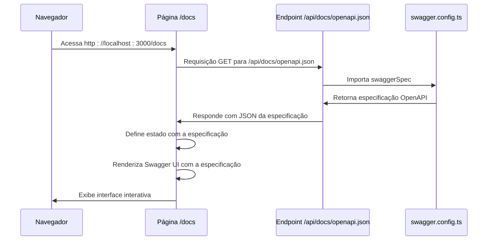
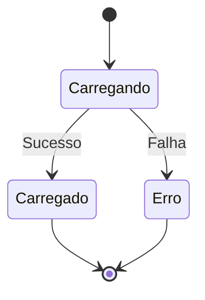

# Como Acessar /docs

<cite>
**Arquivos Referenciados neste Documento**  
- [page.tsx](file://app/docs/page.tsx)
- [route.ts](file://app/api/docs/openapi.json/route.ts)
- [swagger.config.ts](file://swagger.config.ts)
- [SWAGGER.md](file://docs/SWAGGER.md)
</cite>

## Sumário
1. [Introdução](#introdução)
2. [Fluxo de Carregamento da Documentação](#fluxo-de-carregamento-da-documentação)
3. [Página de Documentação Swagger UI](#página-de-documentação-swagger-ui)
4. [Endpoint da Especificação OpenAPI](#endpoint-da-especificação-openapi)
5. [Configuração da Especificação Swagger](#configuração-da-especificação-swagger)
6. [Estados de Loading e Erro](#estados-de-loading-e-erro)
7. [Renderização do Swagger UI](#renderização-do-swagger-ui)
8. [Acesso em Ambientes de Desenvolvimento e Produção](#acesso-em-ambientes-de-desenvolvimento-e-produção)
9. [Considerações sobre CORS e Autenticação](#considerações-sobre-cors-e-autenticação)
10. [Orientações para Uso e Troubleshooting](#orientações-para-uso-e-troubleshooting)

## Introdução

A documentação interativa da API do sistema Sinesys está disponível através da interface Swagger UI, acessível no caminho `/docs`. Esta documentação é gerada dinamicamente a partir da especificação OpenAPI 3.0, que é construída em tempo de execução com base nos comentários JSDoc presentes nas rotas da API. O acesso à documentação permite explorar endpoints, visualizar parâmetros, exemplos de requisição e resposta, além de testar diretamente as chamadas à API.

## Fluxo de Carregamento da Documentação

O processo de carregamento da documentação interativa segue um fluxo bem definido entre o cliente (navegador) e o servidor (Next.js), envolvendo três componentes principais: a página `/docs`, o endpoint `/api/docs/openapi.json` e a configuração centralizada em `swagger.config.ts`.

**Diagram sources**  
- [page.tsx](file://app/docs/page.tsx#L1-L69)
- [route.ts](file://app/api/docs/openapi.json/route.ts#L1-L24)
- [swagger.config.ts](file://swagger.config.ts#L1-L212)

## Página de Documentação Swagger UI

A página localizada em `app/docs/page.tsx` é uma página cliente do Next.js que carrega dinamicamente a interface do Swagger UI. Ela utiliza o pacote `swagger-ui-react` para renderizar a documentação interativa.

A página implementa um fluxo de carregamento assíncrono que inclui estados de loading, erro e sucesso. O componente é responsável por buscar a especificação OpenAPI do endpoint `/api/docs/openapi.json` e passá-la para o componente `SwaggerUI`.

**Section sources**  
- [page.tsx](file://app/docs/page.tsx#L1-L69)

## Endpoint da Especificação OpenAPI

O endpoint `app/api/docs/openapi.json/route.ts` é uma rota do Next.js que retorna a especificação OpenAPI em formato JSON. Ele importa a constante `swaggerSpec` do arquivo `swagger.config.ts` e a envia como resposta JSON.

Este endpoint é crucial para o funcionamento da documentação, pois fornece os metadados estruturados necessários para a renderização do Swagger UI. A rota está documentada com JSDoc no formato Swagger, garantindo que ela própria apareça na documentação.

**Section sources**  
- [route.ts](file://app/api/docs/openapi.json/route.ts#L1-L24)

## Configuração da Especificação Swagger

O arquivo `swagger.config.ts` contém a configuração centralizada da especificação OpenAPI. Ele utiliza o pacote `swagger-jsdoc` para gerar a especificação a partir dos comentários JSDoc encontrados nos arquivos de rotas da API.

A configuração inclui:
- Informações gerais da API (título, versão, descrição)
- Servidores de desenvolvimento e produção
- Esquemas de segurança (Bearer Auth, Session Auth, Service API Key)
- Schemas reutilizáveis para erros, respostas de sucesso e parâmetros comuns
- Caminho de busca para os arquivos de rotas (`./app/api/**/*.ts`)

A especificação gerada é exportada como `swaggerSpec` e utilizada pelo endpoint da documentação.

**Section sources**  
- [swagger.config.ts](file://swagger.config.ts#L1-L212)

## Estados de Loading e Erro

A página de documentação implementa três estados principais para melhorar a experiência do usuário:

1. **Estado de Loading**: Exibido enquanto a especificação OpenAPI está sendo carregada. Mostra um spinner de carregamento e uma mensagem informativa.
2. **Estado de Erro**: Exibido quando ocorre uma falha ao carregar a especificação. Mostra uma mensagem de erro detalhada em vermelho.
3. **Estado de Sucesso**: Exibido quando a especificação é carregada com sucesso, renderizando a interface do Swagger UI.

Esses estados são gerenciados por estados React (`loading`, `error`, `spec`) e garantem que o usuário sempre receba feedback sobre o status do carregamento da documentação.

**Diagram sources**  
- [page.tsx](file://app/docs/page.tsx#L1-L69)

## Renderização do Swagger UI

Após o carregamento bem-sucedido da especificação OpenAPI, a página renderiza o componente `SwaggerUI` do pacote `swagger-ui-react`. O componente recebe a especificação como propriedade `spec` e se encarrega de renderizar a interface interativa completa.

A interface permite aos usuários:
- Explorar todos os endpoints disponíveis
- Visualizar detalhes de cada endpoint (método, parâmetros, respostas)
- Testar chamadas à API diretamente da interface
- Visualizar esquemas de requisição e resposta
- Autenticar-se na API para testar endpoints protegidos

**Section sources**  
- [page.tsx](file://app/docs/page.tsx#L62-L66)

## Acesso em Ambientes de Desenvolvimento e Produção

A documentação pode ser acessada em diferentes ambientes:

- **Desenvolvimento**: Acesse `http://localhost:3000/docs` após iniciar o servidor com `npm run dev`.
- **Produção**: A documentação está disponível em `https://api.sinesys.com.br/docs`.

A configuração da especificação OpenAPI inclui servidores para ambos os ambientes, garantindo que a documentação reflita corretamente os endpoints disponíveis em cada ambiente.

**Section sources**  
- [swagger.config.ts](file://swagger.config.ts#L15-L23)

## Considerações sobre CORS e Autenticação

### CORS

O sistema pode enfrentar problemas de CORS ao acessar a documentação, especialmente em ambientes de desenvolvimento. O Next.js geralmente lida com CORS automaticamente para rotas da API, mas em configurações específicas pode ser necessário configurar cabeçalhos CORS manualmente.

### Autenticação

A documentação suporta múltiplos métodos de autenticação, conforme definido na configuração:

- **Bearer Token**: Token JWT no cabeçalho `Authorization: Bearer <token>`
- **Session Auth**: Cookie de sessão do Supabase (`sb-access-token`)
- **Service API Key**: Chave de API no cabeçalho `x-service-api-key`

O Swagger UI permite que os usuários se autentiquem usando esses métodos antes de testar endpoints protegidos.

**Section sources**  
- [swagger.config.ts](file://swagger.config.ts#L25-L45)
- [SWAGGER.md](file://docs/SWAGGER.md#L117-L124)

## Orientações para Uso e Troubleshooting

### Como Acessar

1. Inicie o servidor de desenvolvimento com `npm run dev`
2. Abra o navegador e acesse `http://localhost:3000/docs`
3. Aguarde o carregamento da documentação

### Troubleshooting Comum

**Problema**: A documentação não aparece  
**Solução**: Verifique se o servidor está rodando e se há erros no console.

**Problema**: Erro ao carregar especificação OpenAPI  
**Solução**: Confirme que o arquivo `swagger.config.ts` está configurado corretamente e que os caminhos dos arquivos de rotas estão corretos.

**Problema**: Rotas não aparecem na documentação  
**Solução**: Verifique se os comentários JSDoc estão no formato correto e se os arquivos estão no diretório `app/api/**/*.ts`.

**Problema**: Erros de autenticação  
**Solução**: Certifique-se de que o token ou cookie de autenticação é válido e está sendo enviado corretamente.

**Section sources**  
- [SWAGGER.md](file://docs/SWAGGER.md#L132-L151)
- [page.tsx](file://app/docs/page.tsx#L1-L69)