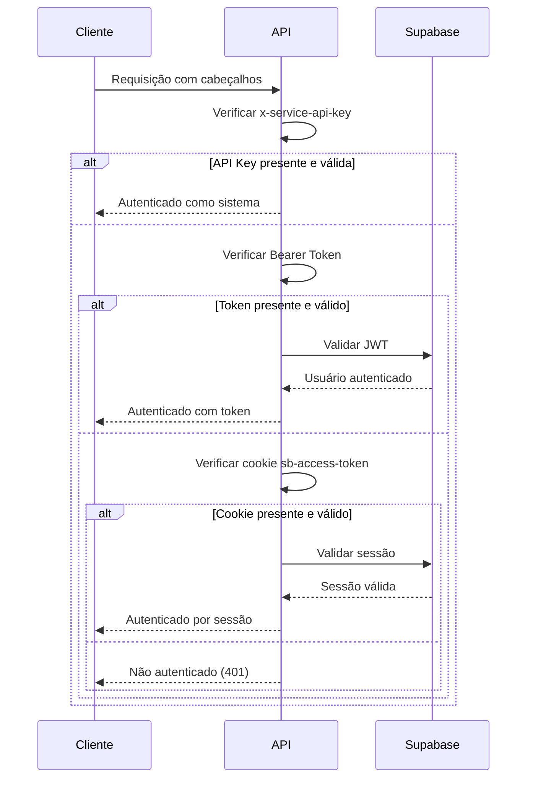

# Documentação da API

<cite>
**Arquivos Referenciados neste Documento**  
- [swagger.config.ts](file://swagger.config.ts)
- [app/api/docs/openapi.json/route.ts](file://app/api/docs/openapi.json/route.ts)
- [app/api/acervo/route.ts](file://app/api/acervo/route.ts)
- [app/api/clientes/route.ts](file://app/api/clientes/route.ts)
- [app/api/contratos/route.ts](file://app/api/contratos/route.ts)
- [app/api/partes-contrarias/route.ts](file://app/api/partes-contrarias/route.ts)
- [app/api/usuarios/route.ts](file://app/api/usuarios/route.ts)
- [app/api/pendentes-manifestacao/route.ts](file://app/api/pendentes-manifestacao/route.ts)
- [backend/utils/auth/api-auth.ts](file://backend/utils/auth/api-auth.ts)
- [backend/types/acervo/types.ts](file://backend/types/acervo/types.ts)
- [backend/types/pje-trt/types.ts](file://backend/types/pje-trt/types.ts)
</cite>

## Sumário
1. [Introdução](#introdução)
2. [Acesso à Documentação Interativa](#acesso-à-documentação-interativa)
3. [Estrutura de Resposta Padronizada](#estrutura-de-resposta-padronizada)
4. [Métodos de Autenticação](#métodos-de-autenticação)
5. [Endpoints da API](#endpoints-da-api)
   - [Acervo](#acervo)
   - [Clientes](#clientes)
   - [Contratos](#contratos)
   - [Partes Contrárias](#partes-contrárias)
   - [Usuários](#usuários)
   - [Pendentes de Manifestação](#pendentes-de-manifestação)
6. [Estratégias de Versionamento](#estratégias-de-versionamento)
7. [Limitação de Taxa (Rate Limiting)](#limitação-de-taxa-rate-limiting)
8. [Tratamento de Erros](#tratamento-de-erros)
9. [Diretrizes para Desenvolvedores](#diretrizes-para-desenvolvedores)
10. [Diretrizes para Mantenedores](#diretrizes-para-mantenedores)

## Introdução

A API do sistema Sinesys é uma interface programática que permite a integração com o sistema de captura de dados do PJE/TRT. Ela fornece acesso a funcionalidades essenciais como listagem de processos, gerenciamento de clientes, contratos, partes contrárias, usuários e pendentes de manifestação. A API foi projetada com foco em segurança, escalabilidade e facilidade de uso, utilizando padrões modernos como OpenAPI 3.0 e autenticação robusta.

O sistema permite a automação de tarefas jurídicas, especialmente no que diz respeito à captura de dados de processos trabalhistas nos Tribunais Regionais do Trabalho (TRTs) em diferentes graus de jurisdição. A documentação é gerada dinamicamente para garantir que sempre reflita o estado atual da API.

**Seção fontes**
- [swagger.config.ts](file://swagger.config.ts)
- [app/api/docs/openapi.json/route.ts](file://app/api/docs/openapi.json/route.ts)

## Acesso à Documentação Interativa

A documentação interativa da API está disponível em `/docs` via Swagger UI, fornecendo uma interface visual para explorar, testar e entender todos os endpoints disponíveis. Essa documentação é gerada dinamicamente a partir do arquivo `swagger.config.ts` e servida pelo endpoint `app/api/docs/openapi.json/route.ts`.

Para acessar a documentação interativa:
1. Acesse `http://localhost:3000/docs` em ambiente de desenvolvimento
2. Acesse `https://api.sinesys.com.br/docs` em ambiente de produção

A documentação inclui:
- Descrições detalhadas de cada endpoint
- Parâmetros de requisição (query, path, body)
- Esquemas de requisição e resposta
- Códigos de status HTTP
- Exemplos de uso
- Requisitos de autenticação

A geração automática da documentação garante que ela esteja sempre sincronizada com a implementação da API, reduzindo discrepâncias entre documentação e funcionalidade real.

```mermaid
graph TD
A[swagger.config.ts] --> B[Definição OpenAPI]
B --> C[app/api/docs/openapi.json/route.ts]
C --> D[Endpoint /api/docs/openapi.json]
D --> E[Swagger UI]
E --> F[/docs Interface Interativa]
```

**Fontes do diagrama**
- [swagger.config.ts](file://swagger.config.ts)
- [app/api/docs/openapi.json/route.ts](file://app/api/docs/openapi.json/route.ts)

**Seção fontes**
- [swagger.config.ts](file://swagger.config.ts)
- [app/api/docs/openapi.json/route.ts](file://app/api/docs/openapi.json/route.ts)

## Estrutura de Resposta Padronizada

Todos os endpoints da API Sinesys seguem uma estrutura de resposta padronizada para garantir consistência e facilitar o consumo. A resposta sempre inclui os campos `success`, `data`, `message` e `error` quando aplicável.

### Estrutura Básica

```json
{
  "success": true,
  "data": {},
  "message": "Operação realizada com sucesso"
}
```

### Campos da Resposta

| Campo | Tipo | Descrição |
|-------|------|-----------|
| **success** | boolean | Indica se a operação foi bem-sucedida (true) ou falhou (false) |
| **data** | object | Dados retornados pela operação. Pode ser um objeto, array ou null |
| **message** | string | Mensagem descritiva sobre o resultado da operação |
| **error** | string | Mensagem de erro quando success é false |

### Exemplo de Resposta de Sucesso

```json
{
  "success": true,
  "data": {
    "id": 123,
    "nome": "João Silva",
    "email": "joao@exemplo.com"
  },
  "message": "Cliente encontrado com sucesso"
}
```

### Exemplo de Resposta de Erro

```json
{
  "success": false,
  "error": "Cliente não encontrado",
  "message": "Não foi possível localizar o cliente com ID 123"
}
```

Esta estrutura padronizada permite que os consumidores da API implementem lógica de tratamento de respostas de forma consistente, independentemente do endpoint chamado.

**Seção fontes**
- [swagger.config.ts](file://swagger.config.ts)
- [app/api/acervo/route.ts](file://app/api/acervo/route.ts)

## Métodos de Autenticação

A API Sinesys suporta múltiplos métodos de autenticação para atender diferentes cenários de uso, desde acesso de usuários finais até integrações automatizadas.

### Bearer Token (Supabase Auth)

O método Bearer Token utiliza JWT (JSON Web Token) fornecido pelo Supabase Auth para autenticação. Este método é ideal para aplicações front-end e clientes API externos.

**Como usar:**
```bash
curl -X GET https://api.sinesys.com.br/api/acervo \
  -H "Authorization: Bearer <seu-token-jwt>"
```

O token JWT deve ser incluído no cabeçalho `Authorization` com o prefixo `Bearer`. O token contém informações de autenticação do usuário e é validado pelo servidor Supabase.

### Session Cookie

A autenticação via cookie de sessão é utilizada principalmente pelo front-end da aplicação, onde a sessão é gerenciada automaticamente pelo Supabase.

**Cabeçalho necessário:**
```
Cookie: sb-access-token=<token-de-sessão>
```

Este método é transparente para o usuário final, pois a sessão é mantida automaticamente após o login no sistema.

### API Key

A autenticação por API Key é utilizada por jobs do sistema, scripts automatizados e processos agendados que precisam acessar a API sem intervenção humana.

**Como usar:**
```bash
curl -X GET https://api.sinesys.com.br/api/captura/trt/acervo-geral \
  -H "x-service-api-key: <sua-api-key>"
```

A API Key deve ser incluída no cabeçalho `x-service-api-key`. Este método tem prioridade sobre os demais e é usado exclusivamente por processos do sistema.

### Ordem de Prioridade

A API verifica os métodos de autenticação na seguinte ordem de prioridade:
1. API Key (para jobs do sistema)
2. Bearer Token (para front-end/API externa)
3. Session Cookie (para front-end)

Isso permite que diferentes tipos de clientes utilizem o método de autenticação mais apropriado para seu cenário.



**Fontes do diagrama**
- [backend/utils/auth/api-auth.ts](file://backend/utils/auth/api-auth.ts)

**Seção fontes**
- [backend/utils/auth/api-auth.ts](file://backend/utils/auth/api-auth.ts)
- [swagger.config.ts](file://swagger.config.ts)

## Endpoints da API

Esta seção documenta os principais grupos de endpoints da API Sinesys, detalhando métodos HTTP, padrões de URL, esquemas de requisição e resposta, e códigos de status.

### Acervo

Os endpoints do acervo permitem listar e gerenciar processos jurídicos capturados do PJE/TRT.

#### Listar Processos do Acervo

**Método:** `GET`  
**URL:** `/api/acervo`  
**Autenticação:** Bearer Token, Session Cookie ou API Key

**Parâmetros de Query:**

| Parâmetro | Tipo | Descrição | Obrigatório |
|-----------|------|-----------|-------------|
| **pagina** | integer | Número da página (começa em 1) | Não |
| **limite** | integer | Quantidade de itens por página (máx. 100) | Não |
| **origem** | string | Filtrar por origem: acervo_geral ou arquivado | Não |
| **trt** | string | Filtrar por código do TRT (ex: TRT3) | Não |
| **grau** | string | Filtrar por grau: primeiro_grau ou segundo_grau | Não |
| **responsavel_id** | string | Filtrar por ID do responsável ou 'null' | Não |
| **busca** | string | Busca textual em múltiplos campos | Não |

**Exemplo de Requisição:**
```bash
curl -X GET "https://api.sinesys.com.br/api/acervo?pagina=1&limite=50&trt=TRT3&grau=primeiro_grau" \
  -H "Authorization: Bearer <token>"
```

**Resposta de Sucesso (200):**
```json
{
  "success": true,
  "data": {
    "processos": [
      {
        "id": 1,
        "numero_processo": "0010014-94.2025.5.03.0022",
        "nome_parte_autora": "João Silva",
        "nome_parte_re": "Empresa XYZ",
        "data_autuacao": "2025-01-10T13:03:15.862Z"
      }
    ],
    "paginacao": {
      "pagina": 1,
      "limite": 50,
      "total": 100,
      "totalPaginas": 2
    }
  }
}
```

**Códigos de Status:**
- `200`: Sucesso
- `400`: Parâmetros inválidos
- `401`: Não autenticado
- `500`: Erro interno do servidor

**Seção fontes**
- [app/api/acervo/route.ts](file://app/api/acervo/route.ts)
- [backend/types/acervo/types.ts](file://backend/types/acervo/types.ts)

### Clientes

Os endpoints de clientes permitem gerenciar informações de clientes do sistema.

#### Listar Clientes

**Método:** `GET`  
**URL:** `/api/clientes`  
**Autenticação:** Bearer Token, Session Cookie ou API Key

**Parâmetros de Query:**

| Parâmetro | Tipo | Descrição | Obrigatório |
|-----------|------|-----------|-------------|
| **pagina** | integer | Número da página | Não |
| **limite** | integer | Quantidade de itens por página | Não |
| **busca** | string | Busca em nome, CPF, CNPJ ou e-mail | Não |
| **tipoPessoa** | string | Filtrar por tipo: pf (pessoa física) ou pj (pessoa jurídica) | Não |
| **ativo** | boolean | Filtrar por status ativo/inativo | Não |

**Exemplo de Requisição:**
```bash
curl -X GET "https://api.sinesys.com.br/api/clientes?busca=João&tipoPessoa=pf" \
  -H "Authorization: Bearer <token>"
```

#### Criar Cliente

**Método:** `POST`  
**URL:** `/api/clientes`  
**Autenticação:** Bearer Token, Session Cookie ou API Key

**Corpo da Requisição:**
```json
{
  "tipoPessoa": "pf",
  "nome": "João Silva",
  "cpf": "123.456.789-00",
  "email": "joao@exemplo.com",
  "telefonePrimario": "(11) 91234-5678"
}
```

**Resposta de Sucesso (201):**
```json
{
  "success": true,
  "data": {
    "id": 123,
    "tipoPessoa": "pf",
    "nome": "João Silva",
    "cpf": "123.456.789-00",
    "email": "joao@exemplo.com"
  }
}
```

**Códigos de Status:**
- `201`: Cliente criado com sucesso
- `400`: Dados inválidos ou duplicados
- `401`: Não autenticado
- `500`: Erro interno do servidor

**Seção fontes**
- [app/api/clientes/route.ts](file://app/api/clientes/route.ts)
- [backend/clientes/services/persistence/cliente-persistence.service.ts](file://backend/clientes/services/persistence/cliente-persistence.service.ts)

### Contratos

Os endpoints de contratos permitem gerenciar contratos associados a clientes.

#### Listar Contratos

**Método:** `GET`  
**URL:** `/api/contratos`  
**Autenticação:** Bearer Token, Session Cookie ou API Key

**Parâmetros de Query:**

| Parâmetro | Tipo | Descrição | Obrigatório |
|-----------|------|-----------|-------------|
| **pagina** | integer | Número da página | Não |
| **limite** | integer | Quantidade de itens por página | Não |
| **cliente_id** | integer | Filtrar por ID do cliente | Não |
| **busca** | string | Busca textual em múltiplos campos | Não |

**Exemplo de Requisição:**
```bash
curl -X GET "https://api.sinesys.com.br/api/contratos?cliente_id=123" \
  -H "Authorization: Bearer <token>"
```

#### Gerenciar Processos de Contrato

**Método:** `GET` e `POST`  
**URL:** `/api/contratos/[id]/processos`  
**Autenticação:** Bearer Token, Session Cookie ou API Key

Permite listar e associar processos a um contrato específico.

**Seção fontes**
- [app/api/contratos/route.ts](file://app/api/contratos/route.ts)
- [backend/contratos/services/persistence/contrato-persistence.service.ts](file://backend/contratos/services/persistence/contrato-persistence.service.ts)

### Partes Contrárias

Os endpoints de partes contrárias permitem gerenciar informações sobre as partes contrárias em processos jurídicos.

#### Listar Partes Contrárias

**Método:** `GET`  
**URL:** `/api/partes-contrarias`  
**Autenticação:** Bearer Token, Session Cookie ou API Key

**Parâmetros de Query:**

| Parâmetro | Tipo | Descrição | Obrigatório |
|-----------|------|-----------|-------------|
| **pagina** | integer | Número da página | Não |
| **limite** | integer | Quantidade de itens por página | Não |
| **busca** | string | Busca textual em múltiplos campos | Não |

**Exemplo de Requisição:**
```bash
curl -X GET "https://api.sinesys.com.br/api/partes-contrarias?busca=Empresa" \
  -H "Authorization: Bearer <token>"
```

**Seção fontes**
- [app/api/partes-contrarias/route.ts](file://app/api/partes-contrarias/route.ts)
- [backend/partes-contrarias/services/persistence/parte-contraria-persistence.service.ts](file://backend/partes-contrarias/services/persistence/parte-contraria-persistence.service.ts)

### Usuários

Os endpoints de usuários permitem gerenciar informações de usuários do sistema.

#### Listar Usuários

**Método:** `GET`  
**URL:** `/api/usuarios`  
**Autenticação:** Bearer Token, Session Cookie ou API Key

**Parâmetros de Query:**

| Parâmetro | Tipo | Descrição | Obrigatório |
|-----------|------|-----------|-------------|
| **pagina** | integer | Número da página | Não |
| **limite** | integer | Quantidade de itens por página | Não |
| **busca** | string | Busca por nome, CPF ou e-mail | Não |

**Exemplo de Requisição:**
```bash
curl -X GET "https://api.sinesys.com.br/api/usuarios?busca=João" \
  -H "Authorization: Bearer <token>"
```

**Seção fontes**
- [app/api/usuarios/route.ts](file://app/api/usuarios/route.ts)
- [backend/usuarios/services/persistence/usuario-persistence.service.ts](file://backend/usuarios/services/persistence/usuario-persistence.service.ts)

### Pendentes de Manifestação

Os endpoints de pendentes de manifestação permitem gerenciar processos que exigem manifestação.

#### Listar Pendentes

**Método:** `GET`  
**URL:** `/api/pendentes-manifestacao`  
**Autenticação:** Bearer Token, Session Cookie ou API Key

**Parâmetros de Query:**

| Parâmetro | Tipo | Descrição | Obrigatório |
|-----------|------|-----------|-------------|
| **pagina** | integer | Número da página | Não |
| **limite** | integer | Quantidade de itens por página | Não |
| **trt** | string | Filtrar por código do TRT | Não |
| **grau** | string | Filtrar por grau do processo | Não |
| **filtroPrazo** | string | Filtrar por prazo: no_prazo ou sem_prazo | Não |

**Exemplo de Requisição:**
```bash
curl -X GET "https://api.sinesys.com.br/api/pendentes-manifestacao?trt=TRT3&filtroPrazo=sem_prazo" \
  -H "Authorization: Bearer <token>"
```

**Seção fontes**
- [app/api/pendentes-manifestacao/route.ts](file://app/api/pendentes-manifestacao/route.ts)
- [backend/pendentes/services/persistence/listar-pendentes.service.ts](file://backend/pendentes/services/persistence/listar-pendentes.service.ts)

## Estratégias de Versionamento

A API Sinesys utiliza uma estratégia de versionamento baseada em URLs para garantir compatibilidade com versões anteriores enquanto permite o desenvolvimento de novas funcionalidades.

### Abordagem de Versionamento

O versionamento é implementado através de prefixos de versão nas URLs dos endpoints:

```
/api/v1/acervo
/api/v1/clientes
/api/v2/contratos
```

Atualmente, a API está na versão 1.0.0, conforme definido no arquivo `swagger.config.ts`. Quando novas versões forem lançadas, os endpoints anteriores serão mantidos por um período de transição para permitir que os consumidores atualizem suas integrações.

### Política de Suporte

- **Versão Atual (v1)**: Suporte completo, incluindo correções de bugs e melhorias
- **Versão Anterior (v0)**: Suporte limitado, apenas para correções críticas de segurança
- **Versão Futura (v2)**: Em desenvolvimento, disponível em ambiente de testes

Os consumidores da API devem especificar explicitamente a versão que desejam utilizar para evitar quebrar mudanças inesperadas.

**Seção fontes**
- [swagger.config.ts](file://swagger.config.ts)

## Limitação de Taxa (Rate Limiting)

A API implementa limitação de taxa para proteger os recursos do servidor e garantir a disponibilidade para todos os usuários.

### Configurações de Limitação

- **Usuários autenticados**: 100 requisições por minuto
- **Usuários não autenticados**: 10 requisições por minuto
- **Jobs do sistema**: 500 requisições por minuto

### Cabeçalhos de Rate Limiting

As respostas da API incluem cabeçalhos que informam o status da limitação:

| Cabeçalho | Descrição |
|-----------|-----------|
| **X-RateLimit-Limit** | Número máximo de requisições permitidas |
| **X-RateLimit-Remaining** | Número de requisições restantes |
| **X-RateLimit-Reset** | Tempo em segundos até o reset da contagem |

### Comportamento em Caso de Excesso

Quando o limite é excedido, a API retorna:
- **Código de status**: `429 Too Many Requests`
- **Corpo da resposta**: Mensagem de erro indicando o excesso de requisições
- **Cabeçalho Retry-After**: Tempo em segundos para tentar novamente

Esta estratégia protege o sistema contra uso excessivo e ataques de negação de serviço.

**Seção fontes**
- [backend/utils/auth/api-auth.ts](file://backend/utils/auth/api-auth.ts)

## Tratamento de Erros

A API Sinesys implementa um tratamento de erros padronizado para fornecer feedback claro e útil aos consumidores.

### Códigos de Status HTTP

A API utiliza códigos de status HTTP de acordo com as convenções REST:

| Código | Status | Uso |
|--------|--------|-----|
| **200** | OK | Sucesso em operações GET |
| **201** | Created | Sucesso em operações POST |
| **400** | Bad Request | Dados inválidos ou mal formatados |
| **401** | Unauthorized | Falha na autenticação |
| **403** | Forbidden | Acesso negado |
| **404** | Not Found | Recurso não encontrado |
| **429** | Too Many Requests | Limite de taxa excedido |
| **500** | Internal Server Error | Erro interno do servidor |

### Estrutura de Erro

Todos os erros seguem a estrutura padronizada definida no `swagger.config.ts`:

```json
{
  "success": false,
  "error": "Mensagem descritiva do erro",
  "message": "Detalhes adicionais sobre o erro"
}
```

### Exemplos de Erros Comuns

**Cliente não encontrado (404):**
```json
{
  "success": false,
  "error": "Cliente não encontrado",
  "message": "Não foi possível localizar o cliente com ID 123"
}
```

**Dados inválidos (400):**
```json
{
  "success": false,
  "error": "CPF inválido",
  "message": "O CPF fornecido não é válido"
}
```

**Não autenticado (401):**
```json
{
  "success": false,
  "error": "Unauthorized",
  "message": "Token de autenticação ausente ou inválido"
}
```

**Seção fontes**
- [swagger.config.ts](file://swagger.config.ts)
- [app/api/acervo/route.ts](file://app/api/acervo/route.ts)

## Diretrizes para Desenvolvedores

Esta seção fornece orientações para novos desenvolvedores que desejam consumir a API Sinesys.

### Primeiros Passos

1. Acesse a documentação interativa em `/docs`
2. Obtenha um token de autenticação válido
3. Escolha o método de autenticação apropriado para seu caso de uso
4. Comece com endpoints de leitura (GET) antes de usar operações de escrita

### Boas Práticas

- Sempre trate erros de forma adequada
- Implemente retry com backoff exponencial para erros temporários
- Utilize paginação para listagens grandes
- Armazene tokens de forma segura
- Monitore o uso de rate limiting

### Exemplo de Integração

```javascript
// Exemplo de consumo da API com JavaScript
async function listarClientes() {
  try {
    const response = await fetch('/api/clientes?pagina=1&limite=50', {
      headers: {
        'Authorization': 'Bearer seu-token-aqui'
      }
    });
    
    const data = await response.json();
    
    if (data.success) {
      console.log('Clientes:', data.data);
    } else {
      console.error('Erro:', data.error);
    }
  } catch (error) {
    console.error('Erro de rede:', error);
  }
}
```

**Seção fontes**
- [app/api/clientes/route.ts](file://app/api/clientes/route.ts)

## Diretrizes para Mantenedores

Esta seção fornece orientações para mantenedores da API sobre como documentar novos endpoints.

### Documentação com JSDoc

Todos os novos endpoints devem ser documentados usando JSDoc com anotações Swagger. O arquivo `swagger.config.ts` configura o `swagger-jsdoc` para ler essas anotações e gerar a documentação OpenAPI.

### Estrutura de Documentação

```typescript
/**
 * @swagger
 * /api/novo-endpoint:
 *   get:
 *     summary: Resumo conciso da funcionalidade
 *     description: Descrição detalhada do endpoint
 *     tags:
 *       - Grupo do Endpoint
 *     security:
 *       - bearerAuth: []
 *     parameters:
 *       - in: query
 *         name: parametro
 *         schema:
 *           type: string
 *         description: Descrição do parâmetro
 *     responses:
 *       200:
 *         description: Descrição da resposta de sucesso
 *         content:
 *           application/json:
 *             schema:
 *               type: object
 *               properties:
 *                 success:
 *                   type: boolean
 *                 data:
 *                   type: object
 */
```

### Validação da Documentação

Após adicionar um novo endpoint:
1. Verifique se a documentação aparece corretamente em `/docs`
2. Teste todos os exemplos fornecidos
3. Valide o esquema OpenAPI gerado
4. Confirme que os códigos de status estão corretos

A documentação deve ser clara, completa e refletir exatamente o comportamento do endpoint.

**Seção fontes**
- [swagger.config.ts](file://swagger.config.ts)
- [app/api/docs/openapi.json/route.ts](file://app/api/docs/openapi.json/route.ts)