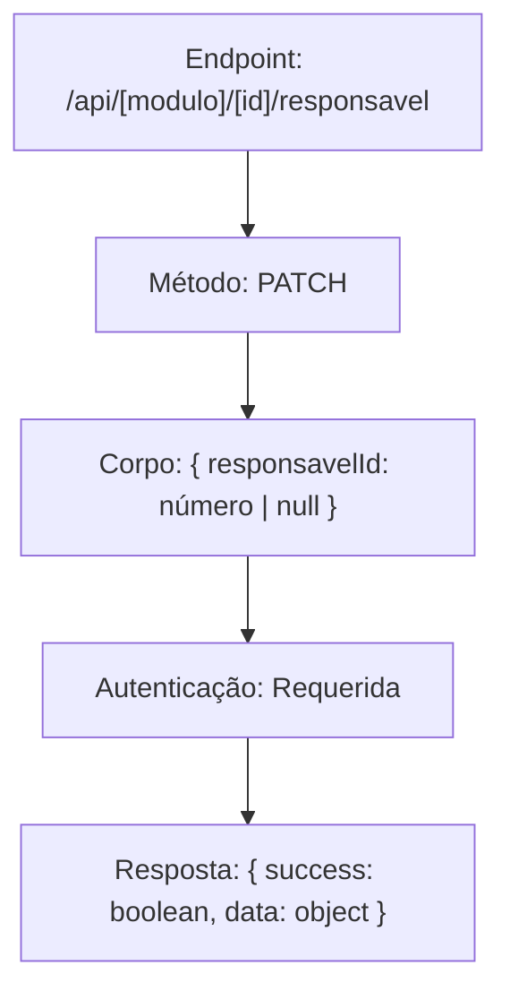
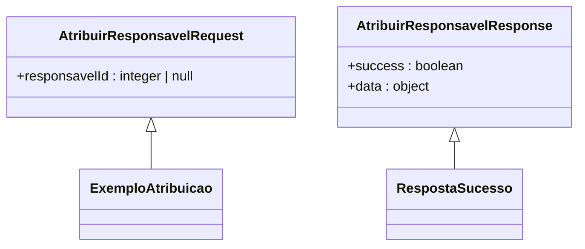
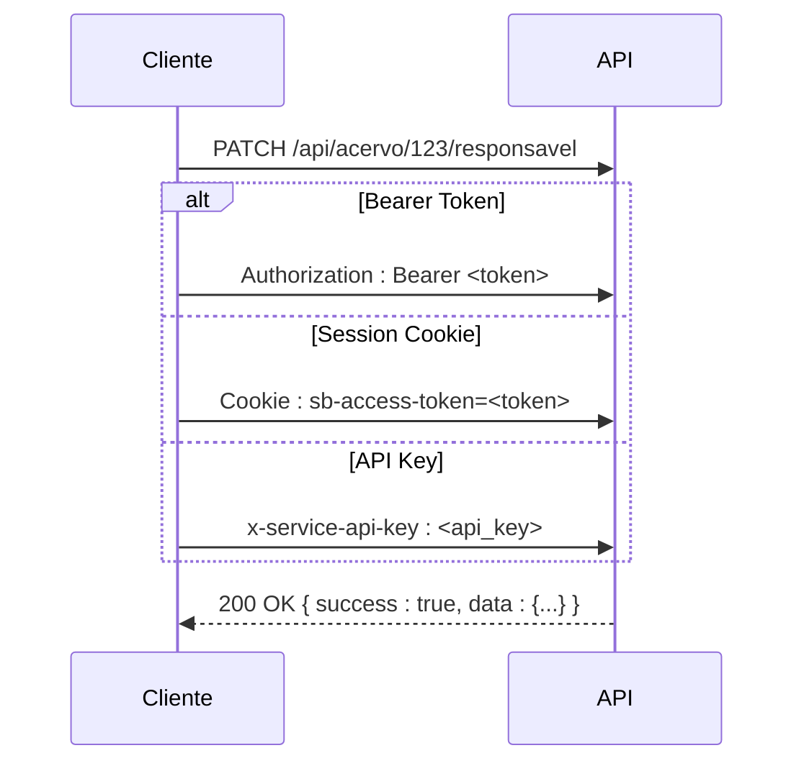
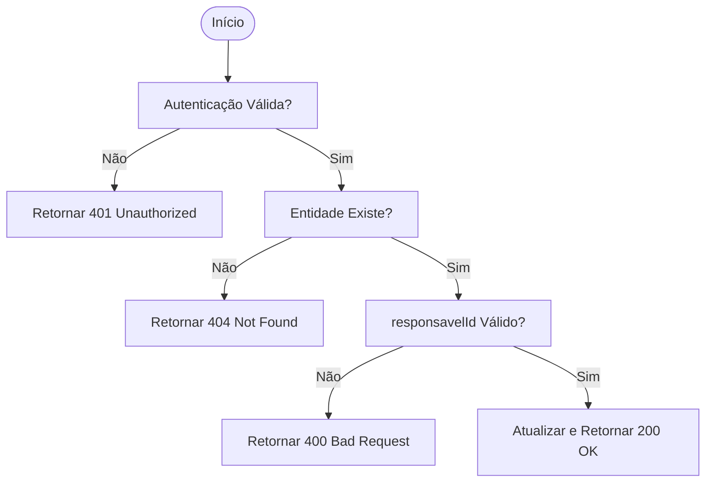

# Exemplos de Atribuição de Responsável

<cite>
**Arquivos Referenciados neste Documento**   
- [swagger.config.ts](file://swagger.config.ts)
- [app/api/acervo/[id]/responsavel/route.ts](file://app/api/acervo/[id]/responsavel/route.ts)
- [app/api/audiencias/[id]/responsavel/route.ts](file://app/api/audiencias/[id]/responsavel/route.ts)
- [app/api/pendentes-manifestacao/[id]/responsavel/route.ts](file://app/api/pendentes-manifestacao/[id]/responsavel/route.ts)
- [backend/acervo/services/atribuir-responsavel.service.ts](file://backend/acervo/services/atribuir-responsavel.service.ts)
- [backend/audiencias/services/atribuir-responsavel.service.ts](file://backend/audiencias/services/atribuir-responsavel.service.ts)
- [backend/pendentes/services/atribuir-responsavel.service.ts](file://backend/pendentes/services/atribuir-responsavel.service.ts)
- [supabase/migrations/20251117020000_create_rpc_functions_atribuir_responsavel.sql](file://supabase/migrations/20251117020000_create_rpc_functions_atribuir_responsavel.sql)
</cite>

## Sumário
1. [Introdução](#introdução)
2. [Padrão de URL e Método HTTP](#padrão-de-url-e-método-http)
3. [Formato da Requisição](#formato-da-requisição)
4. [Exemplos de Comandos cURL](#exemplos-de-comandos-curl)
   - [Atribuição em Acervo](#atribuição-em-acervo)
   - [Atribuição em Audiências](#atribuição-em-audiências)
   - [Atribuição em Pendentes de Manifestação](#atribuição-em-pendentes-de-manifestação)
   - [Desatribuição de Responsável](#desatribuição-de-responsável)
5. [Métodos de Autenticação](#métodos-de-autenticação)
6. [Formato da Resposta](#formato-da-resposta)
7. [Testes no Swagger UI e Postman](#testes-no-swagger-ui-e-postman)
8. [Tratamento de Erros Comuns](#tratamento-de-erros-comuns)
9. [Considerações Finais](#considerações-finais)

## Introdução
Este documento fornece exemplos práticos para a operação de atribuição de responsável em diferentes módulos do sistema Sinesys, como acervo, audiências e pendentes de manifestação. A API segue um padrão consistente utilizando o endpoint `/[id]/responsavel` com o método HTTP PATCH, permitindo atribuir, transferir ou desatribuir responsáveis por meio do campo `responsavelId` no corpo da requisição. O valor `null` é utilizado para desatribuir um responsável.

**Seção fontes**
- [app/api/acervo/[id]/responsavel/route.ts](file://app/api/acervo/[id]/responsavel/route.ts#L1-L158)
- [app/api/audiencias/[id]/responsavel/route.ts](file://app/api/audiencias/[id]/responsavel/route.ts#L1-L191)
- [app/api/pendentes-manifestacao/[id]/responsavel/route.ts](file://app/api/pendentes-manifestacao/[id]/responsavel/route.ts#L1-L191)

## Padrão de URL e Método HTTP
O padrão de URL para atribuição de responsável é consistente entre os módulos: `/api/[modulo]/[id]/responsavel`, onde `[modulo]` pode ser `acervo`, `audiencias` ou `pendentes-manifestacao`. O método HTTP utilizado é **PATCH**, indicando uma atualização parcial do recurso. O ID na URL refere-se ao identificador único da entidade específica.



**Fontes do diagrama**
- [app/api/acervo/[id]/responsavel/route.ts](file://app/api/acervo/[id]/responsavel/route.ts#L10-L12)
- [app/api/audiencias/[id]/responsavel/route.ts](file://app/api/audiencias/[id]/responsavel/route.ts#L10-L12)
- [app/api/pendentes-manifestacao/[id]/responsavel/route.ts](file://app/api/pendentes-manifestacao/[id]/responsavel/route.ts#L10-L12)

**Fontes da seção**
- [app/api/acervo/[id]/responsavel/route.ts](file://app/api/acervo/[id]/responsavel/route.ts#L10-L12)
- [app/api/audiencias/[id]/responsavel/route.ts](file://app/api/audiencias/[id]/responsavel/route.ts#L10-L12)
- [app/api/pendentes-manifestacao/[id]/responsavel/route.ts](file://app/api/pendentes-manifestacao/[id]/responsavel/route.ts#L10-L12)

## Formato da Requisição
A requisição deve ser feita com o método PATCH e incluir o campo `responsavelId` no corpo no formato JSON. O valor deve ser um número inteiro positivo para atribuir ou transferir um responsável, ou `null` para desatribuir. O campo `responsavelId` é opcional; se omitido, o responsável atual é mantido.



**Fontes do diagrama**
- [swagger.config.ts](file://swagger.config.ts#L158-L167)
- [app/api/acervo/[id]/responsavel/route.ts](file://app/api/acervo/[id]/responsavel/route.ts#L39-L41)

**Fontes da seção**
- [swagger.config.ts](file://swagger.config.ts#L158-L167)
- [app/api/acervo/[id]/responsavel/route.ts](file://app/api/acervo/[id]/responsavel/route.ts#L39-L41)

## Exemplos de Comandos cURL
Os exemplos abaixo demonstram o uso do comando cURL para interagir com a API. Substitua os valores de ID, token e URL conforme necessário.

### Atribuição em Acervo
Atribui o responsável com ID 15 ao processo do acervo com ID 123.

```bash
curl -X PATCH 'http://localhost:3000/api/acervo/123/responsavel' \
  -H 'Authorization: Bearer seu_token_jwt' \
  -H 'Content-Type: application/json' \
  -d '{"responsavelId": 15}'
```

**Fontes da seção**
- [app/api/acervo/[id]/responsavel/route.ts](file://app/api/acervo/[id]/responsavel/route.ts#L10-L12)
- [swagger.config.ts](file://swagger.config.ts#L158-L167)

### Atribuição em Audiências
Atribui o responsável com ID 15 à audiência com ID 456.

```bash
curl -X PATCH 'http://localhost:3000/api/audiencias/456/responsavel' \
  -H 'Authorization: Bearer seu_token_jwt' \
  -H 'Content-Type: application/json' \
  -d '{"responsavelId": 15}'
```

**Fontes da seção**
- [app/api/audiencias/[id]/responsavel/route.ts](file://app/api/audiencias/[id]/responsavel/route.ts#L10-L12)
- [swagger.config.ts](file://swagger.config.ts#L158-L167)

### Atribuição em Pendentes de Manifestação
Atribui o responsável com ID 15 ao processo pendente de manifestação com ID 789.

```bash
curl -X PATCH 'http://localhost:3000/api/pendentes-manifestacao/789/responsavel' \
  -H 'Authorization: Bearer seu_token_jwt' \
  -H 'Content-Type: application/json' \
  -d '{"responsavelId": 15}'
```

**Fontes da seção**
- [app/api/pendentes-manifestacao/[id]/responsavel/route.ts](file://app/api/pendentes-manifestacao/[id]/responsavel/route.ts#L10-L12)
- [swagger.config.ts](file://swagger.config.ts#L158-L167)

### Desatribuição de Responsável
Remove o responsável atual do processo do acervo com ID 123, definindo `responsavelId` como `null`.

```bash
curl -X PATCH 'http://localhost:3000/api/acervo/123/responsavel' \
  -H 'Authorization: Bearer seu_token_jwt' \
  -H 'Content-Type: application/json' \
  -d '{"responsavelId": null}'
```

**Fontes da seção**
- [app/api/acervo/[id]/responsavel/route.ts](file://app/api/acervo/[id]/responsavel/route.ts#L20-L21)
- [swagger.config.ts](file://swagger.config.ts#L163-L164)

## Métodos de Autenticação
A API suporta três métodos de autenticação, todos configurados no schema OpenAPI. O cabeçalho de autorização varia conforme o método escolhido.



**Fontes do diagrama**
- [swagger.config.ts](file://swagger.config.ts#L26-L44)
- [app/api/acervo/[id]/responsavel/route.ts](file://app/api/acervo/[id]/responsavel/route.ts#L24-L26)

**Fontes da seção**
- [swagger.config.ts](file://swagger.config.ts#L26-L44)
- [app/api/acervo/[id]/responsavel/route.ts](file://app/api/acervo/[id]/responsavel/route.ts#L24-L26)

## Formato da Resposta
A resposta da API segue um padrão consistente definido pelo schema `AtribuirResponsavelResponse` no `swagger.config.ts`. Em caso de sucesso, retorna um objeto com `success: true` e os dados atualizados da entidade. O campo `data` contém o ID da entidade e o novo valor de `responsavel_id`.

```json
{
  "success": true,
  "data": {
    "id": 123,
    "responsavel_id": 15
  }
}
```

**Fontes da seção**
- [swagger.config.ts](file://swagger.config.ts#L169-L188)
- [app/api/acervo/[id]/responsavel/route.ts](file://app/api/acervo/[id]/responsavel/route.ts#L48-L61)

## Testes no Swagger UI e Postman
Para testar os endpoints no Swagger UI, acesse `/api/docs/openapi.json` e localize os endpoints sob as tags "Acervo", "Audiências" ou "Pendentes de Manifestação". No Postman, configure a requisição com o método PATCH, URL apropriada, cabeçalhos de autenticação e corpo JSON. Certifique-se de que o Content-Type esteja definido como `application/json`.

**Fontes da seção**
- [app/api/docs/openapi.json/route.ts](file://app/api/docs/openapi.json/route.ts#L8-L14)
- [swagger.config.ts](file://swagger.config.ts#L5-L9)

## Tratamento de Erros Comuns
A API retorna códigos de status HTTP específicos para erros. O erro 404 indica que a entidade com o ID fornecido não foi encontrada. O erro 403 (ou 401) indica falta de permissão para realizar a operação, geralmente devido à autenticação inválida ou ausente. Valide o ID da entidade e as credenciais de autenticação ao encontrar esses erros.



**Fontes do diagrama**
- [app/api/acervo/[id]/responsavel/route.ts](file://app/api/acervo/[id]/responsavel/route.ts#L137-L141)
- [backend/acervo/services/atribuir-responsavel.service.ts](file://backend/acervo/services/atribuir-responsavel.service.ts#L98-L103)

**Fontes da seção**
- [app/api/acervo/[id]/responsavel/route.ts](file://app/api/acervo/[id]/responsavel/route.ts#L137-L141)
- [backend/acervo/services/atribuir-responsavel.service.ts](file://backend/acervo/services/atribuir-responsavel.service.ts#L98-L103)

## Considerações Finais
A operação de atribuição de responsável é padronizada em múltiplos módulos, facilitando a integração e o uso da API. Todos os endpoints seguem o mesmo padrão de URL, método HTTP e formato de requisição/resposta. A utilização de triggers no banco de dados garante que todas as alterações sejam registradas em logs de auditoria, independentemente do módulo.

**Fontes da seção**
- [supabase/migrations/20251117015306_create_triggers_log_atribuicao.sql](file://supabase/migrations/20251117015306_create_triggers_log_atribuicao.sql#L77-L101)
- [supabase/migrations/20251117020000_create_rpc_functions_atribuir_responsavel.sql](file://supabase/migrations/20251117020000_create_rpc_functions_atribuir_responsavel.sql#L1-L100)