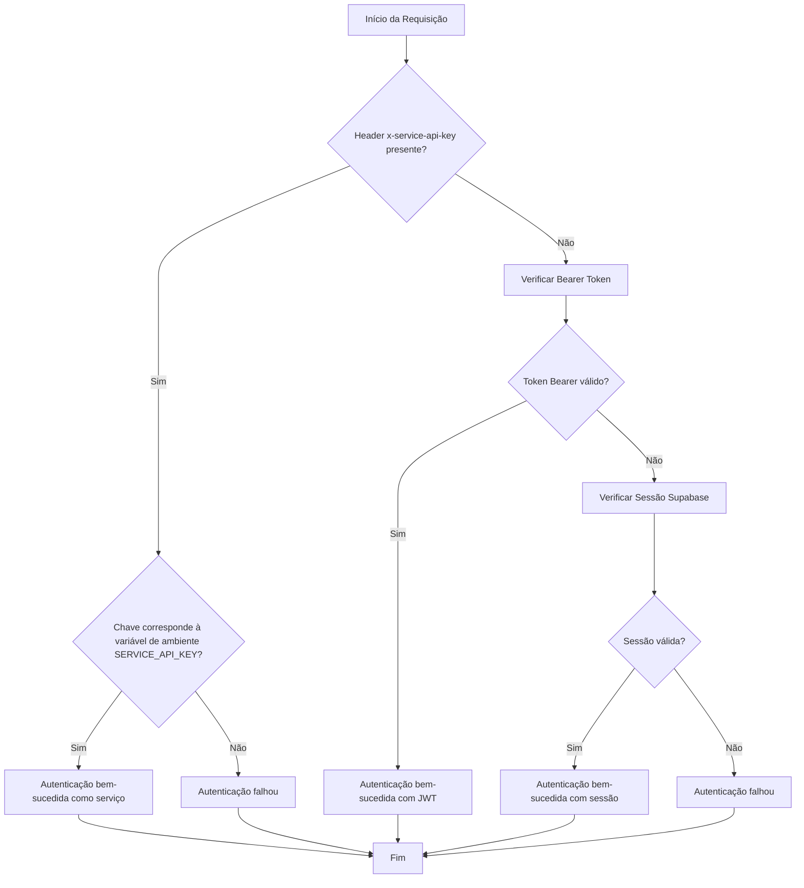
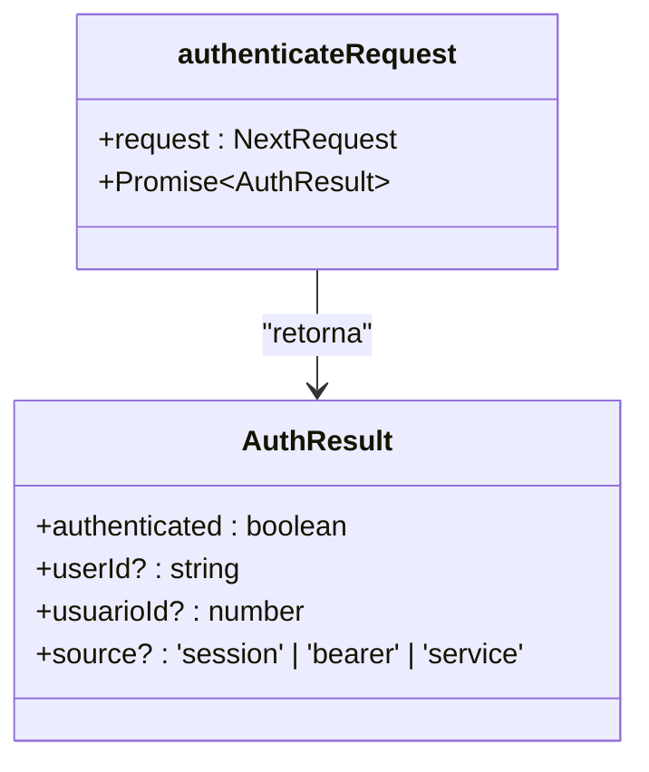

# Autenticação com API Key (x-service-api-key)

<cite>
**Arquivos Referenciados neste Documento**  
- [api-auth.ts](file://backend/utils/auth/api-auth.ts)
- [swagger.config.ts](file://swagger.config.ts)
</cite>

## Tabela de Conteúdo
1. [Introdução](#introdução)
2. [Fluxo de Autenticação com API Key](#fluxo-de-autenticação-com-api-key)
3. [Implementação do Middleware apiAuth](#implementação-do-middleware-apiAuth)
4. [Uso de API Key em Requisições](#uso-de-api-key-em-requisições)
5. [Boas Práticas de Segurança](#boas-práticas-de-segurança)
6. [Considerações Finais](#considerações-finais)

## Introdução

A autenticação com API Key utilizando o header personalizado `x-service-api-key` é um mecanismo essencial para autenticar serviços automatizados (machine-to-machine) no sistema Sinesys. Este método é especialmente projetado para processos agendados, jobs do sistema e integrações entre serviços que não envolvem interação direta com usuários. A API Key permite que o sistema valide a identidade de serviços automatizados de forma segura, garantindo que apenas entidades autorizadas possam acessar endpoints específicos da API.

O sistema implementa uma abordagem de autenticação múltipla, onde a verificação da API Key tem prioridade sobre outros métodos de autenticação, como tokens JWT (Bearer) e sessões do Supabase. Isso garante que os processos automatizados possam operar independentemente dos mecanismos de autenticação utilizados por usuários finais, proporcionando uma arquitetura mais robusta e segura.

## Fluxo de Autenticação com API Key

O fluxo de autenticação com API Key é implementado no utilitário `authenticateRequest`, que verifica a presença e validade da chave no header `x-service-api-key`. O processo segue uma sequência lógica de validação, onde a API Key é verificada primeiro, antes de qualquer outro método de autenticação.



**Fontes do Diagrama**  
- [api-auth.ts](file://backend/utils/auth/api-auth.ts#L53-L72)

Este fluxo demonstra como o sistema prioriza a autenticação por API Key, garantindo que serviços automatizados possam ser autenticados de forma eficiente e segura. A verificação é realizada em tempo constante para prevenir ataques de timing, e a comparação entre a chave fornecida e a esperada é feita diretamente com o operador de igualdade estrita.

## Implementação do Middleware apiAuth

O middleware de autenticação é implementado na função `authenticateRequest`, localizada no arquivo `api-auth.ts`. Esta função é responsável por verificar a autenticidade da requisição, retornando um objeto `AuthResult` que indica se a autenticação foi bem-sucedida e fornecendo informações sobre a identidade do cliente.



**Fontes do Diagrama**  
- [api-auth.ts](file://backend/utils/auth/api-auth.ts#L10-L15)
- [api-auth.ts](file://backend/utils/auth/api-auth.ts#L50-L133)

A implementação verifica três métodos de autenticação em ordem de prioridade:
1. **API Key de Serviço**: Verifica o header `x-service-api-key` e compara com a variável de ambiente `SERVICE_API_KEY`
2. **Token Bearer (JWT)**: Verifica o header `Authorization` com prefixo `Bearer`
3. **Sessão Supabase**: Verifica cookies de sessão do Supabase

Quando a API Key é utilizada, o sistema retorna um objeto de autenticação com `userId` definido como `'system'` e `source` como `'service'`, indicando claramente que a requisição foi feita por um serviço automatizado.

**Fontes da Seção**  
- [api-auth.ts](file://backend/utils/auth/api-auth.ts#L53-L72)

## Uso de API Key em Requisições

Para utilizar a API Key em requisições programáticas, é necessário incluir o header `x-service-api-key` com o valor correspondente à variável de ambiente `SERVICE_API_KEY` configurada no sistema. Abaixo estão exemplos de como fazer requisições usando diferentes métodos.

### Exemplo com cURL

```bash
curl -X GET https://api.sinesys.com.br/api/clientes \
  -H "x-service-api-key: seu_valor_de_api_key_aqui" \
  -H "Content-Type: application/json"
```

### Exemplo com JavaScript (Fetch API)

```javascript
fetch('https://api.sinesys.com.br/api/clientes', {
  method: 'GET',
  headers: {
    'x-service-api-key': process.env.SERVICE_API_KEY,
    'Content-Type': 'application/json'
  }
})
.then(response => response.json())
.then(data => console.log(data));
```

### Exemplo com Python (Requests)

```python
import requests

headers = {
    'x-service-api-key': 'seu_valor_de_api_key_aqui',
    'Content-Type': 'application/json'
}

response = requests.get('https://api.sinesys.com.br/api/clientes', headers=headers)
print(response.json())
```

A documentação OpenAPI (Swagger) do sistema define claramente o esquema de segurança para a API Key:

```mermaid
erDiagram
securitySchemes ||--o{ serviceApiKey : "define"
serviceApiKey {
type: apiKey
in: header
name: x-service-api-key
description: API Key para autenticação de jobs do sistema
}
```

**Fontes do Diagrama**  
- [swagger.config.ts](file://swagger.config.ts#L39-L44)

**Fontes da Seção**  
- [swagger.config.ts](file://swagger.config.ts#L39-L44)
- [api-auth.ts](file://backend/utils/auth/api-auth.ts#L54-L56)

## Boas Práticas de Segurança

A implementação da autenticação com API Key segue várias boas práticas de segurança para proteger o sistema contra acessos não autorizados.

### Armazenamento Seguro de Chaves

As API Keys devem ser armazenadas em secrets de ambiente, nunca em código fonte. No sistema Sinesys, a chave esperada é obtida da variável de ambiente `SERVICE_API_KEY`:

```typescript
const expectedServiceKey = process.env.SERVICE_API_KEY;
```

### Rotação Periódica de Chaves

Recomenda-se a rotação periódica das API Keys para minimizar o impacto de vazamentos. O sistema deve permitir a configuração de múltiplas chaves durante o período de transição, permitindo a atualização gradual dos serviços que utilizam a API.

### Limitação de Taxa (Rate Limiting)

Embora não implementado diretamente no middleware de autenticação, é essencial combinar a autenticação com API Key com mecanismos de limitação de taxa para prevenir ataques de força bruta e abuso do sistema. Cada serviço autenticado por API Key deve ter limites específicos de requisições por período.

### Logging de Acesso

O sistema deve registrar todos os acessos realizados com API Key, incluindo timestamp, endpoint acessado e resultado da autenticação. Isso permite auditoria e detecção de atividades suspeitas.

### Revogação de Chaves Comprometidas

Em caso de suspeita de comprometimento, a chave deve ser revogada imediatamente alterando o valor da variável de ambiente `SERVICE_API_KEY`. Todos os serviços que utilizam a chave antiga serão automaticamente bloqueados, enquanto os serviços atualizados com a nova chave continuarão funcionando normalmente.

**Fontes da Seção**  
- [api-auth.ts](file://backend/utils/auth/api-auth.ts#L55-L56)
- [swagger.config.ts](file://swagger.config.ts#L43-L44)

## Considerações Finais

A autenticação com API Key utilizando o header `x-service-api-key` é um componente crítico da arquitetura de segurança do sistema Sinesys. Ao permitir a autenticação de serviços automatizados de forma segura e eficiente, este mecanismo possibilita a execução de tarefas em segundo plano, integrações entre sistemas e processos agendados sem comprometer a segurança do sistema.

A implementação segue boas práticas consolidadas, como o armazenamento de chaves em variáveis de ambiente, a verificação em tempo constante e a priorização clara entre diferentes métodos de autenticação. A combinação com outras medidas de segurança, como limitação de taxa e logging de acesso, cria uma camada robusta de proteção contra acessos não autorizados.

Para manter a segurança do sistema, é essencial seguir as práticas recomendadas de rotação periódica de chaves, monitoramento de acessos e revogação imediata de chaves comprometidas. Com essas medidas, o sistema pode continuar operando de forma segura mesmo em ambientes com ameaças constantes.