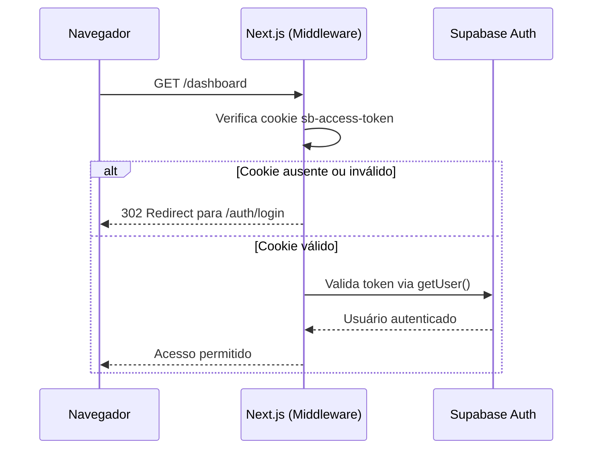
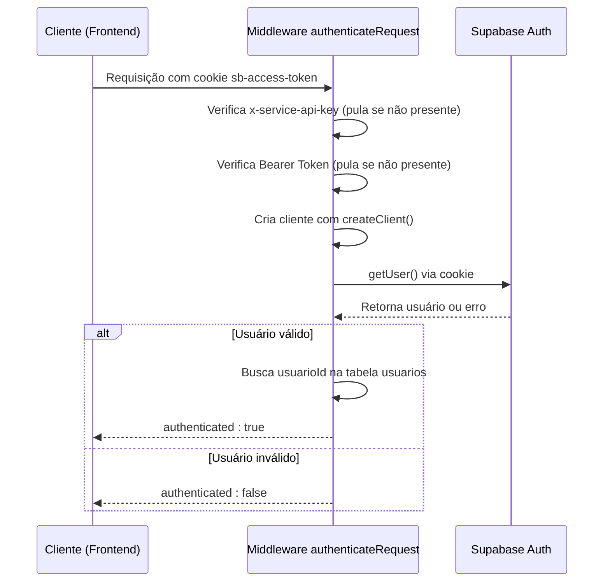

# Autenticação com Session Cookie (sb-access-token)

<cite>
**Arquivos Referenciados neste Documento**  
- [lib/middleware.ts](file://lib/middleware.ts)
- [backend/utils/supabase/server.ts](file://backend/utils/supabase/server.ts)
- [backend/utils/auth/api-auth.ts](file://backend/utils/auth/api-auth.ts)
- [lib/server.ts](file://lib/server.ts)
- [lib/client.ts](file://lib/client.ts)
- [components/login-form.tsx](file://components/login-form.tsx)
- [components/logout-button.tsx](file://components/logout-button.tsx)
- [proxy.ts](file://proxy.ts)
</cite>

## Sumário
1. [Introdução](#introdução)
2. [Fluxo de Autenticação com Session Cookie](#fluxo-de-autenticação-com-session-cookie)
3. [Geração e Gerenciamento de Sessões pelo Supabase](#geração-e-gerenciamento-de-sessões-pelo-supabase)
4. [Funcionamento do Cookie HTTPOnly (sb-access-token)](#funcionamento-do-cookie-httponly-sb-access-token)
5. [Segurança contra XSS e Proteção do Cookie](#segurança-contra-xss-e-proteção-do-cookie)
6. [Uso em Navegadores e Aplicações Web Tradicionais](#uso-em-navegadores-e-aplicações-web-tradicionais)
7. [Extração e Validação do Token pela Middleware 'apiAuth'](#extração-e-validação-do-token-pela-middleware-apiAuth)
8. [Fluxo Completo de Autenticação](#fluxo-completo-de-autenticação)
9. [Considerações de Segurança: SameSite, Secure Flag e CSRF](#considerações-de-segurança-samesite-secure-flag-e-csrf)
10. [Conclusão](#conclusão)

## Introdução

A autenticação baseada em cookies de sessão é um mecanismo amplamente utilizado em aplicações web tradicionais para manter o estado de login do usuário entre requisições. Neste sistema, o Supabase é responsável por gerenciar a sessão do usuário, emitindo um cookie chamado `sb-access-token` que contém um token JWT (JSON Web Token) assinado. Esse cookie é armazenado no navegador com atributos de segurança rigorosos, como `HttpOnly` e `Secure`, garantindo que não possa ser acessado por scripts do lado do cliente, mitigando assim ataques de XSS (Cross-Site Scripting).

Este documento detalha como o sistema implementa a autenticação com session cookie, desde o login até o logout, destacando o papel do Supabase, a configuração da middleware, e as práticas de segurança adotadas.

**Seção fontes**
- [lib/middleware.ts](file://lib/middleware.ts#L1-L67)
- [backend/utils/supabase/server.ts](file://backend/utils/supabase/server.ts#L1-L30)

## Fluxo de Autenticação com Session Cookie

O fluxo de autenticação com session cookie envolve várias etapas coordenadas entre o cliente (navegador), o servidor Next.js e o serviço de autenticação do Supabase. Quando um usuário realiza login com sucesso, o Supabase gera uma sessão e envia um cookie `sb-access-token` no cabeçalho `Set-Cookie` da resposta HTTP. Este cookie é automaticamente armazenado pelo navegador e incluído em todas as requisições subsequentes para o mesmo domínio, permitindo que o servidor valide a identidade do usuário sem necessidade de reautenticação.

A middleware do Next.js intercepta todas as requisições para verificar a presença e validade desse cookie, garantindo que apenas usuários autenticados possam acessar rotas protegidas.



**Fontes do diagrama**
- [lib/middleware.ts](file://lib/middleware.ts#L41-L49)
- [backend/utils/supabase/server.ts](file://backend/utils/supabase/server.ts#L3-L28)

## Geração e Gerenciamento de Sessões pelo Supabase

O Supabase gera uma sessão quando um usuário realiza login com sucesso, seja por senha, provedores OAuth ou outros métodos suportados. A sessão é representada por um JWT que contém informações sobre o usuário, como `user_id`, `email`, `role` e tempo de expiração. Esse JWT é então armazenado no cookie `sb-access-token`.

O gerenciamento da sessão é feito automaticamente pelo Supabase, incluindo renovação de sessão (refresh) e invalidação após logout ou expiração. O cliente do Supabase no frontend (usando `createClient` em `lib/client.ts`) lida com a persistência da sessão no navegador, enquanto o servidor utiliza `createServerClient` para validar o cookie em cada requisição.

**Seção fontes**
- [lib/client.ts](file://lib/client.ts#L2-L23)
- [backend/utils/supabase/server.ts](file://backend/utils/supabase/server.ts#L3-L28)

## Funcionamento do Cookie HTTPOnly (sb-access-token)

O cookie `sb-access-token` é configurado com o atributo `HttpOnly`, o que significa que ele não pode ser acessado por JavaScript no navegador. Isso impede que scripts maliciosos roubem o token em caso de vulnerabilidade XSS. Além disso, o cookie é marcado como `Secure`, garantindo que só seja enviado sobre conexões HTTPS, e utiliza o atributo `SameSite=Lax` (ou `Strict`) para proteger contra ataques CSRF (Cross-Site Request Forgery).

Esses atributos são configurados automaticamente pelo cliente do Supabase ao criar a sessão, e são essenciais para a segurança da aplicação.

**Seção fontes**
- [lib/middleware.ts](file://lib/middleware.ts#L19-L26)
- [backend/utils/supabase/server.ts](file://backend/utils/supabase/server.ts#L15-L24)

## Segurança contra XSS e Proteção do Cookie

A principal defesa contra XSS é o uso do atributo `HttpOnly` no cookie de sessão. Como o token não está acessível via `document.cookie`, mesmo que um atacante injete código JavaScript na página, ele não poderá extrair o token de autenticação. Isso isola efetivamente o token de qualquer execução de script no lado do cliente.

Além disso, o uso de `Content-Security-Policy` (CSP) e sanitização de entradas de usuário são práticas complementares que fortalecem a proteção contra XSS.

**Seção fontes**
- [lib/middleware.ts](file://lib/middleware.ts#L19-L26)
- [components/login-form.tsx](file://components/login-form.tsx#L32-L54)

## Uso em Navegadores e Aplicações Web Tradicionais

Em aplicações web tradicionais baseadas em SSR (Server-Side Rendering) com Next.js, o uso de session cookies é o padrão recomendado. O cookie `sb-access-token` é automaticamente enviado pelo navegador em cada requisição HTTP, permitindo que a middleware do servidor valide a sessão antes de renderizar a página.

Isso contrasta com APIs RESTful que usam Bearer Tokens no cabeçalho `Authorization`, onde o controle é feito manualmente pelo cliente. No modelo de cookies, o navegador cuida automaticamente do armazenamento e envio do token, simplificando a lógica do frontend.

**Seção fontes**
- [lib/middleware.ts](file://lib/middleware.ts#L1-L67)
- [proxy.ts](file://proxy.ts#L1-L21)

## Extração e Validação do Token pela Middleware 'apiAuth'

A função `authenticateRequest` localizada em `backend/utils/auth/api-auth.ts` é responsável por validar a autenticação em rotas da API. Ela suporta três métodos: chave de serviço (para jobs), Bearer Token e sessão por cookie. Para sessões baseadas em cookies, ela utiliza `createClient()` para instanciar o cliente do Supabase com acesso aos cookies da requisição e chama `supabase.auth.getUser()` para validar o token presente no cookie `sb-access-token`.

Se o token for válido, o usuário é autenticado; caso contrário, a requisição é rejeitada.



**Fontes do diagrama**
- [backend/utils/auth/api-auth.ts](file://backend/utils/auth/api-auth.ts#L109-L127)
- [backend/utils/supabase/server.ts](file://backend/utils/supabase/server.ts#L3-L28)

**Seção fontes**
- [backend/utils/auth/api-auth.ts](file://backend/utils/auth/api-auth.ts#L49-L133)

## Fluxo Completo de Autenticação

O fluxo completo de autenticação envolve as seguintes etapas:

1. **Login**: O usuário insere email e senha no formulário.
2. **Autenticação**: O cliente Supabase envia as credenciais ao Supabase.
3. **Geração de Sessão**: O Supabase valida as credenciais e retorna uma sessão com o cookie `sb-access-token`.
4. **Armazenamento do Cookie**: O navegador armazena automaticamente o cookie.
5. **Requisições Autenticadas**: Todas as requisições subsequentes incluem o cookie.
6. **Validação no Servidor**: A middleware valida o cookie em cada requisição.
7. **Logout**: O cliente chama `signOut()`, invalidando a sessão e removendo o cookie.

```mermaid
flowchart TD
A[Usuário acessa /auth/login] --> B[Formulário de login]
B --> C{Credenciais válidas?}
C --> |Sim| D[Supabase gera sessão]
D --> E[Navegador armazena sb-access-token]
E --> F[Requisições subsequentes incluem cookie]
F --> G[Middleware valida sessão]
G --> H[Acesso concedido]
C --> |Não| I[Erro de login]
H --> J[Usuário clica em Sair]
J --> K[Chama supabase.auth.signOut()]
K --> L[Sessão invalidada no Supabase]
L --> M[Cookies removidos]
M --> N[Redireciona para /auth/login]
```

**Fontes do diagrama**
- [components/login-form.tsx](file://components/login-form.tsx#L32-L54)
- [components/logout-button.tsx](file://components/logout-button.tsx#L10-L13)
- [lib/middleware.ts](file://lib/middleware.ts#L38-L39)

**Seção fontes**
- [components/login-form.tsx](file://components/login-form.tsx#L1-L145)
- [components/logout-button.tsx](file://components/logout-button.tsx#L1-L18)

## Considerações de Segurança: SameSite, Secure Flag e CSRF

Os atributos de segurança do cookie são fundamentais para proteger a sessão:

- **HttpOnly**: Impede acesso via JavaScript, mitigando XSS.
- **Secure**: Garante que o cookie só seja enviado sobre HTTPS.
- **SameSite=Lax/Strict**: Previne que o cookie seja enviado em requisições cross-site, protegendo contra CSRF.

O Supabase configura esses atributos automaticamente. O `SameSite=Lax` permite o envio do cookie em navegações de alto nível (como clicar em um link), mas não em requisições POST de outros sites, equilibrando usabilidade e segurança.

**Seção fontes**
- [lib/middleware.ts](file://lib/middleware.ts#L19-L26)
- [backend/utils/supabase/server.ts](file://backend/utils/supabase/server.ts#L15-L24)

## Conclusão

A autenticação baseada em session cookie com `sb-access-token` é uma abordagem segura e eficaz para aplicações web tradicionais. O Supabase simplifica o gerenciamento de sessões, enquanto a arquitetura do Next.js permite validação robusta no servidor através de middleware. Com os atributos de segurança adequados — `HttpOnly`, `Secure` e `SameSite` — o sistema é resistente a ataques comuns como XSS e CSRF. O uso da função `authenticateRequest` permite uma validação consistente em toda a aplicação, garantindo que apenas usuários autenticados acessem recursos protegidos.