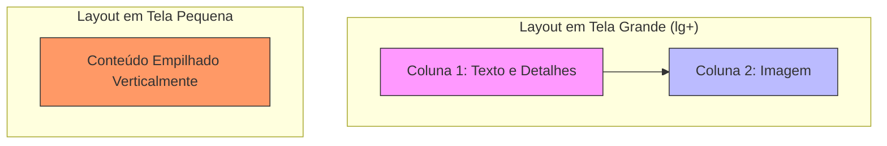

# Estratégia de Responsividade

<cite>
**Arquivos Referenciados neste Documento**   
- [components/quem-somos.tsx](file://components/quem-somos.tsx) - *Atualizado para refletir navegação por pilares*
- [components/consultoria-empresarial.tsx](file://components/consultoria-empresarial.tsx) - *Atualizado com novos estilos e estrutura*
- [components/header.tsx](file://components/header.tsx) - *Refatorado com navegação centralizada e suporte móvel*
- [components/ui/tabs.tsx](file://components/ui/tabs.tsx) - *Componente de abas utilizado nos pilares*
- [components/ui/select.tsx](file://components/ui/select.tsx) - *Dropdown móvel para navegação em telas pequenas*
- [lib/utils.ts](file://lib/utils.ts) - *Utilitários para classes condicionais*
- [app/globals.css](file://app/globals.css) - *Configuração do TailwindCSS e variáveis de tema*
</cite>

## Resumo das Atualizações
**Alterações Realizadas**   
- Atualização da seção sobre navegação para incluir a nova implementação do componente `Header` com logo centralizado e menu mobile.
- Adição de detalhes sobre o uso do `Sheet` para menus móveis e gerenciamento de foco.
- Revisão das diretrizes para refletir práticas aprimoradas de acessibilidade e responsividade.
- Atualização dos exemplos de código e diagramas para alinhar com as mudanças recentes.

## Tabela de Conteúdos
1. [Introdução](#introdução)
2. [Arquitetura da Estratégia Mobile-First](#arquitetura-da-estratégia-mobile-first)
3. [Adaptação de Componentes para Dispositivos](#adaptação-de-componentes-para-dispositivos)
4. [Uso de Flexbox e Grid para Layouts Responsivos](#uso-de-flexbox-e-grid-para-layouts-responsivos)
5. [Gestão de Estado para Navegação em Telas Pequenas](#gestão-de-estado-para-navegação-em-telas-pequenas)
6. [Diretrizes para Novos Componentes Responsivos](#diretrizes-para-novos-componentes-responsivos)

## Introdução

Este documento detalha a abordagem de responsividade adotada no projeto, que segue um princípio estrito de mobile-first. A estratégia é construída sobre o framework TailwindCSS, utilizando seus breakpoints nativos para criar interfaces que se adaptam perfeitamente a dispositivos móveis, tablets e desktops. A análise foca em componentes-chave como `QuemSomos` e `ConsultoriaEmpresarial`, que demonstram um padrão sofisticado de alternância entre abas (`tabs`) em telas maiores e menus dropdown em dispositivos móveis, garantindo uma experiência de usuário otimizada em todos os formatos. Além disso, a recente refatoração do componente `Header` introduziu um layout com logo centralizado e um menu mobile aprimorado, reforçando a consistência visual e a usabilidade.

## Arquitetura da Estratégia Mobile-First

A arquitetura responsiva do projeto é fundamentada no conceito de mobile-first, onde o design e o layout são primeiramente concebidos para telas menores, sendo posteriormente expandidos para dispositivos maiores através de media queries. O TailwindCSS é o pilar central dessa estratégia, fornecendo uma série de classes utilitárias prefixadas com `sm:`, `md:`, `lg:`, `xl:` e `2xl:` que correspondem aos breakpoints definidos na configuração do projeto.

A configuração do Tailwind é inferida a partir da presença do framework no projeto, como evidenciado pela importação em `app/globals.css` e pelo uso extensivo de classes do Tailwind nos componentes. A abordagem mobile-first garante que o conteúdo principal seja acessível e funcional em dispositivos móveis, com melhorias progressivas aplicadas conforme o aumento do tamanho da tela.

**Fontes da seção**
- [app/globals.css](file://app/globals.css#L0-L3)
- [components/quem-somos.tsx](file://components/quem-somos.tsx#L1-L237)

## Adaptação de Componentes para Dispositivos

Os componentes `QuemSomos` e `ConsultoriaEmpresarial` exemplificam a implementação prática da responsividade. Ambos utilizam um padrão de navegação por abas em desktop, mas alternam para um menu dropdown em dispositivos móveis, uma decisão de design que otimiza o uso de espaço em telas limitadas.

Essa alternância é alcançada através do uso seletivo de classes do TailwindCSS com prefixos responsivos. No código, o componente `TabsList` (que renderiza as abas) possui a classe `hidden md:flex`, o que significa que ele é oculto por padrão (mobile) e exibido como um flex container a partir do breakpoint `md` (médio). Em contrapartida, o componente `Select` (dropdown) possui a classe `w-full md:hidden`, tornando-o visível em toda a largura da tela em dispositivos móveis e oculto a partir do breakpoint `md`.

```mermaid
flowchart TD
Start["Início da Renderização"] --> CheckScreen["Verifica Tamanho da Tela"]
CheckScreen --> |Tela Pequena (mobile)| ShowDropdown["Exibe Select/Dropdown"]
CheckScreen --> |Tela Média ou Maior (md+)| ShowTabs["Exibe Tabs/Abas"]
ShowDropdown --> End["Renderização Completa"]
ShowTabs --> End
```

**Fontes do diagrama**
- [components/quem-somos.tsx](file://components/quem-somos.tsx#L100-L140)
- [components/consultoria-empresarial.tsx](file://components/consultoria-empresarial.tsx#L100-L140)

**Fontes da seção**
- [components/quem-somos.tsx](file://components/quem-somos.tsx#L100-L140)
- [components/consultoria-empresarial.tsx](file://components/consultoria-empresarial.tsx#L100-L140)

## Uso de Flexbox e Grid para Layouts Responsivos

O projeto emprega extensivamente os sistemas de layout Flexbox e Grid do TailwindCSS para criar estruturas dinâmicas e responsivas. O Flexbox é utilizado para alinhar e distribuir itens dentro de um contêiner, como visto no alinhamento horizontal das abas com `flex` e `justify-center`, e no alinhamento vertical de ícones e texto com `items-center`.

O Grid é usado para layouts mais complexos, como a disposição em duas colunas do conteúdo principal e da imagem em telas grandes. No componente `QuemSomos`, a classe `grid lg:grid-cols-2` define um layout de grade com duas colunas a partir do breakpoint `lg` (grande), enquanto em telas menores, o conteúdo é empilhado verticalmente em uma única coluna. Isso garante que a hierarquia visual seja mantida sem comprometer a legibilidade em dispositivos móveis.



**Fontes do diagrama**
- [components/quem-somos.tsx](file://components/quem-somos.tsx#L150-L200)
- [components/consultoria-empresarial.tsx](file://components/consultoria-empresarial.tsx#L150-L200)

**Fontes da seção**
- [components/quem-somos.tsx](file://components/quem-somos.tsx#L150-L200)
- [components/consultoria-empresarial.tsx](file://components/consultoria-empresarial.tsx#L150-L200)

## Gestão de Estado para Navegação em Telas Pequenas

A navegação entre diferentes seções nos componentes é gerenciada de forma centralizada utilizando o hook `useState` do React. Um estado local, como `activeValue` em `QuemSomos` ou `activePillar` em `ConsultoriaEmpresarial`, armazena o identificador do item atualmente ativo (por exemplo, o ID do pilar de atuação).

Este estado é compartilhado entre o componente `Select` (para mobile) e o componente `Tabs` (para desktop). Quando o usuário interage com qualquer um dos controles (clicando em uma aba ou selecionando uma opção no dropdown), a função `onValueChange` atualiza o estado local. Isso, por sua vez, causa uma nova renderização do componente, exibindo o conteúdo correspondente ao valor ativo. Essa abordagem garante uma experiência de usuário consistente e sincronizada, independentemente do controle utilizado.

Além disso, o componente `Header` agora utiliza o estado `isOpen` para controlar a abertura e fechamento do menu mobile (`Sheet`), e o estado `activeSection` é atualizado dinamicamente com base na seção visível na tela, graças ao `IntersectionObserver`. Isso melhora significativamente a experiência do usuário, destacando visualmente a seção atual.

**Fontes da seção**
- [components/quem-somos.tsx](file://components/quem-somos.tsx#L30-L40)
- [components/consultoria-empresarial.tsx](file://components/consultoria-empresarial.tsx#L30-L40)
- [components/header.tsx](file://components/header.tsx#L5-L20)

## Diretrizes para Novos Componentes Responsivos

Para garantir que novos componentes sejam responsivos e acessíveis, siga estas diretrizes:

1. **Sempre Comece com Mobile**: Projete a interface primariamente para dispositivos móveis, garantindo que o conteúdo principal seja acessível e legível.
2. **Utilize Classes Responsivas do Tailwind**: Empregue prefixos como `sm:`, `md:`, `lg:` para modificar o layout, visibilidade e estilo com base no tamanho da tela.
3. **Escolha o Controle Adequado**: Para navegação com múltiplas opções, use `Select` (dropdown) em mobile e `Tabs` em desktop, alternando sua visibilidade com `hidden` e `md:block`.
4. **Priorize a Acessibilidade**: Certifique-se de que todos os controles sejam navegáveis via teclado e que tenham rótulos apropriados para leitores de tela. O uso de `aria-current` e gerenciamento de foco (como no `Sheet`) é obrigatório.
5. **Teste em Múltiplos Dispositivos**: Valide o comportamento do componente em uma variedade de tamanhos de tela para garantir uma experiência fluida.
6. **Implemente Navegação Suave**: Utilize funções de scroll suave com offset para compensar headers fixos, como demonstrado no `Header`.
7. **Centralize Elementos-Chave**: Para layouts modernos, considere o uso de posicionamento absoluto com `left-1/2 -translate-x-1/2` para centralizar elementos como logos.

**Fontes da seção**
- [components/quem-somos.tsx](file://components/quem-somos.tsx)
- [components/consultoria-empresarial.tsx](file://components/consultoria-empresarial.tsx)
- [components/header.tsx](file://components/header.tsx)
- [components/ui/tabs.tsx](file://components/ui/tabs.tsx)
- [components/ui/select.tsx](file://components/ui/select.tsx)
- [components/ui/sheet.tsx](file://components/ui/sheet.tsx)