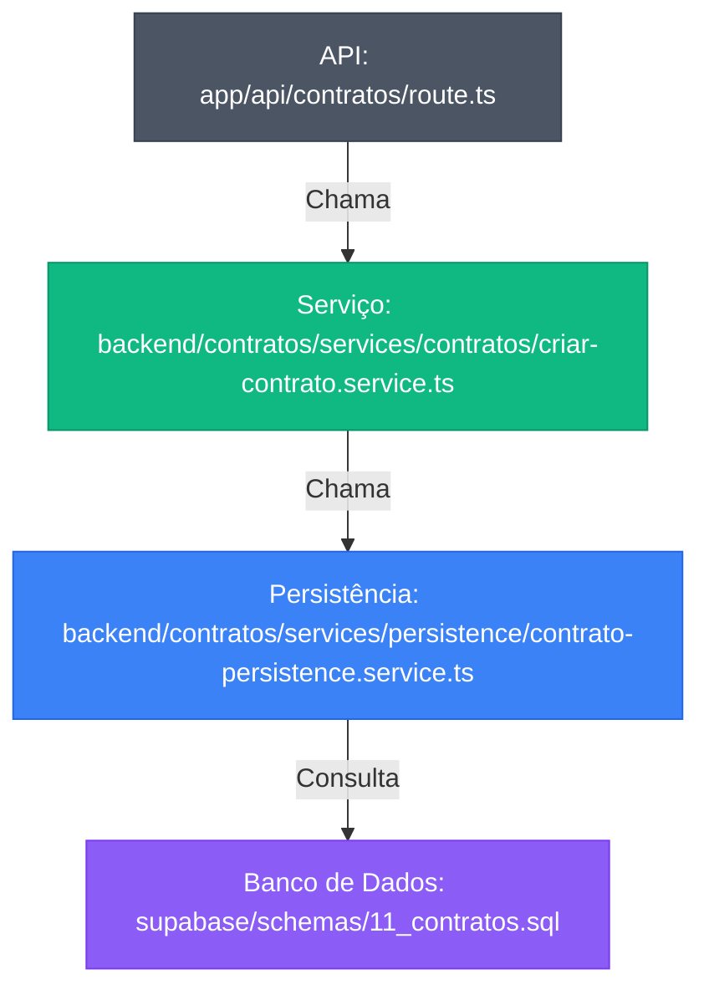

# Estrutura de Diretórios

<cite>
**Arquivos Referenciados neste Documento**  
- [app/api/contratos/route.ts](file://app/api/contratos/route.ts)
- [app/api/contratos/[id]/route.ts](file://app/api/contratos/[id]/route.ts)
- [app/api/contratos/[id]/processos/route.ts](file://app/api/contratos/[id]/processos/route.ts)
- [backend/contratos/services/contratos/criar-contrato.service.ts](file://backend/contratos/services/contratos/criar-contrato.service.ts)
- [backend/contratos/services/contratos/atualizar-contrato.service.ts](file://backend/contratos/services/contratos/atualizar-contrato.service.ts)
- [backend/contratos/services/contratos/listar-contratos.service.ts](file://backend/contratos/services/contratos/listar-contratos.service.ts)
- [backend/contratos/services/contratos/buscar-contrato.service.ts](file://backend/contratos/services/contratos/buscar-contrato.service.ts)
- [backend/contratos/services/contratos/gerenciar-processos.service.ts](file://backend/contratos/services/contratos/gerenciar-processos.service.ts)
- [backend/contratos/services/persistence/contrato-persistence.service.ts](file://backend/contratos/services/persistence/contrato-persistence.service.ts)
- [backend/contratos/services/persistence/contrato-processo-persistence.service.ts](file://backend/contratos/services/persistence/contrato-processo-persistence.service.ts)
- [supabase/schemas/11_contratos.sql](file://supabase/schemas/11_contratos.sql)
- [supabase/schemas/12_contrato_processos.sql](file://supabase/schemas/12_contrato_processos.sql)
- [components/ui/button.tsx](file://components/ui/button.tsx)
</cite>

## Sumário
1. [Introdução](#introdução)
2. [Estrutura Geral do Projeto](#estrutura-geral-do-projeto)
3. [Diretório app/](#diretório-app)
4. [Diretório backend/](#diretório-backend)
5. [Diretório components/](#diretório-components)
6. [Diretório supabase/](#diretório-supabase)
7. [Diretório dev_data/scripts/](#diretório-dev_data/scripts)
8. [Padrão de Camadas: API → Serviço → Persistência](#padrão-de-camadas-api--serviço--persistência)
9. [Mapa Visual da Estrutura de Diretórios](#mapa-visual-da-estrutura-de-diretórios)
10. [Adicionando Novos Módulos](#adicionando-novos-módulos)
11. [Conclusão](#conclusão)

## Introdução

Este documento apresenta uma análise detalhada da estrutura de diretórios do projeto **sinesys**, um sistema jurídico desenvolvido com foco em organização modular, separação de camadas e escalabilidade. O objetivo é orientar novos desenvolvedores na navegação pelo código, explicando a hierarquia do repositório, a arquitetura por funcionalidade e os padrões de desenvolvimento adotados. A estrutura foi projetada para promover clareza, manutenibilidade e consistência ao longo do projeto.

## Estrutura Geral do Projeto

A arquitetura do projeto sinesys é organizada em diretórios principais que refletem responsabilidades bem definidas:

- **app/**: Frontend da aplicação e rotas da API (Next.js App Router)
- **backend/**: Lógica de negócio, organizada por módulos funcionais
- **components/**: Componentes de interface de usuário reutilizáveis
- **supabase/**: Configurações de banco de dados, migrações e esquemas
- **dev_data/scripts/**: Scripts de teste e dados de desenvolvimento

Essa divisão clara entre frontend, backend, UI e dados facilita a manutenção e permite que equipes diferentes trabalhem em paralelo com baixo acoplamento.

## Diretório app/

O diretório `app/` contém o frontend da aplicação e as rotas da API, utilizando o App Router do Next.js.

### Frontend

- **(dashboard)/**: Contém o layout da dashboard, indicando áreas protegidas por autenticação.
- **docs/**: Páginas estáticas de documentação.
- **globals.css** e **layout.tsx**: Estilos globais e layout principal da aplicação.
- **page.tsx**: Página inicial do sistema.

### Rotas da API

Dentro de `app/api/`, cada entidade do sistema possui seu próprio diretório (ex: `contratos/`, `clientes/`, `acervo/`). Essas rotas atuam como **controladores**, recebendo requisições HTTP, validando entradas e orquestrando chamadas aos serviços do backend.

Por exemplo, `app/api/contratos/route.ts` lida com:
- `GET`: Listagem de contratos (chama `obterContratos`)
- `POST`: Criação de novo contrato (chama `cadastrarContrato`)

Já `app/api/contratos/[id]/route.ts` lida com:
- `GET`: Busca de contrato por ID
- `PATCH`: Atualização parcial de contrato

A estrutura de rotas é hierárquica e intuitiva, facilitando a descoberta de endpoints.

**Seção fontes**
- [app/api/contratos/route.ts](file://app/api/contratos/route.ts)
- [app/api/contratos/[id]/route.ts](file://app/api/contratos/[id]/route.ts)
- [app/api/contratos/[id]/processos/route.ts](file://app/api/contratos/[id]/processos/route.ts)

## Diretório backend/

O diretório `backend/` abriga toda a lógica de negócio, organizada em uma arquitetura modular por funcionalidade.

### Arquitetura Modular por Funcionalidade

Cada módulo (ex: `contratos/`, `clientes/`, `acervo/`) possui sua própria subestrutura de serviços, promovendo coesão e baixo acoplamento. Dentro de `backend/contratos/services/`, temos:

- **contratos/**: Serviços de negócio específicos (criar, atualizar, listar)
- **persistence/**: Camada de acesso a dados (persistência no Supabase)

Essa divisão permite que cada módulo evolua independentemente, facilitando testes e manutenção.

### Camadas de Abstração

A lógica de negócio segue um padrão claro de camadas:

1. **API (app/api)**: Recebe requisições
2. **Serviço (backend/contratos/services/contratos)**: Implementa regras de negócio
3. **Persistência (backend/contratos/services/persistence)**: Interage com o banco de dados

Essa separação garante que a lógica de negócio não esteja acoplada à camada de apresentação ou ao mecanismo de armazenamento.

**Seção fontes**
- [backend/contratos/services/contratos/criar-contrato.service.ts](file://backend/contratos/services/contratos/criar-contrato.service.ts)
- [backend/contratos/services/contratos/atualizar-contrato.service.ts](file://backend/contratos/services/contratos/atualizar-contrato.service.ts)
- [backend/contratos/services/contratos/listar-contratos.service.ts](file://backend/contratos/services/contratos/listar-contratos.service.ts)
- [backend/contratos/services/contratos/buscar-contrato.service.ts](file://backend/contratos/services/contratos/buscar-contrato.service.ts)
- [backend/contratos/services/contratos/gerenciar-processos.service.ts](file://backend/contratos/services/contratos/gerenciar-processos.service.ts)
- [backend/contratos/services/persistence/contrato-persistence.service.ts](file://backend/contratos/services/persistence/contrato-persistence.service.ts)
- [backend/contratos/services/persistence/contrato-processo-persistence.service.ts](file://backend/contratos/services/persistence/contrato-processo-persistence.service.ts)

## Diretório components/

O diretório `components/` contém os componentes de interface de usuário reutilizáveis.

### Componentes UI Baseados em shadcn/ui

O subdiretório `components/ui/` contém componentes baseados no [shadcn/ui](https://ui.shadcn.com/), uma coleção de componentes acessíveis e estilizáveis para React. Esses componentes são wrappers sobre bibliotecas como Radix UI e utilizam Tailwind CSS para estilização.

Exemplos incluem:
- `button.tsx`: Botões com variantes (default, destructive, outline, etc.)
- `input.tsx`: Campos de entrada
- `table.tsx`: Tabelas estilizadas
- `dropdown-menu.tsx`: Menus suspensos

Esses componentes garantem consistência visual e acessibilidade em toda a aplicação.

### Componentes de Aplicação

Fora de `ui/`, temos componentes específicos da aplicação:
- `app-sidebar.tsx`: Barra lateral da aplicação
- `nav-main.tsx`: Navegação principal
- `project-data-table.tsx`: Tabela de dados de projetos

**Seção fontes**
- [components/ui/button.tsx](file://components/ui/button.tsx)

## Diretório supabase/

O diretório `supabase/` contém todas as configurações relacionadas ao banco de dados Supabase.

### Migrações

Localizadas em `supabase/migrations/`, as migrações são scripts SQL que definem alterações no esquema do banco de dados. Cada arquivo é nomeado com um timestamp (ex: `20251117015304_create_logs_alteracao.sql`), garantindo execução ordenada.

### Esquemas

Os arquivos em `supabase/schemas/` definem as tabelas do banco de dados:
- `00_permissions.sql`: Permissões e políticas de segurança
- `01_enums.sql`: Tipos enumerados (ex: status_contrato)
- `04_acervo.sql`: Tabela de processos jurídicos
- `11_contratos.sql`: Tabela de contratos
- `12_contrato_processos.sql`: Relacionamento muitos-para-muitos entre contratos e processos

A estrutura de esquemas é clara e documentada, com comentários explicativos para cada coluna.

**Seção fontes**
- [supabase/schemas/11_contratos.sql](file://supabase/schemas/11_contratos.sql)
- [supabase/schemas/12_contrato_processos.sql](file://supabase/schemas/12_contrato_processos.sql)

## Diretório dev_data/scripts/

O diretório `dev_data/scripts/` contém scripts utilizados para testes e população de dados de desenvolvimento.

### Scripts de Teste

Arquivos como `test-api-acervo-geral.ts` e `test-api-audiencias.ts` permitem testar endpoints da API de forma isolada, útil para depuração e validação de integração.

### Dados de Teste

A subpasta `results/` armazena dados de resposta de APIs externas (ex: PJe-TRT), utilizados para simular integrações durante o desenvolvimento sem depender de chamadas externas em tempo real.

Esses scripts são essenciais para garantir a qualidade do código e acelerar o ciclo de desenvolvimento.

## Padrão de Camadas: API → Serviço → Persistência

O projeto segue rigorosamente o padrão de separação de camadas, ilustrado abaixo com o exemplo do módulo **contratos**:



**Fontes do Diagrama**
- [app/api/contratos/route.ts](file://app/api/contratos/route.ts)
- [backend/contratos/services/contratos/criar-contrato.service.ts](file://backend/contratos/services/contratos/criar-contrato.service.ts)
- [backend/contratos/services/persistence/contrato-persistence.service.ts](file://backend/contratos/services/persistence/contrato-persistence.service.ts)
- [supabase/schemas/11_contratos.sql](file://supabase/schemas/11_contratos.sql)

## Mapa Visual da Estrutura de Diretórios

```mermaid
graph TD
A[sinesys] --> B[app/]
A --> C[backend/]
A --> D[components/]
A --> E[supabase/]
A --> F[dev_data/scripts/]
B --> B1[(dashboard)/]
B --> B2[api/]
B --> B3[docs/]
B --> B4[globals.css]
B --> B5[layout.tsx]
B --> B6[page.tsx]
B2 --> B2a[contratos/]
B2 --> B2b[clientes/]
B2 --> B2c[acervo/]
C --> C1[contratos/]
C --> C2[clientes/]
C --> C3[acervo/]
C --> C4[utils/]
C1 --> C1a[services/]
C1a --> C1a1[contratos/]
C1a --> C1a2[persistence/]
D --> D1[ui/]
D --> D2[app-sidebar.tsx]
D --> D3[nav-main.tsx]
D1 --> D1a[button.tsx]
D1 --> D1b[input.tsx]
D1 --> D1c[table.tsx]
E --> E1[migrations/]
E --> E2[schemas/]
F --> F1[populate-database.ts]
F --> F2[test-api-acervo-geral.ts]
F --> F3[results/]
style A fill:#1F2937,stroke:#111827,color:white
style B fill:#059669,stroke:#047857,color:white
style C fill:#0891B2,stroke:#0E7490,color:white
style D fill:#7C3AED,stroke:#6D28D9,color:white
style E fill:#DC2626,stroke:#B91C1C,color:white
style F fill:#991B1B,stroke:#7F1D1D,color:white
```

**Fontes do Diagrama**
- [app/api/contratos/route.ts](file://app/api/contratos/route.ts)
- [backend/contratos/services/contratos/criar-contrato.service.ts](file://backend/contratos/services/contratos/criar-contrato.service.ts)
- [components/ui/button.tsx](file://components/ui/button.tsx)
- [supabase/schemas/11_contratos.sql](file://supabase/schemas/11_contratos.sql)

## Adicionando Novos Módulos

Para adicionar um novo módulo ao sistema (ex: `processos/`), siga o padrão existente:

1. **Crie o diretório no backend**: `backend/processos/services/`
2. **Adicione subdiretórios**: `processos/` (serviços de negócio) e `persistence/` (acesso a dados)
3. **Crie os serviços**: `criar-processo.service.ts`, `listar-processos.service.ts`, etc.
4. **Implemente a persistência**: `processo-persistence.service.ts` com operações CRUD
5. **Defina o esquema no Supabase**: Crie `supabase/schemas/XX_processos.sql`
6. **Adicione rotas na API**: `app/api/processos/route.ts` e `app/api/processos/[id]/route.ts`
7. **Atualize as migrações se necessário**

Essa abordagem garante consistência, facilita a manutenção e permite que novos desenvolvedores contribuam rapidamente com confiança.

## Conclusão

A estrutura de diretórios do projeto sinesys é um exemplo bem-sucedido de arquitetura modular, com separação clara de responsabilidades entre frontend, backend, UI e dados. O padrão de camadas (API → Serviço → Persistência) promove manutenibilidade e testabilidade, enquanto a organização por funcionalidade no backend facilita a escalabilidade. Novos desenvolvedores podem navegar pelo códigobase com facilidade, seguindo padrões consistentes e bem documentados. Esta estrutura serve como base sólida para o crescimento contínuo do sistema jurídico.