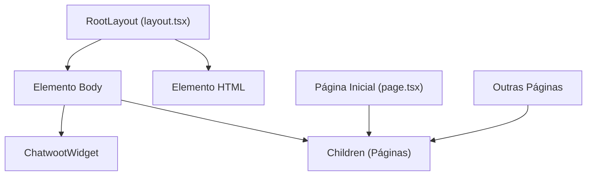
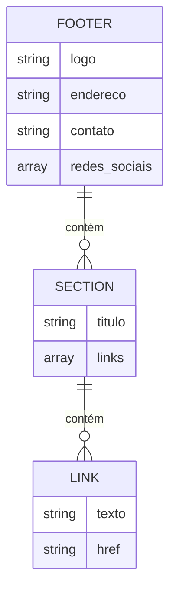

# Estrutura de Rotas (App Router)

<cite>
**Arquivos Referenciados neste Documento**  
- [app/layout.tsx](file://app/layout.tsx)
- [app/page.tsx](file://app/page.tsx)
- [components/header.tsx](file://components/header.tsx)
- [components/ui/footer.tsx](file://components/ui/footer.tsx)
- [components/chatwoot-widget.tsx](file://components/chatwoot-widget.tsx)
</cite>

## Sumário
1. [Introdução](#introdução)
2. [Estrutura de Arquivos e Roteamento Automático](#estrutura-de-arquivos-e-roteamento-automático)
3. [Componente RootLayout](#componente-rootlayout)
4. [Página Inicial (Home)](#página-inicial-home)
5. [Análise de Componentes do Layout](#análise-de-componentes-do-layout)
6. [Navegação Interna](#navegação-interna)
7. [Server Components e Client Components](#server-components-e-client-components)
8. [Diretrizes para Adicionar Novas Páginas](#diretrizes-para-adicionar-novas-páginas)
9. [Conclusão](#conclusão)

## Introdução

Este documento apresenta a arquitetura de rotas do sistema baseado no App Router do Next.js, utilizado no projeto do site da Polastri e Zattar Advogados. O App Router introduz um modelo de arquitetura baseado em arquivos, onde a estrutura de diretórios define diretamente o sistema de rotas da aplicação. Este modelo simplifica significativamente a criação e manutenção de rotas, tornando o sistema mais previsível e escalável. A análise abrange desde a estrutura básica até os componentes específicos que compõem a interface, com foco na integração de elementos comuns e no comportamento dos componentes do servidor.

## Estrutura de Arquivos e Roteamento Automático

A estrutura de arquivos no diretório `/app` é fundamental para o funcionamento do sistema de rotas do Next.js. O framework utiliza uma convenção baseada em arquivos, onde a presença de um arquivo `page.tsx` dentro de um diretório define automaticamente uma rota correspondente. No caso do projeto analisado, o arquivo `app/page.tsx` representa a rota raiz (`/`) do site, servindo como a página inicial acessível diretamente pela URL base do domínio.

O sistema de roteamento é completamente automático: qualquer novo diretório criado dentro de `/app` que contenha um arquivo `page.tsx` será automaticamente transformado em uma nova rota acessível. Por exemplo, a criação de um diretório `app/sobre/page.tsx` geraria automaticamente a rota `/sobre`. Essa abordagem elimina a necessidade de configuração manual de rotas, reduzindo erros e acelerando o desenvolvimento. A estrutura de diretórios reflete diretamente a estrutura de navegação do site, proporcionando uma correspondência clara entre a organização do código e a experiência do usuário.

**Section sources**
- [app/page.tsx](file://app/page.tsx#L1-L22)

## Componente RootLayout

O arquivo `layout.tsx` localizado no diretório raiz `/app` define o `RootLayout`, um componente especial que envolve todas as páginas da aplicação com elementos comuns. Este componente é renderizado uma única vez durante a inicialização da aplicação e mantém seu estado entre as navegações, permitindo uma experiência de SPA (Single Page Application) com transições suaves entre as páginas.

O `RootLayout` é responsável por estruturar a camada mais externa da aplicação, definindo o elemento HTML raiz com atributos globais como o idioma (`pt-BR`) e classes de estilo que aplicam tipografia e antialiasing consistentes em todo o site. Ele também é o responsável por injetar o widget do Chatwoot, garantindo que este serviço de atendimento ao cliente esteja disponível em todas as páginas do site sem necessidade de importação repetida em cada componente de página.

**Diagram sources**
- [app/layout.tsx](file://app/layout.tsx#L23-L38)

**Section sources**
- [app/layout.tsx](file://app/layout.tsx#L1-L40)
- [components/chatwoot-widget.tsx](file://components/chatwoot-widget.tsx#L1-L27)

## Página Inicial (Home)

A página inicial do site é definida pelo componente `Home` no arquivo `app/page.tsx`. Este componente é um Server Component que renderiza a estrutura principal da página inicial, composta por uma série de componentes funcionais que representam diferentes seções do site. A arquitetura adota um padrão de composição, onde a página é construída como uma montagem de componentes menores e especializados.

O componente `Home` organiza os elementos na ordem de exibição: começa com o `Header`, seguido pelo `Hero` (seção de destaque), `DireitosEssenciais`, `EtapasProcessuais`, `QuemSomos`, `ConsultoriaEmpresarial` e finalmente o `Footer`. Essa estrutura linear reflete a jornada do usuário pela página, guiando-o desde a apresentação inicial até as informações institucionais e de contato. Cada componente importado representa uma seção autônoma com sua própria lógica e estilização, promovendo reutilização e manutenção simplificada.

**Section sources**
- [app/page.tsx](file://app/page.tsx#L1-L22)

## Análise de Componentes do Layout

### Header

O componente `Header` é um Client Component, indicado pela diretiva `'use client'` no início do arquivo. Ele é posicionado de forma fixa no topo da tela (`position: fixed`) com um índice z elevado (`z-50`) para garantir que permaneça visível acima de outros elementos durante a rolagem da página. O design incorpora elementos visuais sofisticados, como um fundo translúcido com desfoque (`backdrop-blur-sm`) e uma borda arredondada, criando um efeito de sobreposição moderno e elegante.

A implementação utiliza um sistema de posicionamento relativo com um elemento absoluto que cria um efeito de "halo" sutil ao redor do logo, adicionando profundidade visual à interface. O componente é minimalista por design, contendo apenas o logo do escritório, o que reforça a identidade visual e mantém o foco no conteúdo principal da página.

**Section sources**
- [components/header.tsx](file://components/header.tsx#L1-L18)

### Footer

O componente `Footer` é um componente React funcional que estrutura o rodapé do site em uma grade responsiva. Ele é dividido em duas partes principais: uma seção superior com o logo, informações de contato e links para redes sociais, e uma seção inferior com o copyright e links legais. A seção de links é gerada dinamicamente a partir de um objeto de dados `footerSections`, que organiza os links em categorias como "Institucional", "Áreas de Atuação" e "Conteúdo".

Cada link utiliza o componente `Link` do Next.js, que habilita navegação cliente-side otimizada, melhorando o desempenho e a experiência do usuário. O componente também incorpora ícones de redes sociais interativos que abrem os perfis do escritório em novas janelas. A estrutura é projetada para ser responsiva, adaptando-se a diferentes tamanhos de tela através de classes do Tailwind CSS.

**Diagram sources**
- [components/ui/footer.tsx](file://components/ui/footer.tsx#L1-L139)

**Section sources**
- [components/ui/footer.tsx](file://components/ui/footer.tsx#L1-L139)

### Chatwoot Widget

O componente `ChatwootWidget` é um Client Component responsável por integrar o serviço de chat ao vivo do Chatwoot ao site. Ele utiliza o componente `Script` do Next.js com a estratégia `afterInteractive`, garantindo que o script do Chatwoot seja carregado após a interatividade inicial da página, minimizando o impacto no desempenho de carregamento.

O widget injeta dinamicamente um script JavaScript que inicializa o SDK do Chatwoot com um token de website específico (`zyY6kcqbBsudawsAPVRw7ooM`) e a URL base do servidor. Este componente é renderizado no `RootLayout`, garantindo sua disponibilidade em todas as páginas do site. A implementação utiliza uma função autoinvocada (IIFE) para configurar e executar o SDK, seguindo as práticas recomendadas de integração do Chatwoot.

**Section sources**
- [components/chatwoot-widget.tsx](file://components/chatwoot-widget.tsx#L1-L27)

## Navegação Interna

A navegação interna no site é implementada utilizando o componente `Link` do Next.js, que é encontrado principalmente no componente `Footer`. Este componente permite navegação cliente-side entre as páginas, evitando recarregamentos completos da página e proporcionando transições mais rápidas e suaves. As rotas são definidas como strings no objeto `footerSections`, com valores como `/sobre`, `/atuacao` e `/contato`, que correspondem diretamente aos diretórios no sistema de arquivos `/app`.

O uso do `Link` do Next.js é uma prática recomendada porque ele pré-carrega as páginas de destino em segundo plano quando o usuário passa o mouse sobre os links, melhorando significativamente a percepção de desempenho. A estrutura de navegação é hierárquica e intuitiva, com seções organizadas por categorias lógicas que refletem a estrutura do escritório e seus serviços. Embora o componente `Header` atualmente não contenha links de navegação, a arquitetura permite fácil adição de um menu de navegação no futuro, aproveitando o mesmo sistema de rotas baseado em arquivos.

**Section sources**
- [components/ui/footer.tsx](file://components/ui/footer.tsx#L48-L139)

## Server Components e Client Components

A arquitetura do Next.js no App Router distingue claramente entre Server Components e Client Components, uma separação fundamental para otimizar desempenho e funcionalidade. No projeto analisado, a página inicial (`page.tsx`) é um Server Component, o que significa que é renderizada no servidor e enviada ao cliente como HTML estático. Isso reduz significativamente o tamanho do pacote JavaScript enviado ao navegador e melhora o tempo de carregamento inicial.

Componentes que requerem interatividade do lado do cliente, como o `Header`, `Footer` e `ChatwootWidget`, são explicitamente marcados como Client Components através da diretiva `'use client'`. Essa diretiva informa ao Next.js que esses componentes devem ser renderizados no cliente e que podem utilizar recursos do navegador, como eventos de mouse, armazenamento local e manipulação do DOM. A separação clara entre componentes do servidor e do cliente permite uma otimização eficiente do desempenho, onde o conteúdo estático é entregue rapidamente do servidor, enquanto a interatividade é adicionada apenas onde necessário.

**Section sources**
- [app/page.tsx](file://app/page.tsx#L1-L22)
- [components/header.tsx](file://components/header.tsx#L1-L18)
- [components/chatwoot-widget.tsx](file://components/chatwoot-widget.tsx#L1-L27)

## Diretrizes para Adicionar Novas Páginas

Para adicionar novas páginas ao projeto, siga as convenções estabelecidas pelo App Router do Next.js:

1. **Crie um novo diretório** dentro de `/app` com o nome da rota desejada (ex: `/app/sobre`).
2. **Adicione um arquivo `page.tsx`** dentro do novo diretório. Este arquivo deve exportar um componente React funcional padrão.
3. **Importe e utilize componentes existentes** quando possível, especialmente para elementos comuns como `Header` e `Footer`.
4. **Defina metadados específicos** para a página, se necessário, utilizando o objeto `metadata` exportado no arquivo.
5. **Utilize o componente `Link` do Next.js** para criar links para a nova página a partir de outros componentes.
6. **Considere o tipo de componente** necessário: use Server Components para páginas estáticas e adicione `'use client'` apenas quando interatividade do lado do cliente for necessária.

Essas diretrizes garantem que novas páginas se integrem perfeitamente à arquitetura existente, mantendo consistência no design, desempenho e experiência do usuário.

## Conclusão

A arquitetura de rotas baseada no App Router do Next.js demonstra-se altamente eficaz para o site da Polastri e Zattar Advogados, oferecendo uma estrutura clara, escalável e de fácil manutenção. A combinação de Server Components para conteúdo estático e Client Components para interatividade cria um equilíbrio ideal entre desempenho e funcionalidade. O uso de `RootLayout` para elementos comuns e a separação clara de responsabilidades entre componentes promovem uma base sólida para o crescimento futuro do site, permitindo a adição de novas funcionalidades com mínima sobrecarga de desenvolvimento.