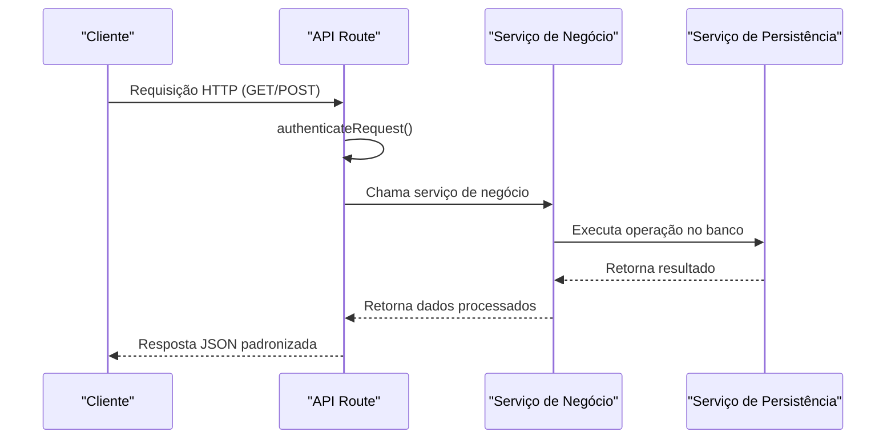
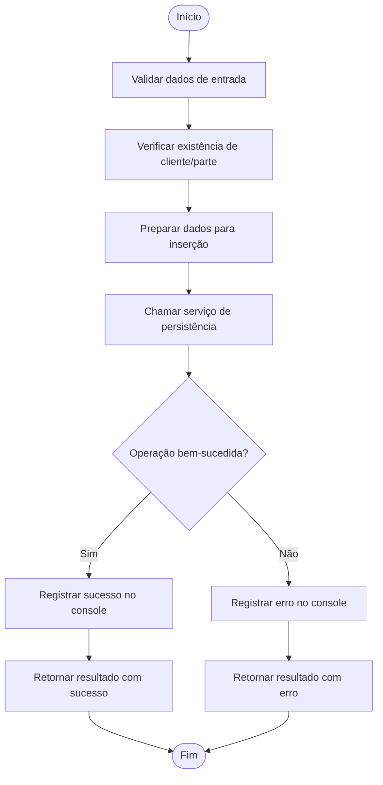
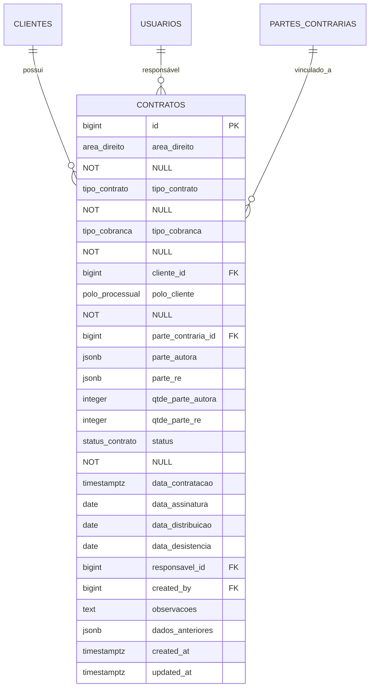

# Guia do Desenvolvedor

<cite>
**Arquivos Referenciados neste Documento**   
- [app/api/contratos/route.ts](file://app/api/contratos/route.ts)
- [backend/contratos/services/contratos/criar-contrato.service.ts](file://backend/contratos/services/contratos/criar-contrato.service.ts)
- [backend/contratos/services/persistence/contrato-persistence.service.ts](file://backend/contratos/services/persistence/contrato-persistence.service.ts)
- [swagger.config.ts](file://swagger.config.ts)
- [app/docs/page.tsx](file://app/docs/page.tsx)
- [app/api/docs/openapi.json/route.ts](file://app/api/docs/openapi.json/route.ts)
- [openspec/project.md](file://openspec/project.md)
- [AGENTS.md](file://AGENTS.md)
- [CLAUDE.md](file://CLAUDE.md)
- [components.json](file://components.json)
- [supabase/schemas/11_contratos.sql](file://supabase/schemas/11_contratos.sql)
</cite>

## Sumário
1. [Introdução](#introdução)
2. [Estrutura de Diretórios e Padrões](#estrutura-de-diretórios-e-padrões)
3. [Adicionando um Novo Módulo](#adicionando-um-novo-módulo)
4. [Criando uma Nova Rota API](#criando-uma-nova-rota-api)
5. [Implementando o Serviço de Negócio](#implementando-o-serviço-de-negócio)
6. [Implementando o Serviço de Persistência](#implementando-o-serviço-de-persistência)
7. [Documentação de Endpoints com JSDoc e OpenAPI](#documentação-de-endpoints-com-jsdoc-e-openapi)
8. [Diretrizes de Contribuição](#diretrizes-de-contribuição)
9. [Exemplo Prático: Adicionar um Novo Endpoint](#exemplo-prático-adicionar-um-novo-endpoint)
10. [Gerenciamento de Componentes UI com components.json](#gerenciamento-de-componentes-ui-com-componentsjson)

## Introdução

Este guia tem como objetivo acelerar a produtividade de novos colaboradores no sistema Sinesys, fornecendo instruções claras e detalhadas sobre como contribuir com o código. O Sinesys é um sistema de gestão jurídica que integra dados do PJE-TRT (Processo Judicial Eletrônico dos Tribunais Regionais do Trabalho) e gerencia clientes, contratos, processos, audiências e pendências. Este documento abrange desde a estrutura de diretórios até as práticas recomendadas para contribuições, incluindo a criação de novos módulos, rotas API, serviços de negócio e persistência, além da documentação automática com OpenAPI.

**Seção fontes**
- [openspec/project.md](file://openspec/project.md#L1-L180)

## Estrutura de Diretórios e Padrões

O projeto Sinesys segue uma arquitetura bem definida que separa claramente as responsabilidades entre as camadas de aplicação. A estrutura de diretórios é organizada por funcionalidade, facilitando a localização e manutenção do código.

```mermaid
graph TB
subgraph "app"
api[api/] --> |API Routes| dashboard[(dashboard)/]
docs[docs/] --> |Documentação| page[page.tsx]
end
subgraph "backend"
feature[feature/] --> services[services/]
services --> business[feature/] & persistence[persistence/]
end
subgraph "components"
ui[ui/] --> |Componentes Reutilizáveis| custom[Componentes Personalizados]
end
subgraph "supabase"
schemas[schemas/] --> |Schemas Declarativos| migrations[migrations/]
end
api --> backend
backend --> supabase
app --> components
```

**Fontes do diagrama**
- [openspec/project.md](file://openspec/project.md#L64-L79)

A estrutura de diretórios principal é a seguinte:

- **`app/`**: Contém o roteador da aplicação Next.js, incluindo rotas API e páginas.
  - **`app/api/`**: Rotas REST da API, onde cada entidade tem seu próprio diretório.
  - **`app/(dashboard)/`**: Rotas protegidas do dashboard do sistema.
- **`backend/`**: Lógica de negócio e serviços, organizados por funcionalidade.
  - **`backend/[feature]/services/`**: Serviços de negócio e persistência para cada funcionalidade.
  - **`backend/[feature]/services/[feature]/`**: Serviços específicos de negócio.
  - **`backend/[feature]/services/persistence/`**: Camada de persistência que interage com o Supabase.
- **`components/`**: Componentes React reutilizáveis, incluindo componentes da biblioteca shadcn/ui.
- **`supabase/`**: Configurações do banco de dados.
  - **`supabase/schemas/`**: Schemas declarativos do banco de dados PostgreSQL.
  - **`supabase/migrations/`**: Migrações geradas automaticamente.

Os padrões de nomenclatura seguem as convenções do projeto:
- **Arquivos**: kebab-case (ex: `criar-contrato.service.ts`)
- **Componentes React**: PascalCase (ex: `AppSidebar.tsx`)
- **Variáveis e funções**: camelCase (ex: `obterContratos`)
- **Tipos e interfaces**: PascalCase (ex: `ContratoDados`)
- **Banco de dados**: snake_case (ex: `contratos`, `cliente_id`)

**Seção fontes**
- [openspec/project.md](file://openspec/project.md#L43-L48)

## Adicionando um Novo Módulo

Para adicionar um novo módulo ao sistema Sinesys, siga o padrão de diretórios e separação de camadas. Um módulo representa uma entidade do domínio jurídico, como "clientes", "contratos" ou "audiências". O processo envolve a criação de diretórios e arquivos nas camadas apropriadas.

1. **Crie o diretório do módulo em `backend/`**: Por exemplo, para um novo módulo "processos", crie `backend/processos/`.
2. **Crie a estrutura de serviços**: Dentro do diretório do módulo, crie `services/`, e dentro dele, os subdiretórios `processos/` para serviços de negócio e `persistence/` para serviços de persistência.
3. **Crie o diretório da API em `app/api/`**: Crie `app/api/processos/` para as rotas REST.
4. **Defina o schema do banco de dados**: Crie um arquivo SQL em `supabase/schemas/` (ex: `13_processos.sql`) definindo a tabela e seus campos.

Este padrão garante que o código seja organizado, escalável e fácil de manter, com separação clara entre as camadas de apresentação, negócio e dados.

**Seção fontes**
- [openspec/project.md](file://openspec/project.md#L64-L79)

## Criando uma Nova Rota API

As rotas API são definidas no diretório `app/api/` usando o App Router do Next.js. Cada rota é um arquivo `route.ts` que exporta funções assíncronas para os métodos HTTP (GET, POST, PUT, DELETE).

Para criar uma nova rota, siga este exemplo baseado no endpoint de contratos:



**Fontes do diagrama**
- [app/api/contratos/route.ts](file://app/api/contratos/route.ts#L1-L187)
- [openspec/project.md](file://openspec/project.md#L82-L85)

Os passos para criar uma nova rota são:
1. Crie um arquivo `route.ts` no diretório apropriado em `app/api/`.
2. Importe as funções necessárias: `NextRequest`, `NextResponse`, `authenticateRequest` e os serviços de negócio.
3. Exporte funções assíncronas para cada método HTTP necessário.
4. Em cada função, valide a autenticação com `authenticateRequest()`.
5. Extraia os parâmetros da requisição (query params, body).
6. Chame o serviço de negócio correspondente.
7. Retorne uma resposta JSON padronizada com `success`, `data` e `error`.

A resposta sempre segue o padrão `{ success: boolean, data?: T, error?: string }`, garantindo consistência na API.

**Seção fontes**
- [app/api/contratos/route.ts](file://app/api/contratos/route.ts#L1-L187)

## Implementando o Serviço de Negócio

Os serviços de negócio residem em `backend/[feature]/services/[feature]/` e contêm a lógica de negócio pura, sem preocupações com autenticação ou formatação de resposta. Eles atuam como intermediários entre as rotas API e os serviços de persistência.

Um serviço de negócio típico, como o de criação de contrato, segue este padrão:



**Fontes do diagrama**
- [backend/contratos/services/contratos/criar-contrato.service.ts](file://backend/contratos/services/contratos/criar-contrato.service.ts#L1-L46)
- [backend/contratos/services/persistence/contrato-persistence.service.ts](file://backend/contratos/services/persistence/contrato-persistence.service.ts#L197-L300)

As responsabilidades do serviço de negócio incluem:
- Validação de dados de entrada.
- Verificação de integridade referencial (ex: verificar se o cliente existe).
- Preparação dos dados para a camada de persistência.
- Chamada ao serviço de persistência.
- Tratamento de erros e logging.
- Retorno de um resultado padronizado.

O logging é usado extensivamente para rastrear o fluxo de execução, com mensagens de sucesso (✅) e erro (❌) para facilitar o debugging.

**Seção fontes**
- [backend/contratos/services/contratos/criar-contrato.service.ts](file://backend/contratos/services/contratos/criar-contrato.service.ts#L1-L46)

## Implementando o Serviço de Persistência

Os serviços de persistência estão localizados em `backend/[feature]/services/persistence/` e são responsáveis por todas as operações de CRUD no banco de dados Supabase. Eles contêm a lógica específica de acesso ao banco, incluindo consultas, inserções, atualizações e exclusões.

O serviço de persistência para contratos demonstra práticas avançadas:



**Fontes do diagrama**
- [backend/contratos/services/persistence/contrato-persistence.service.ts](file://backend/contratos/services/persistence/contrato-persistence.service.ts#L1-L524)
- [supabase/schemas/11_contratos.sql](file://supabase/schemas/11_contratos.sql#L1-L86)

As características principais são:
- **Tipos TypeScript**: Definição de interfaces e tipos (ex: `ContratoDados`, `OperacaoContratoResult`) para garantir segurança de tipo.
- **Validação de dados**: Verificação de campos obrigatórios e integridade referencial.
- **Manipulação de JSONB**: Funções para validar e converter arrays de partes (autor e ré).
- **Tratamento de datas**: Função `parseDate` para garantir formatos de data consistentes.
- **Conversão de nomes**: Funções para mapear entre snake_case (banco) e camelCase (TypeScript).
- **Tratamento de erros**: Bloco try/catch para capturar erros inesperados.

A camada de persistência também implementa auditoria, com o campo `dados_anteriores` armazenando o estado anterior antes de uma atualização, e triggers no banco para manter `updated_at` atualizado.

**Seção fontes**
- [backend/contratos/services/persistence/contrato-persistence.service.ts](file://backend/contratos/services/persistence/contrato-persistence.service.ts#L1-L524)
- [supabase/schemas/11_contratos.sql](file://supabase/schemas/11_contratos.sql#L1-L86)

## Documentação de Endpoints com JSDoc e OpenAPI

O sistema Sinesys utiliza JSDoc para gerar automaticamente a documentação OpenAPI, que é servida via Swagger UI. Isso garante que a documentação esteja sempre sincronizada com o código.

A configuração é feita em `swagger.config.ts`, que define:
- Informações gerais da API (título, versão, contato).
- Servidores (desenvolvimento e produção).
- Esquemas de segurança (Bearer, sessão, API Key).
- Componentes reutilizáveis (schemas, responses).
- Caminho para os arquivos de rotas (`./app/api/**/*.ts`).

```mermaid
graph TD
A[Rotas API com JSDoc] --> B[swagger.config.ts]
B --> C[swagger-jsdoc]
C --> D[OpenAPI Spec JSON]
D --> E[/api/docs/openapi.json]
E --> F[Swagger UI]
F --> G[Documentação Interativa]
```

**Fontes do diagrama**
- [swagger.config.ts](file://swagger.config.ts#L1-L212)
- [app/api/docs/openapi.json/route.ts](file://app/api/docs/openapi.json/route.ts#L1-L23)
- [app/docs/page.tsx](file://app/docs/page.tsx#L1-L68)

Para documentar um endpoint, use anotações JSDoc no arquivo `route.ts`. Por exemplo, para o endpoint `GET /api/contratos`:

```typescript
/**
 * @swagger
 * /api/contratos:
 *   get:
 *     summary: Lista contratos do sistema
 *     description: Retorna uma lista paginada de contratos com filtros opcionais
 *     tags:
 *       - Contratos
 *     security:
 *       - bearerAuth: []
 *     parameters:
 *       - in: query
 *         name: pagina
 *         schema:
 *           type: integer
 *     responses:
 *       200:
 *         description: Lista retornada com sucesso
 */
```

A documentação pode ser acessada em `http://localhost:3000/docs`, onde o Swagger UI exibe uma interface interativa para explorar e testar os endpoints.

**Seção fontes**
- [swagger.config.ts](file://swagger.config.ts#L1-L212)
- [app/api/docs/openapi.json/route.ts](file://app/api/docs/openapi.json/route.ts#L1-L23)
- [app/docs/page.tsx](file://app/docs/page.tsx#L1-L68)

## Diretrizes de Contribuição

As contribuições para o projeto Sinesys devem seguir as diretrizes estabelecidas nos arquivos `AGENTS.md` e `CLAUDE.md`, que definem o fluxo de trabalho e as práticas recomendadas.

### Git Workflow
- A branch principal é `main`.
- Commits devem ter mensagens descritivas em português.
- Use a estrutura `tipo: descrição breve` (ex: `feat: adiciona novo endpoint para contratos`).
- Para mudanças significativas, use o OpenSpec para criar uma proposta de mudança.

### OpenSpec para Propostas de Mudança
O OpenSpec é usado para planejar mudanças complexas, como novas funcionalidades, alterações de arquitetura ou mudanças de dados significativas. Ele ajuda a alinhar stakeholders e tomar decisões técnicas antes da codificação.

Um esqueleto mínimo de `design.md` inclui:
- **Contexto**: Fundamentos e restrições do problema.
- **Objetivos / Não-Objetivos**: O que será feito e o que não será feito.
- **Alternativas Consideradas**: Diferentes abordagens avaliadas.
- **Decisão Final**: A solução escolhida e porquê.

### Revisão de Código
A revisão de código é obrigatória para garantir qualidade, segurança e aderência aos padrões. Os revisores devem verificar:
- Correção da lógica de negócio.
- Segurança (autenticação, RLS).
- Performance (uso de índices, paginação).
- Legibilidade e aderência aos padrões de código.

**Seção fontes**
- [AGENTS.md](file://AGENTS.md#L1-L18)
- [CLAUDE.md](file://CLAUDE.md#L1-L18)
- [openspec/project.md](file://openspec/project.md#L107-L111)

## Exemplo Prático: Adicionar um Novo Endpoint

Vamos demonstrar como adicionar um novo endpoint para uma entidade, usando como exemplo a criação de um contrato.

1. **Rota API (`app/api/contratos/route.ts`)**:
   - A função `POST` valida a autenticação, extrai o corpo da requisição e chama o serviço de negócio `cadastrarContrato`.

2. **Serviço de Negócio (`backend/contratos/services/contratos/criar-contrato.service.ts`)**:
   - A função `cadastrarContrato` valida os dados, verifica a existência do cliente, chama o serviço de persistência e trata erros com logging.

3. **Serviço de Persistência (`backend/contratos/services/persistence/contrato-persistence.service.ts`)**:
   - A função `criarContrato` prepara os dados, insere no banco via Supabase e retorna o contrato criado.

Este fluxo exemplifica a separação de responsabilidades: a rota lida com HTTP, o serviço de negócio com a lógica, e a persistência com o banco de dados.

**Seção fontes**
- [app/api/contratos/route.ts](file://app/api/contratos/route.ts#L138-L187)
- [backend/contratos/services/contratos/criar-contrato.service.ts](file://backend/contratos/services/contratos/criar-contrato.service.ts#L13-L46)
- [backend/contratos/services/persistence/contrato-persistence.service.ts](file://backend/contratos/services/persistence/contrato-persistence.service.ts#L197-L300)

## Gerenciamento de Componentes UI com components.json

O arquivo `components.json` é usado para configurar e gerenciar os componentes UI do projeto, baseados na biblioteca shadcn/ui. Ele define aliases, estilos e configurações do Tailwind CSS.

```json
{
  "$schema": "https://ui.shadcn.com/schema.json",
  "style": "new-york",
  "rsc": true,
  "tsx": true,
  "tailwind": {
    "config": "",
    "css": "app/globals.css",
    "baseColor": "gray",
    "cssVariables": true,
    "prefix": ""
  },
  "iconLibrary": "lucide",
  "aliases": {
    "components": "@/components",
    "utils": "@/lib/utils",
    "ui": "@/components/ui",
    "lib": "@/lib",
    "hooks": "@/hooks"
  }
}
```

Os aliases permitem imports mais limpos (ex: `import { Button } from "@/components/ui/button"`). O schema aponta para a configuração do shadcn/ui, facilitando a adição de novos componentes com o comando `npx shadcn-ui@latest add button`.

**Seção fontes**
- [components.json](file://components.json#L1-L23)