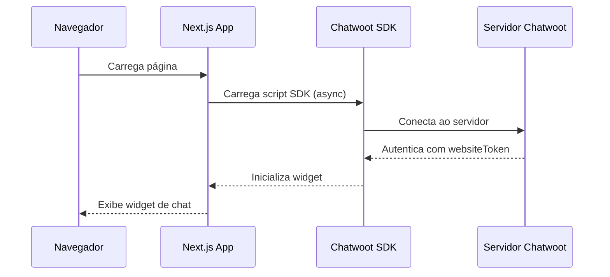
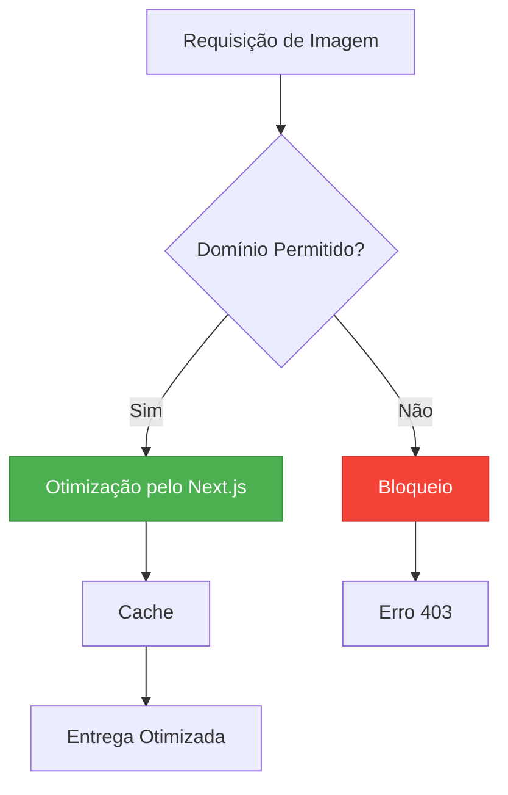

# Integrações Externas

<cite>
**Arquivos Referenciados neste Documento**  
- [components/chatwoot-widget.tsx](file://components/chatwoot-widget.tsx)
- [next.config.ts](file://next.config.ts)
- [README.md](file://README.md)
- [openspec/project.md](file://openspec/project.md)
- [README-deploy.md](file://README-deploy.md)
</cite>

## Sumário
1. [Introdução](#introdução)
2. [Integração com Chatwoot](#integração-com-chatwoot)
3. [Configuração de Imagens Externas](#configuração-de-imagens-externas)
4. [Considerações de Segurança](#considerações-de-segurança)
5. [Considerações de Desempenho](#considerações-de-desempenho)
6. [Guia de Configuração e Teste](#guia-de-configuração-e-teste)
7. [Adicionando Novas Integrações](#adicionando-novas-integrações)
8. [Conclusão](#conclusão)

## Introdução

Este documento apresenta a arquitetura de integrações externas do projeto **PZ Advogados**, com foco especial na implementação do widget de atendimento em tempo real do **Chatwoot**. O sistema foi projetado para permitir comunicação direta com clientes através de um chat integrado ao site, além de suportar o carregamento seguro de recursos externos como imagens do Unsplash.

A arquitetura segue padrões modernos de desenvolvimento web com Next.js, priorizando segurança, desempenho e facilidade de manutenção. As integrações são implementadas como componentes reutilizáveis que podem ser facilmente configurados através de variáveis de ambiente, permitindo flexibilidade entre diferentes ambientes (desenvolvimento, homologação, produção).

**Section sources**
- [README.md](file://README.md#L0-L404)

## Integração com Chatwoot

O componente `ChatwootWidget` é responsável por carregar e inicializar o widget de atendimento do Chatwoot. Ele utiliza o componente `Script` do Next.js para carregar o SDK do Chatwoot de forma assíncrona, garantindo que não interfira no carregamento inicial da página.

O widget é configurado com dois parâmetros essenciais:
- `websiteToken`: Identificador único do website no Chatwoot
- `baseUrl`: URL base da instância do Chatwoot

Atualmente, o token está embutido diretamente no código-fonte, o que não é uma prática recomendada para produção. A configuração ideal utiliza variáveis de ambiente como `NEXT_PUBLIC_CHATWOOT_TOKEN` e `NEXT_PUBLIC_CHATWOOT_WEBSITE_TOKEN`, conforme documentado no README do projeto.



**Diagram sources**
- [components/chatwoot-widget.tsx](file://components/chatwoot-widget.tsx#L4-L25)

**Section sources**
- [components/chatwoot-widget.tsx](file://components/chatwoot-widget.tsx#L1-L27)
- [README.md](file://README.md#L0-L404)

## Configuração de Imagens Externas

A configuração em `next.config.ts` permite o carregamento de imagens do domínio `images.unsplash.com`, essencial para utilizar fotos de alta qualidade no site sem armazená-las localmente.

A configuração utiliza o recurso `remotePatterns` do Next.js, que define quais domínios externos são permitidos para carregamento de imagens. Isso é crucial para a segurança e desempenho do site, pois o Next.js pode então otimizar automaticamente essas imagens (redimensionamento, formatação, lazy loading).



**Diagram sources**
- [next.config.ts](file://next.config.ts#L0-L16)

**Section sources**
- [next.config.ts](file://next.config.ts#L0-L16)
- [README-deploy.md](file://README-deploy.md#L84-L86)

## Considerações de Segurança

A segurança das integrações externas é uma prioridade no projeto. O uso de variáveis de ambiente com prefixo `NEXT_PUBLIC_` é uma prática recomendada do Next.js que garante que apenas variáveis intencionais sejam expostas ao cliente.

As principais medidas de segurança implementadas incluem:

- **Variáveis de ambiente**: Tokens sensíveis devem ser configurados via `.env.local` e nunca embutidos no código-fonte
- **Content Security Policy (CSP)**: Embora não explicitamente configurada, o uso do `Script` do Next.js ajuda na gestão de scripts externos
- **Validação de origem**: A configuração `remotePatterns` valida explicitamente os domínios de imagens permitidos
- **Isolamento de scripts**: O script do Chatwoot é carregado em um contexto separado, minimizando o risco de XSS

A documentação do projeto menciona que o token do Chatwoot deve ser configurado via variáveis de ambiente (`NEXT_PUBLIC_CHATWOOT_TOKEN`), mas atualmente está embutido no código-fonte, representando um risco de segurança que deve ser corrigido.

**Section sources**
- [README.md](file://README.md#L0-L404)
- [openspec/project.md](file://openspec/project.md#L157-L195)

## Considerações de Desempenho

O desempenho das integrações externas foi cuidadosamente considerado na arquitetura do projeto. O carregamento assíncrono do script do Chatwoot é essencial para garantir que a funcionalidade de chat não impacte negativamente o tempo de carregamento inicial da página.

Práticas de otimização implementadas:

- **Carregamento assíncrono**: O script do Chatwoot é carregado com `async` e `defer`, não bloqueando o carregamento da página
- **Estratégia afterInteractive**: O script é carregado após a interação inicial do usuário, priorizando o conteúdo principal
- **Otimização de imagens**: O Next.js automaticamente otimiza imagens do Unsplash (redimensionamento, formatação WebP, lazy loading)
- **Bundle standalone**: A configuração `output: 'standalone'` cria uma build otimizada para produção

Essas práticas garantem que o site mantenha tempos de carregamento rápidos mesmo com integrações externas, proporcionando uma experiência de usuário fluida.

**Section sources**
- [components/chatwoot-widget.tsx](file://components/chatwoot-widget.tsx#L4-L25)
- [next.config.ts](file://next.config.ts#L0-L16)
- [openspec/project.md](file://openspec/project.md#L157-L195)

## Guia de Configuração e Teste

### Configuração do Chatwoot

1. Obtenha os tokens no painel administrativo do Chatwoot:
   - `NEXT_PUBLIC_CHATWOOT_TOKEN`: Token de acesso da API
   - `NEXT_PUBLIC_CHATWOOT_WEBSITE_TOKEN`: Token específico do website

2. Crie um arquivo `.env.local` na raiz do projeto:
```env
NEXT_PUBLIC_CHATWOOT_TOKEN=seu_token_aqui
NEXT_PUBLIC_CHATWOOT_WEBSITE_TOKEN=seu_website_token
```

3. Atualize o componente `chatwoot-widget.tsx` para utilizar as variáveis de ambiente:
```tsx
window.chatwootSDK.run({
  websiteToken: process.env.NEXT_PUBLIC_CHATWOOT_WEBSITE_TOKEN,
  baseUrl: process.env.NEXT_PUBLIC_CHATWOOT_BASE_URL || "https://chatwoot-web.platform.sinesys.app"
})
```

### Teste da Integração

1. **Ambiente de desenvolvimento**:
   ```bash
   npm run dev
   ```
   Verifique se o widget de chat aparece no canto inferior direito.

2. **Ambiente de produção**:
   ```bash
   npm run build
   npm start
   ```
   Teste o carregamento e funcionalidade completa do chat.

3. **Verificação de segurança**:
   - Confirme que os tokens não aparecem no código-fonte gerado
   - Verifique o uso de HTTPS para todas as requisições externas

4. **Testes de desempenho**:
   - Utilize o Lighthouse para verificar o impacto no tempo de carregamento
   - Confirme que o script do Chatwoot não bloqueia o carregamento da página

**Section sources**
- [README.md](file://README.md#L0-L404)
- [components/chatwoot-widget.tsx](file://components/chatwoot-widget.tsx#L1-L27)

## Adicionando Novas Integrações

Para adicionar novas integrações externas ao projeto, siga este padrão arquitetural:

### 1. Criação do Componente de Integração

Crie um novo componente na pasta `components/` seguindo o padrão existente:

```tsx
'use client';

import Script from 'next/script';

export default function NovaIntegracao() {
  return (
    <Script id="nova-integracao-script" strategy="afterInteractive">
      {`
        // Código de inicialização da nova integração
        (function() {
          // Configuração com variáveis de ambiente
          const config = {
            token: process.env.NEXT_PUBLIC_NOVA_INTEGRACAO_TOKEN,
            apiUrl: process.env.NEXT_PUBLIC_NOVA_INTEGRACAO_API_URL
          };
          // Carregamento assíncrono do script
        })();
      `}
    </Script>
  );
}
```

### 2. Configuração de Variáveis de Ambiente

Adicione as variáveis necessárias ao `.env.local`:
```env
NEXT_PUBLIC_NOVA_INTEGRACAO_TOKEN=seu_token
NEXT_PUBLIC_NOVA_INTEGRACAO_API_URL=https://api.servico-externo.com
```

### 3. Atualização da Configuração de Segurança

Se a nova integração requer carregamento de recursos externos, atualize `next.config.ts`:

```ts
const nextConfig: NextConfig = {
  images: {
    remotePatterns: [
      {
        protocol: 'https',
        hostname: 'cdn.servico-externo.com',
        pathname: '/**',
      },
    ],
  },
};
```

### 4. Testes e Validação

Siga o processo de teste descrito anteriormente, garantindo:
- Funcionalidade correta em todos os ambientes
- Segurança adequada (tokens protegidos)
- Desempenho aceitável (sem impacto significativo no carregamento)
- Compatibilidade com diferentes navegadores

**Section sources**
- [next.config.ts](file://next.config.ts#L0-L16)
- [components/chatwoot-widget.tsx](file://components/chatwoot-widget.tsx#L1-L27)
- [README.md](file://README.md#L0-L404)

## Conclusão

A arquitetura de integrações externas do projeto PZ Advogados demonstra um equilíbrio entre funcionalidade, segurança e desempenho. O uso do Chatwoot para atendimento em tempo real melhora significativamente a experiência do cliente, enquanto a configuração cuidadosa do Next.js garante que recursos externos sejam carregados de forma segura e eficiente.

Embora a implementação atual seja funcional, recomenda-se fortemente mover o token do Chatwoot do código-fonte para variáveis de ambiente, corrigindo um risco de segurança identificado. Além disso, a padronização do processo de integração facilita a adição de novos serviços externos no futuro, mantendo a consistência e qualidade do código.

O projeto está bem posicionado para evoluir com novas integrações, desde que os padrões arquiteturais documentados sejam seguidos, garantindo manutenibilidade e segurança a longo prazo.