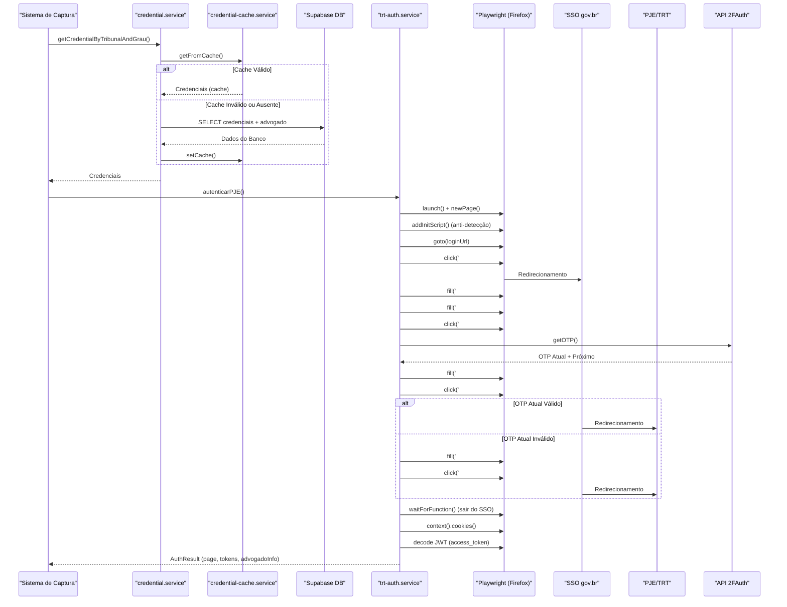

# Autenticação na Captura de Dados

<cite>
**Arquivos Referenciados neste Documento**   
- [trt-auth.service.ts](file://backend/captura/services/trt/trt-auth.service.ts)
- [credential.service.ts](file://backend/captura/credentials/credential.service.ts)
- [credential-cache.service.ts](file://backend/captura/credentials/credential-cache.service.ts)
- [twofauth.service.ts](file://backend/utils/api/twofauth.service.ts)
</cite>

## Sumário
1. [Introdução](#introdução)
2. [Fluxo de Autenticação no PJE/TRT](#fluxo-de-autenticação-no-pjetrt)
3. [Componentes-Chave do Sistema de Autenticação](#componentes-chave-do-sistema-de-autenticação)
4. [Gerenciamento de Credenciais e Cache](#gerenciamento-de-credenciais-e-cache)
5. [Autenticação de Dois Fatores (2FA)](#autenticação-de-dois-fatores-2fa)
6. [Diagrama de Sequência do Fluxo de Autenticação](#diagrama-de-sequência-do-fluxo-de-autenticação)
7. [Estratégias de Segurança](#estratégias-de-segurança)
8. [Tratamento de Erros e Mecanismos de Retentativa](#tratamento-de-erros-e-mecanismos-de-retentativa)
9. [Melhores Práticas para Configuração em Produção](#melhores-práticas-para-configuração-em-produção)
10. [Conclusão](#conclusão)

## Introdução
O sistema de autenticação na captura de dados é um componente crítico para o acesso automatizado ao Portal Eletrônico da Justiça do Trabalho (PJE/TRT). Este documento detalha o processo de autenticação automatizada, que combina credenciais de usuário, autenticação de dois fatores (2FA) via 2FAuth e gerenciamento seguro de sessões. A implementação é baseada em uma arquitetura modular, utilizando serviços especializados para cada etapa do processo, garantindo segurança, confiabilidade e eficiência na coleta de dados jurídicos.

## Fluxo de Autenticação no PJE/TRT
O processo de autenticação automatizada no PJE/TRT é composto por várias etapas sequenciais, projetadas para simular o comportamento de um usuário humano enquanto mantém a integridade e a segurança do sistema. O fluxo inicia com a inicialização de um navegador automatizado (Firefox), seguido pela navegação até a página de login do tribunal específico. O sistema então realiza o login SSO (Single Sign-On) do gov.br, inserindo as credenciais do usuário (CPF e senha). Após a submissão, o sistema é redirecionado para a página de autenticação de dois fatores (2FA), onde o código OTP (One-Time Password) é obtido via API do 2FAuth e inserido automaticamente. Após a validação do OTP, o sistema aguarda os redirecionamentos do SSO até atingir o domínio do PJE, onde os tokens de sessão (access_token e XSRF-Token) são extraídos dos cookies. Finalmente, o ID do advogado é decodificado do JWT (JSON Web Token) para identificação e auditoria.

**Section sources**
- [trt-auth.service.ts](file://backend/captura/services/trt/trt-auth.service.ts#L482-L528)

## Componentes-Chave do Sistema de Autenticação
O sistema de autenticação é composto por quatro serviços principais, cada um com uma responsabilidade bem definida.

### Serviço de Autenticação TRT (trt-auth.service.ts)
Este serviço é o orquestrador principal do processo de autenticação. Ele coordena todas as etapas, desde a inicialização do navegador até a extração final das informações do advogado. O serviço utiliza a biblioteca Playwright para automação de navegador, aplicando configurações anti-detecção para evitar bloqueios. Ele gerencia o estado da página, realiza navegação, preenche formulários e processa redirecionamentos. A função principal `autenticarPJE` encapsula todo o fluxo, retornando um objeto com a página autenticada, tokens de sessão e informações do advogado.

**Section sources**
- [trt-auth.service.ts](file://backend/captura/services/trt/trt-auth.service.ts#L469-L528)

### Serviço de Credenciais (credential.service.ts)
Este serviço é responsável por gerenciar o acesso às credenciais de login armazenadas no banco de dados. Ele fornece funções para buscar credenciais por ID ou por combinação de advogado, tribunal e grau. O serviço utiliza o cliente de serviço do Supabase para acessar a tabela `credenciais`, contornando as políticas de segurança (RLS) por meio de uma chave secreta. Ele também integra-se com o serviço de cache para otimizar o desempenho, garantindo que as credenciais sejam buscadas do banco de dados apenas quando necessário.

**Section sources**
- [credential.service.ts](file://backend/captura/credentials/credential.service.ts#L39-L82)

### Serviço de Cache de Credenciais (credential-cache.service.ts)
Este serviço implementa um sistema de cache em memória para credenciais, visando reduzir o número de consultas ao banco de dados e melhorar o desempenho. O cache utiliza uma chave composta por `advogadoId:tribunal:grau` para armazenar as credenciais com um timestamp. Um TTL (Time To Live) de 5 minutos é aplicado, após o qual as credenciais são consideradas expiradas e removidas do cache. O serviço fornece funções para obter, definir e limpar o cache, além de uma função para buscar múltiplas credenciais em lote, otimizando o processo para operações em massa.

**Section sources**
- [credential-cache.service.ts](file://backend/captura/credentials/credential-cache.service.ts#L44-L181)

### Serviço de Autenticação de Dois Fatores (twofauth.service.ts)
Este serviço fornece uma interface comum para a API do 2FAuth, utilizada para gerar códigos OTP (One-Time Password). Ele encapsula a lógica de chamada à API, tratando erros de rede, autenticação e resposta. O serviço pode receber uma configuração explícita ou utilizar variáveis de ambiente (`TWOFAUTH_API_URL`, `TWOFAUTH_API_TOKEN`, `TWOFAUTH_ACCOUNT_ID`). Ele valida a resposta da API, garantindo que o código OTP tenha o tamanho correto (6-10 caracteres) antes de retorná-lo. A função `getOTP` retorna tanto o código atual quanto o próximo, permitindo uma retentativa imediata em caso de falha.

**Section sources**
- [twofauth.service.ts](file://backend/utils/api/twofauth.service.ts#L77-L172)

## Gerenciamento de Credenciais e Cache
O gerenciamento de credenciais é um aspecto fundamental da segurança e eficiência do sistema. As credenciais são armazenadas criptografadas no banco de dados Supabase, na tabela `credenciais`. O acesso a essas credenciais é controlado pelo serviço `credential.service.ts`, que valida a ativação da credencial e a existência do CPF do advogado associado.

O cache de credenciais, implementado em `credential-cache.service.ts`, utiliza uma estrutura `Map` em memória. A chave do cache é gerada pela função `getCacheKey`, combinando o ID do advogado, o código do tribunal e o grau do processo. A função `getFromCache` verifica a validade do cache comparando o timestamp atual com o TTL de 5 minutos. Se o cache for válido, a credencial é retornada diretamente; caso contrário, ela é removida e a busca é feita no banco de dados. Após a busca, a credencial é salva no cache pela função `setCache`. A função `getCredentialsBatch` permite buscar múltiplas credenciais em uma única consulta ao banco, otimizando o desempenho para processos em lote.

**Section sources**
- [credential.service.ts](file://backend/captura/credentials/credential.service.ts#L106-L183)
- [credential-cache.service.ts](file://backend/captura/credentials/credential-cache.service.ts#L73-L181)

## Autenticação de Dois Fatores (2FA)
A autenticação de dois fatores é uma etapa obrigatória no processo de login no PJE/TRT. O sistema utiliza o serviço `twofauth.service.ts` para obter o código OTP. O fluxo de processamento do OTP no `trt-auth.service.ts` é robusto e resiliente:

1.  **Aguardar Campo OTP:** O sistema aguarda até 20 segundos (com 10 tentativas de 2 segundos) para que o campo de OTP se torne visível na página.
2.  **Obter Código OTP:** O serviço `getOTP` é chamado para obter o código atual e o próximo.
3.  **Inserir e Validar:** O código atual é inserido no campo e o botão de validação é clicado.
4.  **Tratamento de Falha:** Se o código atual for rejeitado (detectado por mensagens de erro na página), o sistema automaticamente utiliza o próximo código para uma retentativa imediata.
5.  **Aguardar Redirecionamento:** Após a validação bem-sucedida, o sistema aguarda até 120 segundos para sair do domínio do SSO (`sso.cloud.pje.jus.br`) e ser redirecionado para o domínio do tribunal.

Essa lógica de retentativa com dois códigos consecutivos aumenta significativamente a taxa de sucesso da autenticação, mitigando falhas causadas por latência de rede ou sincronização de tempo.

**Section sources**
- [trt-auth.service.ts](file://backend/captura/services/trt/trt-auth.service.ts#L88-L216)
- [twofauth.service.ts](file://backend/utils/api/twofauth.service.ts#L77-L172)

## Diagrama de Sequência do Fluxo de Autenticação

**Diagram sources**
- [trt-auth.service.ts](file://backend/captura/services/trt/trt-auth.service.ts#L482-L528)
- [credential.service.ts](file://backend/captura/credentials/credential.service.ts#L106-L183)
- [credential-cache.service.ts](file://backend/captura/credentials/credential-cache.service.ts#L124-L181)
- [twofauth.service.ts](file://backend/utils/api/twofauth.service.ts#L77-L172)

## Estratégias de Segurança
O sistema implementa várias camadas de segurança para proteger as credenciais e a integridade da sessão:

1.  **Criptografia em Repouso:** As credenciais (CPF e senha) são armazenadas criptografadas no banco de dados Supabase, utilizando políticas de segurança de linha de dados (RLS) e criptografia de coluna.
2.  **Cache em Memória com TTL:** As credenciais são descriptografadas e mantidas em memória apenas durante a execução da captura. O cache em memória tem um TTL de 5 minutos, garantindo que as credenciais sejam recarregadas do banco de dados periodicamente, refletindo quaisquer atualizações.
3.  **Configuração Segura do 2FAuth:** As credenciais da API do 2FAuth (`TWOFAUTH_API_URL`, `TWOFAUTH_API_TOKEN`, `accountId`) são fornecidas via variáveis de ambiente ou configuração segura, evitando hardcoding no código-fonte.
4.  **Anti-Detecção de Automação:** O serviço `trt-auth.service.ts` aplica scripts de inicialização para remover flags que identificam o navegador como automatizado (por exemplo, `navigator.webdriver`), reduzindo o risco de bloqueio por mecanismos de segurança do PJE.
5.  **Tokens de Sessão Seguros:** Os tokens de sessão (`access_token` e `XSRF-Token`) são extraídos diretamente dos cookies da sessão autenticada, garantindo que a sessão seja válida e segura.

**Section sources**
- [credential.service.ts](file://backend/captura/credentials/credential.service.ts#L49-L66)
- [credential-cache.service.ts](file://backend/captura/credentials/credential-cache.service.ts#L54-L55)
- [trt-auth.service.ts](file://backend/captura/services/trt/trt-auth.service.ts#L63-L82)

## Tratamento de Erros e Mecanismos de Retentativa
O sistema é projetado para ser resiliente a falhas comuns:

1.  **Falhas no 2FA:** Como descrito, o sistema utiliza um mecanismo de retentativa com dois códigos OTP (atual e próximo) para lidar com falhas de validação.
2.  **Bloqueios por Tentativas Excessivas:** Embora não explicitamente tratado no código fornecido, a arquitetura modular permite a implementação de estratégias de backoff exponencial. Após várias falhas consecutivas, o sistema pode aguardar um período crescente antes de tentar novamente, evitando bloqueios temporários.
3.  **Expiração de Sessão:** A sessão do PJE pode expirar após um período de inatividade. O sistema pode detectar isso ao tentar acessar uma página protegida e receber um redirecionamento para login. Nesse caso, o fluxo de autenticação completo pode ser reiniciado automaticamente.
4.  **Notificação de Erros:** O serviço `trt-auth.service.ts` utiliza um sistema de logging detalhado com níveis de severidade (info, success, warn, error). Erros críticos são lançados como exceções, que podem ser capturados por serviços superiores para notificação (por exemplo, e-mail, Slack) ou registro em um sistema de monitoramento.

**Section sources**
- [trt-auth.service.ts](file://backend/captura/services/trt/trt-auth.service.ts#L188-L209)
- [twofauth.service.ts](file://backend/utils/api/twofauth.service.ts#L117-L136)

## Melhores Práticas para Configuração em Produção
Para garantir a segurança e a estabilidade do sistema em produção, as seguintes práticas são recomendadas:

1.  **Variáveis de Ambiente Seguras:** Todas as credenciais sensíveis (Supabase Service Key, 2FAuth API Token, URLs) devem ser configuradas como variáveis de ambiente em um sistema de gerenciamento de segredos (por exemplo, AWS Secrets Manager, Hashicorp Vault), nunca no código-fonte.
2.  **Monitoramento e Alertas:** Implementar monitoramento para o serviço de autenticação, com alertas para falhas de login, erros de 2FAuth e expiração de sessão.
3.  **Rotação de Credenciais:** Estabelecer um processo para a rotação regular das credenciais do 2FAuth e das senhas dos usuários no PJE.
4.  **Auditoria de Acesso:** Utilizar o ID do advogado extraído do JWT para registrar todas as ações de captura de dados, criando um log de auditoria completo.
5.  **Limitação de Taxa (Rate Limiting):** Implementar limitação de taxa nas chamadas à API do 2FAuth e no número de tentativas de login para evitar sobrecarga e bloqueios.
6.  **Testes de Integração:** Realizar testes de integração regulares para garantir que o fluxo de autenticação continue funcionando após atualizações no PJE ou no 2FAuth.

## Conclusão
O sistema de autenticação na captura de dados é uma solução robusta e segura para o acesso automatizado ao PJE/TRT. Ao combinar credenciais de usuário, autenticação de dois fatores e gerenciamento avançado de sessões, o sistema garante um acesso confiável e eficiente aos dados jurídicos. A arquitetura modular, com serviços especializados para credenciais, cache e 2FA, permite manutenção fácil e escalabilidade. As estratégias de segurança, como criptografia em repouso e cache com TTL, protegem as informações sensíveis, enquanto os mecanismos de retentativa e tratamento de erros garantem a resiliência do sistema. Com as melhores práticas de configuração em produção, este sistema fornece uma base sólida para a automação de processos jurídicos.