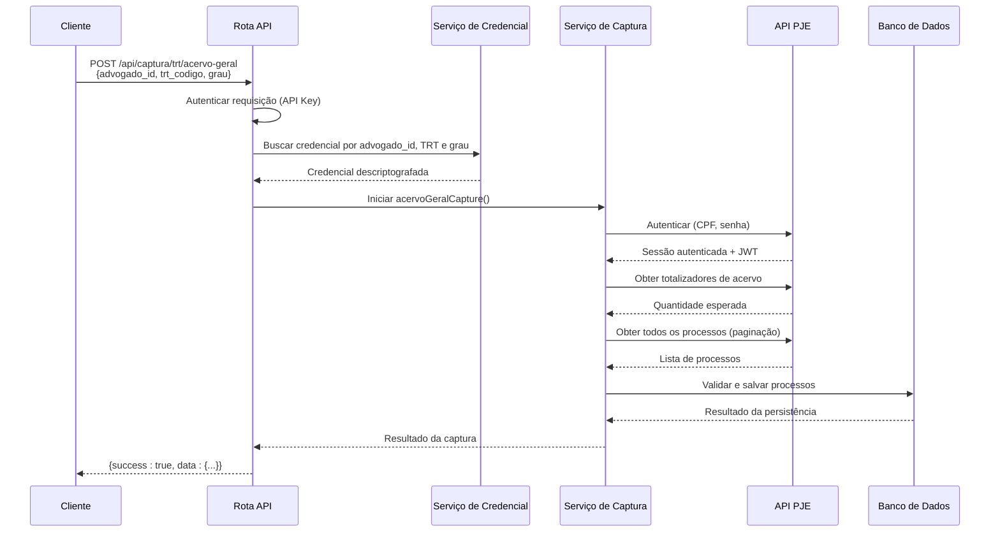
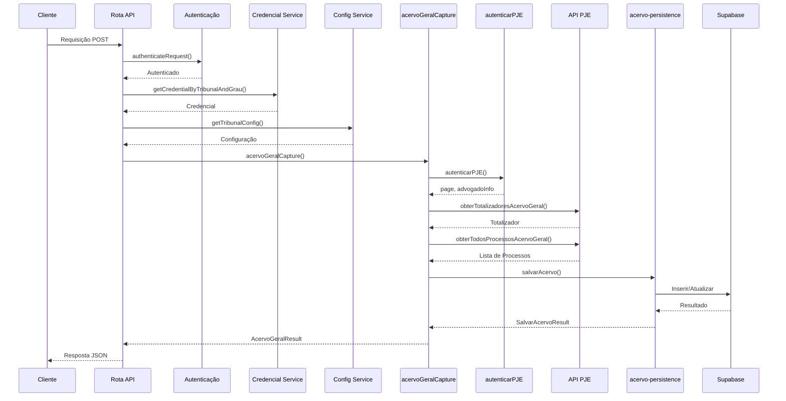

# Captura de Acervo Geral

<cite>
**Arquivos Referenciados neste Documento**  
- [acervo-geral.service.ts](file://backend/captura/services/trt/acervo-geral.service.ts)
- [trt-capture.service.ts](file://backend/captura/services/trt/trt-capture.service.ts)
- [acervo-persistence.service.ts](file://backend/captura/services/persistence/acervo-persistence.service.ts)
- [route.ts](file://app/api/captura/trt/acervo-geral/route.ts)
- [trt-types.ts](file://backend/types/captura/trt-types.ts)
</cite>

## Sumário
1. [Introdução](#introdução)
2. [Fluxo de Captura de Acervo Geral](#fluxo-de-captura-de-acervo-geral)
3. [Autenticação no PJE](#autenticação-no-pje)
4. [Extração de Dados](#extração-de-dados)
5. [Persistência Estruturada no Supabase](#persistência-estruturada-no-supabase)
6. [Rota API e Autenticação com API Key](#rota-api-e-autenticação-com-api-key)
7. [Mapeamento de Dados entre PJE e Modelo Interno](#mapeamento-de-dados-entre-pje-e-modelo-interno)
8. [Diagrama de Sequência do Fluxo Completo](#diagrama-de-sequência-do-fluxo-completo)
9. [Considerações de Desempenho e Tratamento de Erros](#considerações-de-desempenho-e-tratamento-de-erros)
10. [Validação de Integridade com Scripts de Teste](#validação-de-integridade-com-scripts-de-teste)

## Introdução

A funcionalidade de **Captura de Acervo Geral** tem como objetivo extrair dados processuais completos dos Tribunais Regionais do Trabalho (TRTs), incluindo número do processo, partes envolvidas, movimentações e status. Essa funcionalidade é essencial para manter um repositório atualizado de processos judiciais, permitindo análise, acompanhamento e gestão eficiente por escritórios de advocacia. A implementação é realizada de forma segura e automatizada, utilizando credenciais armazenadas no banco de dados, autenticação robusta no Portal Judicial Eletrônico (PJE) e persistência estruturada no Supabase.

## Fluxo de Captura de Acervo Geral

O fluxo de captura de acervo geral é composto por etapas bem definidas que garantem a integridade, segurança e eficiência do processo de extração de dados. Ele inicia com uma requisição à API, passa pela autenticação no PJE, extração dos dados via API REST, validação com base em totalizadores, persistência no banco de dados e finaliza com a resposta estruturada ao cliente. Cada etapa é projetada para lidar com falhas, garantir a consistência dos dados e otimizar o desempenho.

**Fontes da seção**
- [acervo-geral.service.ts](file://backend/captura/services/trt/acervo-geral.service.ts#L37-L119)

## Autenticação no PJE

A autenticação no PJE é realizada pelo serviço `trt-auth.service.ts`, que utiliza o navegador Firefox em modo headless para simular uma sessão de usuário real. O processo envolve o preenchimento automático de CPF e senha, além do suporte a autenticação de dois fatores (2FA), quando configurado. Após o login bem-sucedido, o sistema extrai o ID do advogado a partir do JWT (JSON Web Token) retornado pelo PJE, que é utilizado nas chamadas subsequentes à API REST. A autenticação é realizada apenas uma vez por requisição, e os recursos do navegador são liberados ao final do processo.

**Fontes da seção**
- [acervo-geral.service.ts](file://backend/captura/services/trt/acervo-geral.service.ts#L43-L49)
- [trt-auth.service.ts](file://backend/captura/services/trt/trt-auth.service.ts#L481-L528)

## Extração de Dados

A extração de dados é feita diretamente através da API REST do PJE, evitando o uso de scraping de HTML. O serviço `acervo-geral.service.ts` chama a função `obterTodosProcessosAcervoGeral`, que realiza múltiplas requisições paginadas para obter todos os processos do acervo geral do advogado autenticado. Antes da extração completa, o sistema consulta os totalizadores de acervo geral para validar se a quantidade de processos obtida corresponde ao esperado. Caso haja discrepância, um erro é lançado, indicando que a raspagem pode estar incompleta.

**Fontes da seção**
- [acervo-geral.service.ts](file://backend/captura/services/trt/acervo-geral.service.ts#L60-L64)
- [acervo-geral.ts](file://backend/api/pje-trt/acervo-geral.ts#L188-L249)

## Persistência Estruturada no Supabase

Os dados extraídos são persistidos de forma estruturada no banco de dados Supabase através do serviço `acervo-persistence.service.ts`. Antes da inserção ou atualização, o sistema compara os dados recebidos com os já existentes no banco para evitar atualizações desnecessárias. Se o registro não existir, ele é inserido. Se existir e houver alterações, o registro é atualizado, e os dados anteriores são armazenados no campo `dados_anteriores` para auditoria. O serviço também registra logs detalhados de inserções, atualizações, registros não alterados e erros, facilitando a depuração e o monitoramento.

**Fontes da seção**
- [acervo-geral.service.ts](file://backend/captura/services/trt/acervo-geral.service.ts#L78-L107)
- [acervo-persistence.service.ts](file://backend/captura/services/persistence/acervo-persistence.service.ts#L84-L234)

## Rota API e Autenticação com API Key

A rota API `app/api/captura/trt/acervo-geral/route.ts` é responsável por orquestrar todo o processo de captura. Ela exige autenticação via API Key, Bearer Token ou sessão do Supabase, garantindo que apenas clientes autorizados possam acionar a captura. A requisição deve conter o `advogado_id`, o código do TRT (ex: TRT1) e o grau do processo (primeiro_grau ou segundo_grau). Com base nesses parâmetros, a rota busca as credenciais criptografadas no banco de dados, descriptografa-as em memória, configura o tribunal e inicia o processo de captura. As credenciais são limpas da memória após o uso, garantindo segurança.

**Fontes do diagrama**
- [route.ts](file://app/api/captura/trt/acervo-geral/route.ts#L80-L161)

**Fontes da seção**
- [route.ts](file://app/api/captura/trt/acervo-geral/route.ts#L80-L161)

## Mapeamento de Dados entre PJE e Modelo Interno

O mapeamento de dados entre o formato retornado pelo PJE e o modelo interno do sistema é realizado de forma explícita no serviço de persistência. O tipo `Processo` definido em `types/pje-trt/types.ts` é convertido para o formato da tabela `acervo` no Supabase, com campos como `id_pje`, `numero_processo`, `descricao_orgao_julgador`, `classe_judicial`, `segredo_justica`, entre outros. Datas são convertidas para o formato ISO, e campos de texto são normalizados com `trim()`. Esse mapeamento garante que os dados sejam armazenados de forma consistente e adequada para consultas e relatórios.

**Fontes da seção**
- [acervo-persistence.service.ts](file://backend/captura/services/persistence/acervo-persistence.service.ts#L114-L136)
- [trt-types.ts](file://backend/types/captura/trt-types.ts#L49-L56)

## Diagrama de Sequência do Fluxo Completo

O diagrama abaixo ilustra o fluxo completo da funcionalidade de Captura de Acervo Geral, desde a requisição inicial até a resposta final, destacando as interações entre os principais componentes do sistema.

**Fontes do diagrama**
- [route.ts](file://app/api/captura/trt/acervo-geral/route.ts#L80-L161)
- [acervo-geral.service.ts](file://backend/captura/services/trt/acervo-geral.service.ts#L37-L119)
- [acervo-persistence.service.ts](file://backend/captura/services/persistence/acervo-persistence.service.ts#L84-L234)

## Considerações de Desempenho e Tratamento de Erros

O sistema implementa várias estratégias para garantir desempenho e resiliência. Um delay de 500ms entre as requisições paginadas à API do PJE evita sobrecarga e respeita o rate limiting. Em caso de falha na persistência, o erro é registrado, mas a captura não é interrompida, permitindo que os dados sejam retornados ao cliente mesmo que não tenham sido salvos. O tratamento de erros inclui validação de sessão expirada, falhas de autenticação e possíveis CAPTCHAs, embora o uso da API REST minimize esses riscos. O serviço também implementa retry automático para operações de rede, garantindo robustez em condições de rede instáveis.

**Fontes da seção**
- [acervo-geral.service.ts](file://backend/captura/services/trt/acervo-geral.service.ts#L104-L107)
- [acervo-geral.ts](file://backend/api/pje-trt/acervo-geral.ts#L188-L249)

## Validação de Integridade com Scripts de Teste

A integridade dos dados capturados é validada por scripts de teste localizados em `dev_data/scripts/`. O script `test-api-acervo-geral.ts` realiza chamadas à rota API com parâmetros de teste, verificando se a resposta contém os dados esperados e se o número de processos corresponde ao totalizador. Esses testes automatizados garantem que qualquer alteração no código ou na API do PJE seja detectada rapidamente, mantendo a confiabilidade da funcionalidade de captura.

**Fontes da seção**
- [test-api-acervo-geral.ts](file://dev_data/scripts/test-api-acervo-geral.ts#L256-L268)