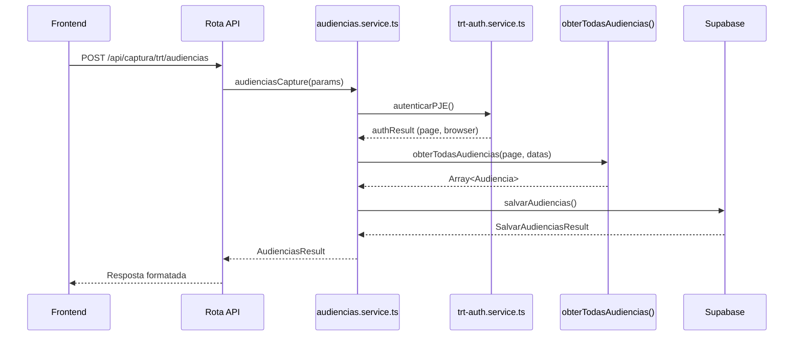
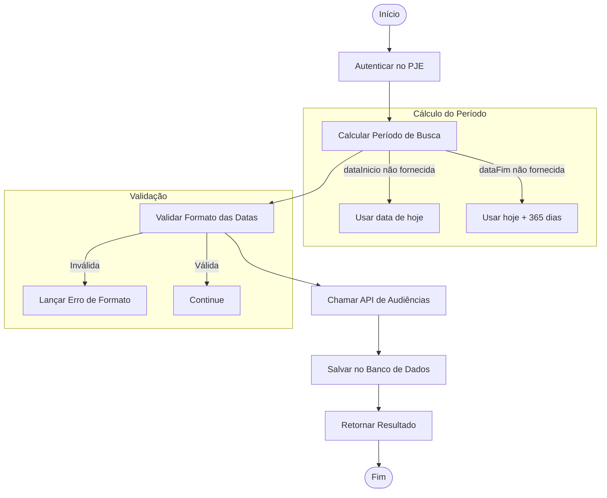
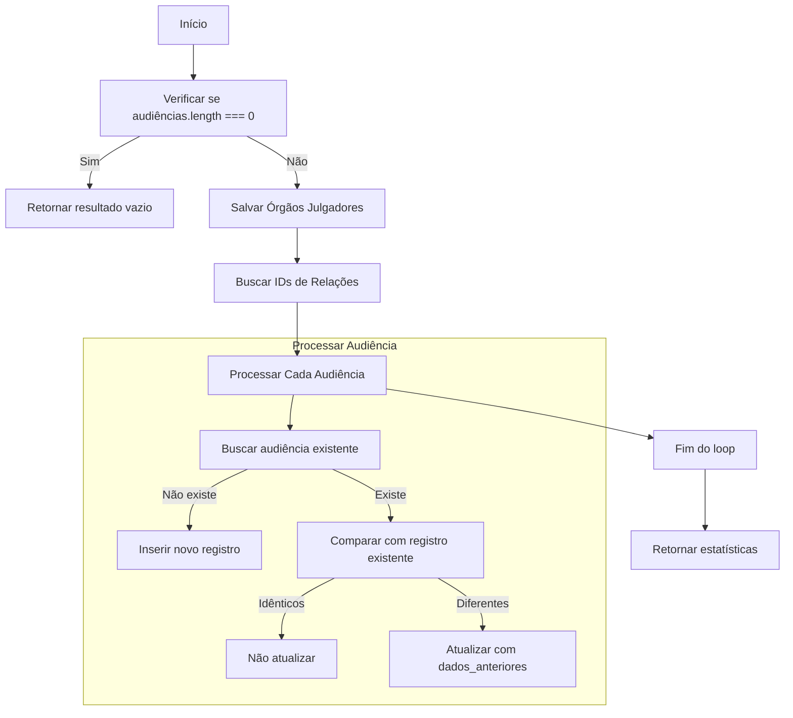
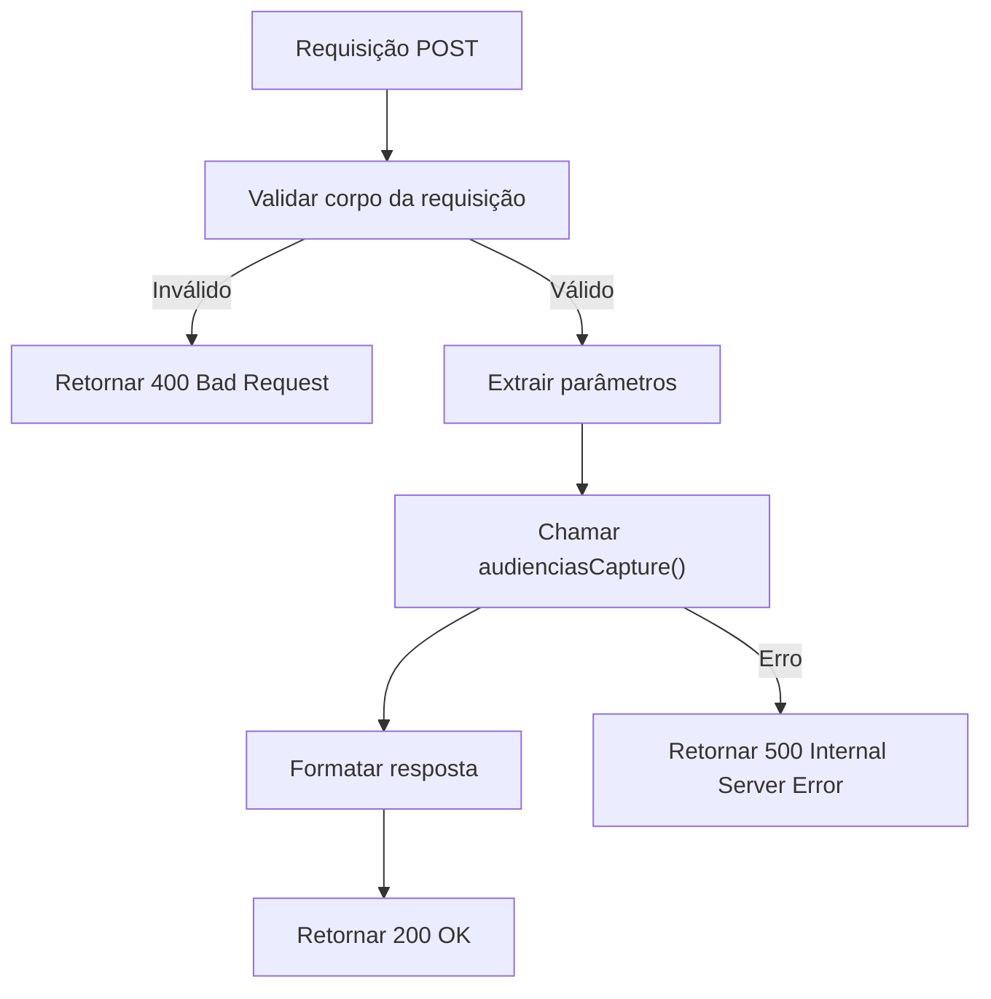
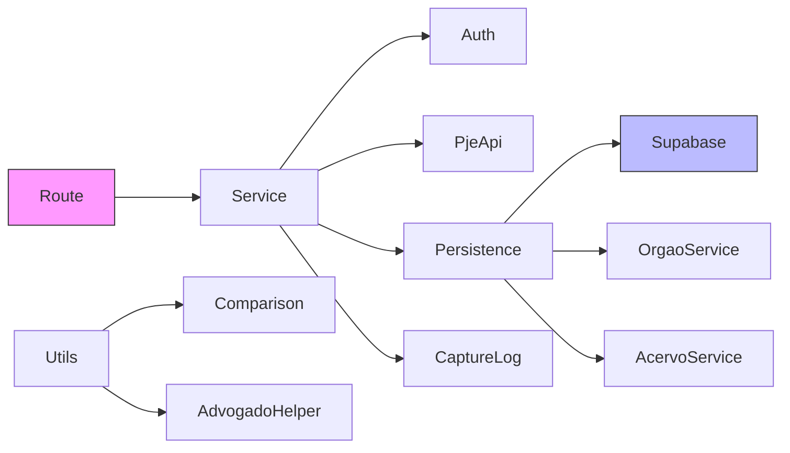

# Captura de Audiências

<cite>
**Arquivos Referenciados neste Documento**  
- [audiencias.service.ts](file://backend/captura/services/trt/audiencias.service.ts)
- [trt-capture.service.ts](file://backend/captura/services/trt/trt-capture.service.ts)
- [audiencias-persistence.service.ts](file://backend/captura/services/persistence/audiencias-persistence.service.ts)
- [audiencias.ts](file://backend/api/pje-trt/audiencias.ts)
- [route.ts](file://app/api/captura/trt/audiencias/route.ts)
- [test-api-audiencias.ts](file://dev_data/scripts/test-api-audiencias.ts)
</cite>

## Sumário
1. [Introdução](#introdução)
2. [Estrutura do Projeto](#estrutura-do-projeto)
3. [Componentes Principais](#componentes-principais)
4. [Visão Geral da Arquitetura](#visão-geral-da-arquitetura)
5. [Análise Detalhada dos Componentes](#análise-detalhada-dos-componentes)
6. [Análise de Dependências](#análise-de-dependências)
7. [Considerações de Desempenho](#considerações-de-desempenho)
8. [Guia de Solução de Problemas](#guia-de-solução-de-problemas)
9. [Conclusão](#conclusão)

## Introdução
A funcionalidade de **Captura de Audiências** tem como objetivo extrair informações estruturadas sobre audiências de processos judiciais do sistema PJE/TRT, incluindo datas, horários, tipos e status. Este documento detalha a implementação técnica do serviço, desde a autenticação no sistema até a persistência dos dados no banco de dados Supabase, passando pela validação, mapeamento e tratamento de casos especiais. O sistema é projetado para ser robusto frente a mudanças na interface do PJE, timeouts e falhas de login, utilizando uma API REST em vez de scraping HTML.

## Estrutura do Projeto
A funcionalidade de captura de audiências está organizada em múltiplos diretórios do backend, com separação clara de responsabilidades entre autenticação, captura, persistência e integração com a API.

```mermaid
graph TB
subgraph "API"
API[app/api/captura/trt/audiencias/route.ts]
end
subgraph "Captura"
Auth[backend/captura/services/trt/trt-auth.service.ts]
Capture[backend/captura/services/trt/audiencias.service.ts]
Types[backend/captura/services/trt/types.ts]
end
subgraph "API PJE"
PjeApi[backend/api/pje-trt/audiencias.ts]
end
subgraph "Persistência"
Persistence[backend/captura/services/persistence/audiencias-persistence.service.ts]
Supabase[backend/utils/supabase/service-client.ts]
end
API --> Capture
Capture --> Auth
Capture --> PjeApi
Capture --> Persistence
Persistence --> Supabase
```

**Fontes do Diagrama**
- [audiencias.service.ts](file://backend/captura/services/trt/audiencias.service.ts)
- [trt-auth.service.ts](file://backend/captura/services/trt/trt-auth.service.ts)
- [audiencias.ts](file://backend/api/pje-trt/audiencias.ts)
- [audiencias-persistence.service.ts](file://backend/captura/services/persistence/audiencias-persistence.service.ts)
- [route.ts](file://app/api/captura/trt/audiencias/route.ts)

**Fontes da Seção**
- [audiencias.service.ts](file://backend/captura/services/trt/audiencias.service.ts)
- [audiencias-persistence.service.ts](file://backend/captura/services/persistence/audiencias-persistence.service.ts)
- [audiencias.ts](file://backend/api/pje-trt/audiencias.ts)

## Componentes Principais
Os principais componentes envolvidos na captura de audiências são:
- **audiencias.service.ts**: Coordena todo o fluxo de captura.
- **trt-capture.service.ts**: Define os tipos e interfaces comuns.
- **audiencias-persistence.service.ts**: Gerencia a persistência no banco de dados.
- **obterTodasAudiencias**: Função da API PJE que realiza a extração real dos dados.
- **route.ts**: Rota da API que expõe a funcionalidade ao frontend.

**Fontes da Seção**
- [audiencias.service.ts](file://backend/captura/services/trt/audiencias.service.ts)
- [trt-capture.service.ts](file://backend/captura/services/trt/trt-capture.service.ts)
- [audiencias-persistence.service.ts](file://backend/captura/services/persistence/audiencias-persistence.service.ts)

## Visão Geral da Arquitetura
O sistema utiliza uma arquitetura em camadas, onde cada componente tem uma responsabilidade bem definida. A comunicação flui do frontend para a rota da API, que orquestra os serviços de autenticação, captura e persistência.



**Fontes do Diagrama**
- [audiencias.service.ts](file://backend/captura/services/trt/audiencias.service.ts)
- [trt-auth.service.ts](file://backend/captura/services/trt/trt-auth.service.ts)
- [audiencias.ts](file://backend/api/pje-trt/audiencias.ts)
- [audiencias-persistence.service.ts](file://backend/captura/services/persistence/audiencias-persistence.service.ts)
- [route.ts](file://app/api/captura/trt/audiencias/route.ts)

## Análise Detalhada dos Componentes

### Análise do Serviço de Captura
O serviço `audienciasCapture` é o coração da funcionalidade, coordenando todos os passos do processo.

#### Fluxo de Execução


**Fontes do Diagrama**
- [audiencias.service.ts](file://backend/captura/services/trt/audiencias.service.ts#L69-L182)

**Fontes da Seção**
- [audiencias.service.ts](file://backend/captura/services/trt/audiencias.service.ts#L69-L182)

### Análise do Serviço de Persistência
O serviço de persistência realiza comparações inteligentes para evitar atualizações desnecessárias e mantém logs detalhados das operações.

#### Lógica de Persistência


**Fontes do Diagrama**
- [audiencias-persistence.service.ts](file://backend/captura/services/persistence/audiencias-persistence.service.ts#L92-L314)

**Fontes da Seção**
- [audiencias-persistence.service.ts](file://backend/captura/services/persistence/audiencias-persistence.service.ts#L92-L314)

### Análise da Rota da API
A rota da API valida os dados de entrada e orquestra a chamada ao serviço de captura.

#### Validação de Entrada


**Fontes da Seção**
- [route.ts](file://app/api/captura/trt/audiencias/route.ts)

## Análise de Dependências
O sistema depende de vários serviços internos e externos, com uma clara separação de responsabilidades.



**Fontes do Diagrama**
- [audiencias.service.ts](file://backend/captura/services/trt/audiencias.service.ts)
- [audiencias-persistence.service.ts](file://backend/captura/services/persistence/audiencias-persistence.service.ts)
- [route.ts](file://app/api/captura/trt/audiencias/route.ts)

**Fontes da Seção**
- [audiencias.service.ts](file://backend/captura/services/trt/audiencias.service.ts)
- [audiencias-persistence.service.ts](file://backend/captura/services/persistence/audiencias-persistence.service.ts)

## Considerações de Desempenho
O sistema implementa várias otimizações para garantir desempenho e confiabilidade:
- Uso de `tamanhoPagina=100` para minimizar o número de requisições à API do PJE.
- Delay configurável entre páginas (`delayEntrePaginas`) para evitar rate limiting.
- Comparação de objetos antes de atualizações no banco de dados.
- Processamento em lote com feedback de progresso.

## Guia de Solução de Problemas
### Problemas Comuns e Soluções

| Problema | Causa Provável | Solução |
|--------|----------------|--------|
| Falha na autenticação | Credenciais inválidas ou 2FA | Verificar credenciais e configuração do 2FA |
| Timeout na API | Demora excessiva na resposta | Aumentar timeout ou verificar status do PJE |
| Mudança na UI do PJE | Alteração no seletor CSS | Atualizar os seletores no serviço de autenticação |
| Erro de validação de data | Formato incorreto | Garantir formato YYYY-MM-DD nas requisições |
| Falha na persistência | Conflito de chave única | Verificar integridade dos dados e chaves |

Os scripts de teste em `dev_data/scripts/` permitem simular diversos cenários, incluindo erros, para validar o comportamento do sistema.

**Fontes da Seção**
- [test-api-audiencias.ts](file://dev_data/scripts/test-api-audiencias.ts)
- [audiencias.service.ts](file://backend/captura/services/trt/audiencias.service.ts)
- [audiencias-persistence.service.ts](file://backend/captura/services/persistence/audiencias-persistence.service.ts)

## Conclusão
A funcionalidade de Captura de Audiências é um sistema robusto e bem estruturado que extrai, valida e persiste informações críticas do PJE/TRT. A arquitetura em camadas, com separação clara de responsabilidades, permite manutenção e evolução eficientes. O uso de API REST em vez de scraping HTML aumenta a confiabilidade, enquanto os mecanismos de log, validação e tratamento de erros garantem operação estável mesmo em condições adversas.