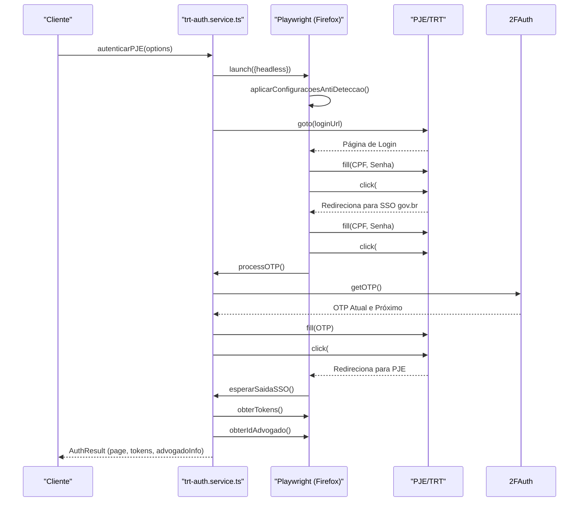
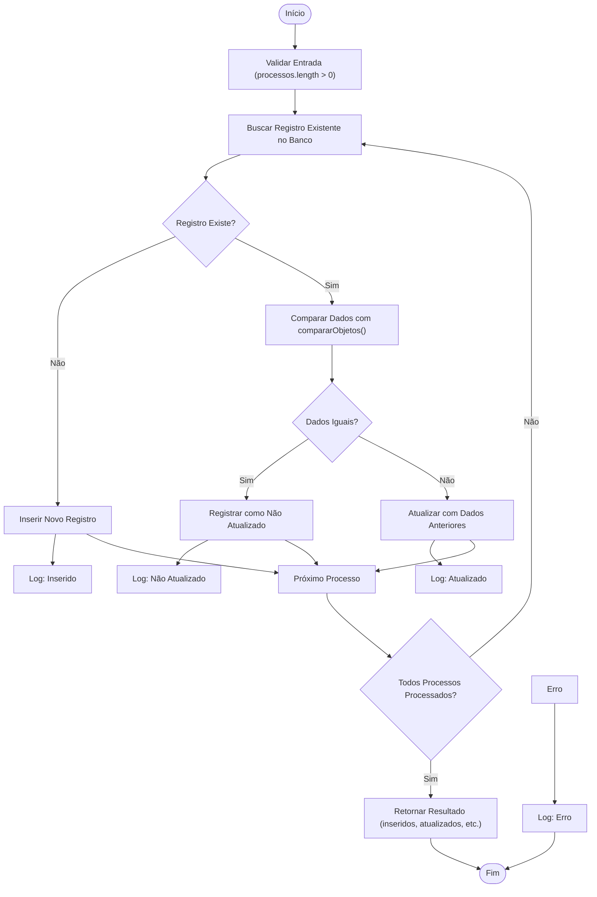
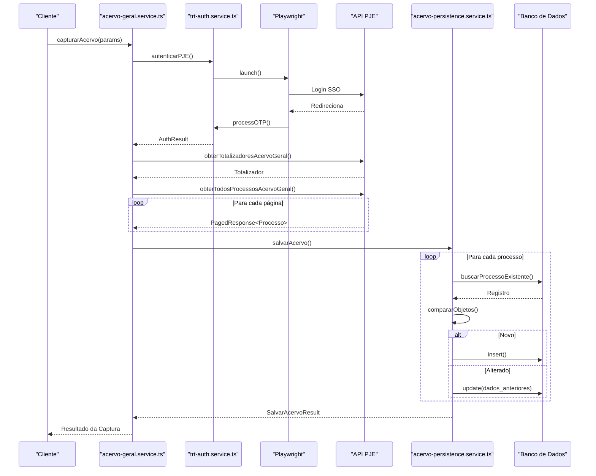
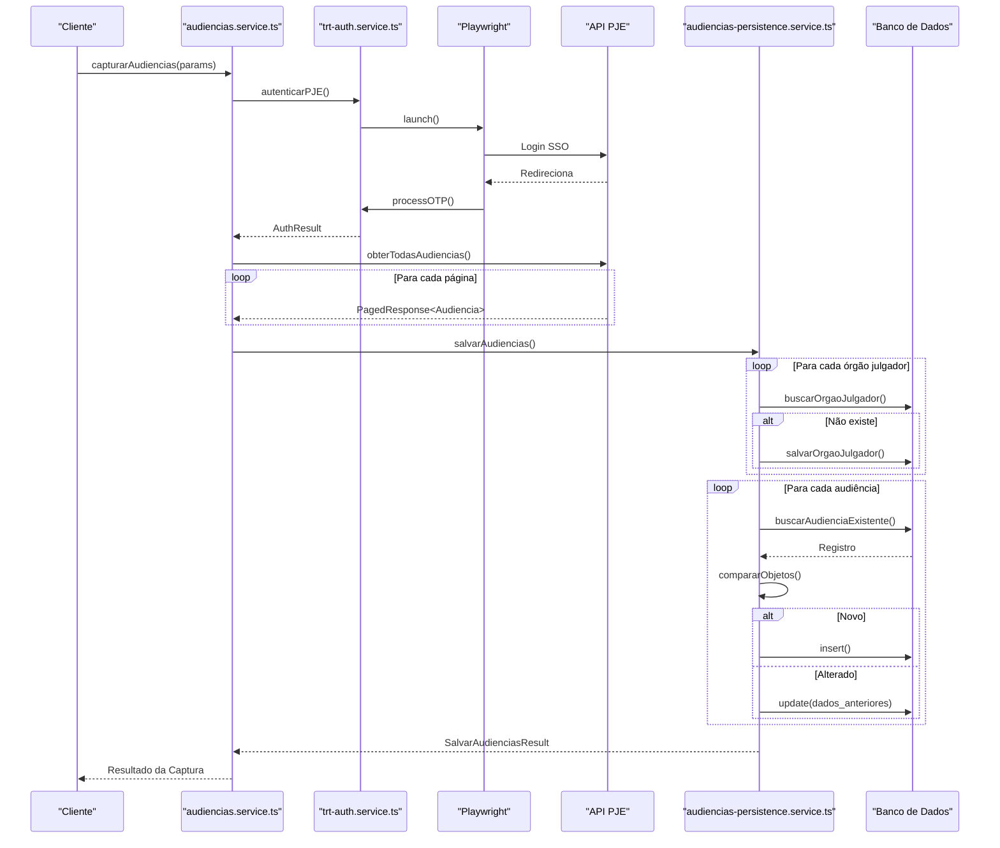
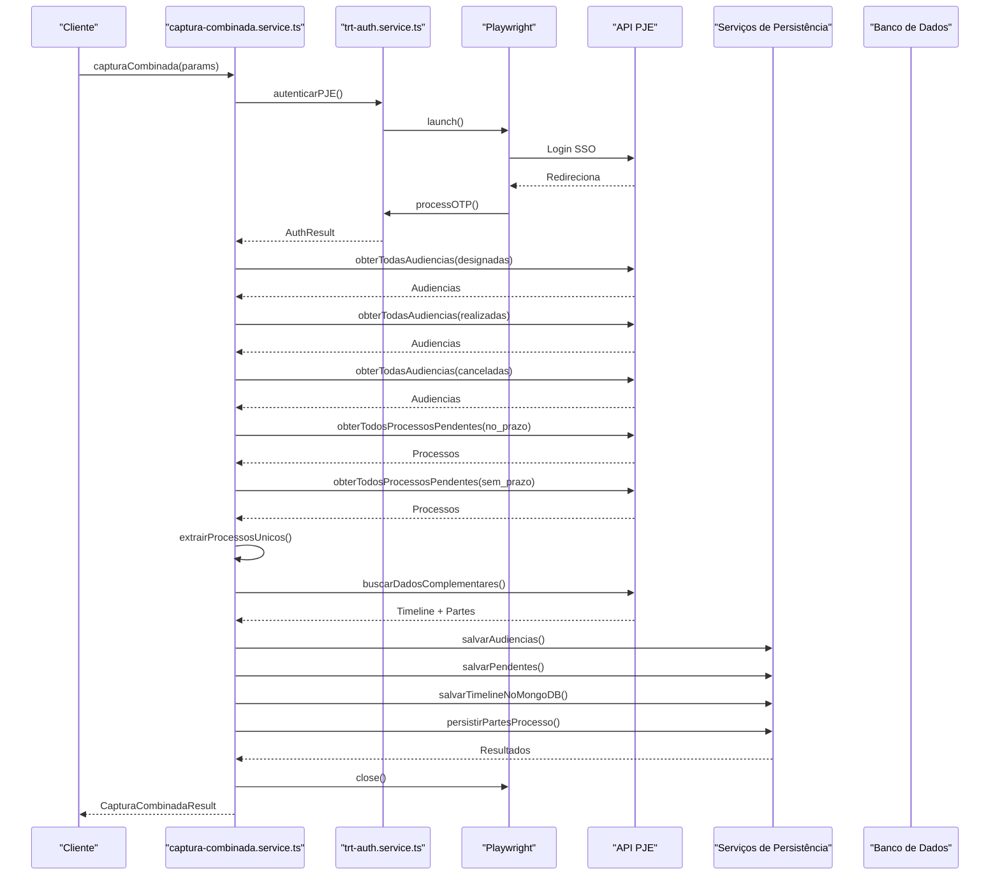

# Captura de Dados do PJE/TRT

<cite>
**Arquivos Referenciados neste Documento**   
- [trt-capture.service.ts](file://backend/captura/services/trt/trt-capture.service.ts)
- [trt-auth.service.ts](file://backend/captura/services/trt/trt-auth.service.ts)
- [acervo-persistence.service.ts](file://backend/captura/services/persistence/acervo-persistence.service.ts)
- [audiencias-persistence.service.ts](file://backend/captura/services/persistence/audiencias-persistence.service.ts)
- [acervo-geral.service.ts](file://backend/captura/services/trt/acervo-geral.service.ts)
- [audiencias.service.ts](file://backend/captura/services/trt/audiencias.service.ts)
- [acervo-geral.ts](file://backend/api/pje-trt/acervo-geral.ts)
- [audiencias.ts](file://backend/api/pje-trt/audiencias.ts)
- [trt-types.ts](file://backend/types/captura/trt-types.ts)
- [types.ts](file://backend/types/pje-trt/types.ts)
- [comparison.util.ts](file://backend/utils/captura/comparison.util.ts)
- [captura-combinada.service.ts](file://backend/captura/services/trt/captura-combinada.service.ts)
- [test-captura-combinada.ts](file://scripts/captura/test-captura-combinada.ts)
- [add-tipo-captura-combinada.sql](file://supabase/migrations/add-tipo-captura-combinada.sql)
- [pendentes-persistence.service.ts](file://backend/captura/services/persistence/pendentes-persistence.service.ts)
- [capture-log.service.ts](file://backend/captura/services/persistence/capture-log.service.ts)
</cite>

## Atualização do Sumário
**Alterações Realizadas**   
- Adicionada nova seção sobre o serviço de captura combinada
- Atualizada a seção de arquitetura para incluir o novo serviço
- Adicionado diagrama de sequência para o fluxo de captura combinada
- Atualizada a seção de testes com novo script de teste
- Incluída nova seção sobre considerações de desempenho da captura combinada

## Sumário
1. [Introdução](#introdução)
2. [Arquitetura do Serviço de Captura](#arquitetura-do-serviço-de-captura)
3. [Fluxo de Autenticação](#fluxo-de-autenticação)
4. [Persistência de Dados](#persistência-de-dados)
5. [Exemplos de Uso dos Serviços](#exemplos-de-uso-dos-serviços)
6. [Integração com Rotas API](#integração-com-rotas-api)
7. [Testes e Validação](#testes-e-validação)
8. [Considerações de Segurança, Desempenho e Escalabilidade](#considerações-de-segurança-desempenho-e-escalabilidade)
9. [Tratamento de Erros e Problemas Comuns](#tratamento-de-erros-e-problemas-comuns)
10. [Diagramas de Sequência](#diagramas-de-sequência)
11. [Serviço de Captura Combinada](#serviço-de-captura-combinada)

## Introdução

O módulo de Captura de Dados do PJE/TRT é responsável por automatizar a extração de informações dos sistemas eletrônicos dos Tribunais Regionais do Trabalho (TRTs). Este sistema permite a coleta de dados de três categorias principais: acervo geral, audiências e processos pendentes de manifestação. A automação garante que os dados jurídicos sejam atualizados de forma consistente, reduzindo erros manuais e aumentando a eficiência operacional.

A arquitetura do módulo é modular, com componentes especializados para autenticação, extração, processamento e persistência de dados. O sistema utiliza Playwright para automação de navegador, garantindo compatibilidade com os fluxos de login do PJE, que incluem autenticação de dois fatores (2FA). Após a autenticação, os dados são extraídos via APIs internas do PJE, processados e armazenados em um banco de dados PostgreSQL com controle de versão e auditoria.

Este documento detalha a estrutura, funcionamento e integração do módulo, fornecendo uma visão completa para desenvolvedores, administradores e usuários técnicos.

## Arquitetura do Serviço de Captura

O serviço de captura é implementado no arquivo `trt-capture.service.ts` e serve como camada de abstração entre os serviços específicos (acervo, audiências, etc.) e os parâmetros comuns de configuração. Ele define interfaces TypeScript que padronizam os parâmetros de entrada para todos os tipos de captura.

As principais interfaces definidas são:
- `CapturaTRTParams`: Parâmetros base para qualquer operação de captura, incluindo credenciais, configuração do TRT e opções de 2FA.
- `CapturaPendentesManifestacaoParams`: Estende os parâmetros base com filtro de prazo (`no_prazo` ou `sem_prazo`).
- `CapturaAudienciasParams`: Inclui parâmetros base mais datas de início e fim para o período de busca de audiências.
- `CapturaCombinadaParams`: Tipo especializado para captura combinada, que reutiliza `CapturaTRTParams` mas executa múltiplas operações em uma única sessão.

Essa estrutura permite que os serviços específicos herdem configurações comuns, garantindo consistência e facilitando a manutenção. O serviço de captura não executa a lógica de extração diretamente, mas fornece a estrutura para que os serviços especializados o façam de forma padronizada.

**Fontes da seção**
- [trt-capture.service.ts](file://backend/captura/services/trt/trt-capture.service.ts#L1-L49)
- [trt-types.ts](file://backend/types/captura/trt-types.ts#L49-L56)

## Fluxo de Autenticação

A autenticação no PJE/TRT é gerenciada pelo serviço `trt-auth.service.ts`, que implementa todo o fluxo necessário para acessar os dados protegidos. O processo envolve:

1. **Inicialização do Navegador**: Utiliza o Firefox em modo headless (opcionalmente visível para depuração).
2. **Configurações Anti-Detecção**: Aplica scripts para mascarar a automação, como remoção do flag `navigator.webdriver` e definição de propriedades realistas de navegador.
3. **Login SSO gov.br**: Navega até a página de login, preenche CPF e senha, e submete o formulário.
4. **Autenticação de Dois Fatores (OTP)**: Aguarda o campo OTP, obtém o código via serviço 2FAuth, preenche e submete. O sistema tenta com o próximo código se o atual falhar.
5. **Extração de Tokens**: Após o login bem-sucedido, captura o `access_token` e `XSRF-Token` dos cookies.
6. **Extração de Informações do Advogado**: Decodifica o JWT para obter o ID do advogado, CPF e nome.

A função principal `autenticarPJE` retorna um objeto com a página autenticada, tokens e informações do advogado, que são usados nas requisições subsequentes. O serviço é robusto, com tratamento de erros detalhado e logs informativos.

**Fontes do diagrama**
- [trt-auth.service.ts](file://backend/captura/services/trt/trt-auth.service.ts#L482-L528)

**Fontes da seção**
- [trt-auth.service.ts](file://backend/captura/services/trt/trt-auth.service.ts#L468-L528)

## Persistência de Dados

A persistência dos dados capturados é realizada por serviços especializados que garantem integridade, evitam duplicações e mantêm histórico de alterações. Os principais serviços são `acervo-persistence.service.ts` e `audiencias-persistence.service.ts`.

### Persistência do Acervo Geral

O serviço `acervo-persistence.service.ts` salva processos do acervo geral e arquivados. Antes de atualizar um registro existente, compara os dados novos com os existentes usando a função `compararObjetos`. Se houver alterações, o registro antigo é armazenado no campo `dados_anteriores` para auditoria.

O processo de persistência inclui:
- Conversão de datas para formato ISO.
- Busca do registro existente pelo ID do PJE, TRT, grau e número do processo.
- Comparação de campos, ignorando campos de controle (`id`, `created_at`, etc.).
- Inserção (se novo) ou atualização (se alterado), com log detalhado.

### Persistência de Audiências

O serviço `audiencias-persistence.service.ts` tem uma lógica adicional: antes de salvar as audiências, garante que os órgãos julgadores relacionados estejam salvos no banco. Isso evita referências órfãs.

O fluxo é:
1. Salvar todos os órgãos julgadores necessários.
2. Buscar IDs de órgãos julgadores e processos no acervo.
3. Processar cada audiência individualmente, comparando antes de atualizar.
4. Registrar inserções, atualizações e erros.

### Persistência de Expedientes

O serviço `pendentes-persistence.service.ts` persiste processos pendentes de manifestação. Ele segue o mesmo padrão de comparação antes da atualização, garantindo que apenas registros modificados sejam atualizados com o histórico preservado em `dados_anteriores`.

Ambos os serviços usam a função `captureLogService` para registrar operações, facilitando auditoria e depuração.

**Fontes do diagrama**
- [acervo-persistence.service.ts](file://backend/captura/services/persistence/acervo-persistence.service.ts#L85-L235)
- [audiencias-persistence.service.ts](file://backend/captura/services/persistence/audiencias-persistence.service.ts#L92-L311)
- [pendentes-persistence.service.ts](file://backend/captura/services/persistence/pendentes-persistence.service.ts#L95-L247)
- [comparison.util.ts](file://backend/utils/captura/comparison.util.ts#L7-L44)

**Fontes da seção**
- [acervo-persistence.service.ts](file://backend/captura/services/persistence/acervo-persistence.service.ts#L85-L235)
- [audiencias-persistence.service.ts](file://backend/captura/services/persistence/audiencias-persistence.service.ts#L92-L311)
- [pendentes-persistence.service.ts](file://backend/captura/services/persistence/pendentes-persistence.service.ts#L95-L247)
- [comparison.util.ts](file://backend/utils/captura/comparison.util.ts#L7-L44)

## Exemplos de Uso dos Serviços

Os serviços `acervo-geral.service.ts` e `audiencias.service.ts` são os pontos de entrada para a captura de dados. Eles orquestram autenticação, extração e persistência.

### Serviço de Acervo Geral

O serviço `acervo-geral.service.ts` utiliza as funções do arquivo `acervo-geral.ts` para extrair dados:

1. Autentica no PJE usando `autenticarPJE`.
2. Obtém o ID do advogado do resultado da autenticação.
3. Usa `obterTotalizadoresAcervoGeral` para validar a quantidade esperada de processos.
4. Chama `obterTodosProcessosAcervoGeral` para buscar todos os processos do acervo geral.
5. Persiste os dados usando `salvarAcervo`.

A função `obterTodosProcessosAcervoGeral` faz paginação automática, chamando `obterProcessosAcervoGeral` para cada página, com delay entre requisições para evitar rate limiting.

### Serviço de Audiências

O serviço `audiencias.service.ts` segue um fluxo similar:

1. Autentica no PJE.
2. Usa `obterTodasAudiencias` para buscar todas as audiências no período especificado.
3. Persiste os dados usando `salvarAudiencias`.

A função `obterTodasAudiencias` também faz paginação automática, chamando `obterPautaAudiencias` para cada página.

Ambos os serviços encapsulam a complexidade, fornecendo uma interface simples para a captura completa de dados.

**Fontes da seção**
- [acervo-geral.service.ts](file://backend/captura/services/trt/acervo-geral.service.ts)
- [audiencias.service.ts](file://backend/captura/services/trt/audiencias.service.ts)
- [acervo-geral.ts](file://backend/api/pje-trt/acervo-geral.ts#L189-L249)
- [audiencias.ts](file://backend/api/pje-trt/audiencias.ts#L330-L421)

## Integração com Rotas API

As rotas API em `app/api/captura/trt/` expõem os serviços de captura via endpoints HTTP. Cada rota corresponde a um tipo de captura:

- `acervo-geral/route.ts`: Captura o acervo geral.
- `audiencias/route.ts`: Captura audiências.
- `pendentes-manifestacao/route.ts`: Captura processos pendentes.
- `arquivados/route.ts`: Captura processos arquivados.
- `combinada/route.ts`: Captura combinada (novo endpoint).

As rotas recebem parâmetros via query string (como TRT, grau, datas), validam as credenciais, chamam o serviço de captura correspondente e retornam o resultado. A integração com o Next.js permite que esses endpoints sejam chamados diretamente por clientes HTTP, facilitando a automação e integração com outros sistemas.

**Fontes da seção**
- [app/api/captura/trt/acervo-geral/route.ts](file://app/api/captura/trt/acervo-geral/route.ts)
- [app/api/captura/trt/audiencias/route.ts](file://app/api/captura/trt/audiencias/route.ts)
- [app/api/captura/trt/combinada/route.ts](file://app/api/captura/trt/combinada/route.ts)

## Testes e Validação

Os scripts de teste em `scripts/captura/` validam o funcionamento do módulo. Eles incluem:

- `test-api-acervo-geral.ts`: Testa a extração do acervo geral para múltiplos TRTs.
- `test-api-audiencias.ts`: Testa a extração de audiências.
- `test-api-pendentes-manifestacao.ts`: Testa a extração de pendentes.
- `test-api-arquivados.ts`: Testa a extração de arquivados.
- `test-captura-combinada.ts`: Testa a nova funcionalidade de captura combinada.

Os testes simulam chamadas aos serviços, verificam a estrutura dos dados retornados e validam a persistência. Os resultados são salvos em arquivos JSON e logs, permitindo análise detalhada. Os dados de teste em `scripts/results/` incluem resultados reais de captura, úteis para depuração e validação de regressão.

**Fontes da seção**
- [scripts/test-api-acervo-geral.ts](file://scripts/test-api-acervo-geral.ts)
- [scripts/test-api-audiencias.ts](file://scripts/test-api-audiencias.ts)
- [scripts/captura/test-captura-combinada.ts](file://scripts/captura/test-captura-combinada.ts)

## Considerações de Segurança, Desempenho e Escalabilidade

### Segurança

- **Credenciais**: São descriptografadas apenas em memória durante a execução, nunca armazenadas em disco.
- **Autenticação 2FA**: O sistema depende de um serviço externo (2FAuth) para obter OTPs, isolando a lógica de autenticação.
- **Anti-Detecção**: O uso de Playwright com configurações anti-detecção reduz o risco de bloqueio por detecção de robôs.
- **Tokens JWT**: São extraídos e usados apenas na sessão, sem armazenamento persistente.

### Desempenho

- **Paginação**: As funções de extração usam paginação com tamanho de página de 100 registros, balanceando eficiência e carga no servidor.
- **Rate Limiting**: Delays entre requisições (500ms padrão) evitam sobrecarga no servidor PJE.
- **Comparação Eficiente**: A função `compararObjetos` evita atualizações desnecessárias, reduzindo operações no banco de dados.
- **Captura Combinada**: A nova funcionalidade de captura combinada otimiza o desempenho ao reutilizar a mesma sessão autenticada para múltiplas operações, economizando tempo de autenticação.

### Escalabilidade

- **Arquitetura Modular**: Serviços independentes permitem escalar por tipo de dado (acervo, audiências, etc.).
- **Execução Paralela**: Múltiplos TRTs podem ser processados em paralelo, aumentando a taxa de captura.
- **Banco de Dados**: O uso de PostgreSQL com índices adequados suporta grandes volumes de dados.

**Fontes da seção**
- [trt-auth.service.ts](file://backend/captura/services/trt/trt-auth.service.ts#L59-L82)
- [acervo-geral.ts](file://backend/api/pje-trt/acervo-geral.ts#L192-L193)
- [audiencias.ts](file://backend/api/pje-trt/audiencias.ts#L335-L336)
- [captura-combinada.service.ts](file://backend/captura/services/trt/captura-combinada.service.ts#L1-L631)

## Tratamento de Erros e Problemas Comuns

O sistema implementa tratamento robusto de erros em todos os níveis:

### Falhas de Autenticação

- **OTP Inválido**: O sistema tenta com o próximo código se disponível.
- **Timeout**: Delays e retries são usados para aguardar elementos carregarem.
- **Credenciais Incorretas**: Erros são capturados e logados com contexto.

### Timeouts

- **Aguardar Elementos**: Funções como `esperarSaidaSSO` têm timeouts configuráveis (padrão 120s).
- **Requisições HTTP**: `waitForLoadState` com timeout evita travamentos.

### Soluções Implementadas

- **Retries**: Em caso de falha, o sistema pode tentar novamente.
- **Logging Detalhado**: Todos os passos são logados com emojis para fácil identificação.
- **Validação de Resposta**: Estrutura da resposta da API é validada antes de processar.

Erros são registrados no serviço `captureLogService`, permitindo auditoria e análise posterior.

**Fontes da seção**
- [trt-auth.service.ts](file://backend/captura/services/trt/trt-auth.service.ts#L130-L131)
- [acervo-geral.ts](file://backend/api/pje-trt/acervo-geral.ts#L205-L207)
- [audiencias.ts](file://backend/api/pje-trt/audiencias.ts#L364-L367)

## Diagramas de Sequência

### Sequência de Captura de Acervo Geral

**Fontes do diagrama**
- [acervo-geral.service.ts](file://backend/captura/services/trt/acervo-geral.service.ts)
- [trt-auth.service.ts](file://backend/captura/services/trt/trt-auth.service.ts)
- [acervo-geral.ts](file://backend/api/pje-trt/acervo-geral.ts)
- [acervo-persistence.service.ts](file://backend/captura/services/persistence/acervo-persistence.service.ts)

### Sequência de Captura de Audiências

**Fontes do diagrama**
- [audiencias.service.ts](file://backend/captura/services/trt/audiencias.service.ts)
- [trt-auth.service.ts](file://backend/captura/services/trt/trt-auth.service.ts)
- [audiencias.ts](file://backend/api/pje-trt/audiencias.ts)
- [audiencias-persistence.service.ts](file://backend/captura/services/persistence/audiencias-persistence.service.ts)

## Serviço de Captura Combinada

O serviço de captura combinada, implementado em `captura-combinada.service.ts`, foi adicionado para otimizar a coleta de dados do TRT executando múltiplas operações em uma única sessão autenticada. Esta abordagem reduz significativamente o tempo total de execução ao eliminar a necessidade de múltiplas autenticações.

### Fluxo Otimizado

O serviço executa as seguintes fases sequenciais:

1. **Autenticação**: Realiza login no PJE uma única vez, mantendo a sessão ativa.
2. **Capturas Múltiplas**: Executa cinco tipos de captura na mesma sessão:
   - Audiências Designadas (hoje → +1 ano)
   - Audiências Realizadas (ontem)
   - Audiências Canceladas (hoje → +1 ano)
   - Expedientes No Prazo
   - Expedientes Sem Prazo
3. **Consolidação de Processos**: Extrai IDs únicos de todos os processos capturados.
4. **Dados Complementares**: Para cada processo único, busca timeline e partes.
5. **Persistência Consolidada**: Salva todos os dados em seus respectivos bancos.
6. **Fechamento do Navegador**: Libera recursos ao final do processo.

### Benefícios de Desempenho

A captura combinada oferece vantagens significativas de desempenho:

- **Economia de Tempo**: Evita 4 autenticações adicionais (cerca de 120 segundos economizados).
- **Redução de Carga**: Minimiza requisições ao servidor PJE, reduzindo o risco de bloqueio.
- **Eficiência Operacional**: Processa múltiplos tipos de dados em um único fluxo contínuo.

### Interface e Resultado

A função `capturaCombinada` recebe parâmetros através de `CapturaCombinadaParams` e retorna um `CapturaCombinadaResult` detalhado, incluindo:

- **Resumo Geral**: Contadores para cada tipo de captura.
- **Dados Complementares**: Estatísticas sobre timelines e partes capturadas.
- **Logs de Persistência**: Informações detalhadas sobre inserções e atualizações.
- **Duração Total**: Tempo de execução para análise de desempenho.

### Validação e Testes

O script `test-captura-combinada.ts` valida o funcionamento do serviço, demonstrando o benefício de performance ao comparar com execuções separadas. A migração de banco de dados `add-tipo-captura-combinada.sql` adicionou o tipo 'combinada' ao enum `tipo_captura`, permitindo o rastreamento da origem dos dados.

**Fontes do diagrama**
- [captura-combinada.service.ts](file://backend/captura/services/trt/captura-combinada.service.ts#L187-L631)
- [test-captura-combinada.ts](file://scripts/captura/test-captura-combinada.ts)
- [add-tipo-captura-combinada.sql](file://supabase/migrations/add-tipo-captura-combinada.sql)

**Fontes da seção**
- [captura-combinada.service.ts](file://backend/captura/services/trt/captura-combinada.service.ts#L1-L631)
- [test-captura-combinada.ts](file://scripts/captura/test-captura-combinada.ts)
- [add-tipo-captura-combinada.sql](file://supabase/migrations/add-tipo-captura-combinada.sql)
- [pendentes-persistence.service.ts](file://backend/captura/services/persistence/pendentes-persistence.service.ts)
- [capture-log.service.ts](file://backend/captura/services/persistence/capture-log.service.ts)