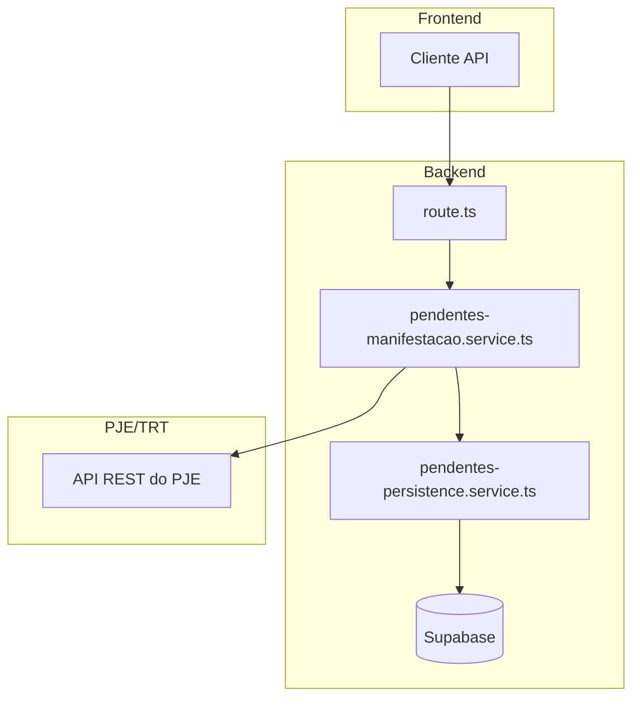
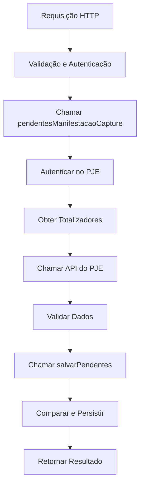
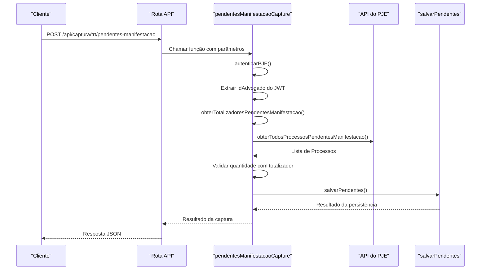
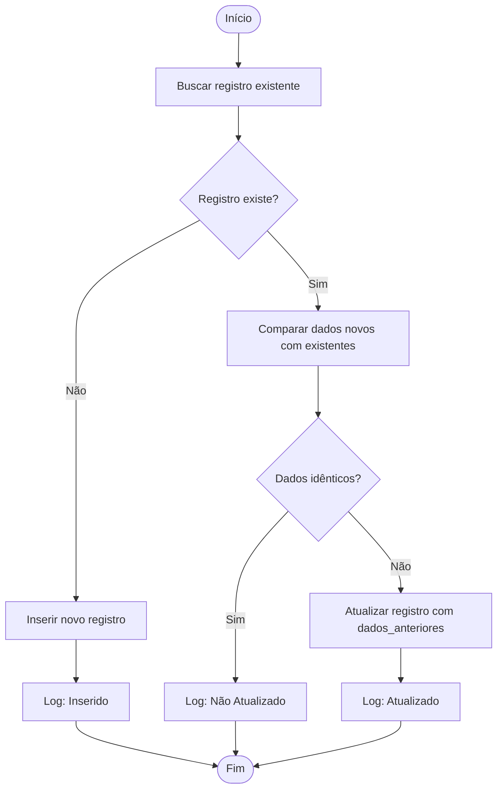
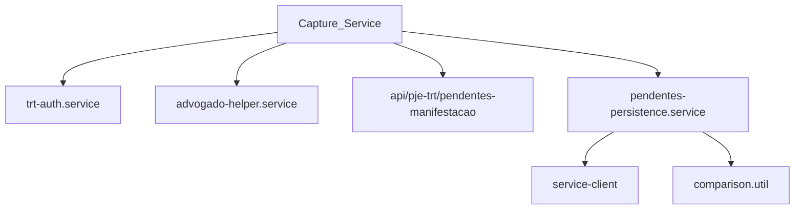

# Captura de Pendentes de Manifestação

<cite>
**Arquivos Referenciados neste Documento**  
- [pendentes-manifestacao.service.ts](file://backend/captura/services/trt/pendentes-manifestacao.service.ts)
- [pendentes-persistence.service.ts](file://backend/captura/services/persistence/pendentes-persistence.service.ts)
- [route.ts](file://app/api/captura/trt/pendentes-manifestacao/route.ts)
</cite>

## Sumário
1. [Introdução](#introdução)
2. [Estrutura do Projeto](#estrutura-do-projeto)
3. [Componentes Principais](#componentes-principais)
4. [Visão Geral da Arquitetura](#visão-geral-da-arquitetura)
5. [Análise Detalhada dos Componentes](#análise-detalhada-dos-componentes)
6. [Análise de Dependências](#análise-de-dependências)
7. [Considerações de Desempenho](#considerações-de-desempenho)
8. [Guia de Solução de Problemas](#guia-de-solução-de-problemas)
9. [Conclusão](#conclusão)

## Introdução
A funcionalidade de **Captura de Pendentes de Manifestação** é um componente crítico do sistema Sinesys, projetado para identificar processos judiciais no PJE/TRT que exigem manifestação imediata por parte do advogado. Este recurso é essencial para o cumprimento de prazos processuais, prevenindo prejuízos como a perda de direitos ou a extinção de processos. A implementação automatiza a coleta de dados diretamente da API REST do PJE, evitando scraping de HTML, e garante a persistência confiável dessas informações no banco de dados Supabase. O sistema suporta filtros por prazo ("no_prazo" ou "sem_prazo") e é resiliente a variações entre diferentes TRTs.

## Estrutura do Projeto
A funcionalidade está organizada em uma arquitetura de camadas bem definida, separando a lógica de captura, persistência e interface da API. Os principais diretórios envolvidos são:
- `backend/captura/services/trt/`: Contém a lógica principal de captura (`pendentes-manifestacao.service.ts`).
- `backend/captura/services/persistence/`: Gerencia a persistência dos dados no Supabase (`pendentes-persistence.service.ts`).
- `app/api/captura/trt/pendentes-manifestacao/`: Define a rota da API que expõe o serviço ao frontend.

**Fontes do Diagrama**
- [pendentes-manifestacao.service.ts](file://backend/captura/services/trt/pendentes-manifestacao.service.ts#L46-L148)
- [pendentes-persistence.service.ts](file://backend/captura/services/persistence/pendentes-persistence.service.ts#L95-L247)
- [route.ts](file://app/api/captura/trt/pendentes-manifestacao/route.ts)

**Fontes da Seção**
- [pendentes-manifestacao.service.ts](file://backend/captura/services/trt/pendentes-manifestacao.service.ts)
- [pendentes-persistence.service.ts](file://backend/captura/services/persistence/pendentes-persistence.service.ts)

## Componentes Principais
Os componentes principais são o serviço de captura (`pendentesManifestacaoCapture`) e o serviço de persistência (`salvarPendentes`). O serviço de captura coordena a autenticação no PJE, a extração de dados com base em filtros e a validação da integridade dos dados. O serviço de persistência é responsável por inserir ou atualizar os registros no banco de dados Supabase, realizando uma comparação detalhada para evitar atualizações desnecessárias e mantendo um log de alterações.

**Fontes da Seção**
- [pendentes-manifestacao.service.ts](file://backend/captura/services/trt/pendentes-manifestacao.service.ts#L46-L148)
- [pendentes-persistence.service.ts](file://backend/captura/services/persistence/pendentes-persistence.service.ts#L95-L247)

## Visão Geral da Arquitetura
O fluxo de arquitetura é um processo em cascata que começa com uma requisição HTTP e termina com dados persistidos. A rota da API valida a entrada e autenticação, então delega ao serviço de captura. Esse serviço, por sua vez, utiliza serviços auxiliares de autenticação e API do PJE para obter os dados. Após a validação, os dados são passados ao serviço de persistência, que os armazena com inteligência de comparação.

**Fontes do Diagrama**
- [pendentes-manifestacao.service.ts](file://backend/captura/services/trt/pendentes-manifestacao.service.ts#L46-L148)
- [pendentes-persistence.service.ts](file://backend/captura/services/persistence/pendentes-persistence.service.ts#L95-L247)

## Análise Detalhada dos Componentes

### Análise do Serviço de Captura
O serviço `pendentesManifestacaoCapture` é o coração da funcionalidade. Ele recebe parâmetros como credenciais, configuração do TRT e filtro de prazo. O fluxo começa com a autenticação no PJE, que retorna uma sessão de navegador e informações do advogado. O ID do advogado é extraído do JWT. Em seguida, o serviço obtém os totalizadores de pendentes para validar a integridade dos dados coletados posteriormente. A API do PJE é chamada com parâmetros específicos, incluindo o filtro de prazo mapeado para códigos internos ('I' para sem prazo, 'N' para no prazo). Após a coleta, uma validação é feita para garantir que o número de processos obtidos não exceda o totalizador. Por fim, o serviço de persistência é acionado.

#### Diagrama de Sequência do Fluxo de Captura

**Fontes do Diagrama**
- [pendentes-manifestacao.service.ts](file://backend/captura/services/trt/pendentes-manifestacao.service.ts#L46-L148)

**Fontes da Seção**
- [pendentes-manifestacao.service.ts](file://backend/captura/services/trt/pendentes-manifestacao.service.ts#L46-L148)

### Análise do Serviço de Persistência
O serviço `salvarPendentes` é projetado para eficiência e integridade. Ele itera por cada processo pendente e, para cada um, verifica se já existe um registro no banco de dados. A comparação é feita campo a campo, excluindo campos de controle, para determinar se uma atualização é necessária. Isso evita sobrecarga no banco de dados e mantém um histórico preciso de mudanças. Quando um registro é atualizado, os dados anteriores são armazenados no campo `dados_anteriores`, permitindo auditoria. O serviço também mantém estatísticas detalhadas (inseridos, atualizados, não atualizados, erros) e utiliza um serviço de log para rastrear todas as operações.

#### Diagrama de Fluxo da Persistência

**Fontes do Diagrama**
- [pendentes-persistence.service.ts](file://backend/captura/services/persistence/pendentes-persistence.service.ts#L95-L247)

**Fontes da Seção**
- [pendentes-persistence.service.ts](file://backend/captura/services/persistence/pendentes-persistence.service.ts#L95-L247)

## Análise de Dependências
O serviço de captura depende fortemente de outros serviços do backend, como `trt-auth.service` para autenticação e `advogado-helper.service` para gerenciar dados de advogados. Ele também depende da API REST do PJE, que é uma interface externa. O serviço de persistência depende do cliente de serviço do Supabase e de utilitários de comparação de objetos. Essas dependências são bem encapsuladas, permitindo testes unitários e manutenção isolada.

**Fontes do Diagrama**
- [pendentes-manifestacao.service.ts](file://backend/captura/services/trt/pendentes-manifestacao.service.ts#L4-L14)
- [pendentes-persistence.service.ts](file://backend/captura/services/persistence/pendentes-persistence.service.ts#L4-L14)

**Fontes da Seção**
- [pendentes-manifestacao.service.ts](file://backend/captura/services/trt/pendentes-manifestacao.service.ts)
- [pendentes-persistence.service.ts](file://backend/captura/services/persistence/pendentes-persistence.service.ts)

## Considerações de Desempenho
O sistema é projetado para lidar com grandes volumes de dados. A coleta da API do PJE é feita com paginação automática e um delay configurável entre páginas para evitar sobrecarga. A persistência é otimizada com a comparação de objetos, reduzindo significativamente o número de operações de escrita no banco de dados. Um desafio conhecido é o tempo de resposta longo da API do PJE, especialmente para TRTs com muitos processos. Estratégias de resiliência, como timeouts longos e tentativas automáticas, são implementadas para mitigar isso. A autenticação é um ponto crítico de desempenho, pois envolve a inicialização de um navegador headless.

## Guia de Solução de Problemas
Problemas comuns incluem falhas de autenticação, sessões expiradas no PJE e variações na interface entre diferentes TRTs. O sistema lida com sessões expiradas reautenticando automaticamente. Para variações de interface, a dependência da API REST (em vez de scraping) aumenta a robustez. Erros de persistência são registrados detalhadamente no serviço de log, facilitando a depuração. Scripts de teste local, como `test-api-pendentes-manifestacao.ts`, são usados para validar a funcionalidade em diferentes cenários, garantindo confiabilidade antes da implantação.

**Fontes da Seção**
- [pendentes-manifestacao.service.ts](file://backend/captura/services/trt/pendentes-manifestacao.service.ts#L143-L146)
- [dev_data/scripts/test-api-pendentes-manifestacao.ts](file://dev_data/scripts/test-api-pendentes-manifestacao.ts)

## Conclusão
A funcionalidade de Captura de Pendentes de Manifestação é uma solução robusta e automatizada para um problema crítico no direito processual. Sua arquitetura modular, com separação clara entre captura e persistência, garante manutenibilidade e escalabilidade. A utilização da API REST do PJE, combinada com validações de integridade e uma lógica de persistência inteligente, assegura a precisão e confiabilidade dos dados. Os desafios operacionais são mitigados com estratégias de resiliência e um sólido conjunto de ferramentas de teste, tornando este componente um pilar fundamental para a gestão eficaz de prazos judiciais.