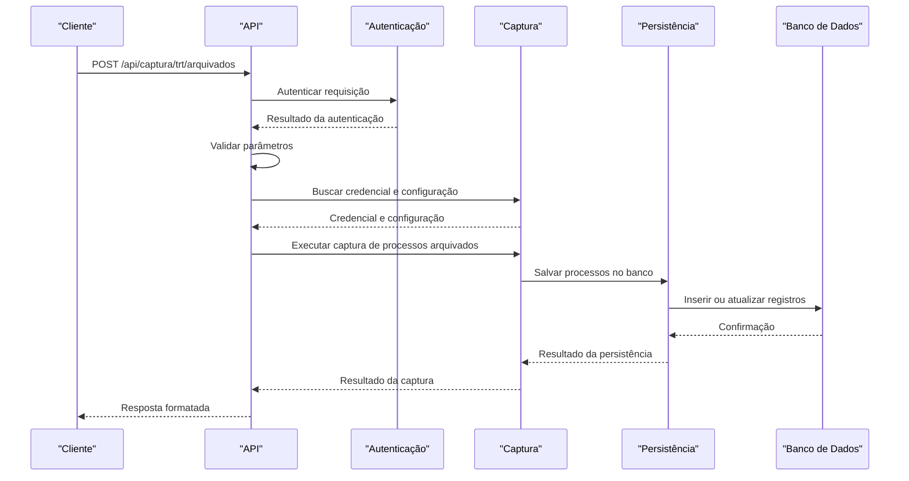

# Captura de Processos Arquivados

<cite>
**Arquivos Referenciados neste Documento**   
- [arquivados.service.ts](file://backend/captura/services/trt/arquivados.service.ts)
- [acervo-persistence.service.ts](file://backend/captura/services/persistence/acervo-persistence.service.ts)
- [route.ts](file://app/api/captura/trt/arquivados/route.ts)
- [test-api-arquivados.ts](file://dev_data/scripts/test-api-arquivados.ts)
</cite>

## Sumário
1. [Introdução](#introdução)
2. [Objetivo da Funcionalidade](#objetivo-da-funcionalidade)
3. [Fluxo de Captura de Processos Arquivados](#fluxo-de-captura-de-processos-arquivados)
4. [Implementação do Serviço arquivados.service.ts](#implementação-do-serviço-arquivados.servicets)
5. [Persistência no Banco de Dados com acervo-persistence.service.ts](#persistência-no-banco-de-dados-com-acervo-persistence.servicets)
6. [Rota API em route.ts](#rota-api-em-routets)
7. [Diagrama de Sequência](#diagrama-de-sequência)
8. [Considerações de Desempenho](#considerações-de-desempenho)
9. [Tratamento de Erros](#tratamento-de-erros)
10. [Validação com Scripts de Teste](#validação-com-scripts-de-teste)

## Introdução
Este documento detalha a funcionalidade de Captura de Processos Arquivados, um componente essencial do sistema que permite monitorar processos judiciais que foram arquivados no PJE/TRT. A funcionalidade é projetada para acompanhar o encerramento de processos e detectar possíveis desarquivamentos, fornecendo uma visão atualizada do status dos processos ao longo do tempo. O sistema utiliza uma arquitetura robusta que envolve autenticação no PJE, extração de metadados, persistência no banco de dados Supabase e validação por meio de testes automatizados.

## Objetivo da Funcionalidade
O principal objetivo da funcionalidade de Captura de Processos Arquivados é monitorar processos que foram arquivados no PJE/TRT, permitindo o acompanhamento de encerramentos e possíveis desarquivamentos. Isso é crucial para escritórios de advocacia que precisam manter um controle rigoroso sobre o status de seus processos, garantindo que não percam prazos ou oportunidades de reaproveitamento de processos arquivados. A funcionalidade extrai metadados essenciais dos processos arquivados, como número do processo, data de arquivamento, partes envolvidas e status atual, e atualiza essas informações no banco de dados Supabase.

## Fluxo de Captura de Processos Arquivados
O fluxo de captura de processos arquivados inicia-se com a autenticação no PJE/TRT utilizando credenciais armazenadas no banco de dados. Após a autenticação bem-sucedida, o sistema acessa a seção de processos arquivados, identificada pelo parâmetro `tipoPainelAdvogado=5`. Em seguida, os metadados dos processos são extraídos e comparados com os registros existentes no banco de dados. Se houver alterações no status dos processos, como um desarquivamento, essas mudanças são registradas no banco de dados. O fluxo é concluído com a persistência dos dados e a liberação dos recursos utilizados durante o processo.

## Implementação do Serviço arquivados.service.ts
O serviço `arquivados.service.ts` é responsável por coordenar a captura de processos arquivados. Ele inicia autenticando no PJE/TRT utilizando o serviço `trt-auth.service.ts`. Após a autenticação, o ID do advogado é extraído do JWT e utilizado para preparar os parâmetros adicionais necessários para a API de processos arquivados. O parâmetro `tipoPainelAdvogado=5` é utilizado para identificar a seção de processos arquivados, enquanto `ordenacaoCrescente=false` garante que os processos mais recentes sejam listados primeiro. O serviço então chama a API REST para obter todos os processos arquivados, com paginação automática, e retorna os dados para o próximo estágio do fluxo.

**Fontes da seção**
- [arquivados.service.ts](file://backend/captura/services/trt/arquivados.service.ts#L34-L117)

## Persistência no Banco de Dados com acervo-persistence.service.ts
O serviço `acervo-persistence.service.ts` é responsável por salvar os processos capturados no banco de dados Supabase. Ele compara cada registro antes de atualizar para evitar atualizações desnecessárias. O processo inicia-se com a conversão dos dados do processo para o formato do banco de dados, seguido pela busca de um registro existente utilizando o ID do PJE, o código do TRT, o grau e o número do processo. Se o registro não existir, ele é inserido no banco de dados. Caso contrário, os dados são comparados, e se houver alterações, o registro é atualizado com os novos dados e os dados anteriores são armazenados para auditoria.

**Fontes da seção**
- [acervo-persistence.service.ts](file://backend/captura/services/persistence/acervo-persistence.service.ts#L84-L234)

## Rota API em route.ts
A rota API em `route.ts` é responsável por receber requisições autenticadas e coordenar a captura de processos arquivados. A requisição POST espera parâmetros como o ID do advogado, o código do TRT e o grau do processo. Após a validação dos parâmetros, a rota busca a credencial do advogado no banco de dados e a configuração do tribunal. Em seguida, executa a captura utilizando o serviço `arquivadosCapture` e retorna uma resposta formatada com os dados dos processos arquivados, o total de processos capturados e informações sobre a persistência no banco de dados.

**Fontes do diagrama**
- [route.ts](file://app/api/captura/trt/arquivados/route.ts#L104-L185)

**Fontes da seção**
- [route.ts](file://app/api/captura/trt/arquivados/route.ts#L104-L185)

## Diagrama de Sequência
O diagrama de sequência ilustra o fluxo de dados desde a requisição inicial até a persistência no banco de dados. Ele mostra como a requisição é autenticada, validada e processada, destacando as interações entre os componentes do sistema. O diagrama também demonstra como os dados dos processos arquivados são extraídos, comparados e salvos no banco de dados, com ênfase na detecção de mudanças de status.

**Fontes do diagrama**
- [route.ts](file://app/api/captura/trt/arquivados/route.ts#L104-L185)
- [arquivados.service.ts](file://backend/captura/services/trt/arquivados.service.ts#L34-L117)
- [acervo-persistence.service.ts](file://backend/captura/services/persistence/acervo-persistence.service.ts#L84-L234)

## Considerações de Desempenho
A funcionalidade de Captura de Processos Arquivados deve lidar com volumes significativos de dados, especialmente em contas com muitos processos arquivados. Para mitigar problemas de desempenho, o sistema implementa estratégias de paginação e filtragem. A paginação automática garante que os dados sejam carregados em blocos gerenciáveis, evitando sobrecarga na memória e na rede. Além disso, o uso de timestamps para controle de versão permite que o sistema identifique rapidamente alterações nos processos, reduzindo a necessidade de processamento desnecessário.

## Tratamento de Erros
O sistema inclui um tratamento robusto de erros para garantir a confiabilidade da funcionalidade. Erros específicos, como a ausência da seção de arquivados na interface do PJE, são tratados com mensagens de erro claras e logs detalhados. O serviço de persistência também inclui tratamento de erros, garantindo que falhas na atualização do banco de dados não interrompam o fluxo de captura. Os erros são registrados no serviço `capture-log.service.ts`, que fornece um resumo das operações realizadas e dos erros ocorridos.

## Validação com Scripts de Teste
A funcionalidade é validada por meio de scripts de teste automatizados, como o `test-api-arquivados.ts`. Esse script simula requisições externas para a API de captura de processos arquivados, testando todos os TRTs disponíveis. Ele valida a resposta da API, mede o tempo de execução e salva os resultados em arquivos JSON para análise posterior. Os testes garantem que a funcionalidade esteja funcionando corretamente e que os dados sejam capturados e persistidos de forma confiável.

**Fontes da seção**
- [test-api-arquivados.ts](file://dev_data/scripts/test-api-arquivados.ts#L48-L127)