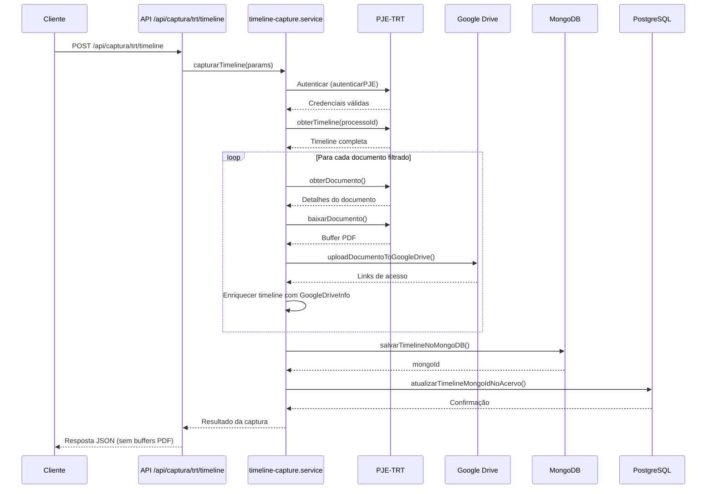
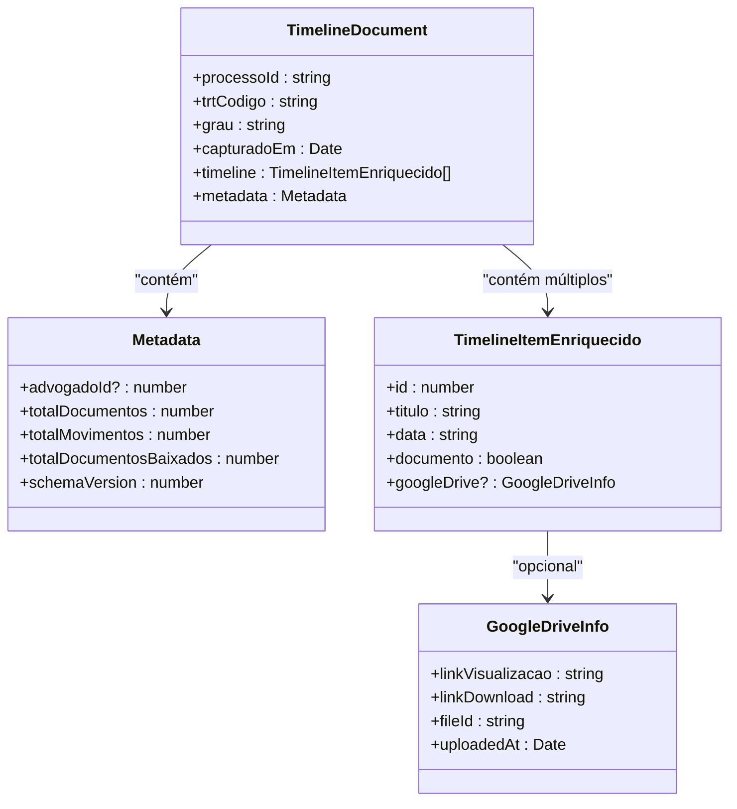
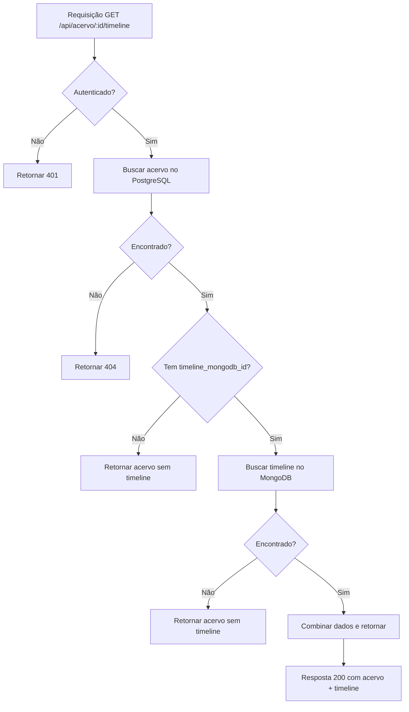

# Captura e Persistência de Timeline

<cite>
**Arquivos Referenciados neste Documento**  
- [timeline-capture.service.ts](file://backend/captura/services/timeline/timeline-capture.service.ts)
- [timeline-persistence.service.ts](file://backend/captura/services/timeline/timeline-persistence.service.ts)
- [client.ts](file://lib/mongodb/client.ts)
- [collections.ts](file://lib/mongodb/collections.ts)
- [timeline.ts](file://backend/types/mongodb/timeline.ts)
- [route.ts](file://app/api/captura/trt/timeline/route.ts)
- [route.ts](file://app/api/acervo/[id]/timeline/route.ts)
- [timeline.ts](file://backend/types/pje-trt/timeline.ts)
</cite>

## Sumário
1. [Introdução](#introdução)
2. [Fluxo de Captura da Timeline](#fluxo-de-captura-da-timeline)
3. [Persistência no MongoDB](#persistência-no-mongodb)
4. [Estrutura de Dados da Timeline](#estrutura-de-dados-da-timeline)
5. [API de Captura](#api-de-captura)
6. [API de Consulta da Timeline](#api-de-consulta-da-timeline)
7. [Fluxo Completo de Dados](#fluxo-completo-de-dados)
8. [Considerações de Segurança e Desempenho](#considerações-de-segurança-e-desempenho)

## Introdução
O sistema de captura e persistência de timeline é responsável por extrair, armazenar e fornecer acesso aos dados de cronologia de processos judiciais do PJE-TRT. Este documento detalha o fluxo completo de captura, desde a autenticação no sistema externo até a persistência dos dados em MongoDB e sua integração com o banco de dados principal PostgreSQL.

## Fluxo de Captura da Timeline
O processo de captura da timeline envolve múltiplas etapas coordenadas entre serviços do backend, incluindo autenticação no PJE, extração dos dados de timeline, filtragem de documentos relevantes, download de PDFs e persistência dos dados.

**Fontes do Diagrama**
- [timeline-capture.service.ts](file://backend/captura/services/timeline/timeline-capture.service.ts#L120-L340)
- [route.ts](file://app/api/captura/trt/timeline/route.ts#L128-L204)

**Fontes da Seção**
- [timeline-capture.service.ts](file://backend/captura/services/timeline/timeline-capture.service.ts#L1-L340)

## Persistência no MongoDB
Os dados da timeline são armazenados em um banco de dados MongoDB, que oferece flexibilidade para armazenar documentos JSON complexos com estrutura variável, ideal para a natureza heterogênea dos dados de timeline do PJE.

**Fontes do Diagrama**
- [timeline-persistence.service.ts](file://backend/captura/services/timeline/timeline-persistence.service.ts#L38-L113)
- [timeline.ts](file://backend/types/mongodb/timeline.ts#L11-L55)

**Fontes da Seção**
- [timeline-persistence.service.ts](file://backend/captura/services/timeline/timeline-persistence.service.ts#L1-L203)
- [client.ts](file://lib/mongodb/client.ts#L1-L95)
- [collections.ts](file://lib/mongodb/collections.ts#L1-L58)

## Estrutura de Dados da Timeline
A estrutura de dados da timeline reflete a complexidade dos registros do PJE-TRT, com distinção entre documentos e movimentos, além de metadados enriquecidos com informações de armazenamento.

### Modelo de Documento MongoDB
O documento principal armazenado no MongoDB contém:

- **Identificação do processo**: ID do processo, código do TRT e grau da instância
- **Metadados de captura**: Data/hora da captura e informações do advogado responsável
- **Timeline completa**: Array de itens que podem ser documentos ou movimentos
- **Metadados estatísticos**: Contadores de documentos, movimentos e downloads bem-sucedidos

### Enriquecimento com Google Drive
Após o download dos documentos, a timeline é enriquecida com informações do Google Drive:

- **Links de acesso**: URLs para visualização e download dos documentos
- **ID do arquivo**: Identificador único no Google Drive
- **Data do upload**: Timestamp do armazenamento no Google Drive

Esta abordagem permite que a aplicação mantenha referências diretas aos documentos armazenados, facilitando o acesso rápido sem necessidade de downloads repetidos.

**Fontes da Seção**
- [timeline.ts](file://backend/types/mongodb/timeline.ts#L11-L55)
- [timeline.ts](file://backend/types/pje-trt/timeline.ts#L87-L190)

## API de Captura
A API de captura permite a extração da timeline de um processo específico do PJE-TRT, com opções de filtragem e download de documentos.

### Endpoint
`POST /api/captura/trt/timeline`

### Parâmetros de Entrada
| Parâmetro | Tipo | Obrigatório | Descrição |
|-----------|------|-------------|-----------|
| trtCodigo | string | Sim | Código do TRT (ex: TRT3) |
| grau | string | Sim | Grau da instância (primeiro_grau, segundo_grau) |
| processoId | string | Sim | ID do processo no sistema PJE |
| advogadoId | number | Sim | ID do advogado para obtenção de credenciais |
| baixarDocumentos | boolean | Não | Indica se deve baixar os PDFs dos documentos (padrão: true) |
| filtroDocumentos | object | Não | Filtros para seleção de documentos |

### Filtros de Documentos
| Filtro | Tipo | Descrição |
|--------|------|-----------|
| apenasAssinados | boolean | Apenas documentos com assinatura digital |
| apenasNaoSigilosos | boolean | Exclui documentos sigilosos |
| tipos | string[] | Lista de tipos de documento específicos |
| dataInicial | string | Data mínima (ISO 8601) |
| dataFinal | string | Data máxima (ISO 8601) |

### Resposta
A resposta inclui a timeline completa e informações sobre o processo de captura, com exceção dos buffers PDF para evitar respostas excessivamente grandes.

**Fontes da Seção**
- [route.ts](file://app/api/captura/trt/timeline/route.ts#L1-L204)

## API de Consulta da Timeline
A API de consulta permite recuperar os dados de timeline de um processo já capturado, combinando informações do PostgreSQL (acervo) com os dados armazenados no MongoDB.

### Endpoint
`GET /api/acervo/:id/timeline`

### Fluxo de Execução
1. Autenticação da requisição
2. Busca dos dados do acervo no PostgreSQL
3. Recuperação da timeline no MongoDB usando o ID armazenado
4. Combinação dos dados e retorno da resposta

### Resposta
A resposta combina:
- **Dados do acervo**: Informações do processo armazenadas no PostgreSQL
- **Timeline**: Dados completos da cronologia armazenados no MongoDB, incluindo links para documentos no Google Drive

Este endpoint permite que a interface do usuário exiba uma visão integrada do processo, com acesso direto aos documentos capturados.

**Fontes do Diagrama**
- [route.ts](file://app/api/acervo/[id]/timeline/route.ts#L64-L145)

**Fontes da Seção**
- [route.ts](file://app/api/acervo/[id]/timeline/route.ts#L1-L145)

## Fluxo Completo de Dados
O fluxo completo de dados ilustra a jornada desde a solicitação inicial até a disponibilização dos dados para consumo.

```mermaid
flowchart LR
A[Frontend] --> B[API de Captura]
B --> C[Autenticação PJE]
C --> D[Extração da Timeline]
D --> E[Filtragem de Documentos]
E --> F[Download de PDFs]
F --> G[Upload para Google Drive]
G --> H[Enriquecimento da Timeline]
H --> I[Persistência no MongoDB]
I --> J[Atualização no PostgreSQL]
J --> K[Armazenamento do mongoId]
K --> L[API de Consulta]
L --> M[Frontend]
```

Este fluxo demonstra a integração entre múltiplos serviços e armazenamentos, garantindo que os dados sejam capturados, processados e disponibilizados de forma eficiente e segura.

**Fontes da Seção**
- [timeline-capture.service.ts](file://backend/captura/services/timeline/timeline-capture.service.ts#L120-L340)
- [timeline-persistence.service.ts](file://backend/captura/services/timeline/timeline-persistence.service.ts#L38-L113)
- [route.ts](file://app/api/captura/trt/timeline/route.ts#L128-L204)
- [route.ts](file://app/api/acervo/[id]/timeline/route.ts#L64-L145)

## Considerações de Segurança e Desempenho
O sistema implementa várias práticas para garantir segurança e desempenho:

- **Autenticação rigorosa**: Todos os endpoints exigem autenticação via Bearer Token ou API Key
- **Isolamento de credenciais**: As credenciais de acesso ao PJE são gerenciadas separadamente
- **Armazenamento seguro**: Os documentos são armazenados no Google Drive com controle de acesso
- **Cache inteligente**: Utilização de Redis para cache de consultas frequentes
- **Tratamento de erros robusto**: Mecanismos de fallback e logging detalhado
- **Limpeza de recursos**: Fechamento adequado de conexões com o navegador Puppeteer

Essas práticas garantem que o sistema seja seguro, confiável e capaz de lidar com grandes volumes de dados de forma eficiente.

**Fontes da Seção**
- [timeline-capture.service.ts](file://backend/captura/services/timeline/timeline-capture.service.ts#L140-L338)
- [timeline-persistence.service.ts](file://backend/captura/services/timeline/timeline-persistence.service.ts#L127-L137)
- [route.ts](file://app/api/captura/trt/timeline/route.ts#L131-L137)
- [route.ts](file://app/api/acervo/[id]/timeline/route.ts#L70-L76)