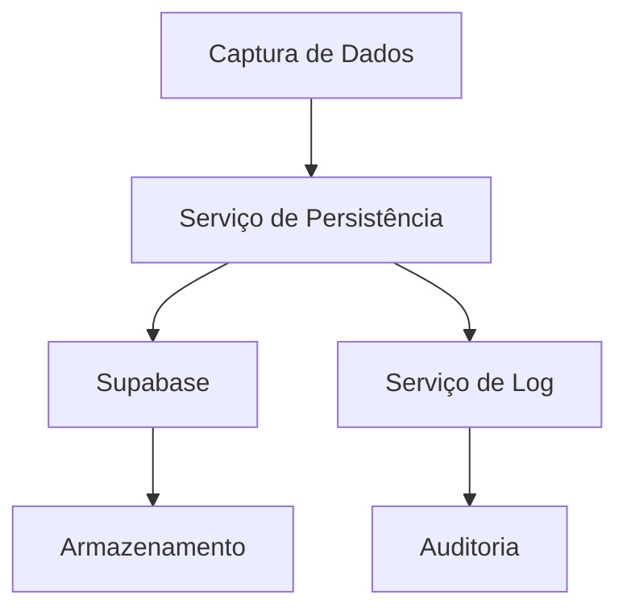
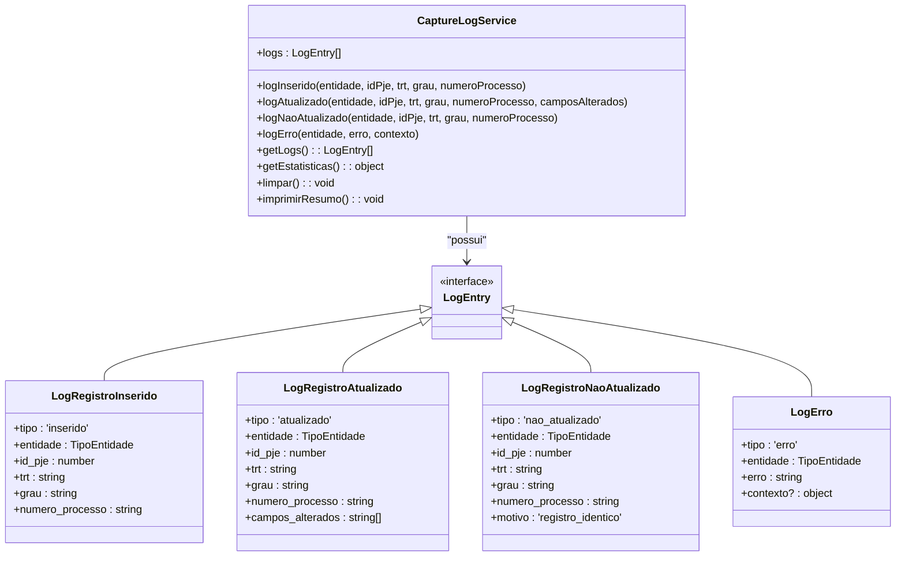
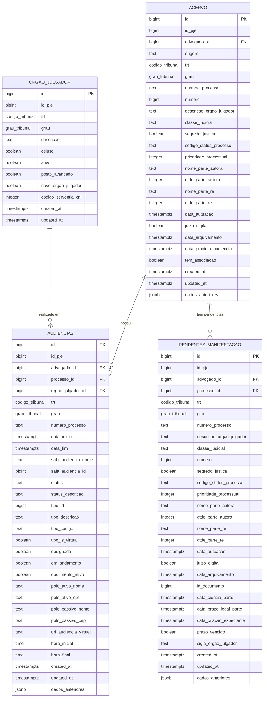

# Persistência de Dados Capturados

<cite>
**Arquivos Referenciados neste Documento**   
- [acervo-persistence.service.ts](file://backend/captura/services/persistence/acervo-persistence.service.ts)
- [audiencias-persistence.service.ts](file://backend/captura/services/persistence/audiencias-persistence.service.ts)
- [pendentes-persistence.service.ts](file://backend/captura/services/persistence/pendentes-persistence.service.ts)
- [orgao-julgador-persistence.service.ts](file://backend/captura/services/persistence/orgao-julgador-persistence.service.ts)
- [capture-log.service.ts](file://backend/captura/services/persistence/capture-log.service.ts)
- [04_acervo.sql](file://supabase/schemas/04_acervo.sql)
- [07_audiencias.sql](file://supabase/schemas/07_audiencias.sql)
- [06_pendentes_manifestacao.sql](file://supabase/schemas/06_pendentes_manifestacao.sql)
- [05_orgao_julgador.sql](file://supabase/schemas/05_orgao_julgador.sql)
</cite>

## Sumário
1. [Introdução](#introdução)
2. [Arquitetura de Persistência](#arquitetura-de-persistência)
3. [Serviços de Persistência](#serviços-de-persistência)
4. [Esquemas de Banco de Dados](#esquemas-de-banco-de-dados)
5. [Auditoria de Capturas](#auditoria-de-capturas)
6. [Modelo de Dados](#modelo-de-dados)
7. [Considerações de Desempenho](#considerações-de-desempenho)
8. [Tratamento de Erros](#tratamento-de-erros)
9. [Conclusão](#conclusão)

## Introdução
O módulo de Persistência de Dados Capturados é responsável por armazenar de forma estruturada e consistente os dados extraídos do PJE/TRT no banco de dados Supabase. Este documento detalha a implementação dos serviços de persistência, suas operações CRUD, estratégias de tratamento de conflitos, integridade referencial, políticas RLS e mecanismos de auditoria. O sistema garante rastreabilidade, confiabilidade e consistência dos dados processuais, essenciais para a operação do sistema.

## Arquitetura de Persistência
A arquitetura de persistência é baseada em serviços especializados que encapsulam a lógica de salvamento para diferentes tipos de entidades capturadas. Cada serviço implementa uma lógica de upsert inteligente que compara dados antes da atualização, evitando escritas desnecessárias e mantendo um histórico de alterações. A comunicação com o banco de dados é feita através do cliente de serviço do Supabase, garantindo autenticação adequada e acesso controlado.

**Fontes do Diagrama**
- [acervo-persistence.service.ts](file://backend/captura/services/persistence/acervo-persistence.service.ts#L84-L234)
- [audiencias-persistence.service.ts](file://backend/captura/services/persistence/audiencias-persistence.service.ts#L91-L311)
- [pendentes-persistence.service.ts](file://backend/captura/services/persistence/pendentes-persistence.service.ts#L94-L246)

## Serviços de Persistência

### Serviço acervo-persistence
O serviço `acervo-persistence` é responsável por salvar processos do acervo geral e arquivados. Ele implementa uma lógica de comparação detalhada antes da atualização, garantindo que apenas registros modificados sejam atualizados. O serviço utiliza a operação `upsert` com comparação manual para detectar alterações em campos específicos.

**Principais Funcionalidades:**
- Inserção de novos processos
- Atualização com comparação de campos
- Registro de histórico de alterações
- Tratamento de erros granular

**Operações CRUD:**
- **Create**: Insere novos registros na tabela `acervo`
- **Read**: Busca registros existentes por ID do PJE, TRT, grau e número do processo
- **Update**: Atualiza registros com dados anteriores armazenados
- **Delete**: Não implementado diretamente, gerenciado por cascata

**Seção fontes**
- [acervo-persistence.service.ts](file://backend/captura/services/persistence/acervo-persistence.service.ts#L84-L234)

### Serviço audiencias-persistence
O serviço `audiencias-persistence` gerencia a persistência de audiências agendadas. Ele possui dependências complexas, pois precisa garantir que os órgãos julgadores e os processos relacionados estejam previamente salvos. O serviço implementa um fluxo de duas etapas: primeiro salva os órgãos julgadores, depois as audiências com referências completas.

**Principais Funcionalidades:**
- Salvamento de órgãos julgadores (upsert)
- Busca de IDs de relacionamento
- Persistência de audiências com validação de integridade
- Contagem de novos órgãos julgadores criados

**Operações CRUD:**
- **Create**: Insere novas audiências e órgãos julgadores
- **Read**: Busca audiências e órgãos julgadores existentes
- **Update**: Atualiza audiências com histórico de dados
- **Delete**: Gerenciado por cascata

**Seção fontes**
- [audiencias-persistence.service.ts](file://backend/captura/services/persistence/audiencias-persistence.service.ts#L91-L311)

### Serviço pendentes-persistence
O serviço `pendentes-persistence` persiste processos pendentes de manifestação. Ele implementa uma lógica similar ao serviço de acervo, mas com campos específicos de pendência, como prazos e datas de ciência. O serviço também utiliza a técnica de comparação antes da atualização para otimizar operações.

**Principais Funcionalidades:**
- Salvamento de processos pendentes
- Comparação de dados antes da atualização
- Armazenamento de dados anteriores
- Integração com trigger para preenchimento automático de relacionamentos

**Operações CRUD:**
- **Create**: Insere novos registros de pendência
- **Read**: Busca pendências existentes
- **Update**: Atualiza com histórico de alterações
- **Delete**: Gerenciado por cascata

**Seção fontes**
- [pendentes-persistence.service.ts](file://backend/captura/services/persistence/pendentes-persistence.service.ts#L94-L246)

### Serviço orgao-julgador-persistence
O serviço `orgao-julgador-persistence` gerencia a persistência de órgãos julgadores, entidade compartilhada entre audiências. Ele utiliza a operação nativa `upsert` do Supabase com conflito definido pela chave única `(id_pje, trt, grau)`.

**Principais Funcionalidades:**
- Upsert baseado em chave única
- Garantia de unicidade por TRT e grau
- Retorno do ID do registro persistido
- Busca por ID do PJE, TRT e grau

**Operações CRUD:**
- **Create/Update**: Operação upsert única
- **Read**: Busca por identificadores
- **Delete**: Não implementado diretamente

**Seção fontes**
- [orgao-julgador-persistence.service.ts](file://backend/captura/services/persistence/orgao-julgador-persistence.service.ts#L32-L70)

## Esquemas de Banco de Dados

### Tabela acervo (04_acervo.sql)
A tabela `acervo` armazena todos os processos capturados, tanto do acervo geral quanto arquivados. A unicidade é garantida pela combinação `(id_pje, trt, grau, numero_processo)`, permitindo que múltiplos advogados vejam o mesmo processo sem duplicação.

**Colunas Principais:**
- `id`: Chave primária gerada automaticamente
- `id_pje`: ID do processo no sistema PJE
- `advogado_id`: Referência ao advogado (chave estrangeira)
- `origem`: 'acervo_geral' ou 'arquivado'
- `trt`: Código do TRT
- `grau`: Primeiro ou segundo grau
- `numero_processo`: Número no formato CNJ
- `dados_anteriores`: JSON com dados anteriores para auditoria

**Chaves Primárias/Estrangeiras:**
- PK: `id`
- FK: `advogado_id` → `advogados(id)` com delete cascade

**Políticas RLS:**
- Habilitadas para controle de acesso por usuário
- Permissões definidas em `00_permissions.sql`

**Seção fontes**
- [04_acervo.sql](file://supabase/schemas/04_acervo.sql#L4-L77)

### Tabela audiencias (07_audiencias.sql)
A tabela `audiencias` armazena informações sobre audiências agendadas. A unicidade é garantida por `(id_pje, trt, grau, numero_processo)`, permitindo múltiplos advogados visualizarem a mesma audiência.

**Colunas Principais:**
- `id`: Chave primária
- `id_pje`: ID da audiência no PJE
- `advogado_id`: Referência ao advogado
- `processo_id`: Referência ao processo no acervo
- `orgao_julgador_id`: Referência ao órgão julgador
- `data_inicio` e `data_fim`: Intervalo da audiência
- `status`: Status da audiência (M=Marcada, R=Realizada, C=Cancelada)

**Chaves Primárias/Estrangeiras:**
- PK: `id`
- FK: `advogado_id` → `advogados(id)` com delete cascade
- FK: `processo_id` → `acervo(id)` com delete cascade
- FK: `orgao_julgador_id` → `orgao_julgador(id)` com delete set null

**Políticas RLS:**
- Habilitadas para controle de acesso
- Permissões baseadas em advogado_id

**Seção fontes**
- [07_audiencias.sql](file://supabase/schemas/07_audiencias.sql#L4-L91)

### Tabela pendentes_manifestacao (06_pendentes_manifestacao.sql)
A tabela `pendentes_manifestacao` armazena processos que aguardam manifestação do advogado. Possui um trigger que preenche automaticamente o `processo_id` baseado no número do processo.

**Colunas Principais:**
- `id`: Chave primária
- `id_pje`: ID do expediente no PJE
- `advogado_id`: Referência ao advogado
- `processo_id`: Referência ao processo (preenchido por trigger)
- `data_ciencia_parte`: Data de ciência da parte
- `data_prazo_legal_parte`: Data limite para manifestação
- `prazo_vencido`: Indicador de prazo vencido

**Chaves Primárias/Estrangeiras:**
- PK: `id`
- FK: `advogado_id` → `advogados(id)` com delete cascade
- FK: `processo_id` → `acervo(id)` com delete set null

**Trigger Importante:**
- `sync_pendentes_processo_id_trigger`: Preenche `processo_id` automaticamente

**Políticas RLS:**
- Habilitadas para controle de acesso
- Permissões baseadas em advogado_id

**Seção fontes**
- [06_pendentes_manifestacao.sql](file://supabase/schemas/06_pendentes_manifestacao.sql#L4-L117)

### Tabela orgao_julgador (05_orgao_julgador.sql)
A tabela `orgao_julgador` armazena informações sobre órgãos julgadores que aparecem nas audiências. A unicidade é garantida por `(id_pje, trt, grau)`.

**Colunas Principais:**
- `id`: Chave primária
- `id_pje`: ID do órgão julgador no PJE
- `trt` e `grau`: Identificadores do tribunal
- `descricao`: Descrição completa do órgão
- `cejusc`, `posto_avancado`: Indicadores específicos

**Chaves Primárias/Estrangeiras:**
- PK: `id`
- Constraint única: `(id_pje, trt, grau)`

**Políticas RLS:**
- Habilitadas para controle de acesso
- Permissões baseadas em contexto de usuário

**Seção fontes**
- [05_orgao_julgador.sql](file://supabase/schemas/05_orgao_julgador.sql#L4-L47)

## Auditoria de Capturas
O serviço `capture-log.service.ts` implementa um sistema de logs estruturado para operações de persistência, essencial para auditoria e rastreabilidade das capturas.

### Estrutura do Serviço
O serviço utiliza um padrão singleton para manter um estado global de logs durante a execução de uma operação de persistência. Ele acumula diferentes tipos de eventos que são processados ao final da operação.

**Tipos de Logs:**
- **Inserido**: Registro de novos registros salvos
- **Atualizado**: Registro de atualizações com campos alterados
- **Não Atualizado**: Registros idênticos que não foram modificados
- **Erro**: Erros ocorridos durante a persistência

**Fontes do Diagrama**
- [capture-log.service.ts](file://backend/captura/services/persistence/capture-log.service.ts#L47-L182)

### Funcionalidades Principais
- **Acumulação de Logs**: Todos os eventos são armazenados em memória durante a operação
- **Estatísticas**: Geração de estatísticas de inserções, atualizações e erros
- **Resumo**: Impressão de resumo com contadores de operações
- **Contexto de Erro**: Armazenamento de contexto detalhado para depuração

**Seção fontes**
- [capture-log.service.ts](file://backend/captura/services/persistence/capture-log.service.ts#L47-L182)

## Modelo de Dados
O modelo de dados reflete a estrutura hierárquica das informações processuais, com relacionamentos bem definidos entre entidades.

**Fontes do Diagrama**
- [04_acervo.sql](file://supabase/schemas/04_acervo.sql)
- [07_audiencias.sql](file://supabase/schemas/07_audiencias.sql)
- [06_pendentes_manifestacao.sql](file://supabase/schemas/06_pendentes_manifestacao.sql)
- [05_orgao_julgador.sql](file://supabase/schemas/05_orgao_julgador.sql)

## Considerações de Desempenho
O sistema implementa várias estratégias para otimizar o desempenho das operações de persistência e consulta.

### Otimização de Queries
- **Processamento Individual**: Cada registro é processado individualmente para permitir comparação detalhada
- **Batch Processing**: Embora processado individualmente, os registros são salvos em batch quando possível
- **Evitação de Atualizações Desnecessárias**: Comparação antes da atualização reduz escritas no banco

### Índices
Cada tabela possui índices estratégicos para acelerar consultas frequentes:

**Índices da Tabela acervo:**
- `idx_acervo_advogado_id`: Por advogado_id
- `idx_acervo_trt_grau`: Por TRT e grau
- `idx_acervo_numero_processo`: Por número do processo
- `idx_acervo_data_autuacao`: Por data de autuação

**Índices da Tabela audiencias:**
- `idx_audiencias_processo_id`: Por processo_id
- `idx_audiencias_data_inicio`: Por data de início
- `idx_audiencias_status`: Por status da audiência
- `idx_audiencias_advogado_trt_grau`: Por advogado, TRT e grau

**Índices da Tabela pendentes_manifestacao:**
- `idx_pendentes_prazo_vencido`: Por status de prazo vencido
- `idx_pendentes_data_prazo_legal`: Por data limite de prazo
- `idx_pendentes_processo_id`: Por processo_id

### Estratégias de Upsert
- **acervo e pendentes**: Comparação manual antes da atualização
- **orgao_julgador**: Upsert nativo do Supabase com conflito definido
- **audiencias**: Comparação manual com histórico de dados

**Seção fontes**
- [04_acervo.sql](file://supabase/schemas/04_acervo.sql#L57-L66)
- [07_audiencias.sql](file://supabase/schemas/07_audiencias.sql#L69-L80)
- [06_pendentes_manifestacao.sql](file://supabase/schemas/06_pendentes_manifestacao.sql#L65-L74)
- [05_orgao_julgador.sql](file://supabase/schemas/05_orgao_julgador.sql#L32-L36)

## Tratamento de Erros
O sistema implementa um tratamento robusto de erros para garantir a integridade dos dados e a continuidade das operações.

### Estratégias de Tratamento
- **Captura Individual**: Erros são capturados por registro, permitindo que outros registros continuem sendo processados
- **Log Detalhado**: Informações de erro são registradas com contexto completo
- **Continuidade da Operação**: A falha na persistência de um registro não interrompe a operação completa

### Níveis de Erro
- **Erro de Banco de Dados**: Capturado e registrado com detalhes do registro afetado
- **Erro de Validação**: Tratado durante a extração, antes da persistência
- **Erro de Conexão**: Tratado pelos serviços superiores de captura
- **Erro de Autenticação**: Tratado pelo serviço de autenticação

### Mecanismos de Recuperação
- **Tentativas Automáticas**: Não implementado diretamente, delegado para camada superior
- **Reprocessamento**: Registros com erro podem ser reprocessados em nova captura
- **Auditoria**: Logs permitem identificar e corrigir problemas específicos

**Seção fontes**
- [acervo-persistence.service.ts](file://backend/captura/services/persistence/acervo-persistence.service.ts#L211-L225)
- [audiencias-persistence.service.ts](file://backend/captura/services/persistence/audiencias-persistence.service.ts#L290-L301)
- [pendentes-persistence.service.ts](file://backend/captura/services/persistence/pendentes-persistence.service.ts#L223-L237)

## Conclusão
O módulo de Persistência de Dados Capturados implementa uma solução robusta e confiável para armazenar dados processuais extraídos do PJE/TRT. A arquitetura baseada em serviços especializados permite uma implementação clara e modular, com foco em integridade de dados, rastreabilidade e desempenho. O uso de técnicas como comparação antes da atualização, histórico de alterações e auditoria estruturada garante que os dados sejam mantidos de forma consistente e confiável. As políticas RLS e a modelagem cuidadosa das tabelas asseguram a segurança e integridade referencial dos dados, fundamentais para a operação do sistema jurídico.