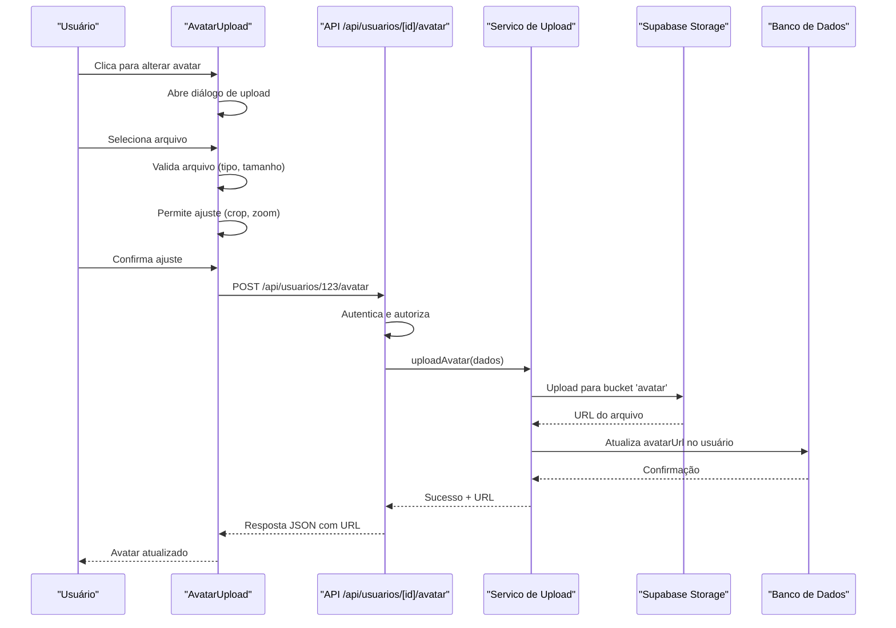

# Gestão de Avatar de Usuários

<cite>
**Arquivos Referenciados neste Documento**   
- [perfil/page.tsx](file://app/(dashboard)/perfil/page.tsx)
- [perfil/components/avatar-edit-dialog.tsx](file://app/(dashboard)/perfil/components/avatar-edit-dialog.tsx)
- [api/usuarios/[id]/avatar/route.ts](file://app/api/usuarios/[id]/avatar/route.ts)
- [components/ui/avatar-upload.tsx](file://components/ui/avatar-upload.tsx)
- [backend/usuarios/services/persistence/usuario-persistence.service.ts](file://backend/usuarios/services/persistence/usuario-persistence.service.ts)
</cite>

## Sumário
1. [Introdução](#introdução)
2. [Fluxo de Funcionalidades](#fluxo-de-funcionalidades)
3. [Componente de Interface de Usuário](#componente-de-interface-de-usuário)
4. [Rota da API](#rota-da-api)
5. [Camada de Persistência](#camada-de-persistência)
6. [Diagrama de Sequência](#diagrama-de-sequência)
7. [Considerações de Segurança](#considerações-de-segurança)
8. [Conclusão](#conclusão)

## Introdução

O sistema de gestão de avatar de usuários no Sinesys permite que os usuários atualizem ou removam sua foto de perfil. A funcionalidade está integrada à página de perfil do usuário e envolve componentes de interface, rotas de API e serviços de persistência. O avatar é armazenado em um bucket de armazenamento (Backblaze B2) e referenciado na tabela `usuarios` do banco de dados Supabase.

A funcionalidade é acessível apenas ao próprio usuário ou a administradores, garantindo que apenas usuários autorizados possam modificar a foto de perfil de um usuário.

## Fluxo de Funcionalidades

O fluxo de gestão de avatar envolve três camadas principais do sistema:
1. **Interface do Usuário**: O usuário interage com o componente `AvatarUpload` na página de perfil.
2. **API**: A rota `/api/usuarios/[id]/avatar` processa o upload ou remoção do avatar.
3. **Persistência**: O serviço de persistência atualiza o registro do usuário no banco de dados.

## Componente de Interface de Usuário

O componente `AvatarUpload` permite ao usuário fazer upload, ajustar (crop, zoom, rotação) e remover o avatar. Ele é usado na página de perfil e no diálogo de edição de avatar.

O componente valida o arquivo (formato e tamanho), permite o ajuste da imagem antes do upload e exibe um preview do avatar. Após o upload, o componente notifica o componente pai via callback `onFileSelect`.

**Seção fontes**
- [perfil/page.tsx](file://app/(dashboard)/perfil/page.tsx#L1-L333)
- [perfil/components/avatar-edit-dialog.tsx](file://app/(dashboard)/perfil/components/avatar-edit-dialog.tsx#L1-L134)
- [components/ui/avatar-upload.tsx](file://components/ui/avatar-upload.tsx#L1-L486)

## Rota da API

A rota `/api/usuarios/[id]/avatar` implementa os métodos `POST` (upload) e `DELETE` (remoção) para gerenciar o avatar de um usuário específico.

### POST: Upload de Avatar
- **Autenticação**: O usuário deve estar autenticado.
- **Autorização**: Apenas o próprio usuário ou um administrador pode alterar o avatar.
- **Validação**: O arquivo deve ser uma imagem (JPEG, PNG, WebP) com no máximo 2MB.
- **Processo**: O arquivo é recebido como `multipart/form-data`, convertido para `Buffer` e passado ao serviço de upload.

### DELETE: Remoção de Avatar
- **Autenticação e Autorização**: Mesmas regras do upload.
- **Processo**: O avatar é removido do armazenamento e o campo `avatarUrl` é limpo no banco de dados.

**Seção fontes**
- [api/usuarios/[id]/avatar/route.ts](file://app/api/usuarios/[id]/avatar/route.ts#L1-L239)

## Camada de Persistência

A camada de persistência é responsável por armazenar e recuperar dados do banco de dados. O serviço `usuario-persistence.service.ts` contém funções para buscar e atualizar usuários, mas o upload e remoção do avatar são tratados por serviços específicos (`upload-avatar.service` e `remover-avatar.service`).

O campo `avatarUrl` na tabela `usuarios` armazena o caminho relativo do arquivo no bucket de armazenamento. O URL público é gerado combinando a URL base do Supabase com o caminho do arquivo.

**Seção fontes**
- [backend/usuarios/services/persistence/usuario-persistence.service.ts](file://backend/usuarios/services/persistence/usuario-persistence.service.ts#L1-L668)

## Diagrama de Sequência

**Fontes do diagrama**
- [perfil/components/avatar-edit-dialog.tsx](file://app/(dashboard)/perfil/components/avatar-edit-dialog.tsx#L50-L73)
- [api/usuarios/[id]/avatar/route.ts](file://app/api/usuarios/[id]/avatar/route.ts#L54-L133)
- [backend/usuarios/services/avatar/upload-avatar.service.ts](file://backend/usuarios/services/avatar/upload-avatar.service.ts)

## Considerações de Segurança

- **Autenticação**: Todas as operações exigem autenticação via token JWT ou sessão.
- **Autorização**: Apenas o usuário dono do avatar ou um administrador pode modificá-lo.
- **Validação de Arquivo**: O tipo e tamanho do arquivo são validados no frontend e backend.
- **Sanitização**: O nome do arquivo é gerado automaticamente para evitar injeção de caminhos.
- **Permissões de Armazenamento**: O bucket de avatares tem políticas de acesso restritas.

## Conclusão

O sistema de gestão de avatar no Sinesys é uma funcionalidade completa que combina uma interface de usuário intuitiva com uma arquitetura segura e escalável. O uso de componentes reutilizáveis, rotas de API bem definidas e serviços de persistência garante que a funcionalidade seja fácil de manter e estender.

A integração com o Supabase Storage permite armazenar arquivos de forma eficiente, enquanto a validação rigorosa e o controle de acesso garantem a segurança dos dados dos usuários.