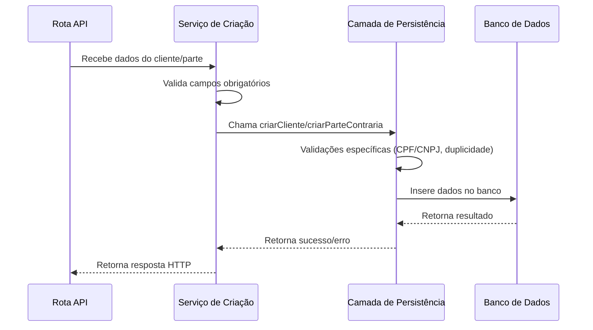
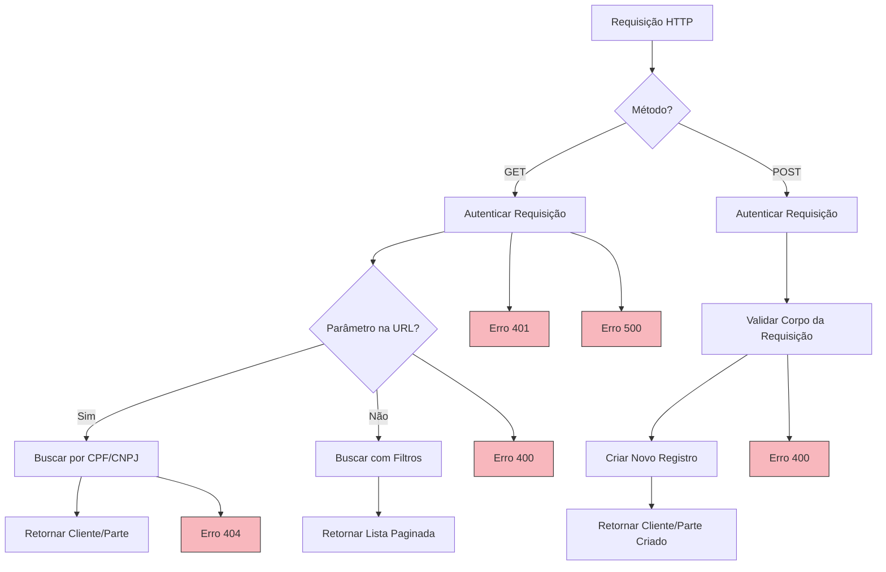

# Gestão de Clientes e Partes Contrárias

<cite>
**Arquivos Referenciados neste Documento**  
- [09_clientes.sql](file://supabase/schemas/09_clientes.sql)
- [10_partes_contrarias.sql](file://supabase/schemas/10_partes_contrarias.sql)
- [criar-cliente.service.ts](file://backend/clientes/services/clientes/criar-cliente.service.ts)
- [criar-parte-contraria.service.ts](file://backend/partes-contrarias/services/partes-contrarias/criar-parte-contraria.service.ts)
- [cliente-persistence.service.ts](file://backend/clientes/services/persistence/cliente-persistence.service.ts)
- [parte-contraria-persistence.service.ts](file://backend/partes-contrarias/services/persistence/parte-contraria-persistence.service.ts)
- [route.ts](file://app/api/clientes/route.ts)
- [route.ts](file://app/api/partes-contrarias/route.ts)
- [por-cpf\[cpf]\route.ts](file://app/api/clientes/buscar/por-cpf/[cpf]/route.ts)
- [por-cpf\[cpf]\route.ts](file://app/api/partes-contrarias/buscar/por-cpf/[cpf]/route.ts)
- [buscar-cliente.service.ts](file://backend/clientes/services/clientes/buscar-cliente.service.ts)
- [buscar-parte-contraria.service.ts](file://backend/partes-contrarias/services/partes-contrarias/buscar-parte-contraria.service.ts)
</cite>

## Sumário
1. [Introdução](#introdução)
2. [Entidades do Sistema](#entidades-do-sistema)
3. [Operações CRUD](#operações-crud)
4. [Camada de Persistência](#camada-de-persistência)
5. [Rotas da API](#rotas-da-api)
6. [Modelos de Dados no Banco de Dados](#modelos-de-dados-no-banco-de-dados)
7. [Exemplos de Requisições e Respostas](#exemplos-de-requisições-e-respostas)
8. [Casos de Uso e Problemas Comuns](#casos-de-uso-e-problemas-comuns)
9. [Conclusão](#conclusão)

## Introdução

O módulo de Gestão de Clientes e Partes Contrárias é fundamental para o funcionamento do sistema de gestão jurídica, permitindo o cadastro, atualização, busca e controle de informações essenciais sobre os envolvidos nos processos. Este documento detalha a estrutura, funcionamento e interações entre as entidades **clientes** (quem contrata os serviços do escritório) e **partes contrárias** (os adversários nos processos judiciais). A análise abrange desde os modelos de dados no banco até as rotas da API, passando pelas camadas de serviço e persistência, com foco na integridade dos dados e na prevenção de problemas comuns como duplicidade de registros.

## Entidades do Sistema

O sistema distingue claramente duas entidades principais, cada uma com um propósito específico e um conjunto de dados bem definido.

### Clientes

A entidade **clientes** representa as pessoas físicas (PF) ou jurídicas (PJ) que contratam os serviços do escritório de advocacia. É o ponto de partida para qualquer relação contratual e jurídica formalizada no sistema. Os dados armazenados são abrangentes, permitindo um cadastro detalhado para fins de comunicação, faturamento e análise de perfil.

**Campos Principais:**
- **tipo_pessoa**: Define se o cliente é uma pessoa física (`pf`) ou jurídica (`pj`).
- **nome**: Nome completo (PF) ou Razão Social (PJ), campo obrigatório.
- **cpf/cnpj**: Documentos de identificação únicos e obrigatórios, dependendo do `tipo_pessoa`.
- **Dados PF**: Inclui campos específicos como `rg`, `data_nascimento`, `genero` e `estado_civil`.
- **Dados PJ**: Inclui `inscricao_estadual`.
- **Contato**: `email`, `telefone_primario`, `telefone_secundario`.
- **Endereço**: Armazenado como um objeto JSONB, permitindo flexibilidade na estrutura (logradouro, número, bairro, cidade, estado, CEP, etc.).
- **Controle**: Campos como `observacoes`, `created_by` (usuário que criou), `ativo` (status do registro) e `dados_anteriores` (para auditoria de alterações).

### Partes Contrárias

A entidade **partes_contrarias** representa as pessoas físicas ou jurídicas que são adversárias em um processo judicial. Diferentemente dos clientes, elas não têm uma relação contratual direta com o escritório, mas seu cadastro é crucial para o gerenciamento de processos, audiências e estratégias jurídicas.

**Campos Principais:**
- **tipo_pessoa**, **nome**, **cpf/cnpj**: Funcionam de forma idêntica aos clientes.
- **Dados PF**: Inclui `rg`, `data_nascimento` (ou data de fundação para PJ), `genero` e `estado_civil`.
- **Inscrição Estadual**: O campo `inscricao_estadual` pode ser usado tanto para PF quanto para PJ, refletindo uma diferença de modelagem em relação aos clientes.
- **Contato e Endereço**: Estrutura idêntica à da entidade clientes.
- **Controle**: Campos como `observacoes`, `created_by`, `ativo` e `dados_anteriores` garantem o mesmo nível de rastreabilidade.

**Seção fontes**
- [09_clientes.sql](file://supabase/schemas/09_clientes.sql)
- [10_partes_contrarias.sql](file://supabase/schemas/10_partes_contrarias.sql)

## Operações CRUD

As operações de Criação (Create), Leitura (Read), Atualização (Update) e Exclusão (Delete) são padronizadas para ambas as entidades, seguindo um fluxo de serviço bem definido.

### Serviço de Criação

Os serviços `criar-cliente.service.ts` e `criar-parte-contraria.service.ts` são responsáveis pela lógica de negócio da criação de novos registros. Eles atuam como intermediários entre a API e a camada de persistência.

**Fluxo de Execução:**
1.  **Validação Inicial:** O serviço inicia validando os dados de entrada, garantindo que campos obrigatórios como `tipoPessoa` e `nome` estejam presentes.
2.  **Chamada à Persistência:** Após a validação básica, o serviço delega a tarefa de criação ao módulo de persistência correspondente (`cliente-persistence.service.ts` ou `parte-contraria-persistence.service.ts`).
3.  **Tratamento de Resultado:** O serviço recebe o resultado da operação de persistência. Se bem-sucedido, retorna o objeto criado. Em caso de erro, loga a falha e retorna uma mensagem de erro padronizada.
4.  **Log de Auditoria:** Ambos os serviços incluem logs detalhados (`console.log`) para rastrear o início e o sucesso/falha do cadastro, o que é essencial para depuração.



**Fontes do diagrama**
- [criar-cliente.service.ts](file://backend/clientes/services/clientes/criar-cliente.service.ts)
- [criar-parte-contraria.service.ts](file://backend/partes-contrarias/services/partes-contrarias/criar-parte-contraria.service.ts)

**Seção fontes**
- [criar-cliente.service.ts](file://backend/clientes/services/clientes/criar-cliente.service.ts)
- [criar-parte-contraria.service.ts](file://backend/partes-contrarias/services/partes-contrarias/criar-parte-contraria.service.ts)

## Camada de Persistência

A camada de persistência, implementada nos arquivos `cliente-persistence.service.ts` e `parte-contraria-persistence.service.ts`, é o núcleo das operações de banco de dados. Ela contém a lógica mais detalhada de validação e manipulação de dados.

### Principais Funções

- **criarCliente/criarParteContraria:** Esta função realiza as validações mais rigorosas:
    - **Validação de Documento:** Verifica se o CPF tem 11 dígitos e o CNPJ tem 14 dígitos.
    - **Verificação de Duplicidade:** Consulta o banco de dados para garantir que o CPF ou CNPJ não esteja já cadastrado para outro registro.
    - **Validação de Email:** Confirma se o formato do e-mail é válido.
    - **Normalização de Dados:** Remove formatação de CPF/CNPJ e CEP, e padroniza o e-mail para minúsculas.
    - **Preparação para Inserção:** Constrói um objeto com os dados normalizados e inseridos no banco via Supabase.
- **atualizarCliente/atualizarParteContraria:** Similar à criação, mas com validações adicionais para garantir que o registro exista e que o `tipo_pessoa` não seja alterado. Também verifica duplicidade apenas se o CPF/CNPJ for alterado.
- **buscarClientePorCpf/buscarParteContrariaPorCpf:** Funções especializadas para busca por documento, que normalizam o CPF antes da consulta.
- **listarClientes/listarPartesContrarias:** Funções para listagem com paginação, filtros por nome, tipo de pessoa, status ativo e busca textual.

**Seção fontes**
- [cliente-persistence.service.ts](file://backend/clientes/services/persistence/cliente-persistence.service.ts)
- [parte-contraria-persistence.service.ts](file://backend/partes-contrarias/services/persistence/parte-contraria-persistence.service.ts)

## Rotas da API

As rotas da API, localizadas em `app/api/clientes/` e `app/api/partes-contrarias/`, expõem as funcionalidades do sistema para os clientes HTTP (front-end, outras APIs, etc.).

### Rota Principal (GET e POST)

A rota `route.ts` em ambos os diretórios implementa dois métodos:
- **GET:** Lista registros com suporte a paginação (`pagina`, `limite`), busca textual (`busca`), e filtros por `tipoPessoa` e `ativo`. A autenticação é obrigatória.
- **POST:** Cria um novo registro. O corpo da requisição deve conter os dados do cliente ou parte contrária no formato JSON. A autenticação é obrigatória.

### Rotas de Busca por CPF/CNPJ

As rotas aninhadas em `buscar/por-cpf/[cpf]/route.ts` e `buscar/por-cnpj/[cnpj]/route.ts` são especializadas para recuperação rápida de um registro com base em seu documento de identificação.
- **Método:** GET
- **Parâmetro:** O CPF ou CNPJ é passado diretamente na URL (path parameter).
- **Comportamento:** A rota valida o parâmetro, chama o serviço de busca correspondente e retorna os dados completos do registro se encontrado, ou um erro 404 se não encontrado.



**Fontes do diagrama**
- [route.ts](file://app/api/clientes/route.ts)
- [route.ts](file://app/api/partes-contrarias/route.ts)
- [por-cpf\[cpf]\route.ts](file://app/api/clientes/buscar/por-cpf/[cpf]/route.ts)
- [por-cpf\[cpf]\route.ts](file://app/api/partes-contrarias/buscar/por-cpf/[cpf]/route.ts)

**Seção fontes**
- [route.ts](file://app/api/clientes/route.ts)
- [route.ts](file://app/api/partes-contrarias/route.ts)
- [por-cpf\[cpf]\route.ts](file://app/api/clientes/buscar/por-cpf/[cpf]/route.ts)
- [por-cpf\[cpf]\route.ts](file://app/api/partes-contrarias/buscar/por-cpf/[cpf]/route.ts)

## Modelos de Dados no Banco de Dados

Os modelos de dados são definidos por scripts SQL no diretório `supabase/schemas/`, garantindo consistência e integridade.

### Tabela `clientes` (09_clientes.sql)

- **Campos Obrigatórios:** `id`, `tipo_pessoa`, `nome`, `created_at`, `updated_at`.
- **Restrições de Unicidade:** Índices únicos para `cpf` e `cnpj` (quando não nulos).
- **Índices de Performance:** Vários índices B-Tree para acelerar buscas por `tipo_pessoa`, `nome`, `ativo` e `created_by`. Um índice GIN é usado para consultas eficientes no campo JSONB `endereco`.
- **Auditoria:** O campo `dados_anteriores` armazena o estado anterior do registro antes de uma atualização, e um trigger atualiza automaticamente o campo `updated_at`.

### Tabela `partes_contrarias` (10_partes_contrarias.sql)

- **Estrutura Idêntica:** A tabela é quase uma cópia da tabela `clientes`, refletindo a semelhança conceitual entre as entidades.
- **Diferença Chave:** O campo `inscricao_estadual` é descrito como aplicável a ambos PF e PJ, indicando uma flexibilidade maior no cadastro de partes contrárias.
- **Mesmas Restrições:** Possui as mesmas restrições de unicidade, índices de performance e mecanismos de auditoria (trigger e `dados_anteriores`).

**Seção fontes**
- [09_clientes.sql](file://supabase/schemas/09_clientes.sql)
- [10_partes_contrarias.sql](file://supabase/schemas/10_partes_contrarias.sql)

## Exemplos de Requisições e Respostas

### Criar um Cliente (POST)

**Requisição:**
```http
POST /api/clientes
Authorization: Bearer <token>
Content-Type: application/json

{
  "tipoPessoa": "pf",
  "nome": "João Silva",
  "cpf": "123.456.789-00",
  "email": "joao.silva@email.com",
  "telefonePrimario": "(11) 91234-5678",
  "endereco": {
    "logradouro": "Rua das Flores",
    "numero": "123",
    "bairro": "Jardim",
    "cidade": "São Paulo",
    "estado": "SP",
    "cep": "01234-567"
  }
}
```

**Resposta de Sucesso (201 Created):**
```json
{
  "success": true,
  "data": {
    "id": 1,
    "tipoPessoa": "pf",
    "nome": "João Silva",
    "cpf": "12345678900",
    "email": "joao.silva@email.com",
    "telefonePrimario": "(11) 91234-5678",
    "endereco": {
      "logradouro": "Rua das Flores",
      "numero": "123",
      "bairro": "Jardim",
      "cidade": "São Paulo",
      "estado": "SP",
      "cep": "01234567"
    },
    "ativo": true,
    "createdAt": "2025-04-05T10:00:00Z",
    "updatedAt": "2025-04-05T10:00:00Z"
  }
}
```

**Resposta de Erro (400 Bad Request - CPF Duplicado):**
```json
{
  "error": "CPF já cadastrado no sistema"
}
```

### Buscar Cliente por CPF (GET)

**Requisição:**
```http
GET /api/clientes/buscar/por-cpf/123.456.789-00
Authorization: Bearer <token>
```

**Resposta de Sucesso (200 OK):**
```json
{
  "success": true,
  "data": {
    "id": 1,
    "tipoPessoa": "pf",
    "nome": "João Silva",
    "cpf": "12345678900",
    "email": "joao.silva@email.com",
    "telefonePrimario": "(11) 91234-5678",
    "endereco": {
      "logradouro": "Rua das Flores",
      "numero": "123",
      "bairro": "Jardim",
      "cidade": "São Paulo",
      "estado": "SP",
      "cep": "01234567"
    },
    "ativo": true,
    "createdAt": "2025-04-05T10:00:00Z",
    "updatedAt": "2025-04-05T10:00:00Z"
  }
}
```

**Resposta de Erro (404 Not Found):**
```json
{
  "error": "Cliente não encontrado"
}
```

## Casos de Uso e Problemas Comuns

### Caso de Uso: Busca por CPF/CNPJ

A busca por CPF ou CNPJ é um caso de uso frequente e crítico. O sistema fornece rotas dedicadas (`/api/clientes/buscar/por-cpf/{cpf}`) que são otimizadas para essa operação. A normalização do CPF/CNPJ (remoção de pontos, traços e barras) no serviço de persistência garante que a busca funcione independentemente da formatação fornecida pelo usuário.

### Problema Comum: Duplicidade de Registros

A duplicidade de registros é um dos problemas mais comuns em sistemas de cadastro. O sistema implementa várias camadas de proteção:
1.  **Restrições no Banco de Dados:** Índices únicos nas colunas `cpf` e `cnpj` impedem a inserção direta de valores duplicados.
2.  **Validação na Camada de Persistência:** Antes de tentar a inserção, o serviço de persistência realiza uma consulta explícita para verificar a existência de um CPF/CNPJ igual. Isso fornece uma mensagem de erro mais clara e amigável do que uma exceção de banco de dados.
3.  **Normalização de Entrada:** Ao normalizar o CPF/CNPJ (removendo formatação), o sistema evita falsos positivos causados por diferentes formatos (ex: `123.456.789-00` vs `12345678900`).

**Seção fontes**
- [buscar-cliente.service.ts](file://backend/clientes/services/clientes/buscar-cliente.service.ts)
- [buscar-parte-contraria.service.ts](file://backend/partes-contrarias/services/partes-contrarias/buscar-parte-contraria.service.ts)
- [cliente-persistence.service.ts](file://backend/clientes/services/persistence/cliente-persistence.service.ts)
- [parte-contraria-persistence.service.ts](file://backend/partes-contrarias/services/persistence/parte-contraria-persistence.service.ts)

## Conclusão

O módulo de Gestão de Clientes e Partes Contrárias apresenta uma arquitetura bem estruturada e robusta, com uma clara separação de responsabilidades entre as camadas de API, serviço e persistência. A modelagem de dados é consistente e reflete com precisão as necessidades do domínio jurídico, distinguindo claramente entre quem contrata os serviços e quem é adversário nos processos. O sistema implementa controles rigorosos para garantir a integridade dos dados, especialmente na prevenção de duplicidade de registros através de validações em múltiplas camadas e restrições no banco de dados. As rotas da API são bem documentadas (via Swagger) e fornecem uma interface clara e eficiente para a criação, leitura e busca de informações, tornando o módulo confiável e fácil de integrar com outras partes do sistema.