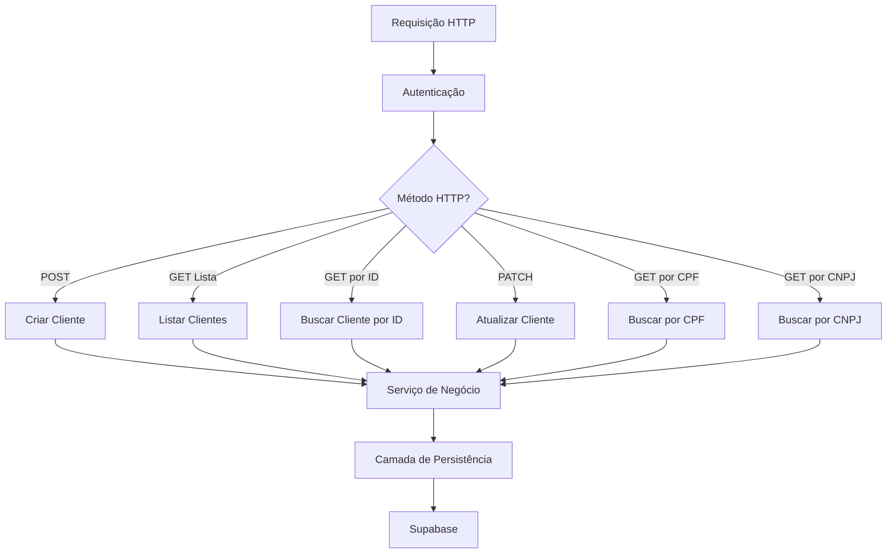
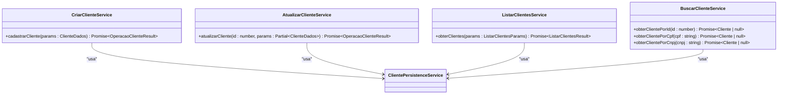
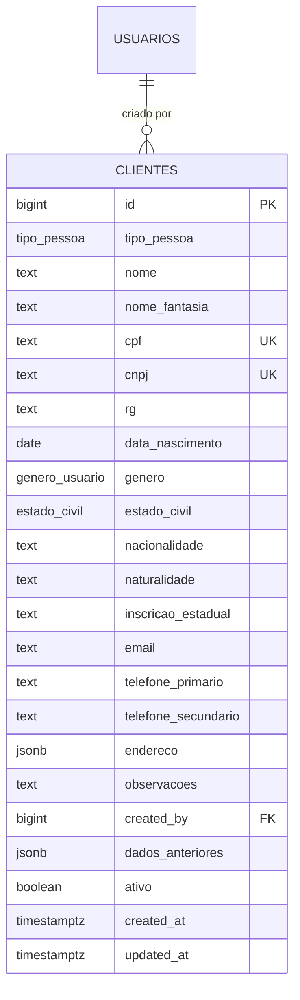
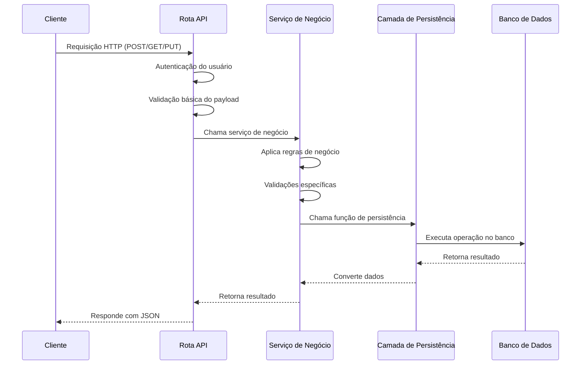

# Gestão de Clientes

<cite>
**Arquivos Referenciados neste Documento**  
- [app/api/clientes/route.ts](file://app/api/clientes/route.ts)
- [app/api/clientes/[id]/route.ts](file://app/api/clientes/[id]/route.ts)
- [app/api/clientes/buscar/por-cpf/[cpf]/route.ts](file://app/api/clientes/buscar/por-cpf/[cpf]/route.ts)
- [app/api/clientes/buscar/por-cnpj/[cnpj]/route.ts](file://app/api/clientes/buscar/por-cnpj/[cnpj]/route.ts)
- [backend/clientes/services/clientes/criar-cliente.service.ts](file://backend/clientes/services/clientes/criar-cliente.service.ts)
- [backend/clientes/services/clientes/atualizar-cliente.service.ts](file://backend/clientes/services/clientes/atualizar-cliente.service.ts)
- [backend/clientes/services/clientes/listar-clientes.service.ts](file://backend/clientes/services/clientes/listar-clientes.service.ts)
- [backend/clientes/services/clientes/buscar-cliente.service.ts](file://backend/clientes/services/clientes/buscar-cliente.service.ts)
- [backend/clientes/services/persistence/cliente-persistence.service.ts](file://backend/clientes/services/persistence/cliente-persistence.service.ts)
- [supabase/schemas/09_clientes.sql](file://supabase/schemas/09_clientes.sql)
</cite>

## Sumário
1. [Introdução](#introdução)
2. [Arquitetura em Camadas](#arquitetura-em-camadas)
3. [Modelo de Dados](#modelo-de-dados)
4. [Operações CRUD](#operações-crud)
5. [Fluxo de Requisição](#fluxo-de-requisição)
6. [Casos Especiais e Integrações](#casos-especiais-e-integrações)
7. [Exemplos Práticos](#exemplos-práticos)
8. [Erros Comuns e Boas Práticas](#erros-comuns-e-boas-práticas)

## Introdução

O módulo de Gestão de Clientes é responsável por representar as entidades que contratam os serviços do escritório de advocacia. Este sistema permite o cadastro, atualização, listagem e busca de clientes, sejam pessoas físicas (PF) ou jurídicas (PJ), com total integridade de dados e segurança. A arquitetura é organizada em camadas bem definidas: rotas API, serviços de negócio e camada de persistência, garantindo separação de responsabilidades e facilitando manutenção e testes.

Este documento detalha a estrutura completa do módulo, desde a definição do modelo de dados até o fluxo completo de requisições HTTP, passando pelas validações, regras de negócio e persistência no Supabase. Também são abordados casos especiais como prevenção de duplicidade por CPF/CNPJ, tratamento de dados sensíveis e integração com outros módulos como contratos.

**Seções de origem**
- [backend/clientes/services/clientes/criar-cliente.service.ts](file://backend/clientes/services/clientes/criar-cliente.service.ts#L1-L54)
- [backend/clientes/services/persistence/cliente-persistence.service.ts](file://backend/clientes/services/persistence/cliente-persistence.service.ts#L1-L644)

## Arquitetura em Camadas

A arquitetura do módulo de Gestão de Clientes segue um padrão de camadas clássico, dividido em três níveis principais: camada de API, camada de serviços de negócio e camada de persistência.

### Camada de API

Localizada em `app/api/clientes/`, esta camada expõe endpoints RESTful para operações CRUD. Cada rota é responsável por receber requisições HTTP, autenticar o usuário, validar os dados de entrada e orquestrar as chamadas aos serviços de negócio.

Os principais endpoints são:
- `POST /api/clientes`: Cria um novo cliente
- `GET /api/clientes`: Lista clientes com paginação e filtros
- `GET /api/clientes/[id]`: Busca um cliente por ID
- `PATCH /api/clientes/[id]`: Atualiza parcialmente um cliente
- `GET /api/clientes/buscar/por-cpf/[cpf]`: Busca por CPF
- `GET /api/clientes/buscar/por-cnpj/[cnpj]`: Busca por CNPJ

Todas as rotas utilizam o mecanismo de autenticação centralizado via `authenticateRequest`, garantindo que apenas usuários autorizados possam acessar os recursos.



**Fontes do diagrama**
- [app/api/clientes/route.ts](file://app/api/clientes/route.ts#L4-L252)
- [app/api/clientes/[id]/route.ts](file://app/api/clientes/[id]/route.ts#L4-L218)

**Seções de origem**
- [app/api/clientes/route.ts](file://app/api/clientes/route.ts#L4-L252)
- [app/api/clientes/[id]/route.ts](file://app/api/clientes/[id]/route.ts#L4-L218)
- [app/api/clientes/buscar/por-cpf/[cpf]/route.ts](file://app/api/clientes/buscar/por-cpf/[cpf]/route.ts#L4-L85)
- [app/api/clientes/buscar/por-cnpj/[cnpj]/route.ts](file://app/api/clientes/buscar/por-cnpj/[cnpj]/route.ts#L4-L85)

### Camada de Serviços de Negócio

Localizada em `backend/clientes/services/clientes/`, esta camada contém a lógica de negócio específica do domínio de clientes. Os principais serviços são:

- `criar-cliente.service.ts`: Gerencia a criação de novos clientes, incluindo validações e prevenção de duplicidade
- `atualizar-cliente.service.ts`: Gerencia a atualização de clientes existentes
- `listar-clientes.service.ts`: Gerencia a listagem com paginação e filtros
- `buscar-cliente.service.ts`: Gerencia buscas por critérios específicos

Esses serviços atuam como intermediários entre a camada de API e a camada de persistência, garantindo que todas as regras de negócio sejam aplicadas antes da persistência dos dados.



**Fontes do diagrama**
- [backend/clientes/services/clientes/criar-cliente.service.ts](file://backend/clientes/services/clientes/criar-cliente.service.ts#L1-L54)
- [backend/clientes/services/clientes/atualizar-cliente.service.ts](file://backend/clientes/services/clientes/atualizar-cliente.service.ts#L1-L49)
- [backend/clientes/services/clientes/listar-clientes.service.ts](file://backend/clientes/services/clientes/listar-clientes.service.ts#L1-L24)
- [backend/clientes/services/clientes/buscar-cliente.service.ts](file://backend/clientes/services/clientes/buscar-cliente.service.ts#L1-L32)

**Seções de origem**
- [backend/clientes/services/clientes/criar-cliente.service.ts](file://backend/clientes/services/clientes/criar-cliente.service.ts#L1-L54)
- [backend/clientes/services/clientes/atualizar-cliente.service.ts](file://backend/clientes/services/clientes/atualizar-cliente.service.ts#L1-L49)
- [backend/clientes/services/clientes/listar-clientes.service.ts](file://backend/clientes/services/clientes/listar-clientes.service.ts#L1-L24)
- [backend/clientes/services/clientes/buscar-cliente.service.ts](file://backend/clientes/services/clientes/buscar-cliente.service.ts#L1-L32)

### Camada de Persistência

Localizada em `backend/clientes/services/persistence/`, esta camada é responsável pelas operações diretas no banco de dados. O arquivo `cliente-persistence.service.ts` contém todas as funções de acesso a dados, utilizando o cliente de serviço do Supabase para realizar operações CRUD na tabela `clientes`.

A camada de persistência é responsável por:
- Executar consultas SQL via Supabase
- Validar dados antes da persistência
- Normalizar dados (CPF, CNPJ, e-mails)
- Gerenciar transações e erros de banco de dados
- Converter entre formatos de dados da aplicação e do banco

Esta separação permite que a lógica de negócio permaneça independente da tecnologia de banco de dados, facilitando futuras migrações ou testes unitários.

**Seções de origem**
- [backend/clientes/services/persistence/cliente-persistence.service.ts](file://backend/clientes/services/persistence/cliente-persistence.service.ts#L1-L644)

## Modelo de Dados

O modelo de dados para clientes é definido no arquivo `supabase/schemas/09_clientes.sql`. A tabela `clientes` é projetada para armazenar informações completas tanto de pessoas físicas quanto jurídicas, com campos específicos para cada tipo.

### Estrutura da Tabela

| Campo | Tipo | Descrição |
|-------|------|-----------|
| id | bigint | Chave primária gerada automaticamente |
| tipo_pessoa | tipo_pessoa | Tipo de pessoa: 'pf' (física) ou 'pj' (jurídica) |
| nome | text | Nome completo (PF) ou Razão Social (PJ) |
| nome_fantasia | text | Nome social (PF) ou Nome fantasia (PJ) |
| cpf | text | CPF do cliente (único, obrigatório para PF) |
| cnpj | text | CNPJ do cliente (único, obrigatório para PJ) |
| rg | text | RG do cliente (apenas para PF) |
| data_nascimento | date | Data de nascimento (apenas para PF) |
| genero | genero_usuario | Gênero do cliente (apenas para PF) |
| estado_civil | estado_civil | Estado civil do cliente (apenas para PF) |
| nacionalidade | text | Nacionalidade do cliente (apenas para PF) |
| naturalidade | text | Naturalidade do cliente (apenas para PF) |
| inscricao_estadual | text | Inscrição estadual (apenas para PJ) |
| email | text | E-mail do cliente |
| telefone_primario | text | Telefone primário do cliente |
| telefone_secundario | text | Telefone secundário do cliente |
| endereco | jsonb | Endereço completo em formato JSONB |
| observacoes | text | Observações gerais sobre o cliente |
| created_by | bigint | ID do usuário que criou o registro |
| dados_anteriores | jsonb | Estado anterior do registro antes da última atualização |
| ativo | boolean | Indica se o cliente está ativo no sistema |
| created_at | timestamptz | Data de criação do registro |
| updated_at | timestamptz | Data da última atualização |

### Índices para Otimização

A tabela possui vários índices para otimizar consultas frequentes:

```sql
create index idx_clientes_tipo_pessoa on public.clientes using btree (tipo_pessoa);
create index idx_clientes_cpf on public.clientes using btree (cpf) where cpf is not null;
create index idx_clientes_cnpj on public.clientes using btree (cnpj) where cnpj is not null;
create index idx_clientes_nome on public.clientes using btree (nome);
create index idx_clientes_ativo on public.clientes using btree (ativo);
create index idx_clientes_created_by on public.clientes using btree (created_by);
create index idx_clientes_endereco on public.clientes using gin (endereco);
```

Esses índices garantem alta performance nas operações de busca por CPF, CNPJ, nome, tipo de pessoa e status ativo. O índice GIN no campo `endereco` permite consultas eficientes em dados JSONB.



**Fontes do diagrama**
- [supabase/schemas/09_clientes.sql](file://supabase/schemas/09_clientes.sql#L1-L86)

**Seções de origem**
- [supabase/schemas/09_clientes.sql](file://supabase/schemas/09_clientes.sql#L1-L86)

## Operações CRUD

O módulo de Gestão de Clientes implementa operações CRUD completas com validações rigorosas e tratamento adequado de erros.

### Criação de Cliente

A operação de criação é realizada através do serviço `criar-cliente.service.ts` e segue um fluxo rigoroso de validação:

1. Validação dos dados obrigatórios (tipo de pessoa, nome)
2. Validações específicas por tipo de pessoa (CPF para PF, CNPJ para PJ)
3. Verificação de unicidade de CPF/CNPJ
4. Validação de formato de e-mail
5. Normalização e validação do endereço
6. Persistência no banco de dados

A criação impede que CPFs sejam cadastrados para pessoas jurídicas e vice-versa, garantindo integridade dos dados.

**Seções de origem**
- [backend/clientes/services/persistence/cliente-persistence.service.ts](file://backend/clientes/services/persistence/cliente-persistence.service.ts#L245-L365)

### Atualização Parcial

A atualização é realizada via método PATCH, permitindo a modificação de campos específicos. O serviço `atualizar-cliente.service.ts` garante que:

- O cliente exista antes da atualização
- Não seja permitida a alteração do tipo de pessoa
- Seja verificada a unicidade de CPF/CNPJ se esses campos forem alterados
- Sejam aplicadas as mesmas validações de criação para os campos fornecidos

A atualização é parcial, significando que apenas os campos enviados no payload são modificados, preservando os demais valores existentes.

**Seções de origem**
- [backend/clientes/services/persistence/cliente-persistence.service.ts](file://backend/clientes/services/persistence/cliente-persistence.service.ts#L370-L521)

### Listagem com Paginação

A listagem de clientes suporta paginação e múltiplos filtros:

- **pagina**: Número da página (padrão: 1)
- **limite**: Itens por página (padrão: 50)
- **busca**: Busca em nome, nome fantasia, CPF, CNPJ e e-mail
- **tipoPessoa**: Filtrar por PF ou PJ
- **ativo**: Filtrar por status ativo/inativo

A resposta inclui metadados de paginação: total de registros, número total de páginas, e os dados da página atual.

**Seções de origem**
- [backend/clientes/services/persistence/cliente-persistence.service.ts](file://backend/clientes/services/persistence/cliente-persistence.service.ts#L595-L644)

### Busca por CPF/CNPJ

Além da busca por ID, o sistema oferece endpoints específicos para busca por CPF e CNPJ, normalizando os valores (removendo formatação) antes da consulta. Esses endpoints são otimizados com índices específicos para garantir alta performance.

**Seções de origem**
- [backend/clientes/services/persistence/cliente-persistence.service.ts](file://backend/clientes/services/persistence/cliente-persistence.service.ts#L547-L590)

## Fluxo de Requisição

O fluxo completo de uma requisição no módulo de Gestão de Clientes envolve várias camadas e componentes:



**Fontes do diagrama**
- [app/api/clientes/route.ts](file://app/api/clientes/route.ts#L164-L252)
- [backend/clientes/services/clientes/criar-cliente.service.ts](file://backend/clientes/services/clientes/criar-cliente.service.ts#L19-L54)
- [backend/clientes/services/persistence/cliente-persistence.service.ts](file://backend/clientes/services/persistence/cliente-persistence.service.ts#L245-L365)

**Seções de origem**
- [app/api/clientes/route.ts](file://app/api/clientes/route.ts#L164-L252)
- [backend/clientes/services/clientes/criar-cliente.service.ts](file://backend/clientes/services/clientes/criar-cliente.service.ts#L19-L54)
- [backend/clientes/services/persistence/cliente-persistence.service.ts](file://backend/clientes/services/persistence/cliente-persistence.service.ts#L245-L365)

## Casos Especiais e Integrações

### Prevenção de Duplicidade

O sistema implementa mecanismos rigorosos para prevenir duplicidade de clientes por CPF ou CNPJ:

- CPF e CNPJ são campos únicos na tabela `clientes`
- Índices específicos garantem performance nas consultas de unicidade
- Validação síncrona durante criação e atualização
- Normalização dos dados (remoção de formatação) antes da comparação

Essa prevenção é crítica para manter a integridade do cadastro e evitar conflitos em documentos legais.

### Tratamento de Dados Sensíveis

O módulo trata dados sensíveis como CPF, RG e dados pessoais com cuidado:

- Todos os endpoints requerem autenticação
- Logs de operações incluem máscara de dados sensíveis
- O campo `dados_anteriores` armazena o estado anterior do registro para auditoria
- RLS (Row Level Security) está habilitado na tabela para controle de acesso

### Integração com Outros Módulos

O módulo de clientes integra-se com outros módulos do sistema:

- **Contratos**: Um contrato está vinculado a um cliente através do campo `cliente_id`
- **Usuários**: O campo `created_by` referencia o usuário que criou o cliente
- **Logs de Alteração**: Alterações são registradas para auditoria
- **Partes Contrárias**: Estrutura similar permite reutilização de componentes

Essas integrações permitem um fluxo de trabalho coeso entre os diferentes aspectos do sistema de gestão jurídica.

**Seções de origem**
- [supabase/schemas/09_clientes.sql](file://supabase/schemas/09_clientes.sql#L1-L86)
- [backend/clientes/services/persistence/cliente-persistence.service.ts](file://backend/clientes/services/persistence/cliente-persistence.service.ts#L245-L365)

## Exemplos Práticos

### Criação de Cliente (POST)

**Requisição:**
```http
POST /api/clientes
Content-Type: application/json
Authorization: Bearer <token>

{
  "tipoPessoa": "pf",
  "nome": "João Silva",
  "nomeFantasia": "João",
  "cpf": "123.456.789-00",
  "email": "joao@email.com",
  "telefonePrimario": "(11) 91234-5678",
  "endereco": {
    "logradouro": "Rua Exemplo",
    "numero": "123",
    "bairro": "Centro",
    "cidade": "São Paulo",
    "estado": "SP",
    "cep": "01000-000"
  }
}
```

**Resposta de Sucesso:**
```json
{
  "success": true,
  "data": {
    "id": 1,
    "tipoPessoa": "pf",
    "nome": "João Silva",
    "nomeFantasia": "João",
    "cpf": "12345678900",
    "email": "joao@email.com",
    "telefonePrimario": "(11) 91234-5678",
    "endereco": {
      "logradouro": "Rua Exemplo",
      "numero": "123",
      "bairro": "Centro",
      "cidade": "São Paulo",
      "estado": "SP",
      "cep": "01000000"
    },
    "ativo": true,
    "createdAt": "2025-01-01T00:00:00Z",
    "updatedAt": "2025-01-01T00:00:00Z"
  }
}
```

### Listagem com Paginação (GET)

**Requisição:**
```http
GET /api/clientes?pagina=1&limite=10&busca=joao&tipoPessoa=pf
Authorization: Bearer <token>
```

**Resposta:**
```json
{
  "success": true,
  "data": {
    "clientes": [...],
    "total": 15,
    "pagina": 1,
    "limite": 10,
    "totalPaginas": 2
  }
}
```

### Atualização Parcial (PATCH)

**Requisição:**
```http
PATCH /api/clientes/1
Content-Type: application/json
Authorization: Bearer <token>

{
  "email": "joao.novo@email.com",
  "telefonePrimario": "(11) 98765-4321"
}
```

**Resposta:**
```json
{
  "success": true,
  "data": {
    "id": 1,
    "nome": "João Silva",
    "email": "joao.novo@email.com",
    "telefonePrimario": "(11) 98765-4321",
    "updatedAt": "2025-01-02T10:00:00Z"
  }
}
```

**Seções de origem**
- [app/api/clientes/route.ts](file://app/api/clientes/route.ts#L164-L252)
- [app/api/clientes/[id]/route.ts](file://app/api/clientes/[id]/route.ts#L110-L218)

## Erros Comuns e Boas Práticas

### Erros Comuns

1. **CPF/CNPJ já cadastrado**: Verifique se o cliente já existe antes de criar
2. **Campos obrigatórios ausentes**: Sempre envie `tipoPessoa` e `nome`
3. **Formato inválido de CPF/CNPJ**: CPF deve ter 11 dígitos, CNPJ 14
4. **Tipo de pessoa inconsistente**: Não envie CPF para PJ ou CNPJ para PF
5. **E-mail inválido**: Certifique-se de que o e-mail tem formato válido

### Boas Práticas

1. **Utilize busca por CPF/CNPJ**: Mais rápido e preciso que busca por nome
2. **Implemente tratamento de erros**: Lidere com respostas 400 e 404 adequadamente
3. **Use paginação em listagens**: Evite sobrecarregar o cliente com muitos dados
4. **Atualize parcialmente**: Use PATCH para modificar apenas os campos necessários
5. **Valide localmente**: Implemente validações de CPF/CNPJ no frontend
6. **Mantenha dados atualizados**: Registre alterações de contato prontamente

Seguindo estas orientações, é possível utilizar o módulo de Gestão de Clientes de forma eficiente e segura, garantindo a integridade dos dados e uma experiência de usuário fluida.

**Seções de origem**
- [backend/clientes/services/persistence/cliente-persistence.service.ts](file://backend/clientes/services/persistence/cliente-persistence.service.ts#L245-L365)
- [backend/clientes/services/persistence/cliente-persistence.service.ts](file://backend/clientes/services/persistence/cliente-persistence.service.ts#L370-L521)