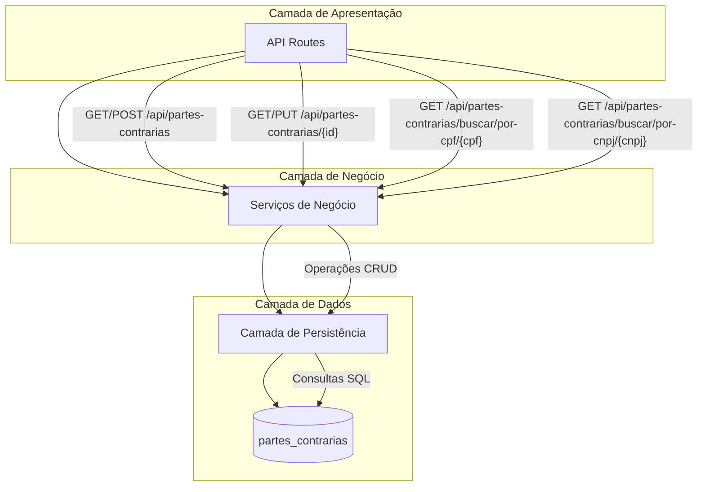
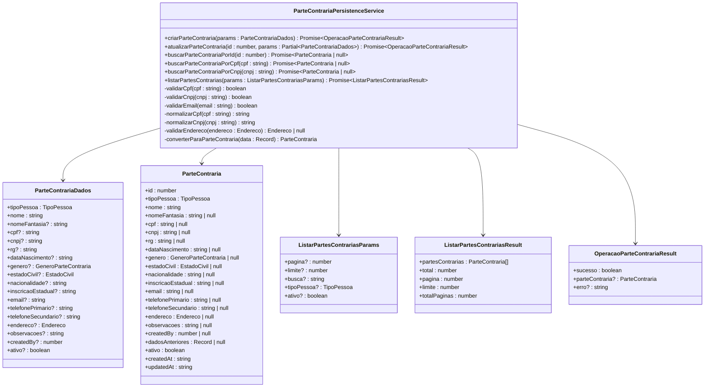
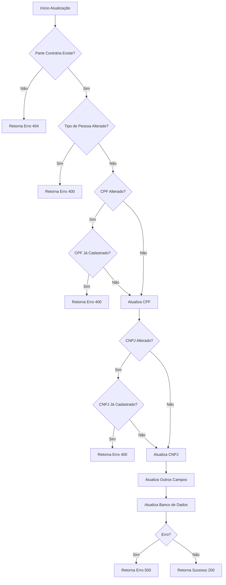
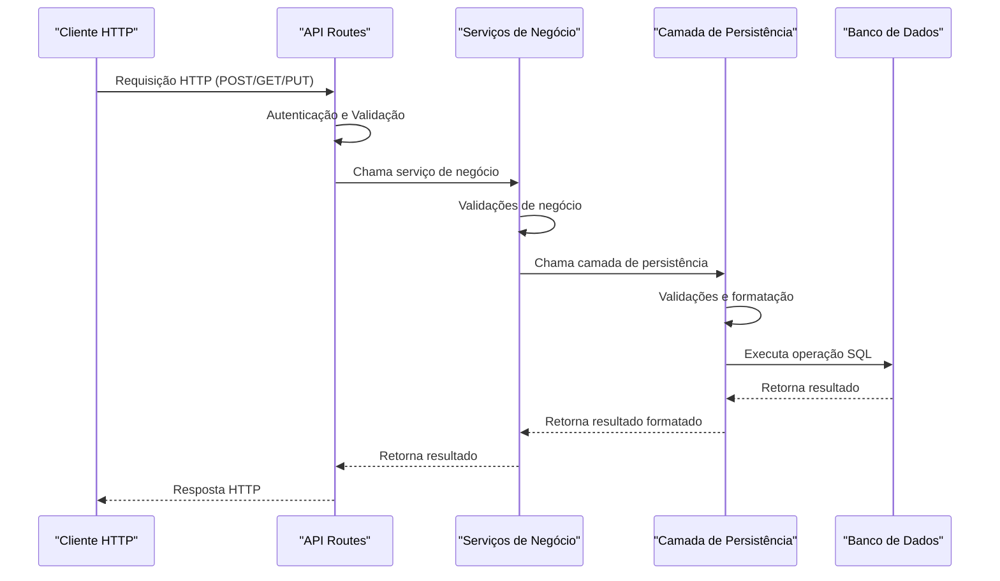

# Gestão de Partes Contrárias

<cite>
**Arquivos Referenciados neste Documento**  
- [10_partes_contrarias.sql](file://supabase/schemas/10_partes_contrarias.sql)
- [criar-parte-contraria.service.ts](file://backend/partes-contrarias/services/partes-contrarias/criar-parte-contraria.service.ts)
- [atualizar-parte-contraria.service.ts](file://backend/partes-contrarias/services/partes-contrarias/atualizar-parte-contraria.service.ts)
- [listar-partes-contrarias.service.ts](file://backend/partes-contrarias/services/partes-contrarias/listar-partes-contrarias.service.ts)
- [buscar-parte-contraria.service.ts](file://backend/partes-contrarias/services/partes-contrarias/buscar-parte-contraria.service.ts)
- [parte-contraria-persistence.service.ts](file://backend/partes-contrarias/services/persistence/parte-contraria-persistence.service.ts)
- [route.ts](file://app/api/partes-contrarias/route.ts)
- [\[id\]/route.ts](file://app/api/partes-contrarias/[id]/route.ts)
- [buscar/por-cpf/\[cpf\]/route.ts](file://app/api/partes-contrarias/buscar/por-cpf/[cpf]/route.ts)
- [buscar/por-cnpj/\[cnpj\]/route.ts](file://app/api/partes-contrarias/buscar/por-cnpj/[cnpj]/route.ts)
</cite>

## Sumário
1. [Introdução](#introdução)
2. [Estrutura do Modelo de Dados](#estrutura-do-modelo-de-dados)
3. [Arquitetura em Camadas](#arquitetura-em-camadas)
4. [Operações CRUD](#operações-crud)
5. [Fluxo de Dados](#fluxo-de-dados)
6. [Casos de Uso](#casos-de-uso)
7. [Exemplos de Requisições](#exemplos-de-requisições)
8. [Considerações de Desempenho](#considerações-de-desempenho)
9. [Conclusão](#conclusão)

## Introdução

O módulo de Gestão de Partes Contrárias é responsável por armazenar e gerenciar informações sobre as partes adversárias nos processos judiciais. Este sistema permite o cadastro, atualização, listagem e busca de partes contrárias, distinguindo entre pessoas físicas (PF) e pessoas jurídicas (PJ). A arquitetura em camadas garante separação de responsabilidades entre a interface de API, a lógica de negócio e a persistência de dados, proporcionando um sistema robusto e escalável para o gerenciamento de informações jurídicas.

**Section sources**
- [10_partes_contrarias.sql](file://supabase/schemas/10_partes_contrarias.sql)

## Estrutura do Modelo de Dados

A tabela `partes_contrarias` no banco de dados é projetada para armazenar informações completas sobre partes contrárias, com campos específicos para cada tipo de pessoa. A estrutura inclui identificadores únicos, dados pessoais, informações de contato e controle de auditoria.

### Campos Principais

| Campo | Tipo | Descrição | Obrigatório |
|------|------|-----------|-------------|
| **id** | bigint | Identificador único gerado automaticamente | Sim |
| **tipo_pessoa** | enum | Tipo de pessoa: 'pf' (física) ou 'pj' (jurídica) | Sim |
| **nome** | text | Nome completo (PF) ou Razão Social (PJ) | Sim |
| **nome_fantasia** | text | Nome social (PF) ou Nome fantasia (PJ) | Não |
| **cpf** | text | CPF da parte contrária | Sim (apenas PF) |
| **cnpj** | text | CNPJ da parte contrária | Sim (apenas PJ) |
| **rg** | text | RG da parte contrária | Não (apenas PF) |
| **data_nascimento** | date | Data de nascimento (PF) ou fundação (PJ) | Não |
| **genero** | enum | Gênero da parte contrária | Não (apenas PF) |
| **estado_civil** | enum | Estado civil da parte contrária | Não (apenas PF) |
| **nacionalidade** | text | Nacionalidade da parte contrária | Não (apenas PF) |
| **inscricao_estadual** | text | Inscrição estadual | Não |
| **email** | text | E-mail da parte contrária | Não |
| **telefone_primario** | text | Telefone primário | Não |
| **telefone_secundario** | text | Telefone secundário | Não |
| **endereco** | jsonb | Endereço completo em formato JSON | Não |
| **observacoes** | text | Observações gerais | Não |
| **created_by** | bigint | ID do usuário que criou o registro | Não |
| **dados_anteriores** | jsonb | Estado anterior do registro antes da última atualização | Não |
| **ativo** | boolean | Indica se a parte contrária está ativa | Sim (padrão: true) |
| **created_at** | timestamptz | Data de criação do registro | Sim (padrão: now()) |
| **updated_at** | timestamptz | Data da última atualização | Sim (padrão: now()) |

### Índices para Otimização

A tabela possui vários índices para otimizar consultas frequentes:

- `idx_partes_contrarias_tipo_pessoa`: Índice B-Tree para filtragem por tipo de pessoa
- `idx_partes_contrarias_cpf`: Índice B-Tree para busca por CPF (apenas quando não nulo)
- `idx_partes_contrarias_cnpj`: Índice B-Tree para busca por CNPJ (apenas quando não nulo)
- `idx_partes_contrarias_nome`: Índice B-Tree para busca por nome
- `idx_partes_contrarias_ativo`: Índice B-Tree para filtragem por status ativo/inativo
- `idx_partes_contrarias_created_by`: Índice B-Tree para filtragem por usuário criador
- `idx_partes_contrarias_endereco`: Índice GIN para busca eficiente em campos JSONB de endereço

### Estrutura do Endereço JSONB

O campo `endereco` utiliza o tipo JSONB do PostgreSQL para armazenar informações de endereço de forma flexível:

```json
{
  "logradouro": "string",
  "numero": "string",
  "complemento": "string",
  "bairro": "string",
  "cidade": "string",
  "estado": "string",
  "pais": "string",
  "cep": "string"
}
```

**Section sources**
- [10_partes_contrarias.sql](file://supabase/schemas/10_partes_contrarias.sql#L4-L84)

## Arquitetura em Camadas

O módulo de Gestão de Partes Contrárias segue uma arquitetura em camadas bem definida, com separação clara entre a interface de API, a lógica de negócio e a camada de persistência.



**Diagram sources**
- [route.ts](file://app/api/partes-contrarias/route.ts)
- [criar-parte-contraria.service.ts](file://backend/partes-contrarias/services/partes-contrarias/criar-parte-contraria.service.ts)
- [parte-contraria-persistence.service.ts](file://backend/partes-contrarias/services/persistence/parte-contraria-persistence.service.ts)

### Camada de Rotas API

A camada de rotas API, localizada em `app/api/partes-contrarias/`, define os endpoints HTTP que expõem a funcionalidade do módulo. Esta camada é responsável por:

- Receber requisições HTTP
- Autenticar o acesso às rotas
- Validar parâmetros de entrada
- Converter dados entre formatos de requisição e objetos de domínio
- Retornar respostas HTTP apropriadas

Os principais endpoints são:

- `GET /api/partes-contrarias`: Lista partes contrárias com filtros e paginação
- `POST /api/partes-contrarias`: Cria uma nova parte contrária
- `GET /api/partes-contrarias/{id}`: Busca uma parte contrária específica por ID
- `PATCH /api/partes-contrarias/{id}`: Atualiza parcialmente uma parte contrária
- `GET /api/partes-contrarias/buscar/por-cpf/{cpf}`: Busca por CPF
- `GET /api/partes-contrarias/buscar/por-cnpj/{cnpj}`: Busca por CNPJ

**Section sources**
- [route.ts](file://app/api/partes-contrarias/route.ts)
- [[id]/route.ts](file://app/api/partes-contrarias/[id]/route.ts)
- [buscar/por-cpf/[cpf]/route.ts](file://app/api/partes-contrarias/buscar/por-cpf/[cpf]/route.ts)
- [buscar/por-cnpj/[cnpj]/route.ts](file://app/api/partes-contrarias/buscar/por-cnpj/[cnpj]/route.ts)

### Camada de Serviços de Negócio

A camada de serviços de negócio, localizada em `backend/partes-contrarias/services/partes-contrarias/`, contém a lógica de negócio específica do domínio. Esta camada implementa as regras de validação, verificações de integridade e fluxos de trabalho.

Os principais serviços são:

- `criar-parte-contraria.service.ts`: Gerencia a lógica de criação de novas partes contrárias
- `atualizar-parte-contraria.service.ts`: Gerencia a lógica de atualização de partes contrárias existentes
- `listar-partes-contrarias.service.ts`: Gerencia a lógica de listagem com filtros e paginação
- `buscar-parte-contraria.service.ts`: Gerencia a lógica de busca por critérios específicos

```mermaid
classDiagram
class CriarParteContrariaService {
+cadastrarParteContraria(params : ParteContrariaDados) Promise~OperacaoParteContrariaResult~
}
class AtualizarParteContrariaService {
+atualizarParteContraria(id : number, params : Partial~ParteContrariaDados~) Promise~OperacaoParteContrariaResult~
}
class ListarPartesContrariasService {
+obterPartesContrarias(params : ListarPartesContrariasParams) Promise~ListarPartesContrariasResult~
}
class BuscarParteContrariaService {
+obterParteContrariaPorId(id : number) Promise~ParteContraria | null~
+obterParteContrariaPorCpf(cpf : string) Promise~ParteContraria | null~
+obterParteContrariaPorCnpj(cnpj : string) Promise~ParteContraria | null~
}
CriarParteContrariaService --> ParteContrariaPersistenceService : "usa"
AtualizarParteContrariaService --> ParteContrariaPersistenceService : "usa"
ListarPartesContrariasService --> ParteContrariaPersistenceService : "usa"
BuscarParteContrariaService --> ParteContrariaPersistenceService : "usa"
```



**Diagram sources**
- [criar-parte-contraria.service.ts](file://backend/partes-contrarias/services/partes-contrarias/criar-parte-contraria.service.ts)
- [atualizar-parte-contraria.service.ts](file://backend/partes-contrarias/services/partes-contrarias/atualizar-parte-contraria.service.ts)
- [listar-partes-contrarias.service.ts](file://backend/partes-contrarias/services/partes-contrarias/listar-partes-contrarias.service.ts)
- [buscar-parte-contraria.service.ts](file://backend/partes-contrarias/services/partes-contrarias/buscar-parte-contraria.service.ts)

### Camada de Persistência

A camada de persistência, implementada em `parte-contraria-persistence.service.ts`, é responsável por todas as operações de acesso ao banco de dados. Esta camada abstrai os detalhes de implementação do banco de dados e fornece uma interface limpa para os serviços de negócio.

A camada de persistência inclui:

- Funções para criação de registros
- Funções para atualização de registros
- Funções para busca por ID, CPF e CNPJ
- Funções para listagem com filtros e paginação
- Validações de dados e formatação
- Conversão entre formatos de banco de dados e objetos de domínio



**Diagram sources**
- [parte-contraria-persistence.service.ts](file://backend/partes-contrarias/services/persistence/parte-contraria-persistence.service.ts)

## Operações CRUD

O módulo de Gestão de Partes Contrárias implementa operações CRUD completas com validações específicas para cada tipo de operação.

### Criação de Registros

A operação de criação de partes contrárias é implementada no serviço `criar-parte-contraria.service.ts` e segue um fluxo rigoroso de validação:

1. **Validação de campos obrigatórios**: Verifica se `tipoPessoa` e `nome` foram fornecidos
2. **Validação específica por tipo**: 
   - Para PF: CPF obrigatório, CNPJ não permitido
   - Para PJ: CNPJ obrigatório, CPF não permitido
3. **Validação de formato**: CPF deve ter 11 dígitos, CNPJ deve ter 14 dígitos
4. **Verificação de duplicidade**: CPF/CNPJ já cadastrado no sistema
5. **Validação de e-mail**: Formato válido de endereço de e-mail
6. **Normalização de dados**: Remoção de formatação de CPF/CNPJ, conversão para minúsculas
7. **Inserção no banco de dados**

**Section sources**
- [criar-parte-contraria.service.ts](file://backend/partes-contrarias/services/partes-contrarias/criar-parte-contraria.service.ts)
- [parte-contraria-persistence.service.ts](file://backend/partes-contrarias/services/persistence/parte-contraria-persistence.service.ts#L241-L353)

### Atualização de Informações

A operação de atualização é implementada no serviço `atualizar-parte-contraria.service.ts` e inclui validações específicas:

1. **Verificação de existência**: Confirma que a parte contrária existe
2. **Restrição de alteração**: Não permite alterar o tipo de pessoa (PF/PJ)
3. **Validação de duplicidade**: Se CPF/CNPJ forem alterados, verifica se já existem no sistema
4. **Atualização seletiva**: Apenas campos fornecidos na requisição são atualizados
5. **Manutenção de histórico**: O campo `dados_anteriores` armazena o estado anterior



**Diagram sources**
- [atualizar-parte-contraria.service.ts](file://backend/partes-contrarias/services/partes-contrarias/atualizar-parte-contraria.service.ts)
- [parte-contraria-persistence.service.ts](file://backend/partes-contrarias/services/persistence/parte-contraria-persistence.service.ts#L358-L500)

### Listagem com Filtros

A operação de listagem é implementada no serviço `listar-partes-contrarias.service.ts` e suporta múltiplos filtros:

- **Busca textual**: Procura em nome, nome fantasia, CPF, CNPJ e e-mail
- **Filtro por tipo de pessoa**: PF ou PJ
- **Filtro por status**: Ativo/inativo
- **Paginação**: Controle de página e limite de resultados
- **Ordenação**: Por data de criação (mais recentes primeiro)

**Section sources**
- [listar-partes-contrarias.service.ts](file://backend/partes-contrarias/services/partes-contrarias/listar-partes-contrarias.service.ts)
- [parte-contraria-persistence.service.ts](file://backend/partes-contrarias/services/persistence/parte-contraria-persistence.service.ts#L570-L620)

### Busca por CPF/CNPJ

As operações de busca por CPF e CNPJ são otimizadas com índices específicos e normalização de dados:

- **Normalização**: Remoção de caracteres especiais do CPF/CNPJ
- **Índices**: Utilização de índices B-Tree para busca rápida
- **Cache**: Potencial para implementação de cache de resultados frequentes

**Section sources**
- [buscar-parte-contraria.service.ts](file://backend/partes-contrarias/services/partes-contrarias/buscar-parte-contraria.service.ts)
- [parte-contraria-persistence.service.ts](file://backend/partes-contrarias/services/persistence/parte-contraria-persistence.service.ts#L524-L568)

## Fluxo de Dados

O fluxo de dados no módulo de Gestão de Partes Contrárias segue uma sequência bem definida desde a requisição HTTP até a persistência no banco de dados.



**Diagram sources**
- [route.ts](file://app/api/partes-contrarias/route.ts)
- [criar-parte-contraria.service.ts](file://backend/partes-contrarias/services/partes-contrarias/criar-parte-contraria.service.ts)
- [parte-contraria-persistence.service.ts](file://backend/partes-contrarias/services/persistence/parte-contraria-persistence.service.ts)

### Validações e Regras de Negócio

O sistema implementa várias validações e regras de negócio para garantir a integridade dos dados:

- **CPF/CNPJ únicos**: Impede cadastro duplicado
- **Tipo de pessoa imutável**: Uma vez definido, não pode ser alterado
- **Campos obrigatórios por tipo**: CPF obrigatório para PF, CNPJ para PJ
- **Formato válido**: CPF com 11 dígitos, CNPJ com 14 dígitos
- **E-mail válido**: Formato RFC 5322
- **Normalização de dados**: Remoção de espaços extras, conversão para minúsculas

## Casos de Uso

### Identificação de Partes Recorrentes

O sistema permite identificar partes contrárias que aparecem em múltiplos processos, facilitando a análise de padrões e estratégias de defesa. A busca por CPF/CNPJ com índices otimizados permite identificar rapidamente partes recorrentes.

### Prevenção de Duplicidade

A validação de CPF/CNPJ únicos no momento do cadastro previne a criação de registros duplicados. Quando uma tentativa de cadastro com CPF/CNPJ já existente é feita, o sistema retorna um erro informativo.

### Integração com Módulo de Processos

O módulo de partes contrárias integra-se com o módulo de processos através do ID da parte contrária. Quando um novo processo é criado, ele pode referenciar uma parte contrária existente ou criar uma nova.

### Tratamento de Dados Incompletos

O sistema permite o cadastro de partes contrárias com dados incompletos, marcando campos opcionais como nulos. Isso é útil quando informações completas não estão disponíveis no momento do cadastro.

## Exemplos de Requisições

### Criação de Parte Contrária (POST)

**Requisição:**
```http
POST /api/partes-contrarias
Content-Type: application/json
Authorization: Bearer <token>

{
  "tipoPessoa": "pf",
  "nome": "João Silva",
  "cpf": "123.456.789-00",
  "email": "joao.silva@email.com",
  "telefonePrimario": "(11) 91234-5678"
}
```

**Resposta de Sucesso (201):**
```json
{
  "success": true,
  "data": {
    "id": 1,
    "tipoPessoa": "pf",
    "nome": "João Silva",
    "cpf": "12345678900",
    "email": "joao.silva@email.com",
    "telefonePrimario": "(11) 91234-5678",
    "ativo": true,
    "createdAt": "2025-01-15T10:30:00.000Z",
    "updatedAt": "2025-01-15T10:30:00.000Z"
  }
}
```

### Atualização de Parte Contrária (PATCH)

**Requisição:**
```http
PATCH /api/partes-contrarias/1
Content-Type: application/json
Authorization: Bearer <token>

{
  "email": "joao.silva@novomail.com",
  "telefoneSecundario": "(11) 3456-7890"
}
```

**Resposta de Sucesso (200):**
```json
{
  "success": true,
  "data": {
    "id": 1,
    "tipoPessoa": "pf",
    "nome": "João Silva",
    "cpf": "12345678900",
    "email": "joao.silva@novomail.com",
    "telefonePrimario": "(11) 91234-5678",
    "telefoneSecundario": "(11) 3456-7890",
    "ativo": true,
    "createdAt": "2025-01-15T10:30:00.000Z",
    "updatedAt": "2025-01-15T11:45:00.000Z"
  }
}
```

### Listagem com Filtros (GET)

**Requisição:**
```http
GET /api/partes-contrarias?busca=Silva&tipoPessoa=pf&pagina=1&limite=10
Authorization: Bearer <token>
```

**Resposta de Sucesso (200):**
```json
{
  "success": true,
  "data": {
    "partesContrarias": [
      {
        "id": 1,
        "tipoPessoa": "pf",
        "nome": "João Silva",
        "cpf": "12345678900",
        "email": "joao.silva@novomail.com",
        "ativo": true,
        "createdAt": "2025-01-15T10:30:00.000Z",
        "updatedAt": "2025-01-15T11:45:00.000Z"
      }
    ],
    "total": 1,
    "pagina": 1,
    "limite": 10,
    "totalPaginas": 1
  }
}
```

### Busca por CPF (GET)

**Requisição:**
```http
GET /api/partes-contrarias/buscar/por-cpf/123.456.789-00
Authorization: Bearer <token>
```

**Resposta de Sucesso (200):**
```json
{
  "success": true,
  "data": {
    "id": 1,
    "tipoPessoa": "pf",
    "nome": "João Silva",
    "cpf": "12345678900",
    "email": "joao.silva@novomail.com",
    "ativo": true,
    "createdAt": "2025-01-15T10:30:00.000Z",
    "updatedAt": "2025-01-15T11:45:00.000Z"
  }
}
```

## Considerações de Desempenho

### Estratégias de Busca Eficiente

O sistema implementa várias estratégias para garantir buscas eficientes:

- **Índices específicos**: Índices B-Tree para campos frequentemente pesquisados (CPF, CNPJ, nome)
- **Índice GIN para JSONB**: Permite buscas eficientes em campos de endereço
- **Normalização de dados**: CPF/CNPJ armazenados sem formatação para otimizar comparações
- **Paginação**: Limitação de resultados por página para evitar sobrecarga

### Otimizações de Consulta

As consultas são otimizadas com:

- **Contagem exata**: Utilização do parâmetro `{ count: 'exact' }` no Supabase
- **Ordenação eficiente**: Ordenação por `created_at` com índice
- **Filtros encadeados**: Aplicação sequencial de filtros para reduzir o conjunto de resultados
- **Seleção de campos**: Seleção apenas dos campos necessários

**Section sources**
- [10_partes_contrarias.sql](file://supabase/schemas/10_partes_contrarias.sql#L64-L73)
- [parte-contraria-persistence.service.ts](file://backend/partes-contrarias/services/persistence/parte-contraria-persistence.service.ts#L582-L599)

## Conclusão

O módulo de Gestão de Partes Contrárias apresenta uma arquitetura bem estruturada em camadas, com separação clara de responsabilidades entre a interface de API, a lógica de negócio e a camada de persistência. O modelo de dados é abrangente, suportando tanto pessoas físicas quanto jurídicas com campos específicos para cada tipo. As operações CRUD são implementadas com validações rigorosas para garantir a integridade dos dados, e as buscas são otimizadas com índices específicos para desempenho. A integração com outros módulos do sistema, como o de processos, permite um gerenciamento completo das informações jurídicas. O sistema é robusto, escalável e preparado para lidar com grandes volumes de dados de partes contrárias em um escritório de advocacia.