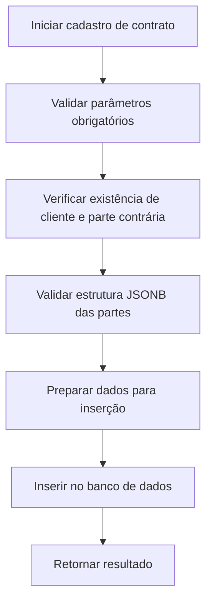
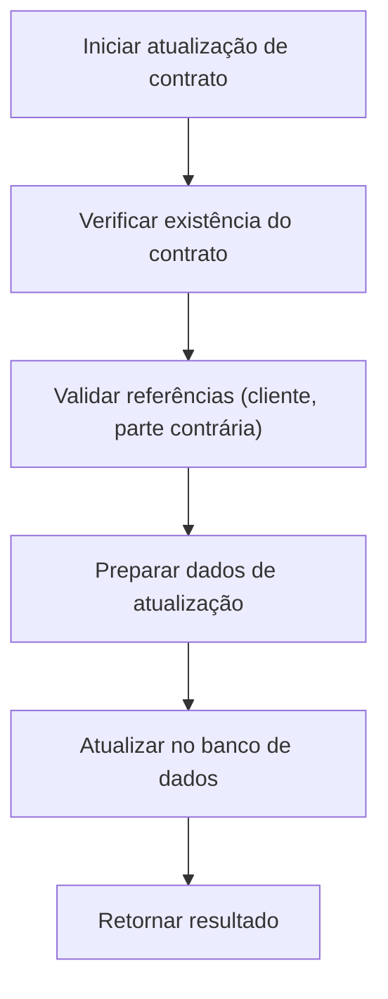
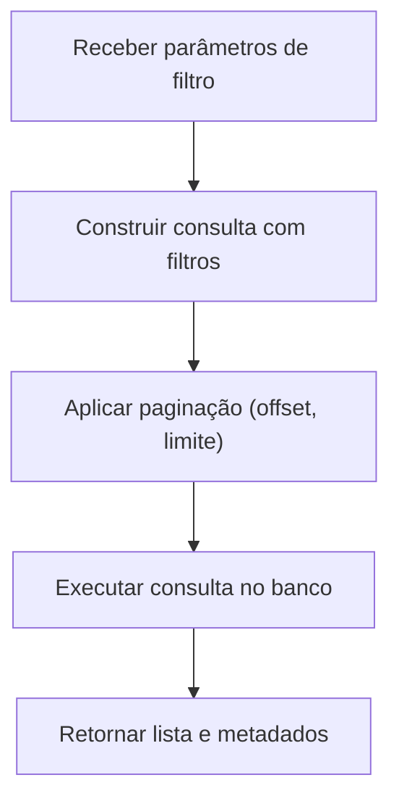
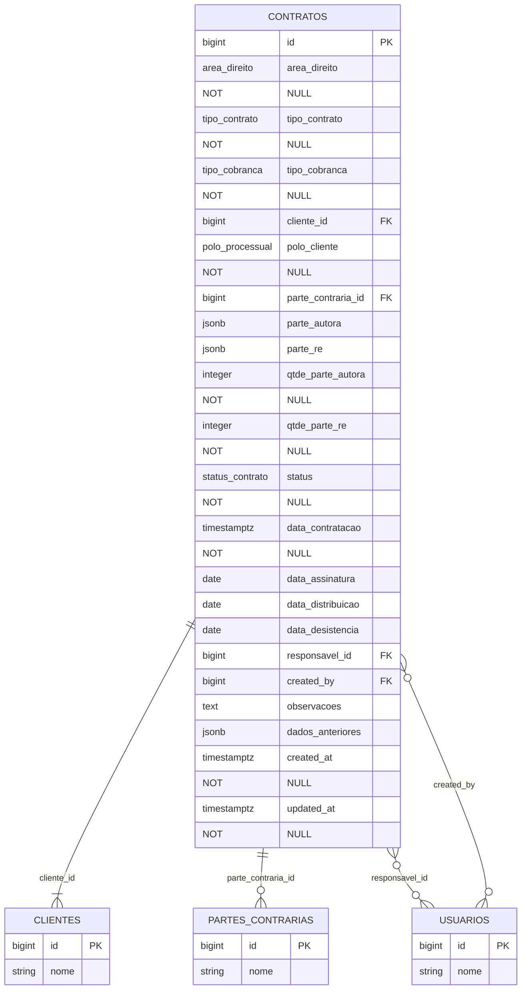

# CRUD de Contratos

<cite>
**Arquivos Referenciados neste Documento**  
- [criar-contrato.service.ts](file://backend/contratos/services/contratos/criar-contrato.service.ts)
- [atualizar-contrato.service.ts](file://backend/contratos/services/contratos/atualizar-contrato.service.ts)
- [listar-contratos.service.ts](file://backend/contratos/services/contratos/listar-contratos.service.ts)
- [buscar-contrato.service.ts](file://backend/contratos/services/contratos/buscar-contrato.service.ts)
- [contrato-persistence.service.ts](file://backend/contratos/services/persistence/contrato-persistence.service.ts)
- [11_contratos.sql](file://supabase/schemas/11_contratos.sql)
- [route.ts](file://app/api/contratos/route.ts)
- [route.ts](file://app/api/contratos/[id]/route.ts)
</cite>

## Sumário
1. [Introdução](#introdução)
2. [Estrutura de Dados da Tabela 'contratos'](#estrutura-de-dados-da-tabela-contratos)
3. [Camada de Persistência](#camada-de-persistência)
4. [Serviços de Negócio](#serviços-de-negócio)
5. [Rotas da API](#rotas-da-api)
6. [Exemplos de Requisições HTTP](#exemplos-de-requisições-http)
7. [Diagrama ER do Módulo de Contratos](#diagrama-er-do-módulo-de-contratos)
8. [Regras de Negócio e Validações](#regras-de-negócio-e-validações)
9. [Tratamento de Erros e Auditoria](#tratamento-de-erros-e-auditoria)
10. [Boas Práticas e Problemas Comuns](#boas-práticas-e-problemas-comuns)

## Introdução
O módulo de contratos implementa operações CRUD (criar, ler, atualizar, deletar) para gerenciar contratos jurídicos em um sistema de escritório de advocacia. Este documento detalha a arquitetura, implementação, validações, regras de negócio e interações com a API, com foco na segurança, integridade dos dados e usabilidade.

## Estrutura de Dados da Tabela 'contratos'

A tabela `contratos` armazena informações sobre contratos jurídicos, incluindo áreas de direito, tipos de cobrança, partes envolvidas e status. Os principais campos são:

| Campo | Tipo | Descrição |
|-------|------|-----------|
| `id` | bigint | Identificador único do contrato |
| `area_direito` | enum | Área do direito (trabalhista, civil, etc.) |
| `tipo_contrato` | enum | Tipo do contrato (ajuizamento, defesa, etc.) |
| `tipo_cobranca` | enum | Forma de cobrança (pró-exito ou pró-labore) |
| `cliente_id` | bigint | Referência ao cliente principal |
| `polo_cliente` | enum | Polo processual do cliente (autor ou ré) |
| `parte_contraria_id` | bigint | Referência à parte contrária principal |
| `parte_autora` | jsonb | Array de partes autoras (clientes ou partes contrárias) |
| `parte_re` | jsonb | Array de partes rés |
| `status` | enum | Status do contrato (em_contratacao, contratado, etc.) |
| `data_contratacao` | timestamptz | Data de início da contratação |
| `data_assinatura` | date | Data de assinatura do contrato |
| `data_distribuicao` | date | Data de distribuição do processo |
| `data_desistencia` | date | Data de desistência (se aplicável) |
| `responsavel_id` | bigint | Usuário responsável pelo contrato |
| `created_by` | bigint | Usuário que criou o registro |
| `observacoes` | text | Observações gerais |
| `dados_anteriores` | jsonb | Armazena o estado anterior do registro para auditoria |
| `created_at` | timestamptz | Timestamp de criação |
| `updated_at` | timestamptz | Timestamp de última atualização |

### Relacionamentos
- **clientes**: `cliente_id` → `clientes.id` (restrição: `on delete restrict`)
- **partes_contrarias**: `parte_contraria_id` → `partes_contrarias.id` (restrição: `on delete set null`)
- **usuarios**: `responsavel_id`, `created_by` → `usuarios.id` (restrição: `on delete set null`)

### Índices
A tabela possui índices B-Tree para campos frequentemente filtrados e índices GIN para consultas em campos JSONB (`parte_autora`, `parte_re`), garantindo desempenho em buscas complexas.

### Políticas de Segurança (RLS)
A tabela tem RLS habilitado (`enable row level security`), exigindo autenticação e autorização adequada para acesso, conforme controlado pela camada de autenticação da API.

**Fontes da seção**
- [11_contratos.sql](file://supabase/schemas/11_contratos.sql#L4-L86)

## Camada de Persistência

O serviço `contrato-persistence.service.ts` encapsula todas as operações de acesso ao banco de dados, utilizando o cliente Supabase com permissões de serviço.

### Principais Funções
- `criarContrato`: Insere um novo contrato após validações de integridade referencial.
- `atualizarContrato`: Atualiza campos específicos, mantendo o histórico em `dados_anteriores`.
- `buscarContratoPorId`: Recupera um contrato por ID.
- `listarContratos`: Retorna contratos com filtros e paginação.

### Validações e Segurança
- Verificação da existência de `cliente_id` e `parte_contraria_id`.
- Validação de estrutura JSONB para `parte_autora` e `parte_re`.
- Conversão e normalização de datas.
- Uso de `dados_anteriores` para auditoria de alterações.

### Triggers
Um trigger `update_contratos_updated_at` atualiza automaticamente o campo `updated_at` em cada modificação, garantindo rastreabilidade temporal.

**Fontes da seção**
- [contrato-persistence.service.ts](file://backend/contratos/services/persistence/contrato-persistence.service.ts#L1-L524)
- [11_contratos.sql](file://supabase/schemas/11_contratos.sql#L78-L81)

## Serviços de Negócio

Os serviços de negócio implementam a lógica de aplicação, atuando como intermediários entre a API e a camada de persistência.

### criar-contrato.service.ts
Responsável por cadastrar novos contratos. Realiza log de operações e trata erros inesperados.



**Fontes do diagrama**
- [criar-contrato.service.ts](file://backend/contratos/services/contratos/criar-contrato.service.ts#L13-L46)
- [contrato-persistence.service.ts](file://backend/contratos/services/persistence/contrato-persistence.service.ts#L197-L299)

**Fontes da seção**
- [criar-contrato.service.ts](file://backend/contratos/services/contratos/criar-contrato.service.ts#L1-L46)

### atualizar-contrato.service.ts
Gerencia atualizações parciais de contratos existentes, com tratamento de campos opcionais.



**Fontes do diagrama**
- [atualizar-contrato.service.ts](file://backend/contratos/services/contratos/atualizar-contrato.service.ts#L13-L42)
- [contrato-persistence.service.ts](file://backend/contratos/services/persistence/contrato-persistence.service.ts#L305-L436)

**Fontes da seção**
- [atualizar-contrato.service.ts](file://backend/contratos/services/contratos/atualizar-contrato.service.ts#L1-L42)

### listar-contratos.service.ts
Fornece listagem paginada com filtros avançados.



**Fontes do diagrama**
- [listar-contratos.service.ts](file://backend/contratos/services/contratos/listar-contratos.service.ts#L13-L19)
- [contrato-persistence.service.ts](file://backend/contratos/services/persistence/contrato-persistence.service.ts#L463-L522)

**Fontes da seção**
- [listar-contratos.service.ts](file://backend/contratos/services/contratos/listar-contratos.service.ts#L1-L19)

### buscar-contrato.service.ts
Recupera um contrato específico por ID.

**Fontes da seção**
- [buscar-contrato.service.ts](file://backend/contratos/services/contratos/buscar-contrato.service.ts#L1-L16)

## Rotas da API

As rotas definem a interface HTTP para operações CRUD.

### POST /contratos
Cria um novo contrato. Requer autenticação e campos obrigatórios.

**Fontes da seção**
- [route.ts](file://app/api/contratos/route.ts#L138-L187)

### GET /contratos
Lista contratos com filtros e paginação.

**Fontes da seção**
- [route.ts](file://app/api/contratos/route.ts#L102-L136)

### GET /contratos/[id]
Busca um contrato específico por ID.

**Fontes da seção**
- [route.ts](file://app/api/contratos/[id]/route.ts#L73-L105)

### PATCH /contratos/[id]
Atualiza parcialmente um contrato existente.

**Fontes da seção**
- [route.ts](file://app/api/contratos/[id]/route.ts#L107-L148)

## Exemplos de Requisições HTTP

### Criar Contrato (POST /contratos)
**Corpo da requisição:**
```json
{
  "areaDireito": "trabalhista",
  "tipoContrato": "ajuizamento",
  "tipoCobranca": "pro_exito",
  "clienteId": 123,
  "poloCliente": "autor",
  "parteContrariaId": 456,
  "parteAutora": [
    { "tipo": "cliente", "id": 123, "nome": "Empresa Cliente" }
  ],
  "status": "em_contratacao",
  "dataContratacao": "2025-01-15",
  "observacoes": "Contrato de ajuizamento trabalhista"
}
```

**Resposta esperada (201 Created):**
```json
{
  "success": true,
  "data": {
    "id": 1,
    "areaDireito": "trabalhista",
    "tipoContrato": "ajuizamento",
    "tipoCobranca": "pro_exito",
    "clienteId": 123,
    "poloCliente": "autor",
    "parteContrariaId": 456,
    "parteAutora": [
      { "tipo": "cliente", "id": 123, "nome": "Empresa Cliente" }
    ],
    "status": "em_contratacao",
    "dataContratacao": "2025-01-15T00:00:00Z",
    "createdAt": "2025-01-15T10:00:00Z",
    "updatedAt": "2025-01-15T10:00:00Z"
  }
}
```

### Atualizar Contrato (PATCH /contratos/1)
**Corpo da requisição:**
```json
{
  "status": "contratado",
  "dataAssinatura": "2025-01-20"
}
```

**Resposta esperada (200 OK):**
```json
{
  "success": true,
  "data": {
    "id": 1,
    "status": "contratado",
    "dataAssinatura": "2025-01-20",
    "updatedAt": "2025-01-20T14:00:00Z"
  }
}
```

**Fontes da seção**
- [route.ts](file://app/api/contratos/route.ts#L138-L187)
- [route.ts](file://app/api/contratos/[id]/route.ts#L107-L148)

## Diagrama ER do Módulo de Contratos



**Fontes do diagrama**
- [11_contratos.sql](file://supabase/schemas/11_contratos.sql#L4-L86)
- [09_clientes.sql](file://supabase/schemas/09_clientes.sql)
- [10_partes_contrarias.sql](file://supabase/schemas/10_partes_contrarias.sql)
- [08_usuarios.sql](file://supabase/schemas/08_usuarios.sql)

## Regras de Negócio e Validações

- **Campos obrigatórios**: `areaDireito`, `tipoContrato`, `tipoCobranca`, `clienteId`, `poloCliente`.
- **Integridade referencial**: Clientes e partes contrárias devem existir.
- **Validação JSONB**: Estrutura de `parte_autora` e `parte_re` deve ser válida.
- **Cálculo automático**: `qtdeParteAutora` e `qtdeParteRe` são calculadas com base nos arrays.
- **Datas**: Normalizadas para formato ISO (YYYY-MM-DD).

**Fontes da seção**
- [contrato-persistence.service.ts](file://backend/contratos/services/persistence/contrato-persistence.service.ts#L204-L255)

## Tratamento de Erros e Auditoria

- **Erros de validação**: Retornados com status 400.
- **Erro de autenticação**: Status 401.
- **Erro de recurso não encontrado**: Status 404.
- **Erro interno**: Status 500 com log detalhado.
- **Auditoria**: Campo `dados_anteriores` armazena o estado anterior em atualizações.

**Fontes da seção**
- [contrato-persistence.service.ts](file://backend/contratos/services/persistence/contrato-persistence.service.ts#L286-L288)
- [route.ts](file://app/api/contratos/route.ts#L128-L135)
- [11_contratos.sql](file://supabase/schemas/11_contratos.sql#L34)

## Boas Práticas e Problemas Comuns

### Problemas Comuns
- **Falhas de validação**: Campos obrigatórios ausentes.
- **Conflitos de concorrência**: Múltiplas atualizações simultâneas (mitigado por `updated_at`).
- **Referências inválidas**: IDs de cliente ou parte contrária inexistentes.

### Boas Práticas
- Utilizar `dados_anteriores` para auditoria de mudanças.
- Filtrar por índices para melhorar desempenho.
- Validar estrutura JSONB antes da persistência.
- Manter logs detalhados de operações.

**Fontes da seção**
- [contrato-persistence.service.ts](file://backend/contratos/services/persistence/contrato-persistence.service.ts)
- [11_contratos.sql](file://supabase/schemas/11_contratos.sql)