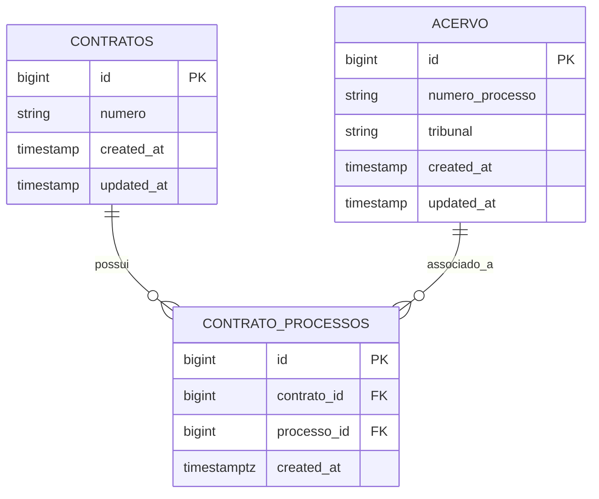
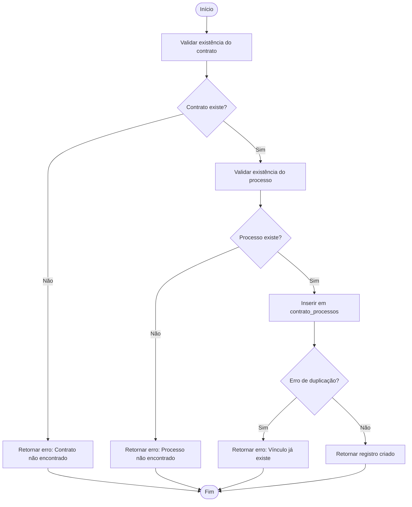
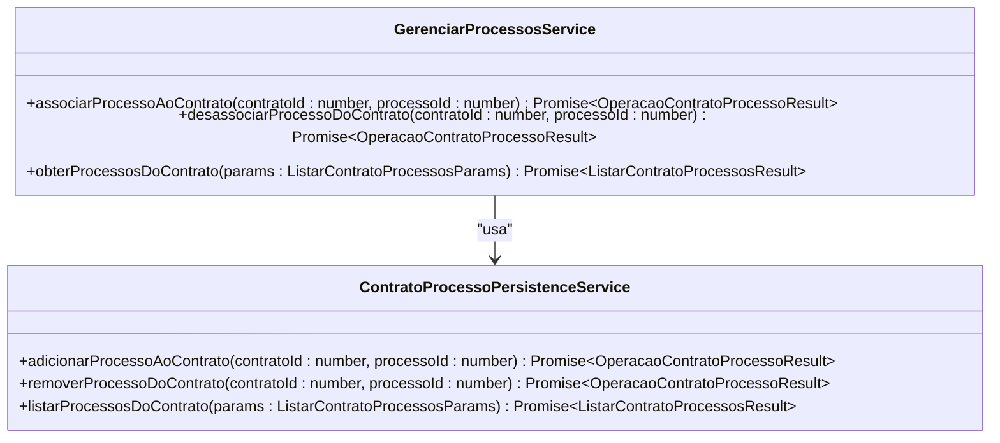
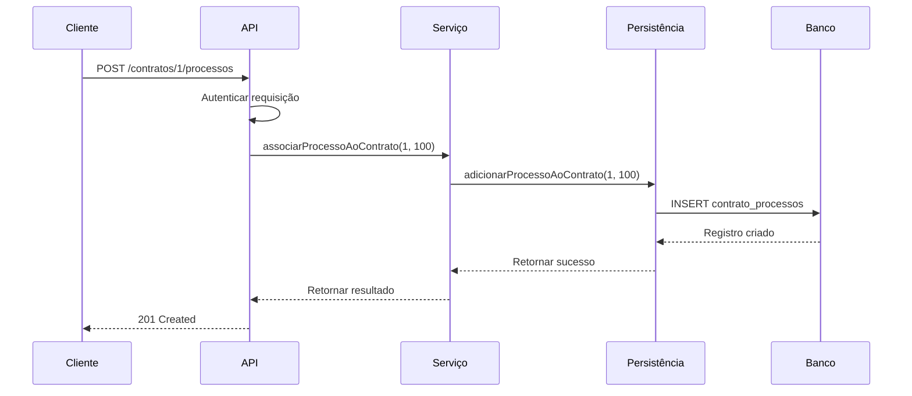

# Gerenciamento de Processos Associados

<cite>
**Arquivos Referenciados neste Documento**  
- [gerenciar-processos.service.ts](file://backend/contratos/services/contratos/gerenciar-processos.service.ts)
- [contrato-processo-persistence.service.ts](file://backend/contratos/services/persistence/contrato-processo-persistence.service.ts)
- [12_contrato_processos.sql](file://supabase/schemas/12_contrato_processos.sql)
- [route.ts](file://app/api/contratos/[id]/processos/route.ts)
- [route.ts](file://app/api/contratos/[id]/processos/[processoId]/route.ts)
</cite>

## Sumário
1. [Introdução](#introdução)
2. [Estrutura de Dados e Modelo Relacional](#estrutura-de-dados-e-modelo-relacional)
3. [Camada de Persistência](#camada-de-persistência)
4. [Serviço de Gerenciamento de Processos](#serviço-de-gerenciamento-de-processos)
5. [Rotas da API](#rotas-da-api)
6. [Casos de Uso e Exemplos](#casos-de-uso-e-exemplos)
7. [Tratamento de Erros e Auditoria](#tratamento-de-erros-e-auditoria)
8. [Considerações de Desempenho](#considerações-de-desempenho)

## Introdução

O sistema de gerenciamento de processos associados a contratos permite vincular, desvincular e listar processos jurídicos (acervo processual) a contratos específicos. Essa funcionalidade é essencial para organizar a relação entre contratos e os processos judiciais que os envolvem, facilitando o acompanhamento jurídico e a gestão documental. A implementação segue uma arquitetura clara com separação entre camadas de serviço, persistência e interface de API.

## Estrutura de Dados e Modelo Relacional

A tabela `contrato_processos` implementa um relacionamento muitos-para-muitos entre contratos e processos, permitindo que um contrato tenha múltiplos processos associados e um processo possa estar vinculado a mais de um contrato.



**Fontes do Diagrama**  
- [12_contrato_processos.sql](file://supabase/schemas/12_contrato_processos.sql#L4-L29)

**Fontes da Seção**  
- [12_contrato_processos.sql](file://supabase/schemas/12_contrato_processos.sql#L1-L29)

### Detalhes do Modelo de Dados

- **Chave Primária**: `id` (gerado automaticamente)
- **Chaves Estrangeiras**: 
  - `contrato_id` → referencia `contratos.id` com deleção em cascata
  - `processo_id` → referencia `acervo.id` com deleção em cascata
- **Restrição de Unicidade**: `(contrato_id, processo_id)` garante que não haja duplicação de vínculos
- **Índices**: 
  - `idx_contrato_processos_contrato_id` para consultas por contrato
  - `idx_contrato_processos_processo_id` para consultas por processo
  - `idx_contrato_processos_contrato_processo` para consultas combinadas

## Camada de Persistência

O serviço `contrato-processo-persistence.service.ts` encapsula todas as operações de acesso ao banco de dados, garantindo integridade referencial e tratamento adequado de erros.

### Operações Implementadas

#### Adicionar Processo ao Contrato
- Valida a existência do contrato e do processo
- Insere o relacionamento na tabela `contrato_processos`
- Trata erro de duplicação (código `23505`) com mensagem específica
- Retorna o registro criado ou erro detalhado

#### Remover Processo do Contrato
- Remove o relacionamento com base em `contrato_id` e `processo_id`
- Retorna erro se a associação não for encontrada
- Suporta deleção em cascata via restrição de banco de dados

#### Listar Processos do Contrato
- Paginação com parâmetros opcionais (`pagina`, `limite`)
- Ordenação por data de criação (mais recentes primeiro)
- Contagem exata de registros para cálculo de páginas totais



**Fontes do Diagrama**  
- [contrato-processo-persistence.service.ts](file://backend/contratos/services/persistence/contrato-processo-persistence.service.ts#L60-L116)

**Fontes da Seção**  
- [contrato-processo-persistence.service.ts](file://backend/contratos/services/persistence/contrato-processo-persistence.service.ts#L1-L193)

## Serviço de Gerenciamento de Processos

O serviço `gerenciar-processos.service.ts` atua como camada intermediária entre a API e a persistência, exportando funções assíncronas para as operações principais.

### Funções Disponíveis

- `associarProcessoAoContrato(contratoId, processoId)`: Adiciona um processo ao contrato
- `desassociarProcessoDoContrato(contratoId, processoId)`: Remove um processo do contrato
- `obterProcessosDoContrato(params)`: Lista processos com paginação

O serviço importa diretamente as funções da camada de persistência, mantendo uma abstração clara e facilitando testes e manutenção.



**Fontes do Diagrama**  
- [gerenciar-processos.service.ts](file://backend/contratos/services/contratos/gerenciar-processos.service.ts#L1-L41)
- [contrato-processo-persistence.service.ts](file://backend/contratos/services/persistence/contrato-processo-persistence.service.ts#L1-L193)

**Fontes da Seção**  
- [gerenciar-processos.service.ts](file://backend/contratos/services/contratos/gerenciar-processos.service.ts#L1-L41)

## Rotas da API

As rotas da API seguem o padrão RESTful e estão localizadas em `app/api/contratos/[id]/processos`.

### Rota GET: Listar Processos

- **Endpoint**: `GET /api/contratos/[id]/processos`
- **Parâmetros de Query**:
  - `pagina` (opcional, padrão: 1)
  - `limite` (opcional, padrão: 50)
- **Resposta de Sucesso**: `200 OK` com lista paginada
- **Autenticação**: Requer token válido (bearer, session ou API key)

### Rota POST: Associar Processo

- **Endpoint**: `POST /api/contratos/[id]/processos`
- **Corpo da Requisição**:
  ```json
  { "processoId": 123 }
  ```
- **Resposta de Sucesso**: `201 Created` com detalhes do vínculo criado
- **Erros Comuns**: 
  - `400 Bad Request` para IDs inválidos
  - `400` se o processo já estiver vinculado

### Rota DELETE: Desassociar Processo

- **Endpoint**: `DELETE /api/contratos/[id]/processos/[processoId]`
- **Resposta de Sucesso**: `200 OK` com detalhes do vínculo removido
- **Erros Comuns**: 
  - `404 Not Found` se o vínculo não existir
  - `400 Bad Request` para IDs inválidos



**Fontes do Diagrama**  
- [route.ts](file://app/api/contratos/[id]/processos/route.ts#L84-L168)
- [route.ts](file://app/api/contratos/[id]/processos/[processoId]/route.ts#L43-L84)

**Fontes da Seção**  
- [route.ts](file://app/api/contratos/[id]/processos/route.ts#L1-L168)
- [route.ts](file://app/api/contratos/[id]/processos/[processoId]/route.ts#L1-L84)

## Casos de Uso e Exemplos

### Vinculação de Múltiplos Processos

Um contrato pode ter vários processos associados. Para adicionar múltiplos processos:

```http
POST /api/contratos/1/processos
Content-Type: application/json

{ "processoId": 101 }
```

Repetir para cada processo desejado. O sistema garante que não ocorra duplicação.

### Tentativa de Duplicação

Se um processo já estiver vinculado, o sistema retorna:

```json
{
  "error": "Este processo já está associado ao contrato"
}
```

Com status `400 Bad Request`, prevenindo dados duplicados.

### Listagem com Paginação

```http
GET /api/contratos/1/processos?pagina=2&limite=10
```

Retorna a segunda página com 10 registros por página, ordenados por data de criação decrescente.

## Tratamento de Erros e Auditoria

O sistema implementa tratamento robusto de erros com mensagens específicas para cada cenário:

- **Contrato não encontrado**: Validação explícita antes da operação
- **Processo não encontrado**: Verificação na tabela `acervo`
- **Vínculo duplicado**: Tratamento especial do erro `23505` do PostgreSQL
- **Erro inesperado**: Captura de exceções com log detalhado

Embora não implementado diretamente nesta funcionalidade, o uso de triggers de auditoria (como `create_triggers_log_atribuicao.sql`) permite rastrear todas as alterações na tabela `contrato_processos` para fins de compliance.

**Fontes da Seção**  
- [contrato-processo-persistence.service.ts](file://backend/contratos/services/persistence/contrato-processo-persistence.service.ts#L67-L116)
- [route.ts](file://app/api/contratos/[id]/processos/route.ts#L147-L151)

## Considerações de Desempenho

Os índices criados na tabela `contrato_processos` garantem consultas eficientes:

- `idx_contrato_processos_contrato_id`: Otimiza listagens por contrato
- `idx_contrato_processos_processo_id`: Suporta consultas reversas
- `idx_contrato_processos_contrato_processo`: Melhora desempenho de exclusão e verificação de unicidade

A paginação com `LIMIT` e `OFFSET` evita sobrecarga em listagens extensas, enquanto a contagem exata (`count: 'exact'`) permite navegação precisa entre páginas.

**Fontes da Seção**  
- [12_contrato_processos.sql](file://supabase/schemas/12_contrato_processos.sql#L22-L24)
- [contrato-processo-persistence.service.ts](file://backend/contratos/services/persistence/contrato-processo-persistence.service.ts#L169-L174)