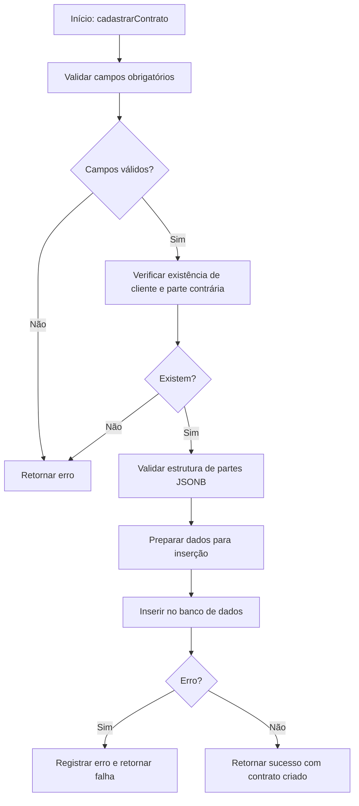
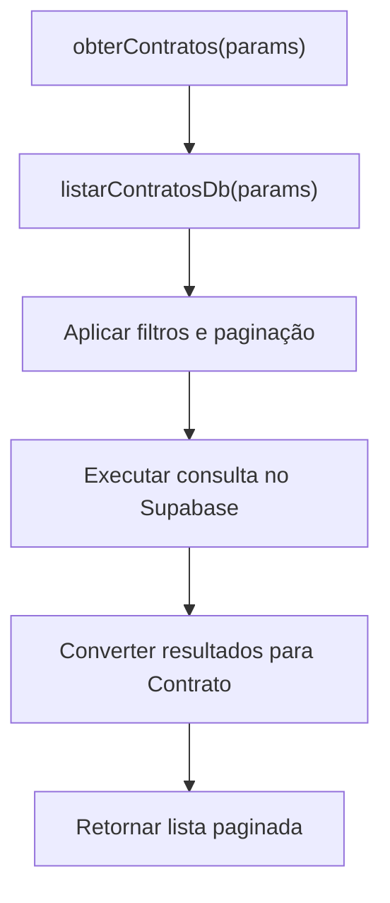
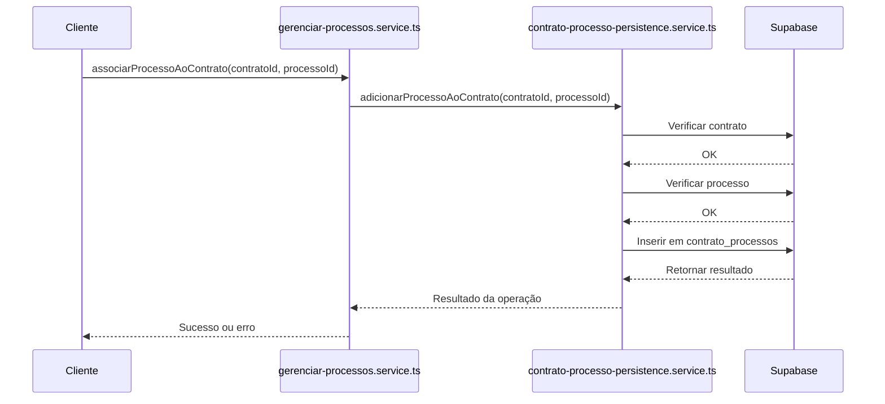

# Gestão de Contratos

<cite>
**Arquivos Referenciados neste Documento**  
- [criar-contrato.service.ts](file://backend/contratos/services/contratos/criar-contrato.service.ts)
- [listar-contratos.service.ts](file://backend/contratos/services/contratos/listar-contratos.service.ts)
- [gerenciar-processos.service.ts](file://backend/contratos/services/contratos/gerenciar-processos.service.ts)
- [contrato-persistence.service.ts](file://backend/contratos/services/persistence/contrato-persistence.service.ts)
- [contrato-processo-persistence.service.ts](file://backend/contratos/services/persistence/contrato-processo-persistence.service.ts)
- [11_contratos.sql](file://supabase/schemas/11_contratos.sql)
- [12_contrato_processos.sql](file://supabase/schemas/12_contrato_processos.sql)
- [route.ts](file://app/api/contratos/route.ts)
- [route.ts](file://app/api/contratos/[id]/route.ts)
- [route.ts](file://app/api/contratos/[id]/processos/route.ts)
- [route.ts](file://app/api/contratos/[id]/processos/[processoId]/route.ts)
</cite>

## Sumário
1. [Introdução](#introdução)
2. [Domínio de Contratos e Relação com Processos Jurídicos](#domínio-de-contratos-e-relação-com-processos-jurídicos)
3. [Operações CRUD nos Serviços](#operações-crud-nos-serviços)
4. [Gerenciamento de Processos Associados a Contratos](#gerenciamento-de-processos-associados-a-contratos)
5. [Camada de Persistência e Integração com Supabase](#camada-de-persistência-e-integração-com-supabase)
6. [Modelo de Dados e Relacionamentos](#modelo-de-dados-e-relacionamentos)
7. [Exemplos de Requisições HTTP](#exemplos-de-requisições-http)
8. [Casos de Uso Comuns](#casos-de-uso-comuns)
9. [Problemas Frequentes e Validações](#problemas-frequentes-e-validações)

## Introdução
Este documento detalha o módulo de Gestão de Contratos do sistema jurídico, abrangendo desde o domínio de contratos até a implementação técnica dos serviços, rotas API, persistência de dados e relacionamentos com processos jurídicos. O foco está na integridade dos dados, validações, estrutura de tabelas e fluxos de operações comuns no contexto de um escritório de advocacia.

## Domínio de Contratos e Relação com Processos Jurídicos
O domínio de contratos engloba acordos jurídicos firmados entre o escritório e seus clientes, podendo estar ligados a processos judiciais ou extrajudiciais. Cada contrato possui um escopo definido por área do direito (trabalhista, civil, etc.), tipo de contrato (ajuizamento, defesa, consultoria, etc.) e tipo de cobrança (pró-exito ou pró-labore). 

Contratos podem estar associados a múltiplos processos jurídicos, armazenados na tabela `acervo`, permitindo rastrear todas as ações judiciais vinculadas a um determinado contrato. Essa relação é gerida pela tabela de junção `contrato_processos`, que estabelece um relacionamento muitos-para-muitos entre contratos e processos.

**Seção fontes**
- [11_contratos.sql](file://supabase/schemas/11_contratos.sql#L1-L86)
- [12_contrato_processos.sql](file://supabase/schemas/12_contrato_processos.sql#L1-L29)

## Operações CRUD nos Serviços
As operações CRUD (criar, ler, atualizar, deletar) são implementadas nos serviços da camada de negócios, localizados em `backend/contratos/services/contratos/`.

### Criação de Contrato
O serviço `criar-contrato.service.ts` implementa a função `cadastrarContrato`, que valida os dados de entrada e chama a camada de persistência para inserir um novo registro na tabela `contratos`. A função realiza validações essenciais como presença de área do direito, tipo de contrato, cliente e polo processual.



**Fontes do diagrama**
- [criar-contrato.service.ts](file://backend/contratos/services/contratos/criar-contrato.service.ts#L13-L46)
- [contrato-persistence.service.ts](file://backend/contratos/services/persistence/contrato-persistence.service.ts#L197-L299)

**Seção fontes**
- [criar-contrato.service.ts](file://backend/contratos/services/contratos/criar-contrato.service.ts#L1-L46)

### Listagem de Contratos
O serviço `listar-contratos.service.ts` fornece a função `obterContratos`, que permite listar contratos com filtros (por área do direito, status, cliente, etc.) e paginação. Os parâmetros são repassados diretamente à camada de persistência.



**Fontes do diagrama**
- [listar-contratos.service.ts](file://backend/contratos/services/contratos/listar-contratos.service.ts#L13-L19)
- [contrato-persistence.service.ts](file://backend/contratos/services/persistence/contrato-persistence.service.ts#L463-L524)

**Seção fontes**
- [listar-contratos.service.ts](file://backend/contratos/services/contratos/listar-contratos.service.ts#L1-L19)

## Gerenciamento de Processos Associados a Contratos
O serviço `gerenciar-processos.service.ts` permite adicionar, remover e consultar processos jurídicos associados a um contrato. Essas operações são essenciais para vincular ações judiciais aos contratos que as originaram.

### Funções Disponíveis
- `associarProcessoAoContrato`: Adiciona um processo a um contrato, verificando a existência de ambos.
- `desassociarProcessoDoContrato`: Remove a associação entre um processo e um contrato.
- `obterProcessosDoContrato`: Lista todos os processos associados a um contrato com paginação.



**Fontes do diagrama**
- [gerenciar-processos.service.ts](file://backend/contratos/services/contratos/gerenciar-processos.service.ts#L15-L41)
- [contrato-processo-persistence.service.ts](file://backend/contratos/services/persistence/contrato-processo-persistence.service.ts#L60-L117)

**Seção fontes**
- [gerenciar-processos.service.ts](file://backend/contratos/services/contratos/gerenciar-processos.service.ts#L1-L41)

## Camada de Persistência e Integração com Supabase
A camada de persistência, localizada em `backend/contratos/services/persistence/`, contém as operações diretas com o banco de dados via Supabase. Utiliza o cliente de serviço para realizar operações autenticadas.

### contrato-persistence.service.ts
Este arquivo implementa todas as operações CRUD na tabela `contratos`, incluindo:
- `criarContrato`: Insere um novo contrato com validações.
- `atualizarContrato`: Atualiza campos específicos com verificação de existência.
- `buscarContratoPorId`: Recupera um contrato por ID.
- `listarContratos`: Consulta com filtros e paginação.

Utiliza funções auxiliares como `validarPartes` para garantir a integridade dos dados JSONB e `parseDate` para normalizar datas.

### contrato-processo-persistence.service.ts
Gerencia a tabela `contrato_processos`, garantindo que:
- Apenas contratos e processos existentes possam ser vinculados.
- Não haja duplicação de associações (chave única).
- As operações respeitem as restrições de integridade referencial (onDelete: cascade).

**Seção fontes**
- [contrato-persistence.service.ts](file://backend/contratos/services/persistence/contrato-persistence.service.ts#L1-L524)
- [contrato-processo-persistence.service.ts](file://backend/contratos/services/persistence/contrato-processo-persistence.service.ts#L1-L193)

## Modelo de Dados e Relacionamentos
O modelo de dados é composto por duas tabelas principais: `contratos` e `contrato_processos`.

### Diagrama de Entidade-Relacionamento
```mermaid
erDiagram
CONTRATOS {
bigint id PK
area_direito area_direito NN
tipo_contrato tipo_contrato NN
tipo_cobranca tipo_cobranca NN
bigint cliente_id FK NN
polo_processual polo_cliente NN
bigint parte_contraria_id FK
jsonb parte_autora
jsonb parte_re
integer qtde_parte_autora NN
integer qtde_parte_re NN
status_contrato status NN
timestamptz data_contratacao NN
date data_assinatura
date data_distribuicao
date data_desistencia
bigint responsavel_id FK
bigint created_by FK
text observacoes
jsonb dados_anteriores
timestamptz created_at NN
timestamptz updated_at NN
}
CONTRATO_PROCESSOS {
bigint id PK
bigint contrato_id FK NN
bigint processo_id FK NN
timestamptz created_at NN
}
ACERVO {
bigint id PK
text numero_processo NN
text orgao_julgador NN
text status_processo NN
}
USUARIOS {
bigint id PK
text nome NN
text email NN
}
CLIENTES {
bigint id PK
text nome NN
text cpf_cnpj NN
}
PARTES_CONTRARIAS {
bigint id PK
text nome NN
text cpf_cnpj NN
}
CONTRATOS ||--o{ CONTRATO_PROCESSOS : "possui"
CONTRATO_PROCESSOS }o--|| ACERVO : "vinculado a"
CONTRATOS }o--|| CLIENTES : "cliente"
CONTRATOS }o--|| PARTES_CONTRARIAS : "parte contrária"
CONTRATOS }o--|| USUARIOS : "responsável"
CONTRATOS }o--|| USUARIOS : "criado por"
```

**Fontes do diagrama**
- [11_contratos.sql](file://supabase/schemas/11_contratos.sql#L4-L86)
- [12_contrato_processos.sql](file://supabase/schemas/12_contrato_processos.sql#L4-L29)

**Seção fontes**
- [11_contratos.sql](file://supabase/schemas/11_contratos.sql#L1-L86)
- [12_contrato_processos.sql](file://supabase/schemas/12_contrato_processos.sql#L1-L29)

## Exemplos de Requisições HTTP
As rotas API estão localizadas em `app/api/contratos/` e utilizam o Next.js App Router.

### Criar um Novo Contrato
**POST** `/api/contratos`
```json
{
  "areaDireito": "trabalhista",
  "tipoContrato": "ajuizamento",
  "tipoCobranca": "pro_exito",
  "clienteId": 123,
  "poloCliente": "autor",
  "parteContrariaId": 456,
  "parteAutora": [
    { "tipo": "cliente", "id": 123, "nome": "Empresa Cliente Ltda" }
  ],
  "observacoes": "Contrato para ação trabalhista comum"
}
```

### Listar Contratos com Filtro
**GET** `/api/contratos?areaDireito=trabalhista&status=contratado&pagina=1&limite=10`

### Associar um Processo a um Contrato
**POST** `/api/contratos/1/processos/789`
- Associa o processo com ID 789 ao contrato com ID 1.

### Listar Processos de um Contrato
**GET** `/api/contratos/1/processos?pagina=1&limite=5`

**Seção fontes**
- [route.ts](file://app/api/contratos/route.ts)
- [route.ts](file://app/api/contratos/[id]/route.ts)
- [route.ts](file://app/api/contratos/[id]/processos/route.ts)
- [route.ts](file://app/api/contratos/[id]/processos/[processoId]/route.ts)

## Casos de Uso Comuns
### Criação de um Novo Contrato com Processos Associados
1. **Criar o contrato**: Enviar dados básicos via POST `/api/contratos`.
2. **Obter ID do contrato**: Usar o ID retornado na resposta.
3. **Associar processos**: Para cada processo, enviar POST para `/api/contratos/{id}/processos/{processoId}`.
4. **Verificar associações**: Listar processos com GET `/api/contratos/{id}/processos`.

Esse fluxo garante que o contrato seja criado antes de vincular processos, respeitando a integridade referencial.

## Problemas Frequentes e Validações
### Validações Implementadas
- **Campos obrigatórios**: Área do direito, tipo de contrato, cliente e polo são obrigatórios.
- **Existência de entidades**: Cliente, parte contrária e processo devem existir no sistema.
- **Formato JSONB**: Partes autoras e rés são validadas quanto ao formato e conteúdo.
- **Datas**: Normalizadas para formato ISO (YYYY-MM-DD).
- **Associações duplicadas**: Impedidas pela chave única na tabela `contrato_processos`.

### Erros Comuns
- `Cliente não encontrado`: ID de cliente inválido ou inexistente.
- `Parte contrária não encontrada`: ID de parte contrária inválido.
- `Este processo já está associado ao contrato`: Tentativa de duplicar associação.
- `Erro ao criar contrato`: Problema no banco de dados ou violação de restrição.

As mensagens de erro são detalhadas para facilitar a depuração e correção pelos usuários.

**Seção fontes**
- [contrato-persistence.service.ts](file://backend/contratos/services/persistence/contrato-persistence.service.ts#L204-L233)
- [contrato-processo-persistence.service.ts](file://backend/contratos/services/persistence/contrato-processo-persistence.service.ts#L67-L102)