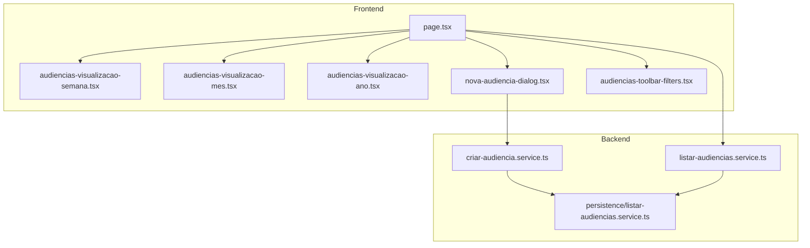
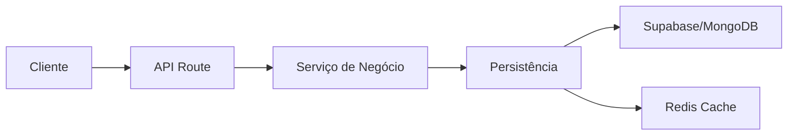
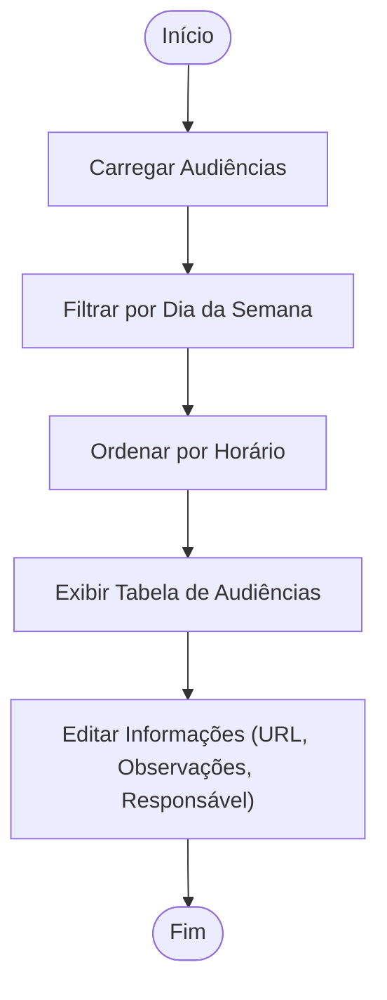
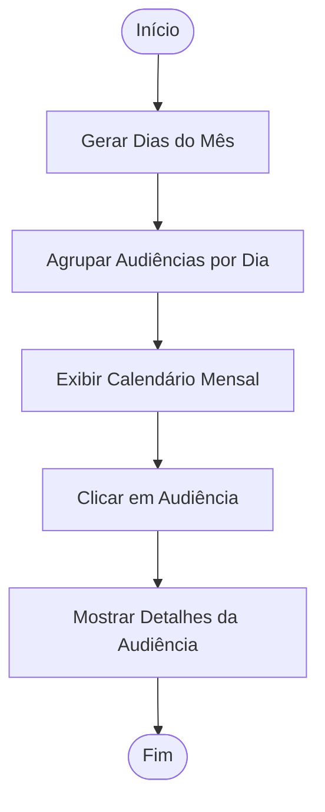
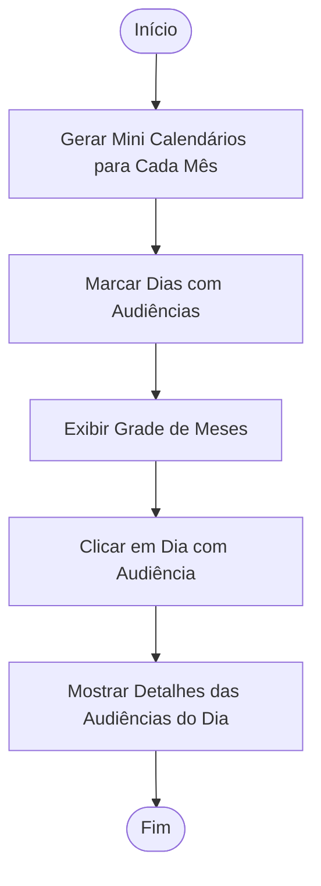
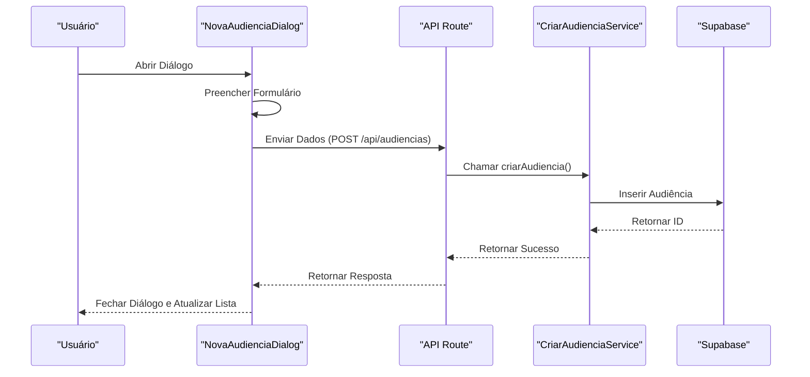
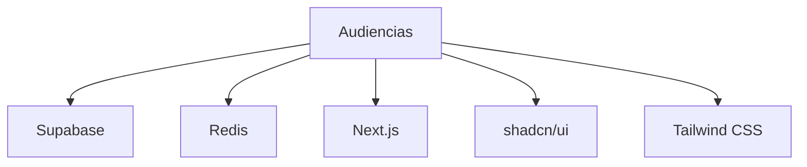

# Manual Audiências System

<cite>
**Arquivos Referenciados neste Documento**   
- [page.tsx](file://app/(dashboard)/audiencias/page.tsx)
- [criar-audiencia.service.ts](file://backend/audiencias/services/criar-audiencia.service.ts)
- [listar-audiencias.service.ts](file://backend/audiencias/services/listar-audiencias.service.ts)
- [persistence/listar-audiencias.service.ts](file://backend/audiencias/services/persistence/listar-audiencias.service.ts)
- [audiencias-visualizacao-semana.tsx](file://app/(dashboard)/audiencias/components/audiencias-visualizacao-semana.tsx)
- [audiencias-visualizacao-mes.tsx](file://app/(dashboard)/audiencias/components/audiencias-visualizacao-mes.tsx)
- [audiencias-visualizacao-ano.tsx](file://app/(dashboard)/audiencias/components/audiencias-visualizacao-ano.tsx)
- [nova-audiencia-dialog.tsx](file://app/(dashboard)/audiencias/components/nova-audiencia-dialog.tsx)
- [audiencias-toolbar-filters.tsx](file://app/(dashboard)/audiencias/components/audiencias-toolbar-filters.tsx)
- [spec.md](file://openspec/changes/archive/2025-11-18-enhance-audiencias-views/specs/audiencias/spec.md)
</cite>

## Sumário
1. [Introdução](#introdução)
2. [Estrutura do Projeto](#estrutura-do-projeto)
3. [Componentes Principais](#componentes-principais)
4. [Visão Geral da Arquitetura](#visão-geral-da-arquitetura)
5. [Análise Detalhada dos Componentes](#análise-detalhada-dos-componentes)
6. [Análise de Dependências](#análise-de-dependências)
7. [Considerações de Desempenho](#considerações-de-desempenho)
8. [Guia de Solução de Problemas](#guia-de-solução-de-problemas)
9. [Conclusão](#conclusão)

## Introdução
O sistema Manual Audiências System é uma funcionalidade integrada ao Sinesys, uma plataforma jurídica completa para escritórios de advocacia. Este módulo permite o gerenciamento manual de audiências judiciais, oferecendo múltiplas visualizações (tabela, semana, mês e ano), filtros avançados e integração com o sistema de cache Redis para otimização de desempenho. O sistema foi projetado para facilitar o acompanhamento de audiências, atribuição de responsáveis e gestão de informações processuais.

## Estrutura do Projeto
O módulo de audiências está organizado em uma estrutura modular e bem definida dentro do diretório `app/(dashboard)/audiencias`. A arquitetura segue o padrão do Next.js App Router, com componentes reutilizáveis e separação clara de responsabilidades entre camadas de apresentação, lógica de negócio e persistência.

**Fontes do Diagrama**
- [page.tsx](file://app/(dashboard)/audiencias/page.tsx)
- [criar-audiencia.service.ts](file://backend/audiencias/services/criar-audiencia.service.ts)
- [listar-audiencias.service.ts](file://backend/audiencias/services/listar-audiencias.service.ts)
- [persistence/listar-audiencias.service.ts](file://backend/audiencias/services/persistence/listar-audiencias.service.ts)

**Fontes da Seção**
- [page.tsx](file://app/(dashboard)/audiencias/page.tsx)

## Componentes Principais
Os componentes principais do sistema de audiências incluem a página principal, os componentes de visualização por semana, mês e ano, o diálogo para criação de novas audiências e os filtros da barra de ferramentas. Cada componente é projetado para ser reutilizável e altamente funcional, permitindo uma experiência de usuário fluida e eficiente.

**Fontes da Seção**
- [page.tsx](file://app/(dashboard)/audiencias/page.tsx)
- [audiencias-visualizacao-semana.tsx](file://app/(dashboard)/audiencias/components/audiencias-visualizacao-semana.tsx)
- [audiencias-visualizacao-mes.tsx](file://app/(dashboard)/audiencias/components/audiencias-visualizacao-mes.tsx)
- [audiencias-visualizacao-ano.tsx](file://app/(dashboard)/audiencias/components/audiencias-visualizacao-ano.tsx)
- [nova-audiencia-dialog.tsx](file://app/(dashboard)/audiencias/components/nova-audiencia-dialog.tsx)
- [audiencias-toolbar-filters.tsx](file://app/(dashboard)/audiencias/components/audiencias-toolbar-filters.tsx)

## Visão Geral da Arquitetura
A arquitetura do sistema de audiências segue um padrão de camadas bem definido, com separação clara entre a camada de apresentação, a camada de serviço e a camada de persistência. A camada de apresentação é responsável pela interface do usuário, a camada de serviço pela lógica de negócio e a camada de persistência pelo acesso ao banco de dados.

**Fontes do Diagrama**
- [page.tsx](file://app/(dashboard)/audiencias/page.tsx)
- [criar-audiencia.service.ts](file://backend/audiencias/services/criar-audiencia.service.ts)
- [listar-audiencias.service.ts](file://backend/audiencias/services/listar-audiencias.service.ts)
- [persistence/listar-audiencias.service.ts](file://backend/audiencias/services/persistence/listar-audiencias.service.ts)

## Análise Detalhada dos Componentes

### Análise do Componente de Visualização por Semana
O componente `AudienciasVisualizacaoSemana` permite ao usuário visualizar as audiências agendadas em uma grade semanal, com abas para cada dia da semana. Ele utiliza o componente `DataTable` para exibir as audiências de forma organizada e permite a edição de informações como URL da audiência virtual, observações e responsável.

**Fontes do Diagrama**
- [audiencias-visualizacao-semana.tsx](file://app/(dashboard)/audiencias/components/audiencias-visualizacao-semana.tsx)

**Fontes da Seção**
- [audiencias-visualizacao-semana.tsx](file://app/(dashboard)/audiencias/components/audiencias-visualizacao-semana.tsx)

### Análise do Componente de Visualização por Mês
O componente `AudienciasVisualizacaoMes` exibe as audiências em um calendário mensal, com cada dia mostrando as audiências agendadas. Ele permite ao usuário clicar em uma audiência específica para ver mais detalhes ou clicar em "mais" para ver todas as audiências do dia.

**Fontes do Diagrama**
- [audiencias-visualizacao-mes.tsx](file://app/(dashboard)/audiencias/components/audiencias-visualizacao-mes.tsx)

**Fontes da Seção**
- [audiencias-visualizacao-mes.tsx](file://app/(dashboard)/audiencias/components/audiencias-visualizacao-mes.tsx)

### Análise do Componente de Visualização por Ano
O componente `AudienciasVisualizacaoAno` exibe uma grade com 12 mini calendários, um para cada mês do ano. Ele permite ao usuário visualizar rapidamente os dias com audiências agendadas e clicar em um dia para ver mais detalhes.

**Fontes do Diagrama**
- [audiencias-visualizacao-ano.tsx](file://app/(dashboard)/audiencias/components/audiencias-visualizacao-ano.tsx)

**Fontes da Seção**
- [audiencias-visualizacao-ano.tsx](file://app/(dashboard)/audiencias/components/audiencias-visualizacao-ano.tsx)

### Análise do Diálogo de Nova Audiência
O componente `NovaAudienciaDialog` permite ao usuário criar uma nova audiência manualmente. Ele inclui campos para TRT, grau, processo, data e hora de início e fim, tipo de audiência, sala, URL virtual, endereço presencial, responsável e observações.

**Fontes do Diagrama**
- [nova-audiencia-dialog.tsx](file://app/(dashboard)/audiencias/components/nova-audiencia-dialog.tsx)
- [criar-audiencia.service.ts](file://backend/audiencias/services/criar-audiencia.service.ts)

**Fontes da Seção**
- [nova-audiencia-dialog.tsx](file://app/(dashboard)/audiencias/components/nova-audiencia-dialog.tsx)
- [criar-audiencia.service.ts](file://backend/audiencias/services/criar-audiencia.service.ts)

## Análise de Dependências
O sistema de audiências depende de vários serviços e componentes externos, incluindo o Supabase para persistência de dados, o Redis para cache, e o Next.js para a camada de apresentação. As dependências são gerenciadas de forma modular, permitindo fácil manutenção e escalabilidade.

**Fontes do Diagrama**
- [page.tsx](file://app/(dashboard)/audiencias/page.tsx)
- [criar-audiencia.service.ts](file://backend/audiencias/services/criar-audiencia.service.ts)
- [listar-audiencias.service.ts](file://backend/audiencias/services/listar-audiencias.service.ts)

**Fontes da Seção**
- [page.tsx](file://app/(dashboard)/audiencias/page.tsx)
- [criar-audiencia.service.ts](file://backend/audiencias/services/criar-audiencia.service.ts)
- [listar-audiencias.service.ts](file://backend/audiencias/services/listar-audiencias.service.ts)

## Considerações de Desempenho
O sistema utiliza o Redis como cache distribuído para otimizar consultas ao banco de dados e reduzir latência. O padrão de cache utilizado é o Cache-Aside (Lazy Loading), onde os dados são buscados primeiro no cache e, em caso de miss, consultados no banco e armazenados no cache para requisições futuras.

**Fontes da Seção**
- [persistence/listar-audiencias.service.ts](file://backend/audiencias/services/persistence/listar-audiencias.service.ts)

## Guia de Solução de Problemas
Problemas comuns no sistema de audiências incluem falhas na criação de audiências, erros de cache e problemas de exibição. Para resolver esses problemas, verifique as configurações do Redis, as credenciais do Supabase e a integridade dos dados no banco de dados.

**Fontes da Seção**
- [criar-audiencia.service.ts](file://backend/audiencias/services/criar-audiencia.service.ts)
- [persistence/listar-audiencias.service.ts](file://backend/audiencias/services/persistence/listar-audiencias.service.ts)

## Conclusão
O Manual Audiências System é uma funcionalidade robusta e bem projetada que permite o gerenciamento eficiente de audiências judiciais. Com múltiplas visualizações, filtros avançados e integração com cache, o sistema oferece uma experiência de usuário fluida e eficiente para escritórios de advocacia.