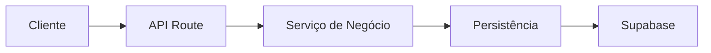
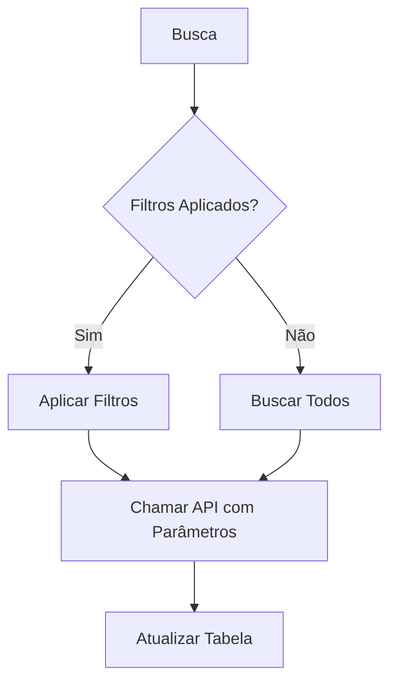
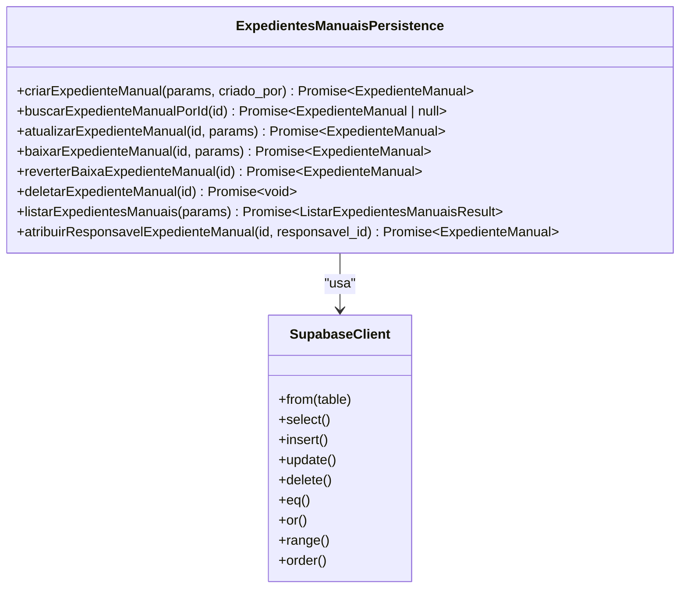
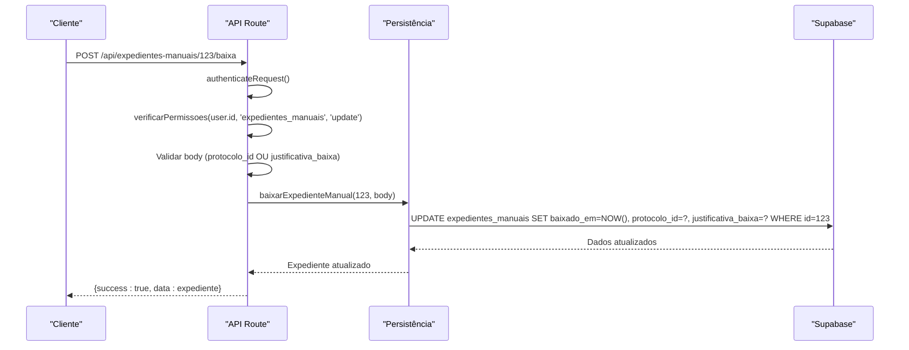
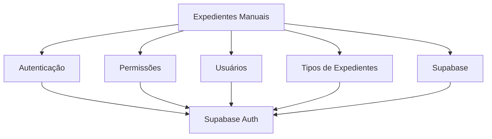

# Manual Expedientes System

<cite>
**Arquivos Referenciados neste Documento**   
- [expedientes-manuais-persistence.service.ts](file://backend/expedientes/services/persistence/expedientes-manuais-persistence.service.ts)
- [route.ts](file://app/api/expedientes-manuais/route.ts)
- [\[id\]/route.ts](file://app/api/expedientes-manuais/[id]/route.ts)
- [\[id\]/baixa/route.ts](file://app/api/expedientes-manuais/[id]/baixa/route.ts)
- [page.tsx](file://app/(dashboard)/expedientes/page.tsx)
- [expedientes-toolbar-filters.tsx](file://app/(dashboard)/expedientes/components/expedientes-toolbar-filters.tsx)
</cite>

## Sumário
1. [Introdução](#introdução)
2. [Estrutura do Projeto](#estrutura-do-projeto)
3. [Componentes Principais](#componentes-principais)
4. [Visão Geral da Arquitetura](#visão-geral-da-arquitetura)
5. [Análise Detalhada dos Componentes](#análise-detalhada-dos-componentes)
6. [Análise de Dependências](#análise-de-dependências)
7. [Considerações de Desempenho](#considerações-de-desempenho)
8. [Guia de Solução de Problemas](#guia-de-solução-de-problemas)
9. [Conclusão](#conclusão)

## Introdução
O sistema Manual Expedientes System é uma funcionalidade integrada ao Sinesys, uma plataforma de gestão jurídica desenvolvida para escritórios de advocacia. Este módulo permite a criação, gerenciamento e acompanhamento de expedientes manuais, que são tarefas ou obrigações não capturadas automaticamente do sistema PJE/TRT. O sistema oferece uma interface completa para listar, filtrar, atualizar e concluir expedientes, com suporte a atribuição de responsáveis, tipos de expedientes e controle de prazos.

## Estrutura do Projeto
A funcionalidade de expedientes manuais está organizada em duas camadas principais: frontend e backend. No frontend, localizado em `app/(dashboard)/expedientes/`, estão os componentes visuais e a página principal. No backend, em `backend/expedientes/services/persistence/`, estão os serviços de persistência que interagem diretamente com o banco de dados. A comunicação entre frontend e backend é feita através de APIs REST definidas em `app/api/expedientes-manuais/`.

```mermaid
graph TB
subgraph "Frontend"
A[page.tsx]
B[components/expedientes-toolbar-filters.tsx]
C[components/expedientes-visualizacao-*.tsx]
D[components/novo-expediente-dialog.tsx]
end
subgraph "API"
E[route.ts]
F[[id]/route.ts]
G[[id]/baixa/route.ts]
end
subgraph "Backend"
H[expedientes-manuais-persistence.service.ts]
end
A --> E
B --> A
C --> A
D --> A
E --> H
F --> H
G --> H
```

**Fontes do Diagrama**
- [page.tsx](file://app/(dashboard)/expedientes/page.tsx)
- [route.ts](file://app/api/expedientes-manuais/route.ts)
- [\[id\]/route.ts](file://app/api/expedientes-manuais/[id]/route.ts)
- [\[id\]/baixa/route.ts](file://app/api/expedientes-manuais/[id]/baixa/route.ts)
- [expedientes-manuais-persistence.service.ts](file://backend/expedientes/services/persistence/expedientes-manuais-persistence.service.ts)

**Fontes da Seção**
- [page.tsx](file://app/(dashboard)/expedientes/page.tsx)
- [route.ts](file://app/api/expedientes-manuais/route.ts)
- [expedientes-manuais-persistence.service.ts](file://backend/expedientes/services/persistence/expedientes-manuais-persistence.service.ts)

## Componentes Principais
Os componentes principais do sistema de expedientes manuais incluem a página principal de listagem, os serviços de persistência no backend e as rotas da API que conectam as duas camadas. A página frontend utiliza hooks para buscar dados e renderizar tabelas e visualizações, enquanto os serviços de persistência executam operações CRUD na tabela `expedientes_manuais` do banco de dados. A arquitetura em camadas garante separação de responsabilidades, com a API validando autenticação e permissões antes de delegar para os serviços de negócio.

**Fontes da Seção**
- [page.tsx](file://app/(dashboard)/expedientes/page.tsx)
- [expedientes-manuais-persistence.service.ts](file://backend/expedientes/services/persistence/expedientes-manuais-persistence.service.ts)
- [route.ts](file://app/api/expedientes-manuais/route.ts)

## Visão Geral da Arquitetura
A arquitetura do sistema de expedientes manuais segue o padrão de camadas do Sinesys, com três camadas bem definidas: API, serviço de negócio e persistência. A camada de API, implementada em rotas Next.js, recebe requisições HTTP, autentica o usuário e valida as permissões. A camada de serviço, embora não explicitamente separada neste caso, está incorporada nos serviços de persistência. A camada de persistência, localizada em `backend/expedientes/services/persistence/`, contém as funções que executam diretamente as operações no banco de dados Supabase.



**Fontes do Diagrama**
- [route.ts](file://app/api/expedientes-manuais/route.ts)
- [expedientes-manuais-persistence.service.ts](file://backend/expedientes/services/persistence/expedientes-manuais-persistence.service.ts)

## Análise Detalhada dos Componentes

### Análise do Frontend
O frontend do sistema de expedientes manuais é implementado no arquivo `page.tsx`, que utiliza o App Router do Next.js. A página é um componente cliente que gerencia o estado de filtros, paginação e visualização (tabela, semana, mês, ano). Ele utiliza hooks personalizados como `usePendentes`, `useUsuarios` e `useTiposExpedientes` para buscar dados do backend. A tabela de dados é renderizada com o componente `DataTable` e as colunas são definidas dinamicamente, incluindo células para edição de tipo/descrição e seleção de responsável.

#### Componentes de Filtros
Os filtros da barra de ferramentas são gerenciados pelos componentes `expedientes-toolbar-filters.tsx`, que define as opções de filtro e grupos para a interface do usuário. O sistema suporta filtros por TRT, grau, responsável, status de baixa, status de prazo, tipo de expediente, segredo de justiça, juízo digital e presença de responsável.



**Fontes do Diagrama**
- [page.tsx](file://app/(dashboard)/expedientes/page.tsx)
- [expedientes-toolbar-filters.tsx](file://app/(dashboard)/expedientes/components/expedientes-toolbar-filters.tsx)

**Fontes da Seção**
- [page.tsx](file://app/(dashboard)/expedientes/page.tsx)
- [expedientes-toolbar-filters.tsx](file://app/(dashboard)/expedientes/components/expedientes-toolbar-filters.tsx)

### Análise do Backend
O backend do sistema de expedientes manuais é composto principalmente pelo serviço de persistência `expedientes-manuais-persistence.service.ts`. Este arquivo exporta funções assíncronas para todas as operações CRUD: `criarExpedienteManual`, `buscarExpedienteManualPorId`, `atualizarExpedienteManual`, `baixarExpedienteManual`, `reverterBaixaExpedienteManual`, `deletarExpedienteManual` e `listarExpedientesManuais`. Todas as funções utilizam o cliente Supabase para interagir com a tabela `expedientes_manuais`.

#### Operações de Persistência
As operações de persistência seguem um padrão consistente: criação de uma instância do cliente Supabase, execução da query com tratamento de erros e retorno dos dados. A função `listarExpedientesManuais` implementa paginação, ordenação e múltiplos filtros, incluindo busca textual, filtros por campos específicos e filtros booleanos.



**Fontes do Diagrama**
- [expedientes-manuais-persistence.service.ts](file://backend/expedientes/services/persistence/expedientes-manuais-persistence.service.ts)

**Fontes da Seção**
- [expedientes-manuais-persistence.service.ts](file://backend/expedientes/services/persistence/expedientes-manuais-persistence.service.ts)

### Análise das APIs
As APIs para expedientes manuais são definidas em três arquivos: `route.ts` para operações de listagem e criação, `[id]/route.ts` para operações de leitura, atualização e exclusão, e `[id]/baixa/route.ts` para a operação de baixa (conclusão) de um expediente. Cada rota implementa autenticação e verificação de permissões antes de executar a operação.

#### Fluxo de Requisição de Baixa
Quando um usuário marca um expediente como concluído, a requisição é enviada para o endpoint `POST /api/expedientes-manuais/[id]/baixa`. A API valida a autenticação, verifica a permissão de atualização, valida que o protocolo ou justificativa foi fornecido e então chama a função de persistência para atualizar o registro no banco de dados.



**Fontes do Diagrama**
- [\[id\]/baixa/route.ts](file://app/api/expedientes-manuais/[id]/baixa/route.ts)
- [expedientes-manuais-persistence.service.ts](file://backend/expedientes/services/persistence/expedientes-manuais-persistence.service.ts)

**Fontes da Seção**
- [route.ts](file://app/api/expedientes-manuais/route.ts)
- [\[id\]/route.ts](file://app/api/expedientes-manuais/[id]/route.ts)
- [\[id\]/baixa/route.ts](file://app/api/expedientes-manuais/[id]/baixa/route.ts)

## Análise de Dependências
O sistema de expedientes manuais depende de vários outros módulos do Sinesys. Ele utiliza o sistema de autenticação e autorização do backend para verificar a identidade do usuário e suas permissões. Também depende dos serviços de busca de usuários e tipos de expedientes para preencher os seletores na interface. A persistência é feita no banco de dados Supabase, especificamente na tabela `expedientes_manuais`, que faz parte do esquema definido em `supabase/schemas/08_expedientes_manuais.sql`.



**Fontes do Diagrama**
- [route.ts](file://app/api/expedientes-manuais/route.ts)
- [expedientes-manuais-persistence.service.ts](file://backend/expedientes/services/persistence/expedientes-manuais-persistence.service.ts)

**Fontes da Seção**
- [route.ts](file://app/api/expedientes-manuais/route.ts)
- [expedientes-manuais-persistence.service.ts](file://backend/expedientes/services/persistence/expedientes-manuais-persistence.service.ts)

## Considerações de Desempenho
O sistema implementa paginação e filtros no backend para evitar o carregamento de grandes volumes de dados no frontend. A função `listarExpedientesManuais` aceita parâmetros de paginação (`pagina`, `limite`) e múltiplos filtros, garantindo que apenas os dados necessários sejam retornados. Para operações de busca textual, são utilizados operadores `ilike` com curingas para busca parcial. O sistema também pode se beneficiar da implementação de cache Redis para as listagens frequentes, embora isso não esteja explicitamente implementado nas rotas analisadas.

## Guia de Solução de Problemas
Problemas comuns no sistema de expedientes manuais incluem permissão negada, ID inválido e erro de validação na baixa. Para permissão negada, verifique se o usuário tem a permissão `expedientes_manuais` com o nível apropriado (read, create, update, delete). Para ID inválido, confirme que o ID fornecido na URL é um número inteiro válido. Para erro na baixa, certifique-se de que o corpo da requisição inclui `protocolo_id` ou `justificativa_baixa`. Erros de banco de dados são registrados no console e retornados como mensagens de erro 500.

**Fontes da Seção**
- [route.ts](file://app/api/expedientes-manuais/route.ts)
- [\[id\]/route.ts](file://app/api/expedientes-manuais/[id]/route.ts)
- [\[id\]/baixa/route.ts](file://app/api/expedientes-manuais/[id]/baixa/route.ts)

## Conclusão
O sistema Manual Expedientes System é uma funcionalidade robusta e bem estruturada dentro do Sinesys, permitindo o gerenciamento completo de tarefas jurídicas manuais. Sua arquitetura em camadas, com separação clara entre frontend, API e persistência, facilita a manutenção e a escalabilidade. A implementação de filtros avançados, múltiplas visualizações e controle de permissões torna o sistema adequado para uso em escritórios de advocacia de médio e grande porte. Recomenda-se a implementação de cache Redis para melhorar o desempenho das listagens e a adição de testes unitários para garantir a confiabilidade das operações de persistência.