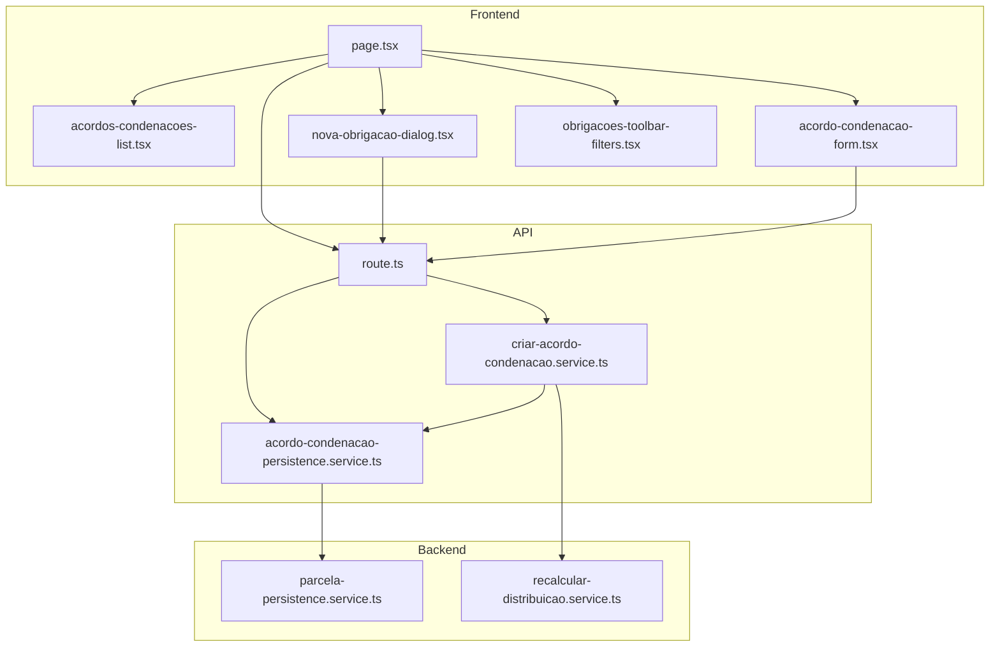
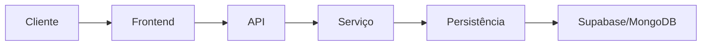
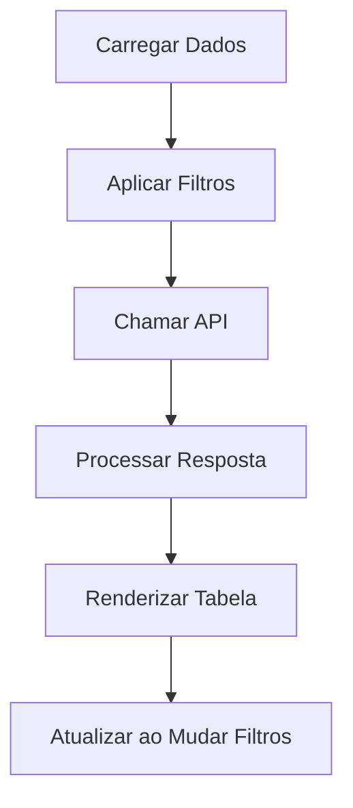
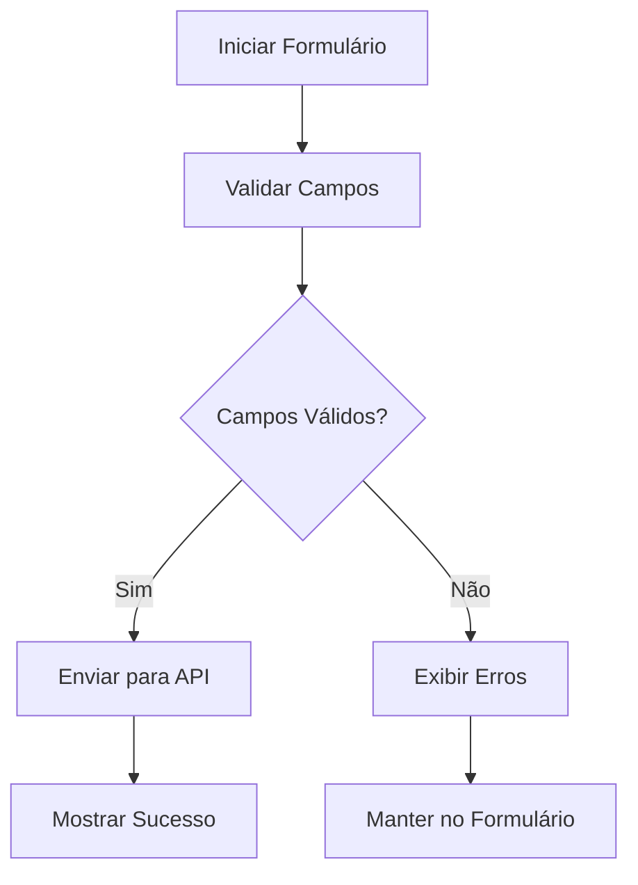
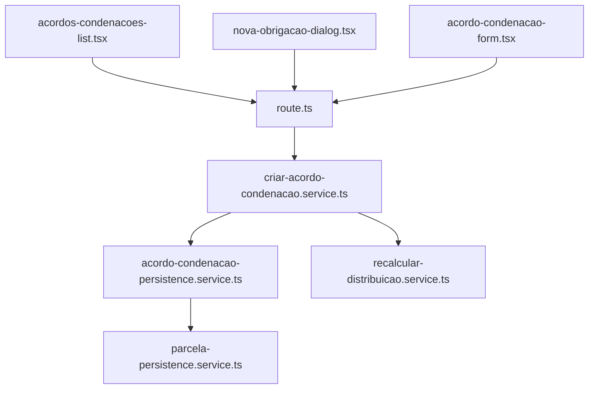

# Manual Obrigacoes System

<cite>
**Arquivos Referenciados neste Documento**   
- [acordo-condenacao-form.tsx](file://app/(dashboard)/acordos-condenacoes/components/acordo-condenacao-form.tsx)
- [acordos-condenacoes-list.tsx](file://app/(dashboard)/acordos-condenacoes/components/acordos-condenacoes-list.tsx)
- [nova-obrigacao-dialog.tsx](file://app/(dashboard)/acordos-condenacoes/components/nova-obrigacao-dialog.tsx)
- [obrigacoes-toolbar-filters.tsx](file://app/(dashboard)/acordos-condenacoes/components/obrigacoes-toolbar-filters.tsx)
- [page.tsx](file://app/(dashboard)/acordos-condenacoes/page.tsx)
- [route.ts](file://app/api/acordos-condenacoes/route.ts)
- [criar-acordo-condenacao.service.ts](file://backend/acordos-condenacoes/services/acordos-condenacoes/criar-acordo-condenacao.service.ts)
- [acordo-condenacao-persistence.service.ts](file://backend/acordos-condenacoes/services/persistence/acordo-condenacao-persistence.service.ts)
- [parcela-persistence.service.ts](file://backend/acordos-condenacoes/services/persistence/parcela-persistence.service.ts)
- [recalcular-distribuicao.service.ts](file://backend/acordos-condenacoes/services/parcelas/recalcular-distribuicao.service.ts)
</cite>

## Sumário
1. [Introdução](#introdução)
2. [Estrutura do Projeto](#estrutura-do-projeto)
3. [Componentes Principais](#componentes-principais)
4. [Visão Geral da Arquitetura](#visão-geral-da-arquitetura)
5. [Análise Detalhada dos Componentes](#análise-detelhada-dos-componentes)
6. [Análise de Dependências](#análise-de-dependências)
7. [Considerações de Desempenho](#considerações-de-desempenho)
8. [Guia de Solução de Problemas](#guia-de-solução-de-problemas)
9. [Conclusão](#conclusão)

## Introdução
O sistema "Manual Obrigacoes System" é uma aplicação jurídica desenvolvida para gerenciar acordos, condenações e obrigações financeiras dentro de um escritório de advocacia. A aplicação permite o cadastro, visualização e gerenciamento de obrigações, incluindo parcelas, pagamentos e repasses, com integração completa ao banco de dados e à camada de serviços. O sistema é construído com tecnologias modernas como Next.js, TypeScript, Supabase e React, garantindo escalabilidade, manutenibilidade e segurança.

## Estrutura do Projeto
A estrutura do projeto segue o padrão do Next.js App Router, organizando os componentes por funcionalidade. O módulo de obrigações está localizado em `app/(dashboard)/acordos-condenacoes/`, contendo páginas, componentes reutilizáveis e lógica de negócios. Os serviços de backend estão separados em diretórios específicos, com camadas de serviço e persistência bem definidas.

**Fontes do Diagrama**
- [page.tsx](file://app/(dashboard)/acordos-condenacoes/page.tsx)
- [route.ts](file://app/api/acordos-condenacoes/route.ts)
- [criar-acordo-condenacao.service.ts](file://backend/acordos-condenacoes/services/acordos-condenacoes/criar-acordo-condenacao.service.ts)
- [acordo-condenacao-persistence.service.ts](file://backend/acordos-condenacoes/services/persistence/acordo-condenacao-persistence.service.ts)
- [parcela-persistence.service.ts](file://backend/acordos-condenacoes/services/persistence/parcela-persistence.service.ts)
- [recalcular-distribuicao.service.ts](file://backend/acordos-condenacoes/services/parcelas/recalcular-distribuicao.service.ts)

**Fontes da Seção**
- [page.tsx](file://app/(dashboard)/acordos-condenacoes/page.tsx)
- [acordos-condenacoes-list.tsx](file://app/(dashboard)/acordos-condenacoes/components/acordos-condenacoes-list.tsx)

## Componentes Principais
Os componentes principais do módulo de obrigações incluem a listagem de acordos, formulários de criação e edição, diálogos modais e filtros avançados. Esses componentes são responsáveis pela interação do usuário com o sistema, garantindo uma experiência fluida e intuitiva.

**Fontes da Seção**
- [acordos-condenacoes-list.tsx](file://app/(dashboard)/acordos-condenacoes/components/acordos-condenacoes-list.tsx)
- [acordo-condenacao-form.tsx](file://app/(dashboard)/acordos-condenacoes/components/acordo-condenacao-form.tsx)
- [nova-obrigacao-dialog.tsx](file://app/(dashboard)/acordos-condenacoes/components/nova-obrigacao-dialog.tsx)
- [obrigacoes-toolbar-filters.tsx](file://app/(dashboard)/acordos-condenacoes/components/obrigacoes-toolbar-filters.tsx)

## Visão Geral da Arquitetura
O sistema segue uma arquitetura em camadas, com separação clara entre frontend, API e backend. A camada de frontend consome endpoints da API, que por sua vez orquestra serviços de negócio e persistência. Essa separação permite manutenção independente e escalabilidade.

**Fontes do Diagrama**
- [page.tsx](file://app/(dashboard)/acordos-condenacoes/page.tsx)
- [route.ts](file://app/api/acordos-condenacoes/route.ts)
- [criar-acordo-condenacao.service.ts](file://backend/acordos-condenacoes/services/acordos-condenacoes/criar-acordo-condenacao.service.ts)
- [acordo-condenacao-persistence.service.ts](file://backend/acordos-condenacoes/services/persistence/acordo-condenacao-persistence.service.ts)

## Análise Detalhada dos Componentes
### Análise do Componente de Listagem
O componente `AcordosCondenacoesList` é responsável por exibir a lista de obrigações em formato de tabela, com suporte a paginação, ordenação e filtros. Ele utiliza o componente `DataTable` para renderização e interage com a API para buscar dados.

**Fontes do Diagrama**
- [acordos-condenacoes-list.tsx](file://app/(dashboard)/acordos-condenacoes/components/acordos-condenacoes-list.tsx)
- [route.ts](file://app/api/acordos-condenacoes/route.ts)

**Fontes da Seção**
- [acordos-condenacoes-list.tsx](file://app/(dashboard)/acordos-condenacoes/components/acordos-condenacoes-list.tsx)

### Análise do Componente de Formulário
O componente `AcordoCondenacaoForm` permite a criação e edição de acordos e condenações. Ele valida os dados de entrada e envia para a API, com feedback visual ao usuário.

**Fontes do Diagrama**
- [acordo-condenacao-form.tsx](file://app/(dashboard)/acordos-condenacoes/components/acordo-condenacao-form.tsx)
- [route.ts](file://app/api/acordos-condenacoes/route.ts)

**Fontes da Seção**
- [acordo-condenacao-form.tsx](file://app/(dashboard)/acordos-condenacoes/components/acordo-condenacao-form.tsx)

## Análise de Dependências
O módulo de obrigações depende diretamente da API de acordos-condenacoes, que por sua vez depende dos serviços de negócio e persistência. As dependências são bem definidas e não há acoplamento excessivo entre os componentes.

**Fontes do Diagrama**
- [acordos-condenacoes-list.tsx](file://app/(dashboard)/acordos-condenacoes/components/acordos-condenacoes-list.tsx)
- [nova-obrigacao-dialog.tsx](file://app/(dashboard)/acordos-condenacoes/components/nova-obrigacao-dialog.tsx)
- [acordo-condenacao-form.tsx](file://app/(dashboard)/acordos-condenacoes/components/acordo-condenacao-form.tsx)
- [route.ts](file://app/api/acordos-condenacoes/route.ts)
- [criar-acordo-condenacao.service.ts](file://backend/acordos-condenacoes/services/acordos-condenacoes/criar-acordo-condenacao.service.ts)
- [acordo-condenacao-persistence.service.ts](file://backend/acordos-condenacoes/services/persistence/acordo-condenacao-persistence.service.ts)
- [recalcular-distribuicao.service.ts](file://backend/acordos-condenacoes/services/parcelas/recalcular-distribuicao.service.ts)
- [parcela-persistence.service.ts](file://backend/acordos-condenacoes/services/persistence/parcela-persistence.service.ts)

**Fontes da Seção**
- [acordos-condenacoes-list.tsx](file://app/(dashboard)/acordos-condenacoes/components/acordos-condenacoes-list.tsx)
- [nova-obrigacao-dialog.tsx](file://app/(dashboard)/acordos-condenacoes/components/nova-obrigacao-dialog.tsx)
- [acordo-condenacao-form.tsx](file://app/(dashboard)/acordos-condenacoes/components/acordo-condenacao-form.tsx)
- [route.ts](file://app/api/acordos-condenacoes/route.ts)

## Considerações de Desempenho
O sistema utiliza cache Redis para operações frequentes, reduzindo a carga no banco de dados. A paginação é implementada na API, evitando o carregamento de grandes volumes de dados no frontend. O uso de debounce em campos de busca melhora a experiência do usuário.

## Guia de Solução de Problemas
Problemas comuns incluem falhas na criação de obrigações devido a campos obrigatórios não preenchidos, erros de autenticação na API e problemas de sincronização entre parcelas e acordos. Verifique os logs do backend e a validação dos dados de entrada.

**Fontes da Seção**
- [route.ts](file://app/api/acordos-condenacoes/route.ts)
- [criar-acordo-condenacao.service.ts](file://backend/acordos-condenacoes/services/acordos-condenacoes/criar-acordo-condenacao.service.ts)
- [acordo-condenacao-persistence.service.ts](file://backend/acordos-condenacoes/services/persistence/acordo-condenacao-persistence.service.ts)

## Conclusão
O sistema "Manual Obrigacoes System" é uma solução robusta e bem estruturada para o gerenciamento de obrigações jurídicas. Sua arquitetura modular, validações rigorosas e interface intuitiva garantem eficiência e confiabilidade no dia a dia de um escritório de advocacia.