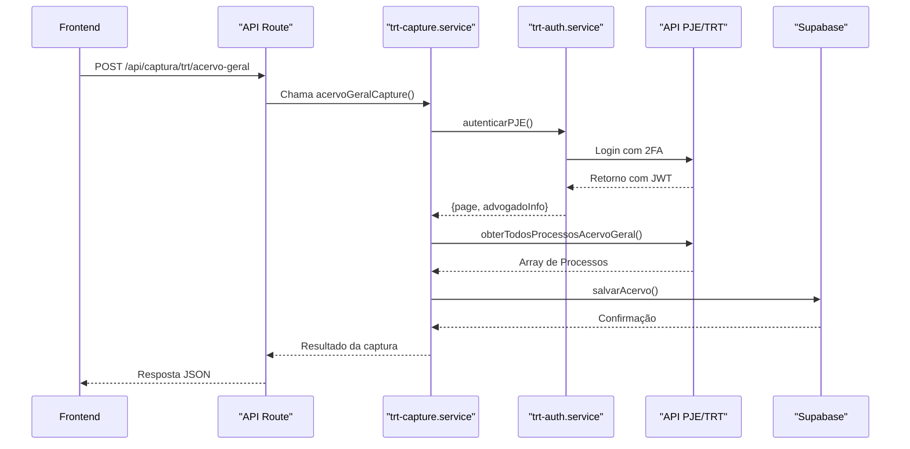
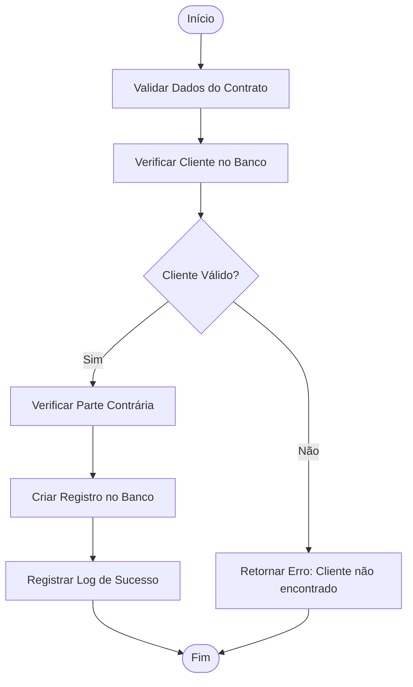
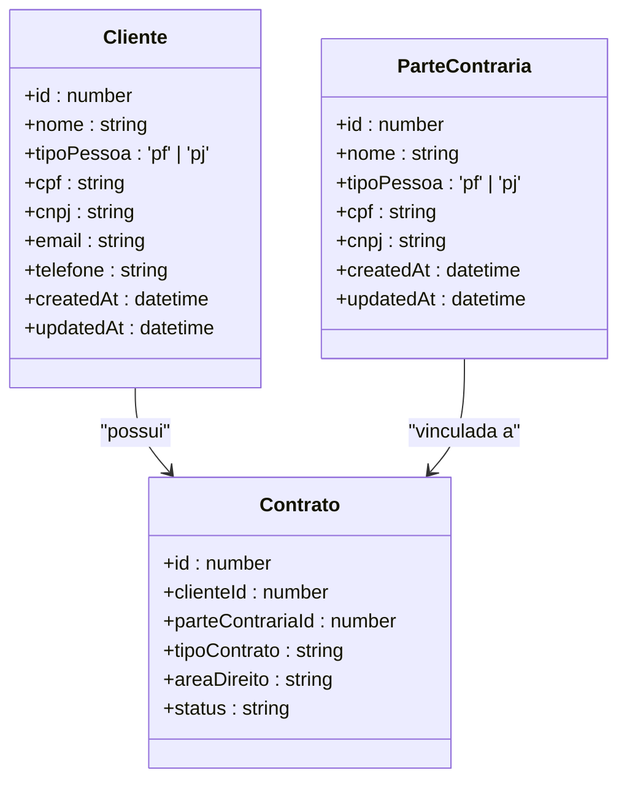
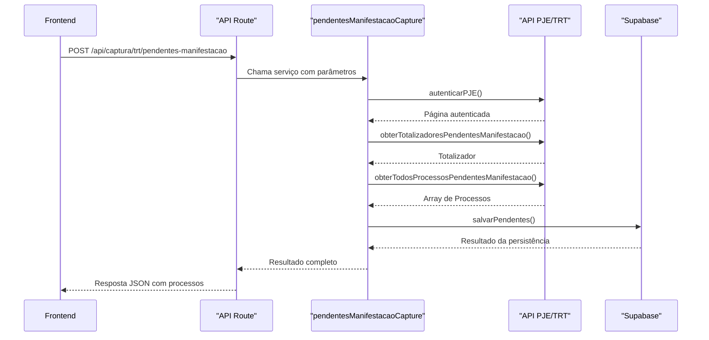

# Módulos de Funcionalidade

<cite>
**Arquivos Referenciados neste Documento**  
- [trt-capture.service.ts](file://backend/captura/services/trt/trt-capture.service.ts)
- [pendentes-manifestacao.service.ts](file://backend/captura/services/trt/pendentes-manifestacao.service.ts)
- [acervo-geral.ts](file://backend/api/pje-trt/acervo-geral.ts)
- [pendentes-manifestacao.ts](file://backend/api/pje-trt/pendentes-manifestacao.ts)
- [criar-contrato.service.ts](file://backend/contratos/services/contratos/criar-contrato.service.ts)
- [contrato-persistence.service.ts](file://backend/contratos/services/persistence/contrato-persistence.service.ts)
- [criar-cliente.service.ts](file://backend/clientes/services/clientes/criar-cliente.service.ts)
- [criar-parte-contraria.service.ts](file://backend/partes-contrarias/services/partes-contrarias/criar-parte-contraria.service.ts)
- [listar-pendentes.service.ts](file://backend/pendentes/services/listar-pendentes.service.ts)
- [trt-types.ts](file://backend/types/captura/trt-types.ts)
- [types.ts](file://backend/types/pje-trt/types.ts)
- [route.ts](file://app/api/captura/trt/pendentes-manifestacao/route.ts)
- [route.ts](file://app/api/contratos/route.ts)
</cite>

## Sumário
1. [Introdução](#introdução)
2. [Módulo de Captura de Dados do PJE/TRT](#módulo-de-captura-de-dados-do-pjetrt)
3. [Módulo de Gestão de Contratos](#módulo-de-gestão-de-contratos)
4. [Módulo de Gestão de Clientes e Partes Contrárias](#módulo-de-gestão-de-clientes-e-partes-contrárias)
5. [Módulo de Pendentes de Manifestação](#módulo-de-pendentes-de-manifestação)
6. [Integrações entre Módulos](#integrações-entre-módulos)
7. [Conclusão](#conclusão)

## Introdução

O sistema **sinesys** é uma plataforma jurídica desenvolvida para automatizar a gestão de processos judiciais, contratos e clientes, com foco na integração com o Processo Judicial Eletrônico (PJE) dos Tribunais Regionais do Trabalho (TRT). Este documento detalha os principais módulos funcionais do sistema, fornecendo uma visão clara do domínio, casos de uso, fluxos de dados e integrações entre componentes. O conteúdo é voltado para novos desenvolvedores, facilitando a compreensão do escopo funcional e da arquitetura do sistema.

## Módulo de Captura de Dados do PJE/TRT

Este módulo é responsável por extrair dados diretamente do PJE/TRT de forma automatizada, utilizando credenciais armazenadas e autenticação com 2FA (OTP). Ele permite a captura de quatro tipos principais de dados: acervo geral, processos arquivados, audiências e pendentes de manifestação.

### Domínio e Casos de Uso
- **Captura de Acervo Geral**: Obter todos os processos ativos vinculados ao advogado.
- **Captura de Arquivados**: Extrair processos que foram arquivados no sistema.
- **Captura de Audiências**: Coletar audiências marcadas em um período específico.
- **Captura de Pendentes de Manifestação**: Identificar processos que exigem resposta imediata do advogado.

### Fluxo de Dados
1. O serviço recebe parâmetros (TRT, grau, credenciais).
2. Realiza autenticação no PJE via `trt-auth.service.ts`.
3. Extrai o `idAdvogado` do JWT.
4. Chama a API REST específica do PJE.
5. Valida os dados com base nos totalizadores.
6. Persiste os dados no banco de dados.

### Integração com Outros Componentes
- **Credenciais**: Usa `credential.service.ts` para obter credenciais criptografadas.
- **Persistência**: Salva dados via serviços específicos em `persistence/`.
- **Validação**: Utiliza `comparison.util.ts` para comparar dados capturados com os existentes.

**Fontes do Diagrama**
- [trt-capture.service.ts](file://backend/captura/services/trt/trt-capture.service.ts)
- [acervo-geral.ts](file://backend/api/pje-trt/acervo-geral.ts)

**Fontes da Seção**
- [trt-capture.service.ts](file://backend/captura/services/trt/trt-capture.service.ts)
- [acervo-geral.ts](file://backend/api/pje-trt/acervo-geral.ts)

## Módulo de Gestão de Contratos

Este módulo gerencia o ciclo de vida dos contratos jurídicos, desde a criação até a associação com processos judiciais.

### Domínio e Casos de Uso
- **Criação de Contrato**: Cadastrar novos contratos com dados como cliente, tipo, área do direito e status.
- **Atualização de Contrato**: Modificar dados de contratos existentes.
- **Associação de Processos**: Vincular processos judiciais a contratos.
- **Listagem de Contratos**: Buscar contratos por filtros (cliente, status, tipo).

### Regras de Negócio
- O cliente associado ao contrato deve existir no sistema.
- A parte contrária (se informada) também deve ser válida.
- O contrato é criado com status inicial "ativo".
- A área do direito e o tipo do contrato são obrigatórios.

### Interfaces de Serviço
- `cadastrarContrato(params: ContratoDados)`: Cria um novo contrato.
- `atualizarContrato(id, params)`: Atualiza um contrato existente.
- `associarProcessoAoContrato(contratoId, processoId)`: Vincula um processo ao contrato.

**Fontes do Diagrama**
- [criar-contrato.service.ts](file://backend/contratos/services/contratos/criar-contrato.service.ts)
- [contrato-persistence.service.ts](file://backend/contratos/services/persistence/contrato-persistence.service.ts)

**Fontes da Seção**
- [criar-contrato.service.ts](file://backend/contratos/services/contratos/criar-contrato.service.ts)
- [contrato-persistence.service.ts](file://backend/contratos/services/persistence/contrato-persistence.service.ts)

## Módulo de Gestão de Clientes e Partes Contrárias

Este módulo permite o cadastro e gerenciamento de clientes (pessoas físicas ou jurídicas) e partes contrárias nos processos.

### Domínio e Casos de Uso
- **Cadastro de Cliente**: Incluir novo cliente com CPF/CNPJ, nome, tipo e dados de contato.
- **Busca por CPF/CNPJ**: Localizar cliente ou parte contrária rapidamente.
- **Atualização de Dados**: Modificar informações cadastrais.
- **Listagem com Filtros**: Exibir clientes por nome, tipo ou status.

### Regras de Negócio
- CPF/CNPJ devem ser únicos no sistema.
- É obrigatório informar o tipo (PF ou PJ).
- No cadastro de PF, o CPF é obrigatório; em PJ, o CNPJ.
- O sistema valida duplicidades antes da inserção.

### Integração com Contratos
Clientes e partes contrárias são entidades independentes, mas são referenciadas nos contratos. O módulo fornece serviços para validação cruzada, garantindo consistência dos dados.

**Fontes do Diagrama**
- [criar-cliente.service.ts](file://backend/clientes/services/clientes/criar-cliente.service.ts)
- [criar-parte-contraria.service.ts](file://backend/partes-contrarias/services/partes-contrarias/criar-parte-contraria.service.ts)

**Fontes da Seção**
- [criar-cliente.service.ts](file://backend/clientes/services/clientes/criar-cliente.service.ts)
- [criar-parte-contraria.service.ts](file://backend/partes-contrarias/services/partes-contrarias/criar-parte-contraria.service.ts)

## Módulo de Pendentes de Manifestação

Este módulo identifica e gerencia processos que exigem manifestação imediata do advogado, garantindo que prazos processuais sejam cumpridos.

### Domínio e Casos de Uso
- **Captura de Pendentes**: Extrair processos pendentes do PJE com filtro por prazo ("no prazo" ou "sem prazo").
- **Listagem de Pendentes**: Exibir pendentes com filtros por TRT, grau, responsável e data.
- **Atribuição de Responsável**: Designar um advogado para tratar o processo.
- **Agrupamento por Critérios**: Agrupar pendentes por cliente, contrato ou tribunal.

### Regras de Negócio
- Os pendentes são classificados como "no prazo" (expedientes com prazo ativo) ou "sem prazo" (expedientes vencidos).
- A captura valida a quantidade obtida contra o totalizador do PJE.
- O sistema permite agrupamento por múltiplos critérios para facilitar a análise.

### Fluxo de Captura
1. Recebe parâmetros (TRT, grau, filtroPrazo).
2. Autentica no PJE.
3. Obtém totalizador de pendentes.
4. Chama API com filtro de prazo.
5. Valida consistência dos dados.
6. Persiste no banco.

**Fontes do Diagrama**
- [pendentes-manifestacao.service.ts](file://backend/captura/services/trt/pendentes-manifestacao.service.ts)
- [pendentes-manifestacao.ts](file://backend/api/pje-trt/pendentes-manifestacao.ts)

**Fontes da Seção**
- [pendentes-manifestacao.service.ts](file://backend/captura/services/trt/pendentes-manifestacao.service.ts)
- [listar-pendentes.service.ts](file://backend/pendentes/services/listar-pendentes.service.ts)

## Integrações entre Módulos

Os módulos do sistema sinesys são altamente integrados, formando um ecossistema coeso para gestão jurídica.

### Fluxo de Dados entre Módulos
1. **Captura → Contratos**: Processos capturados são vinculados a contratos existentes.
2. **Clientes → Contratos**: Contratos referenciam clientes e partes contrárias.
3. **Pendentes → Contratos**: Pendentes são associados a contratos para rastreamento.
4. **Credenciais → Captura**: Serviço de credenciais fornece dados para autenticação.

### Exemplo de Integração Completa
Quando um novo contrato é criado:
- O cliente é validado no módulo de clientes.
- A parte contrária (se informada) é verificada.
- Após a criação, o sistema pode disparar uma captura automática de processos do cliente no PJE.
- Os processos capturados são automaticamente vinculados ao contrato.

## Conclusão

Os módulos do sistema sinesys foram projetados para oferecer uma solução integrada e automatizada para escritórios jurídicos. A arquitetura modular permite escalabilidade e manutenção eficiente, enquanto a integração com o PJE/TRT garante que os dados processuais estejam sempre atualizados. Este documento fornece uma base sólida para novos desenvolvedores compreenderem o escopo funcional, os fluxos de dados e as interações entre os componentes do sistema.