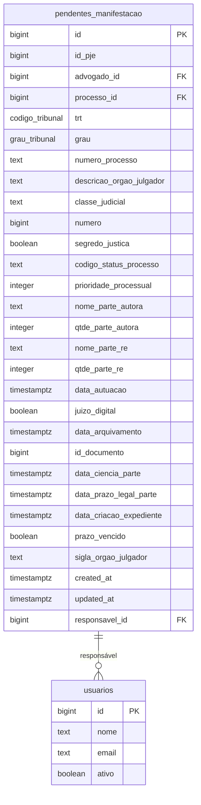
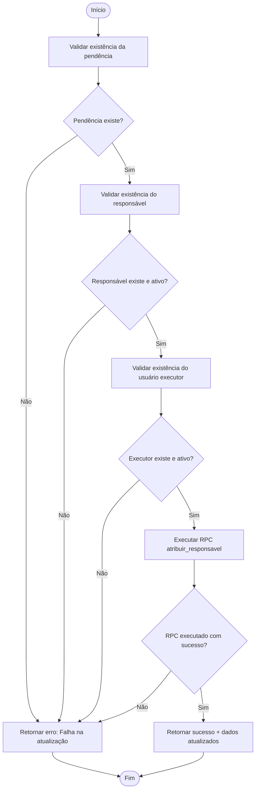
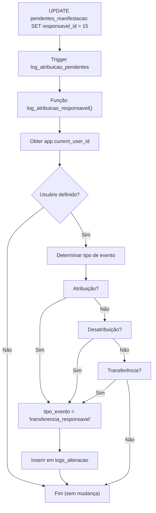

# Atribuição de Responsável

<cite>
**Arquivos Referenciados neste Documento**  
- [app/api/pendentes-manifestacao/[id]/responsavel/route.ts](file://app/api/pendentes-manifestacao/[id]/responsavel/route.ts)
- [backend/pendentes/services/atribuir-responsavel.service.ts](file://backend/pendentes/services/atribuir-responsavel.service.ts)
- [supabase/schemas/06_pendentes_manifestacao.sql](file://supabase/schemas/06_pendentes_manifestacao.sql)
- [supabase/migrations/20251117015306_create_triggers_log_atribuicao.sql](file://supabase/migrations/20251117015306_create_triggers_log_atribuicao.sql)
</cite>

## Sumário
1. [Introdução](#introdução)
2. [Estrutura da Tabela de Pendências de Manifestação](#estrutura-da-tabela-de-pendências-de-manifestação)
3. [Endpoint de Atribuição de Responsável](#endpoint-de-atribuição-de-responsável)
4. [Serviço de Atribuição de Responsável](#serviço-de-atribuição-de-responsável)
5. [Trigger de Auditoria de Atribuição](#trigger-de-auditoria-de-atribuição)
6. [Exemplos de Requisição](#exemplos-de-requisição)
7. [Tratamento de Erros](#tratamento-de-erros)
8. [Garantia de Integridade e Transações](#garantia-de-integridade-e-transações)

## Introdução
Este documento detalha o processo de atribuição de responsáveis a pendências de manifestação no sistema Sinesys. O fluxo envolve um endpoint API que recebe o ID da pendência e o ID do usuário responsável, valida permissões, atualiza o banco de dados via Supabase e registra automaticamente todas as alterações em um log de auditoria. O processo é projetado para garantir integridade referencial, consistência de dados e rastreabilidade completa das ações realizadas.

## Estrutura da Tabela de Pendências de Manifestação

A tabela `pendentes_manifestacao` armazena os processos que aguardam manifestação do advogado. Ela foi projetada para evitar duplicações de expedientes, permitindo que múltiplos advogados visualizem o mesmo processo sem redundância.

O campo `responsavel_id` foi adicionado posteriormente via migração para permitir a atribuição de responsáveis, estabelecendo uma relação com a tabela `usuarios`. Este campo é opcional (`nullable`), permitindo desatribuições.



**Fontes do Diagrama**  
- [supabase/schemas/06_pendentes_manifestacao.sql](file://supabase/schemas/06_pendentes_manifestacao.sql#L4-L117)
- [supabase/schemas/08_usuarios.sql](file://supabase/schemas/08_usuarios.sql)

**Fontes da Seção**  
- [supabase/schemas/06_pendentes_manifestacao.sql](file://supabase/schemas/06_pendentes_manifestacao.sql#L4-L117)

## Endpoint de Atribuição de Responsável

O endpoint `PATCH /api/pendentes-manifestacao/[id]/responsavel` é responsável por atribuir, transferir ou desatribuir um responsável de uma pendência de manifestação. Ele valida a autenticação do chamador, o ID da pendência e o ID do responsável antes de delegar a operação ao serviço.

O endpoint suporta três tipos de operação:
- **Atribuição**: quando a pendência não tem responsável e um é atribuído.
- **Transferência**: quando a pendência tem um responsável e é atribuída a outro.
- **Desatribuição**: quando o campo `responsavelId` é `null`.

```mermaid
sequenceDiagram
participant Cliente as Cliente
participant Endpoint as Endpoint API
participant Serviço as Serviço
participant Banco as Supabase
Cliente->>Endpoint : PATCH /pendentes-manifestacao/123/responsavel
activate Endpoint
Endpoint->>Endpoint : Autenticar requisição
alt Não autenticado
Endpoint-->>Cliente : 401 Unauthorized
deactivate Endpoint
return
end
Endpoint->>Endpoint : Validar ID da pendência
alt ID inválido
Endpoint-->>Cliente : 400 Bad Request
deactivate Endpoint
return
end
Endpoint->>Endpoint : Validar responsavelId
alt ID inválido
Endpoint-->>Cliente : 400 Bad Request
deactivate Endpoint
return
end
Endpoint->>Serviço : atribuirResponsavelPendente()
activate Serviço
Serviço->>Banco : Validar pendente, responsável e usuário
activate Banco
Banco-->>Serviço : Resultados das validações
deactivate Banco
alt Erro de validação
Serviço-->>Endpoint : Erro (ex : não encontrado)
deactivate Serviço
Endpoint-->>Cliente : 400/404
deactivate Endpoint
return
end
Serviço->>Banco : Executar RPC atribuir_responsavel
Banco-->>Serviço : Dados atualizados
deactivate Banco
Serviço-->>Endpoint : Sucesso + dados
deactivate Serviço
Endpoint-->>Cliente : 200 OK + dados
deactivate Endpoint
```

**Fontes do Diagrama**  
- [app/api/pendentes-manifestacao/[id]/responsavel/route.ts](file://app/api/pendentes-manifestacao/[id]/responsavel/route.ts#L83-L191)

**Fontes da Seção**  
- [app/api/pendentes-manifestacao/[id]/responsavel/route.ts](file://app/api/pendentes-manifestacao/[id]/responsavel/route.ts#L83-L191)

## Serviço de Atribuição de Responsável

O serviço `atribuir-responsavel.service.ts` implementa a lógica de negócios para a atribuição de responsáveis. Ele realiza três validações críticas antes de prosseguir com a atualização:

1. **Validação da pendência**: Verifica se a pendência com o ID fornecido existe na tabela `pendentes_manifestacao`.
2. **Validação do responsável**: Confirma se o usuário a ser atribuído como responsável existe e está ativo na tabela `usuarios`.
3. **Validação do executor**: Garante que o usuário que está realizando a ação (seja um usuário autenticado ou o sistema) exista e esteja ativo.

Após as validações, o serviço chama uma função RPC (Remote Procedure Call) no Supabase chamada `atribuir_responsavel`, que executa a atualização no banco de dados. O uso de RPC permite encapsular a lógica de atualização e garantir que o contexto do usuário seja corretamente definido para o trigger de auditoria.



**Fontes do Diagrama**  
- [backend/pendentes/services/atribuir-responsavel.service.ts](file://backend/pendentes/services/atribuir-responsavel.service.ts#L90-L154)

**Fontes da Seção**  
- [backend/pendentes/services/atribuir-responsavel.service.ts](file://backend/pendentes/services/atribuir-responsavel.service.ts#L90-L154)

## Trigger de Auditoria de Atribuição

O trigger definido no arquivo `20251117015306_create_triggers_log_atribuicao.sql` é uma peça fundamental para a governança e rastreabilidade do sistema. Ele é acionado após qualquer atualização no campo `responsavel_id` nas tabelas `acervo`, `audiencias` e `pendentes_manifestacao`.

A função `log_atribuicao_responsavel` detecta automaticamente o tipo de evento:
- **atribuicao_responsavel**: Quando um responsável é atribuído a uma entidade que não tinha um.
- **desatribuicao_responsavel**: Quando o responsável de uma entidade é removido (definido como `null`).
- **transferencia_responsavel**: Quando o responsável é alterado de um usuário para outro.

O trigger obtém o ID do usuário que executou a ação a partir da variável de contexto `app.current_user_id`, que é definida pela aplicação antes da operação de atualização. Isso permite distinguir entre ações de usuários e ações do sistema. Se o contexto do usuário não estiver definido (como em operações de captura automática), nenhum log é criado.

Os logs são armazenados na tabela `logs_alteracao`, capturando informações cruciais como a entidade modificada, os IDs do responsável anterior e novo, e dados contextuais do evento.



**Fontes do Diagrama**  
- [supabase/migrations/20251117015306_create_triggers_log_atribuicao.sql](file://supabase/migrations/20251117015306_create_triggers_log_atribuicao.sql#L6-L102)

**Fontes da Seção**  
- [supabase/migrations/20251117015306_create_triggers_log_atribuicao.sql](file://supabase/migrations/20251117015306_create_triggers_log_atribuicao.sql#L6-L102)

## Exemplos de Requisição

### Atribuição de Responsável
Para atribuir o usuário com ID 15 como responsável pela pendência de ID 123:

```http
PATCH /api/pendentes-manifestacao/123/responsavel HTTP/1.1
Content-Type: application/json
Authorization: Bearer <token>

{
  "responsavelId": 15
}
```

### Desatribuição de Responsável
Para remover o responsável atual da pendência de ID 123:

```http
PATCH /api/pendentes-manifestacao/123/responsavel HTTP/1.1
Content-Type: application/json
Authorization: Bearer <token>

{
  "responsavelId": null
}
```

### Resposta de Sucesso
```json
{
  "success": true,
  "data": {
    "id": 123,
    "responsavel_id": 15,
    "numero_processo": "1000001-23.2023.5.01.0001",
    "trt": "TRT1",
    "grau": "primeiro_grau"
  }
}
```

**Fontes da Seção**  
- [app/api/pendentes-manifestacao/[id]/responsavel/route.ts](file://app/api/pendentes-manifestacao/[id]/responsavel/route.ts#L40-L62)

## Tratamento de Erros

O sistema implementa um tratamento robusto de erros para garantir uma experiência clara e segura:

- **ID da pendência inválido**: Retorna `400 Bad Request` com a mensagem "ID do processo pendente inválido" se o ID fornecido não for um número inteiro positivo.
- **Pendência não encontrada**: Retorna `404 Not Found` se não existir uma pendência com o ID fornecido.
- **Responsável não encontrado**: Retorna `400 Bad Request` com a mensagem "Responsável não encontrado ou inativo" se o `responsavelId` fornecido não corresponder a um usuário ativo.
- **Usuário não autenticado**: Retorna `401 Unauthorized` se a requisição não incluir credenciais válidas.
- **Erro interno**: Retorna `500 Internal Server Error` para falhas inesperadas no servidor.

**Fontes da Seção**  
- [app/api/pendentes-manifestacao/[id]/responsavel/route.ts](file://app/api/pendentes-manifestacao/[id]/responsavel/route.ts#L101-L105)
- [backend/pendentes/services/atribuir-responsavel.service.ts](file://backend/pendentes/services/atribuir-responsavel.service.ts#L98-L103)
- [backend/pendentes/services/atribuir-responsavel.service.ts](file://backend/pendentes/services/atribuir-responsavel.service.ts#L107-L112)

## Garantia de Integridade e Transações

A integridade dos dados é garantida em múltiplos níveis:

1. **Chaves Estrangeiras**: A coluna `responsavel_id` na tabela `pendentes_manifestacao` referencia a tabela `usuarios`, garantindo que apenas IDs de usuários válidos possam ser atribuídos.
2. **Validações no Serviço**: O serviço realiza consultas explícitas para validar a existência e o status dos usuários antes de qualquer operação.
3. **Transações Implícitas**: A função RPC `atribuir_responsavel` e o trigger de auditoria são executados dentro da mesma transação do Supabase. Isso garante que a atualização do responsável e a criação do log de auditoria sejam atômicas: ambas operações são concluídas com sucesso ou ambas são revertidas em caso de erro.
4. **Contexto de Usuário**: O uso da variável de contexto `app.current_user_id` assegura que o log de auditoria registre corretamente quem executou a ação, prevenindo falsificações.

**Fontes da Seção**  
- [supabase/schemas/06_pendentes_manifestacao.sql](file://supabase/schemas/06_pendentes_manifestacao.sql#L7)
- [backend/pendentes/services/atribuir-responsavel.service.ts](file://backend/pendentes/services/atribuir-responsavel.service.ts#L24-L38)
- [supabase/migrations/20251117015306_create_triggers_log_atribuicao.sql](file://supabase/migrations/20251117015306_create_triggers_log_atribuicao.sql#L23-L26)